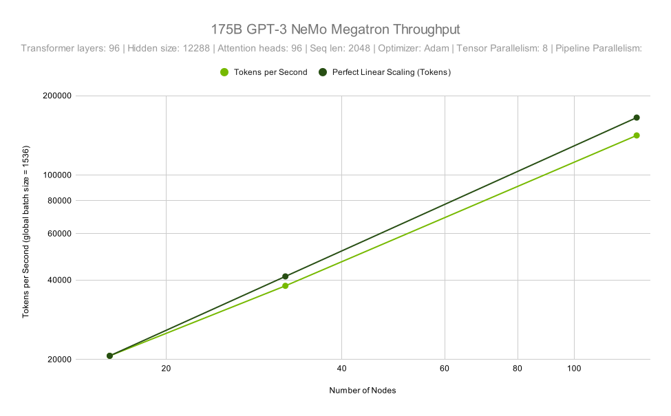
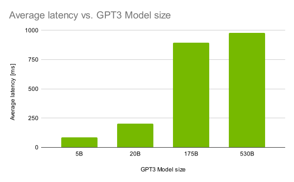
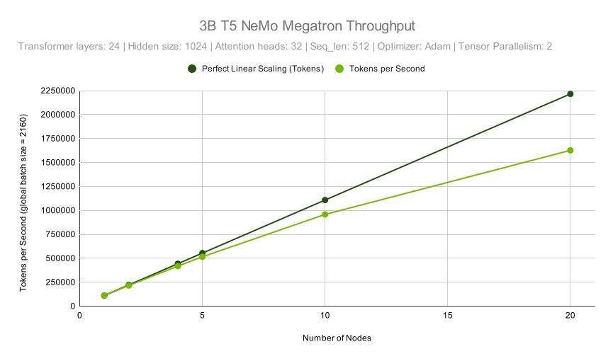
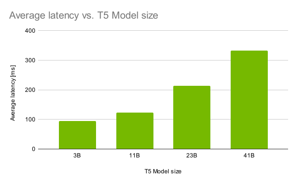

# BigNLP-Scripts

Scripts and code to provide end-to-end data preparation and training for
NeMo-Megatron.

The most recent version of the README can be found at [https://ngc.nvidia.com/containers/ea-bignlp:bignlp-training](https://ngc.nvidia.com/containers/ea-bignlp:bignlp-training).

## Table of contents
- [1. Model Overview](#1-model-overview)
- [2. Feature Matrix](#2-feature-matrix)
  * [2.1. GPT-3 Models](#21-gpt-3-models)
  * [2.2. T5 and mT5 Models](#22-t5-and-mt5-models)
- [3. Setup](#3-setup)
  * [3.1. Support Matrix](#31-support-matrix)
- [4. Cloud Service Providers](#4-cloud-service-providers)
  * [4.1. Azure](#41-azure)
    + [4.1.1. Cluster Bring-Up](#411-cluster-bring-up)
    + [4.1.2. Cluster Validation](#412-cluster-validation)
      - [4.1.2.1. Validation Script Usage](#4121-validation-script-usage)
    + [4.1.3. Config Modifications](#413-config-modifications)
      - [4.1.3.1. Generate NCCL Topology](#4131-generate-nccl-topology)
      - [4.1.3.2. Environment Variables](#4132-environment-variables)
- [5. Quick Start Guide](#5-quick-start-guide)
  * [5.1. Training BigNLP Models](#51-training-bignlp-models)
    + [5.1.1. Prepare Environment](#511-prepare-environment)
      - [5.1.1.1. Slurm](#5111-slurm)
      - [5.1.1.2. Base Command Platform](#5112-base-command-platform)
      - [5.1.1.3. General Configuration](#5113-general-configuration)
    + [5.1.2. Data Preparation](#512-data-preparation)
      - [5.1.2.1. Data Preparation for GPT-3 Models](#5121-data-preparation-for-gpt-3-models)
        * [5.1.2.1.1. Slurm](#51211-slurm)
        * [5.1.2.1.2. Base Command Platform](#51212-base-command-platform)
        * [5.1.2.1.3. Common](#51213-common)
      - [5.1.2.2. Data Preparation for T5 Models](#5122-data-preparation-for-t5-models)
        * [5.1.2.2.1. Slurm](#51221-slurm)
        * [5.1.2.2.2. Base Command Platform](#51222-base-command-platform)
        * [5.1.2.2.3. Common](#51223-common)
      - [5.1.2.3. Data Preparation for mT5 Models](#5123-data-preparation-for-mt5-models)
        * [5.1.2.3.1. Slurm](#51231-slurm)
        * [5.1.2.3.2. Base Command Platform](#51232-base-command-platform)
        * [5.1.2.3.3. Common](#51233-common)
  * [5.2. Training with Predefined Configurations](#52-training-with-predefined-configurations)
    + [5.2.1. Predefined Configurations of GPT-3 Models](#521-predefined-configurations-of-gpt-3-models)
    + [5.2.2. Predefined Configurations of T5 Models](#522-predefined-configurations-of-t5-models)
    + [5.2.3. Predefined Configurations of mT5 Models](#523-predefined-configurations-of-mt5-models)
    + [5.2.4. Training Logs with TensorBoard and weights and biases](#524-training-logs-with-tensorboard-and-weights-and-biases)
  * [5.3. Using the HP Tool to Find the Optimal Configuration](#53-using-the-hp-tool-to-find-the-optimal-configuration)
    + [5.3.1. HP Tool Capabilities](#531-hp-tool-capabilities)
      - [5.3.1.1. Model Size Recommendation](#5311-model-size-recommendation)
      - [5.3.1.2. Base Config Generation](#5312-base-config-generation)
      - [5.3.1.3. Training HP Search](#5313-training-hp-search)
      - [5.3.1.4. Inference HP Search](#5314-inference-hp-search)
    + [5.3.2. Usage](#532-usage)
      - [5.3.2.1. General Configuration](#5321-general-configuration)
      - [5.3.2.2. Running Predefined Configs](#5322-running-predefined-configs)
        * [5.3.2.2.1. Model Config](#53221-model-config)
        * [5.3.2.2.2. Base Config Generation](#53222-base-config-generation)
        * [5.3.2.2.3. Training HP Search](#53223-training-hp-search)
        * [5.3.2.2.4. Inference HP Search](#53224-inference-hp-search)
      - [5.3.2.3. Running Custom Model Size Configs](#5323-running-custom-model-size-configs)
      - [5.3.2.4. Interpreting the Results](#5324-interpreting-the-results)
      - [5.3.2.5. Logging Runs with Weights and Biases](#5325-logging-runs-with-weights-and-biases)
  * [5.4. Training with Custom Configurations](#54-training-with-custom-configurations)
    + [5.4.1. Example: Changing Embedding Type for T5 models](#541-example-changing-embedding-type-for-t5-models)
  * [5.5. Bring Your Own Dataset](#55-bring-your-own-dataset)
    + [5.5.1. Slurm](#551-slurm)
    + [5.5.2. Base Command Platform](#552-base-command-platform)
    + [5.5.3. Common](#553-common)
  * [5.6. Model Training](#56-model-training)
    + [5.6.1. GPT-3 Training](#561-gpt-3-training)
      - [5.6.1.1. Slurm](#5611-slurm)
      - [5.6.1.2. Base Command Platform](#5612-base-command-platform)
    + [5.6.2. T5 Training](#562-t5-training)
      - [5.6.2.1. Slurm](#5621-slurm)
      - [5.6.2.2. Base Command Platform](#5622-base-command-platform)
    + [5.6.3. mT5 Training](#563-mt5-training)
      - [5.6.3.1. Slurm](#5631-slurm)
      - [5.6.3.2. Base Command Platform](#5632-base-command-platform)
  * [5.7. Resuming Training with Different Number of Nodes](#57-resuming-training-with-different-number-of-nodes)
  * [5.8. Checkpoint Conversion](#58-checkpoint-conversion)
    + [5.8.1. GPT-3 Conversion](#581-gpt-3-conversion)
      - [5.8.1.1. Common](#5811-common)
      - [5.8.1.2. Slurm](#5812-slurm)
      - [5.8.1.3. Base Command Platform](#5813-base-command-platform)
    + [5.8.2. T5 Conversion](#582-t5-conversion)
      - [5.8.2.1. Common](#5821-common)
      - [5.8.2.2. Slurm](#5822-slurm)
      - [5.8.2.3. Base Command Platform](#5823-base-command-platform)
    + [5.8.3. mT5 Conversion](#583-mt5-conversion)
      - [5.8.3.1. Common](#5831-common)
      - [5.8.3.2. Slurm](#5832-slurm)
      - [5.8.3.3. Base Command Platform](#5833-base-command-platform)
  * [5.9. Model Fine-tuning](#59-model-fine-tuning)
    + [5.9.1. T5 Fine-tuning](#591-t5-fine-tuning)
      - [5.9.1.1. Common](#5911-common)
      - [5.9.1.2. Slurm](#5912-slurm)
      - [5.9.1.3. Base Command Platform](#5913-base-command-platform)
    + [5.9.2. mT5 Fine-tuning](#592-mt5-fine-tuning)
      - [5.9.2.1. Common](#5921-common)
      - [5.9.2.2. Slurm](#5922-slurm)
      - [5.9.2.3. Base Command Platform](#5923-base-command-platform)
    + [5.9.3. Fine-tuning on Custom Tasks](#593-fine-tuning-on-custom-tasks)
  * [5.10. Model Prompt Learning](#510-model-prompt-learning)
    + [5.10.1. GPT-3 Prompt Learning](#5101-gpt-3-prompt-learning)
      - [5.10.1.1. Common](#51011-common)
      - [5.10.1.2. Slurm](#51012-slurm)
      - [5.10.1.3. Base Command Platform](#51013-base-command-platform)
    + [5.10.2. T5 and mT5 Prompt Learning](#5102-t5-and-mt5-prompt-learning)
      - [5.10.2.1. Common](#51021-common)
      - [5.10.2.2. Slurm](#51022-slurm)
      - [5.10.2.3. Base Command Platform](#51023-base-command-platform)
  * [5.11. Model Evaluation](#511-model-evaluation)
    + [5.11.1. GPT-3 Evaluation](#5111-gpt-3-evaluation)
      - [5.11.1.1. Common](#51111-common)
      - [5.11.1.2. Slurm](#51112-slurm)
      - [5.11.1.3. Base Command Platform](#51113-base-command-platform)
    + [5.11.2. T5 Evaluation](#5112-t5-evaluation)
      - [5.11.2.1. Common](#51121-common)
      - [5.11.2.2. Slurm](#51122-slurm)
      - [5.11.2.3. Base Command Platform](#51123-base-command-platform)
    + [5.11.3. mT5 Evaluation](#5113-mt5-evaluation)
      - [5.11.3.1. Common](#51131-common)
      - [5.11.3.2. Slurm](#51132-slurm)
      - [5.11.3.3. Base Command Platform](#51133-base-command-platform)
    + [5.11.4. Prompt Learnt GPT-3 Evaluation](#5114-prompt-learnt-gpt-3-evaluation)
      - [5.11.4.1. Common](#51141-common)
      - [5.11.4.2. Slurm](#51142-slurm)
      - [5.11.4.3. Base Command Platform](#51143-base-command-platform)
    + [5.11.5. Prompt Learnt T5 and mT5 Evaluation](#5115-prompt-learnt-t5-and-mt5-evaluation)
      - [5.11.5.1. Common](#51151-common)
      - [5.11.5.2. Slurm](#51152-slurm)
      - [5.11.5.3. Base Command Platform](#51153-base-command-platform)
  * [5.12. Model Export](#512-model-export)
    + [5.12.1. GPT-3 Export](#5121-gpt-3-export)
      - [5.12.1.1. Common](#51211-common)
      - [5.12.1.2. Slurm](#51212-slurm)
      - [5.12.1.3. Base Command Platform](#51213-base-command-platform)
- [6. Deploying the BigNLP Model](#6-deploying-the-bignlp-model)
  * [6.1. Run NVIDIA Triton Server with Generated Model Repository](#61-run-nvidia-triton-server-with-generated-model-repository)
- [6.2. GPT-3 text generation with ensemble](#62-gpt-3-text-generation-with-ensemble)
- [6.3. UL2 checkpoints deployment](#63-ul2-checkpoints-deployment)
- [7. Performance](#7-performance)
  * [7.1. GPT-3 Results](#71-gpt-3-results)
    + [7.1.1. Training Accuracy Results](#711-training-accuracy-results)
    + [7.1.2. Training Performance Results](#712-training-performance-results)
    + [7.1.3. Inference Performance](#713-inference-performance)
  * [7.2. T5 Results](#72-t5-results)
    + [7.2.1. Training Accuracy Results](#721-training-accuracy-results)
    + [7.2.2. Training Performance Results](#722-training-performance-results)
    + [7.2.3. Inference Performance](#723-inference-performance)
  * [7.3. mT5 Results](#73-mt5-results)
    + [7.3.1. Training Accuracy Results](#731-training-accuracy-results)
    + [7.3.2. Training Performance Results](#732-training-performance-results)
    + [7.3.3. Inference Performance](#733-inference-performance)
- [8. Changelog](#8-changelog)
- [9. Known Issues](#9-known-issues)

<small><i><a href='http://ecotrust-canada.github.io/markdown-toc/'>Table of contents generated with markdown-toc</a></i></small>


<!-- /TOC -->

## 1. Model Overview
<a id="markdown-model-overview" name="model-overview"></a>

NeMo Megatron is a new version in the NeMo framework that allows developers to effectively train and scale language
models to billions of parameters. With NeMo Megatron, you can train different variants of GPT-3 and T5 style models,
and scale them to multiple nodes on NVIDIA DGX SuperPOD deployments. This deep learning (DL) software stack is optimized for DGX
SuperPOD configurations using NVIDIA InfiniBand technology to provide efficient on-premises compute for training
and inferring complex workloads.

<!-- Should this line be removed/replaced -->
Early access to NeMo Megatron is limited to enterprises that want to train and deploy GPT-3 and T5 style models on
NVIDIA DGX SuperPOD to perform tasks such as answering deep domain questions, translating languages,
comprehending and summarizing complex documents. 

The model parallelism techniques of NeMo Megatron enable the efficient training of large models that do not fit in
the memory of a single GPU. In the training tasks, tensor (intra-layer) and pipeline (inter-layer) model parallelism
are adopted. Tensor model parallelism partitions individual transformer layers over multiple devices. Pipeline
model parallelism stripes layers of a model over multiple devices. For more details, refer to
[this paper](https://arxiv.org/pdf/2104.04473.pdf).

Our latest techniques, sequence parallelism and selective activation recomputation, bring up to `~30%` faster 
training time for GPT-3 models ranging from 20B to 1T parameters.
Sequence parallelism expands tensor-level model parallelism, by 
noticing that the regions of a transformer layer that have not previously been parallelized are independent 
along the sequence dimension. By splitting these layers along the sequence dimension we can distribute 
the compute and, most importantly, the activation memory for these regions across the tensor parallel devices.
Selective activation recomputation improves cases where memory constraints force us to recompute some, 
but not all, of the activations. For more details, refer to [this paper](https://arxiv.org/abs/2205.05198).

**GPT-3 architecture**


Figure 1: The GPT-3 family architecture. The 5B variant includes 24 transformer layers, a hidden size of 4096, and 32 attention heads. The sequence length is 2048, and the optimizer is Adam. This variant uses tensor parallelism of 2.

## 2. Feature Matrix
<a id="markdown-feature-matrix" name="feature-matrix"></a>

### 2.1. GPT-3 Models
<a id="markdown-gpt-3-models" name="gpt-3-models"></a>

| Feature                                                 | Training                             | Inference                                                                                                                                                                                                                                                                                                                 |
| ------------------------------- | ---------------------- | ----------------------------------------------------------------------------------------------------------------------------------------------------------------- |
| Data parallelism                | Yes                    | N/A                                                                                                                                                                  |
| Tensor parallelism              | Yes                    | Yes                                                                                                                                                               |
| Pipeline parallelism            | Yes                     | Yes (Megatron-LM checkpoints)                                                                                                                          |
| Sequence parallelism            | Yes                     | No                                                                                                                       |
| Selective activation checkpointing | Yes                     | No                                                                                                                       |
| Gradient checkpointing          | Yes                    | N/A                                                                                                                                                                  |
| Partial gradient checkpointing  | Yes                    | N/A                                                                                                                                                                  |
| FP32/TF32                       | Yes                    | Yes (FP16 enabled by default)                                                                                                                                     |
| AMP/FP16                        | No | Yes                                                                                                                                                               |
| BF16                            | Yes  | Yes                                                                                                                                                                |
| Multi-GPU                       | Yes                    | Yes                                                                                                                                                               |
| Multi-Node                      | Yes                    | Yes                                                                                                                                                               |
| Inference deployment            | N/A                    | [NVIDIA Triton supported](https://github.com/triton-inference-server/backend#where-can-i-find-all-the-backends-that-are-available-for-triton), Faster Transformer |
| SW stack support                | Slurm DeepOps/Base Command Manager/Base Command Platform          | Slurm DeepOps/Base Command Manager/Base Command Platform                                                                                                                                                     |
| Distributed data preprocessing | Yes (the Pile only)       | N/A                                                                                                                                                                  |
| NVfuser                         | No             | N/A                                                                                                                                                                  |
| P-Tuning and Prompt Tuning                | Yes             | N/A                                                                                                                                                                  |
| Distributed Optimizer (ZeRO-2)               | Yes             | N/A                                                                                                                                                                  |

### 2.2. T5 and mT5 Models
<a id="markdown-t5-and-mt5-models" name="t5-and-mt5-models"></a>

| Feature                          | Training                                                 | Inference |
|----------------------------------|----------------------------------------------------------|:---------:|
| Data parallelism                 | Yes                                                      |    N/A    |
| Tensor parallelism               | Yes                                                      |    No     |
| Pipeline parallelism             | Yes                                                      |    No     |
| Sequence parallelism            | No                     | No                                                                                                                       |
| Selective activation checkpointing | No                     | No                                                                                                                       |
| Gradient checkpointing           | Yes                                                      |    N/A    |
| Partial gradient checkpointing   | Yes                                                      |    N/A    |
| FP32/TF32                        | Yes                                                      |    No     |
| AMP/FP16                         | No                                                       |    No     |
| BF16                             | Yes                                                      |    No     |
| Multi-GPU                        | Yes                                                      |    No     |
| Multi-Node                       | Yes                                                      |     No    |
| Inference deployment             | N/A                                                      |    No     |
| SW stack support                 | Slurm DeepOps/Base Command Manager/Base Command Platform |    No     |
| Distributed data preprocessing   | Yes (the Pile dataset for T5, mC4 dataset for mT5)       |    N/A    |
| NVfuser                          | No                                                       |    N/A    |
| Hyperparameter tool                         | Yes                                                       |    N/A    |


## 3. Setup
<a id="markdown-setup" name="setup"></a>

### 3.1. Support Matrix
<a id="markdown-support-matrix" name="support-matrix"></a>

| Software                | EA               |
|-------------------------|------------------|
| NVIDIA Triton           | 2.21.0           |
| FasterTransformer       | V5               |
| PyTorch                 | 1.12.0a0+8a1a93a |
| NeMo                    | 1.10.0+aadcd1c   |
| PyTorch Lightning       | 1.6.5            |
| Hydra                   | 1.1.1            |
| CUDA                    | NVIDIA CUDA 11.7 |
| cuBLAS                  | 11.10.1.25       |
| cuDNN                   | 8.4.0.27         |
| NCCL                    | 2.12.10          |
| Container OS            | Ubuntu 20.04     |
| rdma-core               | 36.0             |
| GDRcopy                 | 2.3              |
| HPC-X                   | 2.10.0           |
| Base Command Manager    | 1.0.0            |
| DeepOps                 | 21.06            |

## 4. Cloud Service Providers
<a id="markdown-cloud-service-providers" name="cloud-service-providers"></a>

### 4.1. Azure
<a id="markdown-azure" name="azure"></a>

#### 4.1.1. Cluster Bring-Up
<a id="markdown-cluster-bring-up" name="cluster-bring-up"></a>
To set up a Slurm cluster for bignlp, we recommend using Azure CycleCloud with the following steps:

1. Follow the [cc-slurm-ngc](https://github.com/JonShelley/cc-slurm-ngc/blob/master/README.md) README to create the CycleCloud VM in the Azure portal. Complete all steps until "Download and setup the project", including creating a new storage account.
2. Create an Azure AD application using [this document](https://docs.microsoft.com/en-us/azure/active-directory/develop/howto-create-service-principal-portal):
    1. Check both your AD and subscription [permissions](https://docs.microsoft.com/en-us/azure/active-directory/develop/howto-create-service-principal-portal#permissions-required-for-registering-an-app) to ensure you can register an application and assign a role to it, or talk to your subscription administrator.
    2. Create the [app registration](https://docs.microsoft.com/en-us/azure/active-directory/develop/howto-create-service-principal-portal#register-an-application-with-azure-ad-and-create-a-service-principal).
    3. [Assign](https://docs.microsoft.com/en-us/azure/active-directory/develop/howto-create-service-principal-portal#assign-a-role-to-the-application) the contributor role to the application.
    4. Create and record an [application secret](https://docs.microsoft.com/en-us/azure/active-directory/develop/howto-create-service-principal-portal#option-2-create-a-new-application-secret) along with your application ID.
3. Go to \<cyclecloud vm ip\>/subscriptions. Name your subscription and enter your Tenant ID, Application ID, and Application Secret. Then choose a default location and the resource group and storage account you created in step 1 (leave the storage container field as is).
4. Continue with the [cc-slurm-ngc](https://github.com/JonShelley/cc-slurm-ngc#download-and-setup-the-project) README to add the cc-slurm-ngc cluster type and deploy your cluster.

Once your cluster is up and running, continue with the cluster validation steps.

#### 4.1.2. Cluster Validation
<a id="markdown-cluster-validation" name="cluster-validation"></a>

Before running the cluster validation script, ensure your NGC credentials have been added to `~/.config/enroot/.credentials` on all nodes.

The cluster validation script at `tools/csp/azure/cluster_validation.sh` will run GPU diagnostics and test NCCL node-to-node bus bandwidth.
The logs from these tests will be stored at `results/cluster_validation`. The script will list any nodes that fail these tests.
These nodes should be replaced or restarted through the CycleCloud UI.

##### 4.1.2.1. Validation Script Usage
<a id="markdown-validation-script-usage" name="validation-script-usage"></a>

The script has 3 required parameters:
- `--nodes`: the number of nodes
- `--nodelist`: the list of node names
- `--partition`: the Slurm partition the nodes are assigned to

The values for these parameters should be in the same format that is found in `sinfo`.
With the following example:
```
PARTITION AVAIL  TIMELIMIT  NODES  STATE NODELIST
hpc          up   infinite      8   idle hpc-pg0-[1-8]
```
To test all 8 idle nodes, the script would be run as:
```
bash cluster_validation.sh --nodes=8 --nodelist=hpc-pg0-[1-8] --partition=hpc
```

By default, the script will run both the GPU diagnostics and the NCCL test. You can choose to run only one or the other by specifying:
- `--dcgm`: run GPU diagnostics only
- `--nccl`: run NCCL test only

See `bash cluster_validation.sh -h` for more information.

#### 4.1.3. Config Modifications
<a id="markdown-config-modifications" name="config-modifications"></a>
Before launching jobs, the NCCL topology file needs to be created, and some changes to the config files must be made.

##### 4.1.3.1. Generate NCCL Topology
<a id="markdown-generate-nccl-topology" name="generate-nccl-topology"></a>

To generate the NCCL topology file, run the following:
```
sbatch -N 1 -o ndv4-topo.xml csp/azure/gentopo.sh
mv ndv4-topo.xml /opt/microsoft/ndv4-topo.xml
```

In `conf/config.yaml`, mount the directory containing the topology file, and set where the topology file will be located:
```
container_mounts:
  - /opt/microsoft:/opt/microsoft

env_vars:
    NCCL_TOPO_FILE: /opt/microsoft/ndv4-topo.xml
```

##### 4.1.3.2. Environment Variables
<a id="markdown-environment-variables" name="environment-variables"></a>
Set these environment variables in `config.yaml` (in addition to `NCCL_TOPO_FILE` as defined above):
```
env_vars:
  UCX_IB_PCI_RELAXED_ORDERING: auto
  NCCL_IB_PCI_RELAXED_ORDERING: 2
  NCCL_IB_TIMEOUT: 22
  NCCL_DEBUG: INFO
```

Once all these steps have been completed, BigNLP jobs can be launched on your Azure cluster.

## 5. Quick Start Guide
<a id="markdown-quick-start-guide" name="quick-start-guide"></a>

### 5.1. Training BigNLP Models
<a id="markdown-training-bignlp-models" name="training-bignlp-models"></a>

#### 5.1.1. Prepare Environment
<a id="markdown-prepare-environment" name="prepare-environment"></a>

<!--
The whole solution uses a set of Docker containers executed at the Slurm
cluster using the pyxis plug-in Base Command Platform cluster. The training
container also includes conversion scripts and NVIDIA Triton Model Navigator.
The inference container is just the NVIDIA Triton Inference Server with the
FasterTransformer backend installed.    For Base Command Platform, the BigNLP
scripts repository (bcp branch) will be part of the container image. It is
recommended to create a bignlp_ws_scripts_<username> workspace in your ace and
copy the bignlp-scripts directory there    either from the container image or
from git clone of the above repository if you have access.    Install the BigNLP
scripts dependencies on the head node of your cluster. Base Command Platform
clusters do not have a head login node. We're currently running these scripts
on a DGX node in the Base Command Platform cluster. Once the cluster has
cpu-only nodes then we can use those. Till then we can run on DGX node or in a
local conda environment.    To be able to call the necessary scripts from the
login node on a cluster, some packages must be installed there using the
requirements.txt file:
```
cd bignlp-scripts
pip install -r requirements.txt
```
You can use virtualenv to prevent polluting your head node environment for
other Python projects. If your Slurm configuration environment lacks pip, then
you can use get_pip.py with just python3.
 -->
**NOTE:** Ensure the high-speed filesystem is mounted on the job submission
node(s) at the same path as on the compute nodes.

The whole solution uses a set of Docker containers executed on a Slurm
cluster (using the [pyxis](https://github.com/NVIDIA/pyxis) plug-in) or
a Base Command Platform cluster. The training container also includes 
conversion scripts and NVIDIA Triton Model Navigator. The inference container
comprises the NVIDIA Triton Inference Server with the FasterTransformer 
backend installed.

##### 5.1.1.1. Slurm
<a id="markdown-slurm" name="slurm"></a>

The bignlp codebase is included as part of the training container. To
copy it to a local directory in the cluster, it needs to be extracted from the
container. To copy the code to a directory named /path/to/local/dir the
following command can be executed. The BigNLP repository for 
Slurm has been verified on both Slurm-based DeepOps clusters as well as Base 
Command Manager. 


```
srun -p [partition] -N 1 --container-mounts=/path/to/local/dir:/workspace/mount_dir --container-image=[container_tag] bash -c "cp -r /opt/bignlp/bignlp-scripts /opt/bignlp/bignlp-hp-tool /workspace/mount_dir/"
```

Install the BigNLP scripts dependencies on the head node of the cluster:

```
pip install -r requirements.txt
```
You can use virtualenv to prevent polluting your head node environment for
other Python projects. If your configuration lacks pip, then you can
install pip using use [get_pip.py](https://github.com/pypa/get-pip) with just `python3`.

##### 5.1.1.2. Base Command Platform
<a id="markdown-base-command-platform" name="base-command-platform"></a>

The bignlp-scripts codebase is included as part of the training
container. Before starting, set up the ngc cli and configuration as described 
in the Base Command Platform User Guide. In this guide, we will mainly 
use two Base Command Platform workspaces, one for storing the training dataset,
and another for storing the results, checkpoints and logs. Therefore, start by 
creating these workspaces (e.g. `bignlp_data_ws` and `bignlp_results_ws`). See 
the Base Command Platform User Guide for how to create and work with Base 
Command Platform workspaces.

##### 5.1.1.3. General Configuration
<a id="markdown-general-configuration" name="general-configuration"></a>

The first parameter that must be set is the `bignlp_path` parameter inside the
`conf/config.yaml` file.    This parameter must point to the absolute path where
the `bignlp-scripts` repository is stored in the file system.    
Additionally, if using a Slurm based 
cluster, the config file in the subfolder of `conf/cluster/bcm.yaml` has the 
parameters to set the generic cluster related information, such as the 
`partition` or `account` parameters.

The NUMA mapping can also be configured from the `conf/config.yaml` file. The 
mapping should be automatic; the code will read the number of CPU cores available 
in your cluster, and provide the best possible mapping, to maximize performance. 
The mapping is enabled by default, but it can be disabled by setting 
`enable: False` in the `numa_mapping` section of the `conf/config.yaml` file. 
The type of mapping can also be configured using the same file. See the full 
config parameters below:

```yaml
numa_mapping:
  enable: True  # Set to False to disable all mapping (performance will suffer).
  mode: unique_contiguous  # One of: all, single, single_unique, unique_interleaved or unique_contiguous.
  scope: node  # Either node or socket.
  cores: all_logical  # Either all_logical or single_logical.
  balanced: True  # Whether to assing an equal number of physical cores to each process.
  min_cores: 1  # Minimum number of physical cores per process.
  max_cores: 8  # Maximum number of physical cores per process. Can be null to use all available cores.
```


**Slurm**: The `bignlp_path` parameter will automatically be mounted to the
container at the same path as in the local file system. Any additional
directories that should be mounted must be specified using the
`container_mounts` parameter. If the paths contain the colon character (`:`), 
the code will assume both the source and destination paths are provided. 
Otherwise, the given paths will be mounted to the same path inside the container.
The `data_dir` parameter can also be
modified to point to where the dataset will be loaded from or saved. The 
`base_results_dir` can also be modified to point to where the results, 
checkpoints and logs will be stored. These last two parameters will be 
automatically mounted into the container. The parameters `cluster` and `cluster_type`
must be set to `bcm` for all the tasks.

**Base Command Platform**: The `bignlp_path` should be set to 
/opt/bignlp/bignlp-scripts , which is the default location where the scripts 
are located inside the container. The `data_dir` parameter can also be
modified to point to where the dataset will be loaded from or saved. The 
`base_results_dir` can also be modified to point to where the results, 
checkpoints and logs will be stored. In the case of Base Command Platform, we recommend 
that `data_dir` points to one of the workspaces, and `base_results_dir` 
points to the other. They should both be mounted in read and write (RW) 
mode. The parameter `cluster_type` must be set to `bcp` for all the tasks.

`main.py` is the main file that needs to be executed to run the data
preparation, training, conversion, fine-tuning, and evaluation pipelines. Each of these 
pipelines has a parameter in the `conf/config.yaml` file that decides whether 
to run that pipeline or not. In slurm based clusters, all of them can be set 
to `True` at the same time, and they will be executed in order. However, in Base Command Platform, 
only one of them should be set to `True` at a time.

[//]: # (##### 5.1.1.3.1. Settings for GPT-3 Models )

[//]: # (<a id="markdown-settings-for-gpt-3-models" name="settings-for-gpt-3-models"></a>)

**Settings for GPT-3 Models**: Default settings for GPT-3 models are in the `config/config.yaml` file:

```yaml
stages:
  - data_preparation
  - training
  - conversion
  - evaluation
  - export
```

[//]: # (##### 4.1.1.3.2. Settings for T5 Models )

[//]: # (<a id="markdown-settings-for-t5-models" name="settings-for-t5-models"></a>)

**Settings for T5 Models**: Default settings for T5 models are in the `config/config.yaml` file:
```yaml
# default values:
cluster: bcm  # Leave it as bcm even if using bcp. It will be ignored for bcp.
data_preparation: t5/download_t5_pile
training: t5/220m
conversion: t5/convert_t5
fine_tuning: t5/squad
evaluation: t5/squad
export: t5/export_t5

stages:
  - data_preparation
  - training
  - conversion
  - fine_tuning
  - prompt_learning
  - evaluation
  - export
```

**Settings for mT5 Models**: Default settings for T5 models are in the `config/config.yaml` file:
```yaml
# default values:
cluster: bcm  # Leave it as bcm even if using bcp. It will be ignored for bcp.
data_preparation: mt5/download_mc4
training: mt5/390m
conversion: mt5/convert_mt5
fine_tuning: mt5/xquad
evaluation: mt5/xquad
export: mt5/export_mt5

stages:
  - data_preparation
  - training
  - conversion
  - fine_tuning
  - prompt_learning
  - evaluation
  - export
```

To run these pipelines execute:

```
python3 main.py
```

The entire repository uses `hydra/omegaconf` to handle job configuration using
YAML files, so look at the documentation for those projects to learn more.

#### 5.1.2. Data Preparation
<a id="markdown-data-preparation" name="data-preparation"></a>

**The Pile**: We provide utilities to download and prepare [the Pile](https://pile.eleuther.ai/)
dataset ([mirror](https://mystic.the-eye.eu/public/AI/pile/train/)),
which is formed by 22 smaller datasets. The dataset is already blended
by using the mix described in their [paper](https://arxiv.org/pdf/2101.00027.pdf).
It is recommended to store this repository and the datasets in a file system
shared by all the nodes (gpfs) in the case of Slurm based clusters, and in a shared 
workspace with RW permissions in the case of Base Command Platform based clusters.

The Pile dataset consists of 30 shards. Downloading, extracting, and
preprocessing each file takes approximately 1 hour assuming a 30 MB/s download
speed. The data preparation can be parallelized by using up to 30 nodes. 


**mC4**: We provide utilities to download and prepare [mC4](https://www.tensorflow.org/datasets/catalog/c4)
dataset ([allen-ai version](https://huggingface.co/datasets/allenai/c4)). Multilingual C4 (mC4) 
has 101 languages and is generated from 71 [Common Crawl](https://commoncrawl.org/) dumps. 
It is recommended to store this repository and the datasets in a file system
shared by all the nodes (gpfs) in the case of Slurm based clusters, and in a shared 
workspace with RW permissions in the case of Base Command Platform based clusters.

Our scripts give user options to choose any subset of 101 languages to download and preprocess.
We curated 24 languages as our default language list. The raw size of default languages is around 5 TB.
Parallelization is enabled in downloading and preprocessing scripts. It will help to automatically
distribute and balance the work on multi-node systems and provide significant speed up.
Downloading and preprocessing the default language list takes approximately 7 hours 
assuming a 30 MB/s download speed and parallelization by using 20 nodes. The preprocessed dataset has a size 
of around 12 TB. It's recommended to use a file system with larger than 20 TB storage to prepare the data.

Currently, we don't support training with more than 25 languages, see [Known Issues].

The configuration used for data preparation for the Pile dataset or mC4 dataset must be specified in the
`conf/config.yaml` file and `data_preparation` must be included in `stages` to run it.


##### 5.1.2.1. Data Preparation for GPT-3 Models
<a id="markdown-data-preparation-for-gpt-3-model" name="data-preparation-for-gpt-3-model"></a>
The `data_preparation` parameter in `conf/config.yaml` specifies which file to use for data preparation
configuration purposes. The default value is set to `download_gpt3_pile`, which can be
found in `conf/data_preparation/download_gpt3_pile.yaml`. It is used to download, extract,
and preprocess the Pile dataset for GPT-3 model. The parameters can be
modified to perform the different tasks and to decide where to store the
datasets, vocab, and merge files.

To download a reduced portion of the dataset to run tests, the 
`file_numbers` parameter can be updated to download only one of the 
shards by changing “0-29” to “0” (the syntax must be a combination of
numbers separated by dashes "-" or commas ",") For example, 
`file_numbers`="0,3,5-7" will download and prepare 
files 0, 3, 5, 6, and 7.

###### 5.1.2.1.1. Slurm
<a id="markdown-41211-slurm" name="41211-slurm"></a>

First, ensure the cluster related configuration in the `conf/cluster/bcm.yaml` file is correct.
The `cluster` and `cluster_type` parameters in `conf/config.yaml` must be set to `bcm`.
Then, modify the `time_limit` or any other parameter related to the job in the `download_gpt3_pile.yaml`
file for GPT-3 models.
The data preparation can be parallelized by using up to 30 nodes to download all 30 files in parallel.

Example:

To run only the data preparation pipeline and not the training, evaluation or
inference pipelines, set the `conf/config.yaml` file to:
```yaml
stages:
  - data_preparation
```

And then run:
```
python3 main.py
```

###### 5.1.2.1.2. Base Command Platform
<a id="markdown-41212-base-command-platform" name="41212-base-command-platform"></a>

In order to run the data preparation script on Base Command Platform, set the
`cluster_type` parameter in `conf/config.yaml` to `bcp`. This can also be overriden
from the command line, using hydra. 
By default, the data preparation script will download the data into the `bignlp-scripts/data/` directory.
We recommend that the `data_dir` parameter is set to a workspace, so that the data 
is visible across multiple jobs later on. The vocab and merge files should also be 
stored to the same workspace as the dataset, for later usage. The data preparation code 
must be launched in a multi-node job. It can be parallelized to use between 2 and 30 nodes for faster preparation of the dataset.

With Base Command Platform, the 700+ GB dataset can be downloaded once and then
shared by multiple users in the same ACE by setting the permissions of the `bignlp_data_ws` workspace.

To run the data preparation pipeline for GPT-3 models, run:
```
python3 /opt/bignlp/bignlp-scripts/main.py stages=[data_preparation] \
cluster_type=bcp bignlp_path=/opt/bignlp/bignlp-scripts data_dir=/mount/data/the_pile_gpt3 \
base_results_dir=/mount/results data_preparation.file_numbers='0-29' \
data_preparation.vocab_save_dir=/mount/data/bpe data_preparation.merges_save_dir=/mount/data/bpe >> /results/data_gpt3_log.txt 2>&1
```

The command above assumes you want to prepare the entire dataset (files 0-29), and you mounted the data 
workspace in `/mount/data`, and the results workspace in `/mount/results`. Stdout and stderr are redirected to the `/results/data_gpt3_log.txt` file, so it can be downloaded from NGC. 
Any other parameter can also be added to the command to modify its behavior.

###### 5.1.2.1.3. Common
<a id="markdown-41213-common" name="41213-common"></a>

Set the configuration for the data preparation job for GPT-3 models in the YAML file:
```yaml
run:
  name: download_gpt3_pile
  results_dir: ${base_results_dir}/${.name}
  time_limit: "4:00:00"
  dependency: "singleton"
  node_array_size: 30
  array: ${..file_numbers}
  bcp_preproc_npernode: 2 # 2 should be safe to use and x2 times faster.

dataset: pile
download_the_pile: True  # Whether to download the pile dataset from the internet.
the_pile_url: "https://mystic.the-eye.eu/public/AI/pile/train/"  # Source URL to download The Pile dataset from.
file_numbers: "0-29"  # The pile dataset consists of 30 files (0-29), choose which ones to download.
preprocess_data: True  # True to preprocess the data from a jsonl file, False otherwise.
download_vocab_url: "https://huggingface.co/gpt2/resolve/main/vocab.json"  # URL to download the vocab from.
download_merges_url: "https://huggingface.co/gpt2/resolve/main/merges.txt"  # URL to download the merges from.
vocab_save_dir: ${data_dir}/bpe
merges_save_dir: ${data_dir}/bpe
tokenizer_type: GPT2BPETokenizer
rm_downloaded: True # Extract script will remove downloaded zst after extraction
rm_extracted: True # Preprocess script will remove extracted files after preproc.
```

##### 5.1.2.2. Data Preparation for T5 Models
<a id="markdown-data-preparation-for-t5-models" name="data-preparation-for-t5-models"></a>
The `data_preparation` parameter in `conf/config.yaml` specifies which file to use for data preparation
configuration purposes. The `data_preparation` parameter needs to be specified as `t5/download_t5_pile` for
preparing the Pile dataset for T5 models. The config file can be found in 
`conf/data_preparation/t5/download_t5_pile.yaml`. GPT-3 models and T5 models use
different tokenizer and vocab files. The default parameters can be found in the
corresponding config files.

To download a reduced portion of the dataset to run tests, the 
`file_numbers` parameter can be updated to download only one of the 
shards by changing `“0-29”` to `“0”` (the syntax must be a combination of
numbers separated by dashes "-" or commas ",").
 For example, `file_numbers`=`"0,3,5-7"` will download and prepare 
files 0, 3, 5, 6, and 7.

###### 5.1.2.2.1. Slurm
<a id="markdown-41221-slurm" name="41221-slurm"></a>

First, ensure the cluster configuration settings in the `conf/cluster/bcm.yaml` file are correct.
The `cluster` and `cluster_type` parameters in `conf/config.yaml` must be set to `bcm`.
Then, modify the `time_limit` or any other parameter related to the job in the `t5/download_t5_pile.yaml`
file for T5 models.
The data preparation can be parallelized by using up to 30 nodes to download all 30 files in parallel.

Example:

To run only the data preparation pipeline and not the training, evaluation or
inference pipelines, set the `conf/config.yaml` file to:
```yaml
stages:
  - data_preparation: True
```

And then run:
```
python3 main.py
```

###### 5.1.2.2.2. Base Command Platform
<a id="markdown-41222-base-command-platform" name="41222-base-command-platform"></a>

In order to run the data preparation script on Base Command Platform, set the
`cluster_type` parameter in `conf/config.yaml` to `bcp`. This can also be overriden
from the command line, using hydra. 
By default, the data preparation script will download the data into the `bignlp-scripts/data/` directory.
We recommend that the `data_dir` parameter is set to a workspace, so that the data 
is visible across multiple jobs later on. The vocab and merge files should also be 
stored to the same workspace as the dataset. The data preparation code 
must be launched in a multi-node job, and can be parallelized to use between 2 and 30 nodes, 
for faster parallel preparation of the dataset.

With Base Command Platform, the 700+ GB dataset can be downloaded once and then
shared by multiple users in the same ACE by setting the permissions of the `bignlp_data_ws` workspace.

To run the data preparation pipeline for T5 models, run:
```
python3 /opt/bignlp/bignlp-scripts/main.py data_preparation=t5/download_t5_pile \
stages=[data_preparation] \
cluster_type=bcp bignlp_path=/opt/bignlp/bignlp-scripts data_dir=/mount/data/the_pile_t5 \
base_results_dir=/mount/results data_preparation.file_numbers='0-29' \
data_preparation.vocab_save_dir=/mount/data/bpe >> /results/data_t5_log.txt 2>&1
```

The command above assumes you want to prepare the entire dataset (files 0-29), and you mounted the data 
workspace in `/mount/data`, and the results workspace in `/mount/results`. The stdout and stderr outputs will
also be redirected to the `/results/data_t5_log.txt` file, to be able to download the logs from NGC. 
Any other parameter can also be added to the command to modify its behavior.

###### 5.1.2.2.3. Common
<a id="markdown-41223-common" name="41223-common"></a>

Set the configuration for the data preparation job for T5 models in the YAML file:
```yaml
dataset: pile
download_the_pile: True    # Whether to download the pile dataset from the internet.
the_pile_url: "https://mystic.the-eye.eu/public/AI/pile/train/"    # Source URL to download The Pile dataset from.
file_numbers: "0-29"    # The pile dataset consists of 30 files (0-29), choose which ones to download.
preprocess_data: True    # True to preprocess the data from a jsonl file, False otherwise.
download_vocab_url: "https://s3.amazonaws.com/models.huggingface.co/bert/bert-large-cased-vocab.txt"    # URL to download the vocab from.
download_merges_url: null
vocab_save_dir: ${data_dir}/bpe
merges_save_dir: ${data_dir}/bpe
tokenizer_type: BertWordPieceCase # T5 models use BertWordPieceCase tokenizer
log_dir: ${base_results_dir}/data_preparation/t5_pile_logs    # Where to save the logs
rm_downloaded: True # Extract script will remove downloaded zst after extraction
rm_extracted: True # Preprocess script will remove extracted files after preproc.
nodes: 30
time_limit: "4:00:00"
bcp_preproc_npernode: 2 # 2 should be safe to use and x2 times faster.
```


##### 5.1.2.3. Data Preparation for mT5 Models
<a id="markdown-data-preparation-for-mt5-models" name="data-preparation-for-mt5-models"></a>
The `data_preparation` parameter in `conf/config.yaml` specifies which file to use for data preparation
configuration purposes. The `data_preparation` parameter needs to be specified as `download_mc4` for
preparing the mC4 dataset for mT5 models. The config file can be found in 
`conf/data_preparation/download_mc4.yaml`. mT5 models use SentencePiece multilingual tokenzier.

To download a reduced portion of the dataset to run tests, the 
`languages` parameter can be updated to download only one of the 
languages by changing it to `lv`. The list of all 101 languages can be
found in [mC4 dataset](https://www.tensorflow.org/datasets/catalog/c4#c4multilingual).

The data preparation can be parallelized by using multiple nodes (default 20 nodes) to download and preprocess 
all language files in parallel.


###### 5.1.2.3.1. Slurm
<a id="markdown-41231-slurm" name="41231-slurm"></a>

First, ensure the cluster configuration settings in the `conf/cluster/bcm.yaml` file are correct.
The `cluster` and `cluster_type` parameters in `conf/config.yaml` must be set to `bcm`.
Then, modify the `time_limit` or any other parameter related to the job in the `download_mc4.yaml`
file for mT5 models.

Example:

To run only the data preparation pipeline and not the training, evaluation or
inference pipelines, set the `conf/config.yaml` file to:
```yaml
stages:
  - data_preparation
```

And then run:
```
python3 main.py
```

###### 5.1.2.3.2. Base Command Platform
<a id="markdown-41232-base-command-platform" name="41232-base-command-platform"></a>

In order to run the data preparation script on Base Command Platform, set the
`cluster_type` parameter in `conf/config.yaml` to `bcp`. This can also be overriden
from the command line, using hydra. 
By default, the data preparation script will download the data into the `bignlp-scripts/data/` directory.
We recommend that the `data_dir` parameter is set to a workspace, so that the data 
is visible across multiple jobs later on. The tokenizer model file should also be 
stored to the same workspace as the dataset. The data preparation code 
must be launched in a multi-node job, and can be parallelized to use between 2 and 30 nodes, 
for faster parallel preparation of the dataset.

With Base Command Platform, the dataset can be downloaded once and then
shared by multiple users in the same ACE by setting the permissions of the `bignlp_data_ws` workspace.

To run the data preparation pipeline for mT5 models, run:
```
python3 /opt/bignlp/bignlp-scripts/main.py data_preparation=mt5/download_mc4 \
stages=[data_preparation] \
cluster_type=bcp bignlp_path=/opt/bignlp/bignlp-scripts data_dir=/mount/data \
base_results_dir=/mount/results data_preparation.languages=\'cs,da,de,el,en,es,fi,fr,hi,hu,it,ja,ko,lt,lv,nl,no,pl,pt,ro,ru,sk,sv,zh\' \
data_preparation.run.node_array_size=20 data_preparation.run.workers_per_node=4 >> /results/data_mt5_log.txt 2>&1
```

The command above assumes you want to prepare the mC4 dataset with 24 languages, and you mounted the data 
workspace in `/mount/data`, and the results workspace in `/mount/results`. The stdout and stderr outputs will
also be redirected to the `/results/data_mt5_log.txt` file, to be able to download the logs from NGC. The full dataset may not fit into BCP workspaces. We recommand using a smaller subset of languages (total size is 1TB, e.g. `cs,da,de,el,fr,hi`).
Any other parameter can also be added to the command to modify its behavior.

###### 5.1.2.3.3. Common
<a id="markdown-41233-common" name="41233-common"></a>

Set the configuration for the data preparation job for mT5 models in the YAML file:
```yaml
run:
  name: download_mc4
  results_dir: ${base_results_dir}/${.name}
  time_limit: "24:00:00"
  dependency: "singleton"
  node_array_size: 20
  cpus_per_node: 256
  workers_per_node: 4 # Number of workers per node in preprocessing step.
dataset: mc4
download_mc4: True  # Whether to download the mC4 dataset from the internet.
preprocess_data: True  # True to preprocess the data from a json.gz file, False otherwise.
mc4_dir: ${data_dir}/mc4 # Path to (m)C4 dataset repo.
git_lfs_dir: ${.mc4_dir}/lfs # Path to store git lfs files.
download_vocab_url: https://storage.googleapis.com/t5-data/vocabs/mc4.250000.100extra/sentencepiece.vocab # URL to download the vocab from.
download_tokenizer_url: https://storage.googleapis.com/t5-data/vocabs/mc4.250000.100extra/sentencepiece.model # URL to download tokenizer from
vocab_save_dir: ${.mc4_dir}/bpe
tokenizer_save_dir: ${.mc4_dir}/bpe
tokenizer_model: ${.tokenizer_save_dir}/mt5_tokenizer.model
languages: cs,da,de,el,en,es,fi,fr,hi,hu,it,ja,ko,lt,lv,nl,no,pl,pt,ro,ru,sk,sv,zh # language list in mC4 dataset to download and preprocess. Use `all` to download and preprocess all languages or specify language list as `en,es,ko,zh,...`
use_cleaned_english: True # whether to use cleaned version of english data
softlinks_dir: ${.mc4_dir}/softlinks # Path to languages soft links for preprocessing
preprocessed_dir: ${.mc4_dir}/preprocessed
max_split_size: 200 # (GB) Each split will be preprocessed individually. Tune this down to accommodate short wall time on clusters
download_worker_mapping: ${.mc4_dir}/download_mapping
preprocess_worker_mapping: ${.mc4_dir}/preprocess_mapping
rm_downloaded: False # Script will not remove downloaded after preprocessing
```


### 5.2. Training with Predefined Configurations
<a id="markdown-training-with-predefined-configurations" name="training-with-predefined-configurations"></a>

#### 5.2.1. Predefined Configurations of GPT-3 Models
<a id="markdown-predefined-configurations-of-gpt-3-models" name="predefined-configurations-of-gpt-3-models"></a>

We provide five configurations for several different GPT-3 model sizes: 126M, 5B, 20B, 
40B, and 175B parameters. These configurations include carefully selected
hyperparameters, which should be used as a guideline for any custom model
configurations. All these configurations are provided in the `conf/training/gpt3/`
directory. The desired configuration can be chosen by selecting the `training` 
parameter in the `conf/config.yaml` file.
For Base Command Platform, all jobs must be launched in multi-node mode.

**126M configuration:**

The 126M model uses the bf16 data type. It can be trained in about 1 day using 8 nodes with 8 GPUs per node. The model includes 12 transformer layers, a hidden size of 768,
and 12 attention heads. The sequence length is 2048, and the optimizer is
Adam. This model does not use any model parallelism. See the `gpt3/126m.yaml` config file for parameter details.

To train a 126M model on a Slurm cluster, modify the `conf/config.yaml` file to set:
```yaml
- training: gpt3/126m
stages:
  - training
```

And run:
```
python3 main.py
```

To train a 126M GPT-3 model on Base Command Platform cluster on 8 nodes, use the command:
```
python3 /opt/bignlp/bignlp-scripts/main.py training=gpt3/126m \
stages=[training] \
bignlp_path=/opt/bignlp/bignlp-scripts data_dir=/mount/data/the_pile_gpt3 \
base_results_dir=/mount/results training.trainer.num_nodes=\$NGC_ARRAY_SIZE \
training.model.tokenizer.vocab_file=/mount/data/bpe/vocab.json \
training.model.tokenizer.merge_file=/mount/data/bpe/merges.txt cluster_type=bcp
```
The command above assumes that the data and results workspaces are mounted in the `/mount/data` and `/mount/results` 
directories respectively, and that the $NGC_ARRAY_SIZE will use the number of nodes selected when 
creating the job (number of replicas). 

To train with fewer or a different number of nodes, the relevant parameters 
can be adjusted either in the yaml config file or 
from the command line. More on this in [section 5.7](#57-resuming-training-from-fewer-nodes). 
For Base Command Platform, all jobs must be launched in multi-node mode.

**5B configuration:**

The 5B model uses the bf16 data type. It can be trained in about 5 days using 20 nodes with 8 GPUs per node. The model includes 24
transformer layers, a hidden size of 4096, and 32 attention heads. The
sequence length is 2048, and the optimizer is Adam. This model uses tensor
parallelism of 2. For the details on all the parameters, see the 5b.yaml
config file.

To train a 5B GPT-3 model, modify the `conf/config.yaml` file to set:
```yaml
- training: gpt3/5b
stages:
  - training
```

And run:
```
python3 main.py
```

To train a 5B GPT-3 model on Base Command Platform cluster on 20 nodes, use the command:
```
python3 /opt/bignlp/bignlp-scripts/main.py training=gpt3/5b \
stages=[training] \
bignlp_path=/opt/bignlp/bignlp-scripts data_dir=/mount/data/the_pile_gpt3 \
base_results_dir=/mount/results training.trainer.num_nodes=\$NGC_ARRAY_SIZE \
training.model.tokenizer.vocab_file=/mount/data/bpe/vocab.json \
training.model.tokenizer.merge_file=/mount/data/bpe/merges.txt cluster_type=bcp
```
The command above assumes that the data and results workspaces are mounted in the `/mount/data` and `/mount/results` 
directories respectively, and that the $NGC_ARRAY_SIZE will use the number of nodes selected when 
creating the job (number of replicas).


**20B configuration:**

The 20B model uses the bf16 data type. It can be trained in about 6 days using 80 nodes with 8 GPUs per node. The model includes 44
transformer layers, a hidden size of 6144, and 48 attention heads. The
sequence length is 2048, and the optimizer is Adam. This model uses tensor
parallelism of 2 and pipeline parallelism of 4. For the details on all the parameters, see the 20b.yaml
config file.

To train a 20B GPT-3 model, modify the `conf/config.yaml` file to set:
```yaml
- training: gpt3/20b
stages:
  - training
```

And run:
```
python3 main.py
```

To train a 20B GPT-3 model on Base Command Platform cluster on 80 nodes, use the command:
```
python3 /opt/bignlp/bignlp-scripts/main.py training=gpt3/20b \
stages=[training] \
bignlp_path=/opt/bignlp/bignlp-scripts data_dir=/mount/data/the_pile_gpt3 \
base_results_dir=/mount/results training.trainer.num_nodes=\$NGC_ARRAY_SIZE \
training.model.tokenizer.vocab_file=/mount/data/bpe/vocab.json \
training.model.tokenizer.merge_file=/mount/data/bpe/merges.txt cluster_type=bcp
```
The command above assumes that the data and results workspaces are mounted in the `/mount/data` and `/mount/results` 
directories respectively, and that the $NGC_ARRAY_SIZE will use the number of nodes selected when 
creating the job (number of replicas).

**40B configuration:**

The 40B model uses the bf16 data type. It can be trained in about 10.3 days using 80 nodes with 8 GPUs per node. The model includes 48
transformer layers, a hidden size of 8192, and 64 attention heads. The
sequence length is 2048, and the optimizer is Adam. This model uses tensor
parallelism of 4 and pipeline parallelism of 4. 
For the details on all the parameters, see the 40b.yaml config file.

To train a 40B GPT-3 model, modify the `conf/config.yaml` file to set:
```yaml
- training: gpt3/40b
stages:
  - training
```

And run:
```
python3 main.py
```

To train a 40B GPT-3 model on Base Command Platform cluster on 80 nodes, use the command:
```
python3 /opt/bignlp/bignlp-scripts/main.py training=gpt3/40b \
stages=[training] \
bignlp_path=/opt/bignlp/bignlp-scripts data_dir=/mount/data/the_pile_gpt3 \
base_results_dir=/mount/results training.trainer.num_nodes=\$NGC_ARRAY_SIZE \
training.model.tokenizer.vocab_file=/mount/data/bpe/vocab.json \
training.model.tokenizer.merge_file=/mount/data/bpe/merges.txt cluster_type=bcp
```
The command above assumes that the data and results workspaces are mounted in the `/mount/data` and `/mount/results` 
directories respectively, and that the $NGC_ARRAY_SIZE will use the number of nodes selected when 
creating the job (number of replicas).

**175B configuration:**

The 175B model uses the bf16 data type. It can be trained in about 27 days using 128 nodes with 8 GPUs per node. The model includes 96
transformer layers, a hidden size of 12288, and 96 attention heads. The
sequence length is 2048, and the optimizer is Adam. This model uses tensor
parallelism of 8 and pipeline parallelism of 8. 
For the details on all the parameters, see the 175b.yaml config file.

To train a 175B GPT-3 model, modify the `conf/config.yaml` file to set:
```yaml
- training: gpt3/175b
stages:
  - training
```

And run:
```
python3 main.py
```

To train a 175B GPT-3 model on Base Command Platform cluster on 128 nodes, use the command:
```
python3 /opt/bignlp/bignlp-scripts/main.py training=gpt3/175b \
stages=[training] \
bignlp_path=/opt/bignlp/bignlp-scripts data_dir=/mount/data/the_pile_gpt3 \
base_results_dir=/mount/results training.trainer.num_nodes=\$NGC_ARRAY_SIZE \
training.model.tokenizer.vocab_file=/mount/data/bpe/vocab.json \
training.model.tokenizer.merge_file=/mount/data/bpe/merges.txt cluster_type=bcp
```
The command above assumes that the data and results workspaces are mounted in the `/mount/data` and `/mount/results` 
directories respectively, and that the $NGC_ARRAY_SIZE will use the number of nodes selected when 
creating the job (number of replicas).

#### 5.2.2. Predefined Configurations of T5 Models
<a id="markdown-predefined-configurations-of-t5-models" name="predefined-configurations-of-t5-models"></a>

We provide configuration files for two T5 model sizes: 220M and
3B parameters. These configurations include carefully selected
hyperparameters, which should be used as guidelines for any custom model
configurations. The configuration files are provided in the `conf/training/t5`
directory. The desired configuration can be chosen by selecting the training
 parameter in the `conf/config.yaml` file.
For Base Command Platform, all jobs must be launched in multi-node mode.

**220M configuration:**

The 220M model uses the bf16 data type. It can be trained in about 4 days using 4 nodes with 8 GPUs per node. 
The model includes 12 transformer layers, a hidden size of 768, a feedforward network size of 2048,
and 12 attention heads with GeGLU activation function. The sequence length is 512, and the optimizer is
Adam. This model does not use any model parallelism. See the `t5/220m.yaml` config file for parameter details.

To train a 220M model on a Slurm cluster, modify the `conf/config.yaml` file to set:
```yaml
training: t5/220m
stages:
  - training
```

And run:
```
python3 main.py
```

To train a 220M model on Base Command Platform cluster on 4 nodes, use the command:
```
python3 /opt/bignlp/bignlp-scripts/main.py training=t5/220m \
stages=[training] \
bignlp_path=/opt/bignlp/bignlp-scripts data_dir=/mount/data/the_pile_t5 \
base_results_dir=/mount/results training.trainer.num_nodes=\$NGC_ARRAY_SIZE \
training.model.tokenizer.vocab_file=/mount/data/bpe/vocab.txt cluster_type=bcp
```
The command above assumes that the data and results workspaces are mounted in the `/mount/data` and `/mount/results` 
directories respectively. `$NGC_ARRAY_SIZE` is automatically set to the number of nodes that will be used when creating the job (number of replicas). 

To train with a different number of nodes, the relevant parameters 
(e.g. `micro_batch_size`) can be adjusted either in the appropriate yaml config file or 
from the command line. More on this in [section 5.7](#57-resuming-training-from-fewer-nodes). 
For Base Command Platform, all jobs must be launched in multi-node mode.

**3B configuration:**

The 3B model uses the bf16 data type. It can be trained in about 11 days using 20 nodes with 8 GPUs per node. The model includes 24
transformer layers, a hidden size of 2048, a feedforward network size of 5120, and 32 attention heads  with GeGLU activation function. The
sequence length is 512, and the optimizer is Adam. This model uses tensor
parallelism of 2. For the details on all the parameters, see the `t5/3b.yaml`
config file.

To train a 3B model, modify the `conf/config.yaml` file to set:
```yaml
training: t5/3b
stages:
  - training
```

And run:
```
python3 main.py
```

To train a 3B model on Base Command Platform cluster on 20 nodes, use the command:
```
python3 /opt/bignlp/bignlp-scripts/main.py training=t5/3b \
stages=[training] \
bignlp_path=/opt/bignlp/bignlp-scripts data_dir=/mount/data/the_pile_t5 \
base_results_dir=/mount/results training.trainer.num_nodes=\$NGC_ARRAY_SIZE \
training.model.tokenizer.vocab_file=/mount/data/bpe/vocab.txt cluster_type=bcp
```
The command above assumes that the data and results workspaces are mounted in the `/mount/data` and `/mount/results` 
directories respectively. `$NGC_ARRAY_SIZE` is automatically set to the number of nodes that will be used when creating the job (number of replicas).


**11B configuration:**

The 11B model uses the bf16 data type. It can be trained in about 40 days using 20 nodes with 8 GPUs per node. The model includes 24
transformer layers, a hidden size of 4096, a feedforward network size of 10240, and 64 attention heads  with GeGLU activation function. The
sequence length is 512, and the optimizer is Adam. This model uses tensor
parallelism of 4. For the details on all the parameters, see the `t5/11b.yaml`
config file.

To train a 11B model, modify the `conf/config.yaml` file to set:
```yaml
training: t5/11b
stages:
  - training
```

And run:
```
python3 main.py
```

To train a 11B model on Base Command Platform cluster on 20 nodes, use the command:
```
python3 /opt/bignlp/bignlp-scripts/main.py training=t5/11b \
stages=[training] \
bignlp_path=/opt/bignlp/bignlp-scripts data_dir=/mount/data/the_pile_t5 \
base_results_dir=/mount/results training.trainer.num_nodes=\$NGC_ARRAY_SIZE \
training.model.tokenizer.vocab_file=/mount/data/bpe/vocab.txt cluster_type=bcp
```
The command above assumes that the data and results workspaces are mounted in the `/mount/data` and `/mount/results` 
directories respectively. `$NGC_ARRAY_SIZE` is automatically set to the number of nodes that will be used when creating the job (number of replicas).


**23B configuration:**

The 23B model uses the bf16 data type. It can be trained in about 55 days using 40 nodes with 8 GPUs per node. The model includes 36
transformer layers, a hidden size of 5120, a feedforward network size of 10880, and 64 attention heads with GeGLU activation function. The
sequence length is 512, and the optimizer is Adam. This model uses tensor
parallelism of 4 and pipeline parallelism of 2. For the details on all the parameters, see the `t5/23b.yaml`
config file.

To train a 23B model, modify the `conf/config.yaml` file to set:
```yaml
training: t5/23b
stages:
  - training
```

And run:
```
python3 main.py
```

To train a 23B model on Base Command Platform cluster on 40 nodes, use the command:
```
python3 /opt/bignlp/bignlp-scripts/main.py training=t5/23b \
stages=[training] \
bignlp_path=/opt/bignlp/bignlp-scripts data_dir=/mount/data/the_pile_t5 \
base_results_dir=/mount/results training.trainer.num_nodes=\$NGC_ARRAY_SIZE \
training.model.tokenizer.vocab_file=/mount/data/bpe/vocab.txt cluster_type=bcp
```
The command above assumes that the data and results workspaces are mounted in the `/mount/data` and `/mount/results` 
directories respectively. `$NGC_ARRAY_SIZE` is automatically set to the number of nodes that will be used when creating the job (number of replicas).


**41B configuration:**

The 41B model uses the bf16 data type. It can be trained in about 91 days using 40 nodes with 8 GPUs per node. The model includes 36
transformer layers, a hidden size of 6144, a feedforward network size of 10880, and 96 attention heads with GeGLU activation function. The
sequence length is 512, and the optimizer is Adam. This model uses tensor
parallelism of 4 and pipeline parallelism of 4. For the details on all the parameters, see the `t5/23b.yaml`
config file.

To train a 41B model, modify the `conf/config.yaml` file to set:
```yaml
training: t5/41b
stages:
  - training
```

And run:
```
python3 main.py
```

To train a 41B model on Base Command Platform cluster on 40 nodes, use the command:
```
python3 /opt/bignlp/bignlp-scripts/main.py training=t5/41b \
stages=[training] \
bignlp_path=/opt/bignlp/bignlp-scripts data_dir=/mount/data/the_pile_t5 \
base_results_dir=/mount/results training.trainer.num_nodes=\$NGC_ARRAY_SIZE \
training.model.tokenizer.vocab_file=/mount/data/bpe/vocab.txt cluster_type=bcp
```
The command above assumes that the data and results workspaces are mounted in the `/mount/data` and `/mount/results` 
directories respectively. `$NGC_ARRAY_SIZE` is automatically set to the number of nodes that will be used when creating the job (number of replicas).


#### 5.2.3. Predefined Configurations of mT5 Models
<a id="markdown-predefined-configurations-of-mt5-models" name="predefined-configurations-of-mt5-models"></a>

We provide configuration files for three mT5 model sizes: 170M, 390M, and
3B parameters. These configurations include carefully selected
hyperparameters, which should be used as guidelines for any custom model
configurations. The configuration files are provided in the `conf/training/mt5`
directory. The desired configuration can be chosen by selecting the training
 parameter in the `conf/config.yaml` file.
For Base Command Platform, all jobs must be launched in multi-node mode.

**170M configuration:**

The 170M model uses the bf16 data type. It can be trained in about 4 days using 4 nodes with 8 GPUs per node. 
The model includes 8 transformer layers, a hidden size of 512, a feedforward network size of 1024,
and 6 attention heads with GeGLU activation function. The sequence length is 512, and the optimizer is
Adam. This model does not use any model parallelism. See the `mt5/170m.yaml` config file for parameter details.

To train a 170M model on a Slurm cluster, modify the `conf/config.yaml` file to set:
```yaml
training: mt5/170m
stages:
  - training
```

And run:
```
python3 main.py
```

To train a 170M model on Base Command Platform cluster on 4 nodes, use the command:
```
python3 /opt/bignlp/bignlp-scripts/main.py training=mt5/170m \
stages=[training] \
bignlp_path=/opt/bignlp/bignlp-scripts data_dir=/mount/data base_results_dir=/mount/results \
training.trainer.num_nodes=\$NGC_ARRAY_SIZE cluster_type=bcp
```
The command above assumes that the data and results workspaces are mounted in the `/mount/data` and `/mount/results` 
directories respectively. `$NGC_ARRAY_SIZE` is automatically set to the number of nodes that will be used when creating the job (number of replicas). 

To train with a different number of nodes, the relevant parameters 
(e.g. `micro_batch_size`) can be adjusted either in the appropriate yaml config file or 
from the command line. More on this in [section 5.7](#57-resuming-training-from-fewer-nodes). 
For Base Command Platform, all jobs must be launched in multi-node mode.


**390M configuration:**

The 390M model uses the bf16 data type. It can be trained in about 4 days using 8 nodes with 8 GPUs per node. 
The model includes 8 transformer layers, a hidden size of 512, a feedforward network size of 2048,
and 12 attention heads with GeGLU activation function. The sequence length is 512, and the optimizer is
Adam. This model does not use any model parallelism. See the `mt5/390m.yaml` config file for parameter details.

To train a 390M model on a Slurm cluster, modify the `conf/config.yaml` file to set:
```yaml
training: mt5/390m
stages:
  - training
```

And run:
```
python3 main.py
```

To train a 390M model on Base Command Platform cluster on 8 nodes, use the command:
```
python3 /opt/bignlp/bignlp-scripts/main.py training=mt5/390m \
stages=[training] \
bignlp_path=/opt/bignlp/bignlp-scripts data_dir=/mount/data base_results_dir=/mount/results \
training.trainer.num_nodes=\$NGC_ARRAY_SIZE cluster_type=bcp
```
The command above assumes that the data and results workspaces are mounted in the `/mount/data` and `/mount/results` 
directories respectively. `$NGC_ARRAY_SIZE` is automatically set to the number of nodes that will be used when creating the job (number of replicas). 


**3B configuration:**

The 3B model uses the bf16 data type. It can be trained in about 14 days using 20 nodes with 8 GPUs per node. The model includes 24
transformer layers, a hidden size of 2048, a feedforward network size of 5120, and 32 attention heads with GeGLU activation function. The
sequence length is 512, and the optimizer is Adam. This model uses tensor
parallelism of 2. For the details on all the parameters, see the `mt5/3b.yaml`
config file.

To train a 3B model, modify the `conf/config.yaml` file to set:
```yaml
training: mt5/3b
stages:
  - training
```

And run:
```
python3 main.py
```

To train a 3B model on Base Command Platform cluster on 20 nodes, use the command:
```
python3 /opt/bignlp/bignlp-scripts/main.py training=mt5/3b \
stages=[training] \
bignlp_path=/opt/bignlp/bignlp-scripts data_dir=/mount/data base_results_dir=/mount/results \
training.trainer.num_nodes=\$NGC_ARRAY_SIZE cluster_type=bcp
```
The command above assumes that the data and results workspaces are mounted in the `/mount/data` and `/mount/results` 
directories respectively. `$NGC_ARRAY_SIZE` is automatically set to the number of nodes that will be used when creating the job (number of replicas).


#### 5.2.4. Training Logs with TensorBoard and weights and biases
<a id="markdown-training-with-tb-wandb" name="training-with-tb-wandb"></a>
The training code can log the model and system related metrics to both TensorBoard and 
Weights & Biases (W&B). The local files will be stored in the directory specified in the 
`training.exp_manager.explicit_log_dir` parameter. TensorBoard logs are saved by default.

However, W&B needs the API key to be specified to work properly. To upload the logs to W&B, 
the user must first store the W&B API key to a file (on the first line of the file), and 
select the path to the file that contains the key using the `wandb_api_key_file` parameter. 
For Base Command Platform, this file can be stored in a dataset or workspace mounted to the job.
To enable the logging of the training metrics to W&B, the following training parameters must be set:
```yaml
exp_manager:
        create_wandb_logger: True
        wandb_logger_kwargs:
            project: [W&B project name]
            name: [W&B run name]
```

The logs show the reduced_train_loss, val_loss, train_step_timing (which is the best way 
to measure the time it takes to finish each global step), and other relevant metrics.

### 5.3. Using the HP Tool to Find the Optimal Configuration
<a id="markdown-using-the-hp-tool-to-find-the-optimal-configuration" name="using-the-hp-tool-to-find-the-optimal-configuration"></a>
This tool searches for the Hyper-Parameters (HPs) that achieve the highest throughput for training 
Large Language Models (LLMs) using NeMo-Megatron. It also searches for the inference HPs that 
achieve the highest throughput and the lowest latency.

#### 5.3.1. HP Tool Capabilities
<a id="markdown-hp-tool-capabilities" name="hp-tool-capabilities"></a>

The Hyper-Parameter (HP) tool is intended to quickly iterate over different model configurations, 
to find the best configuration with minimal time and money spending. To achieve that, our 
tool provides several different capabilities, as shown in the table below:

| Feature                              | GPT-3 | T5  | mT5 |
| ------------------------------------ | ----- | --- | --- |
| Model Size Recommendation            | Yes   | Yes | Yes |
| Base Config Generation               | Yes   | Yes | Yes |
| Training HP Search                   | Yes   | Yes | Yes |
| Parallel Training HP Search          | Yes   | Yes | Yes |
| Inference HP Search                  | Yes   | No  | No  |
| Parallel Inference HP Search         | No    | No  | No  |
| SLURM Based Clusters                 | Yes   | Yes | Yes |
| Base Command Platform Based Clusters | No    | No  | No  |

##### 5.3.1.1. Model Size Recommendation
<a id="markdown-model-size-recommendation" name="model-size-recommendation"></a>

For users who do not know what model size they wish to train, our tool is capable of recommending 
a model size, given the hardware and training constraints. If the number of GPUs, the TFLOPS per GPU, 
the maximum time to train, and the number of tokens to train for are known, then our tool can 
recommend a model size that can be trained with the specified hardware and time constraints.

For example, if the user has 20 NVIDIA DGX nodes available (80GB GPU memory), and wants to train a 
GPT-3 model for a maximum of 5 days, the tool will recommend using a 5B parameter GPT-3 model. 
The tool will perform an optimized estimate using heuristics.


##### 5.3.1.2. Base Config Generation
<a id="markdown-base-config-generation" name="base-config-generation"></a>

If the model size is provided by the user, or after the model size is suggested, 
the tool will generate a base configuration for the target model. This configuration will be a valid configuration in YAML format, which can be trained using NeMo-Megatron. The optimization will happen at the next step.


##### 5.3.1.3. Training HP Search
<a id="markdown-training-hp-search" name="training-hp-search"></a>

Given the input model size and the base configuration, 
the tool will now search over four different critical Hyper-Parameters, that have great impact on the 
training throughput: Tensor Parallelism (TP), Pipeline Parallelism (PP), Micro Batch Size (MBS), 
and Activation Checkpointing Layers (ActCkpt).

First, the tool will use heuristics to choose good candidates for those four parameters to generate 
the grid of candidate configurations. All the candidate configurations will be saved to the results directory, 
and will include YAML files with the corresponding config. NOTE: some of these configurations might not work, 
due to high memory usage or for other reasons. The next step will determine which configurations are valid.

Once all the candidate configurations are generated, the tool will use heuristics to sort the most promising 
candidate configurations. Then, the tool will launch the most promising candidates in parallel, where the number 
of candidates can be set by the `limit_search_runs` parameter, to perform a grid search over the four training 
parameters. This search will launch the 
jobs using NeMo-Megatron, and it will train each config for a maximum of `max_minutes_per_run` minutes 
and a maximum of `max_steps_per_run` training steps, whichever is reached first on the 
target cluster. During this search, the jobs will run in the minimum number of nodes required by default, using 
Data Parallelism of 1 (DP=1) in most cases, but the number of nodes can be manually overriden using the 
`override_search_num_nodes`. Once all the jobs have finished running, the final result will be summarized in a 
CSV file.


##### 5.3.1.4. Inference HP Search
<a id="markdown-inference-hp-search" name="inference-hp-search"></a>

The tool can also search the best HPs for inference purposes. It will empirically measure the 
throughput and latency for each given configuration in the grid search space, and return a comprehensive 
table with all the numbers. The tool will search over three different critical HPs, which have great 
impact on the inference throughput and latency: Tensor Parallelism (TP), Pipeline Parallelism (PP), and 
Batch Size (BS). Technically, the tool is also capable of searching over different input/output sequence 
lengths. However, we do not recommend adding multiple different sequence lengths to the same search, 
since the model that uses the shortest sequence lengths will always achieve higher throughput and lower 
latency. Therefore, we recommend performing several different inference searches for different sequence 
lengths.

Once the search space has been defined, the tool will launch a job for each config, and measure the 
throughput and latency. This search will launch the jobs using NeMo-Megatron on the target cluster. 
Once all the jobs have finished running, the final result will be summarized in a CSV file.


#### 5.3.2. Usage
<a id="markdown-usage" name="usage"></a>

In this section, we will explain how to run each of the stages described above. 

##### 5.3.2.1. General Configuration
<a id="markdown-general-configuration" name="general-configuration"></a>

First, our configuration setup assumes that the `/opt/bignlp/bignlp-hp-tool` and `/opt/bignlp/bignlp-scripts`
directories have been copied from the container to the local file system.

The first parameter that must be set is the `bignlp_hp_tool_path` parameter inside the `conf/config.yaml` 
file. This parameter must point to the absolute path where the `bignlp-hp-tool` repository is stored in 
the file system. Additionally, if using a Slurm-based cluster, the config file in the 
`conf/cluster/bcm.yaml` subfolder has the parameters to set the generic cluster related information, 
such as the `partition` or `account` parameters.

The `bignlp_hp_tool_path` parameter will automatically be mounted to the container at the same path as 
in the local file system. Any additional directories that should be mounted must be specified using the
`container_mounts` parameter. If the paths contain the colon character (`:`), the code will assume both 
the source and destination paths are provided. Otherwise, the given paths will be mounted to the same 
path inside the container.

The `bignlp_scripts_path` must point to the path where bignlp-scripts is located. The location 
specified in the default config should be valid if `/opt/bignlp` was extracted correctly. Next, the 
`data_dir` value must point to the path where the training dataset is located. Note that the dataset 
for GPT-3, T5 and mT5 values will be different, so modify this parameter accordingly. Follow the data 
preparation steps to learn how to download and preprocess the datasets for each model. The dataset in 
this path does not need to be the full size dataset; only a small representative sample of the dataset 
is needed, since the HP tool does not train the models to convergence. Finally, the `base_results_dir` 
parameter can be modified to point to the location where the results will be stored. See all the 
parameters for the `conf/config.yaml` file below:

```yaml
defaults:
  - _self_
  - cluster: bcm
  - search_config: gpt3/5b
  - override hydra/job_logging: stdout

run_training_hp_search: True
run_inference_hp_search: True

bignlp_hp_tool_path: ???  # Path to the location of bignlp-hp-tool codebase.
bignlp_scripts_path: ${bignlp_hp_tool_path}/../bignlp-scripts  # Path to the location of BigNLP-Inference-Scripts codebase.
data_dir: ${bignlp_scripts_path}/data
base_results_dir: ${bignlp_hp_tool_path}/results

training_container: nvcr.io/ea-bignlp/bignlp-training:22.06-hotfix.01-py3
inference_container: nvcr.io/ea-bignlp/bignlp-inference:22.05-py3
container_mounts:
    - null

wandb:  # Weights and Biases (W&B) logging.
  enable: False  # Whether to save logs to W&B.
  api_key_file: null  # Path to the file where the w&B api key is stored. Key must be on the first line.
  project: bignlp-hp-tool  # Name of the W&B project to store the logs in. The name of the run will be populated automatically.
```

##### 5.3.2.2. Running Predefined Configs
<a id="markdown-running-predefined-configs" name="running-predefined-configs"></a>

The predefined configs we provide have been well tested, and the outputs produced by the HP tool 
have been verified manually. Running one of these configs will first generate a base config file for 
the specified model size. Then, it will launch the training and inference grid search jobs. When 
all the jobs have finished, a final recommendation will be produced for both training and inference, 
which will show the optimal hyper-parameters for the given model.

The predefined configs can be found in the `conf/search_config` directory. Each YAML file shows one 
model type (GPT-3, T5 or mT5) and one model size (up to 175B parameters for GPT-3 and up to 42B 
parameters for T5 and mT5). To run the desired config, we will need to modify the `search_config` 
parameter in the `conf/config.yaml` file. For example, if we wish to run a 5B GPT-3 model, we can 
set this value to `gpt3/5b` (the .yaml ending should not be included). 

The tool will always generate the base configuration for the given model first. Then, the 
`run_training_hp_search` and `run_inference_hp_search` parameters can be set to `True`, 
to run the training and inference HP searches, respectively. If any of these two parameters are set 
to `False`, the corresponding pipeline will not be executed. Once these parameters are set, we can 
run the tool calling `python3 main.py`. 

###### 5.3.2.2.1. Model Config
<a id="markdown-model-config" name="model-config"></a>

To run the `gpt3/5b` config, we need to set up the `conf/search_config/gpt3/5b.yaml` file correctly.
The config is split in two sections: `train_settings` and `inference_settings`. 

```yaml
train_settings:
  model_size_in_b: 5 # unit in billion parameters
  num_nodes: 20
  gpus_per_node: 8
  gpu_memory_gb: 80  # Memory per GPU, in GB. Currently 40GB and 80GB A100s supported.
  max_training_days: 5 # unit in days
  limit_search_runs: 100 # Max number of runs to be launched in parallel for grid search.
  output_top_n: 10  # The result will print the top N fastest training configs.
  max_steps_per_run: 50 # Max steps per run for the grid search.
  max_minutes_per_run: 40 # minutes per run for the grid search.
  tflops_per_gpu: 140  # Estimated tflops per GPU.
  num_tokens_in_b: 300  # Unit in billions, typically 300B for GPT3 models.
  vocab_size: 51200
  logs: ${base_results_dir}/${search_config_value}_${.gpu_memory_gb}gb  # Example base_results_dir/gpt3/126m
  override_search_num_nodes: auto  # auto to use the minimum required number of nodes
  tensor_parallel_sizes: auto  # auto to use our recommendation, or a list, such as [1, 2, 4, 8]
  pipeline_parallel_sizes: auto  # auto to use our recommendation, or a list, such as [1, 2, 4, 8, 10]
  micro_batch_sizes: auto  # auto to use our recommendation, or a list, such as [1, 2, 4, 8, 16]
  act_ckpt_layers: auto  # auto to use our recommendation, or a list, such as [0, 1, 2, 3]
 
inference_settings:
  vocab_size: 51200
  start_id: 50256
  end_id: 50256
  input_seq_len: 60
  output_seq_len: 20
  max_latency_ms: 1200
  top_n: 10
  logs: ${base_results_dir}/${search_config_value}  # Example base_results_dir/gpt3/126m
  tensor_parallel_sizes: [1, 2, 4, 8]
  pipeline_parallel_sizes: [1]
  max_batch_sizes: [8, 16, 32, 64, 128, 256]
```

###### 5.3.2.2.2. Base Config Generation
<a id="markdown-base-config-generation" name="base-config-generation"></a>

Every time we call `python3 main.py`, a base configuration will be generated for the given model, 
and it will be saved to the `logs` directory indicated in your config files. The base configuration 
consists of a YAML file that can be run using the NeMo-Megatron training container. However, this 
base configuration has not yet been optimized to achieve the highest possible throughput.


###### 5.3.2.2.3. Training HP Search
<a id="markdown-training-hp-search" name="training-hp-search"></a>

To run the training HP search pipeline, the parameter `training_hp_search` must be included in `stages` 
in the `conf/config.yaml` file. The model used to search the best training HPs must be selected 
using the `search_config` parameter in `conf/config.yaml`. For example, by default, this parameter 
will be set to `gpt3/5b`, so our tool will search the optimal training HPs for a 5B parameter GPT-3 
model. The configuration for this model can be found in the `conf/search_config/gpt3/5b.yaml` file. 
To configure the behavior of the HP search, the following parameters can be modified in the 
correspoinding YAML file: 

```yaml
train_settings:
  model_size_in_b: 5 # unit in billion parameters
  num_nodes: 20
  gpus_per_node: 8
  gpu_memory_gb: 80  # Memory per GPU, in GB. Currently 40GB and 80GB A100s supported.
  max_training_days: 5 # unit in days
  limit_search_runs: 100 # Max number of runs to be launched in parallel for grid search.
  output_top_n: 10  # The result will print the top N fastest training configs.
  max_steps_per_run: 50 # Max steps per run for the grid search.
  max_minutes_per_run: 40 # minutes per run for the grid search.
  tflops_per_gpu: 140  # Estimated tflops per GPU.
  num_tokens_in_b: 300  # Unit in billions, typically 300B for GPT3 models.
  vocab_size: 51200
  logs: ${base_results_dir}/${search_config_value}_${.gpu_memory_gb}gb  # Example base_results_dir/gpt3/126m
  override_search_num_nodes: auto  # auto to use the minimum required number of nodes
  tensor_parallel_sizes: auto  # auto to use our recommendation, or a list, such as [1, 2, 4, 8]
  pipeline_parallel_sizes: auto  # auto to use our recommendation, or a list, such as [1, 2, 4, 8, 10]
  micro_batch_sizes: auto  # auto to use our recommendation, or a list, such as [1, 2, 4, 8, 16]
  act_ckpt_layers: auto  # auto to use our recommendation, or a list, such as [0, 1, 2, 3]
```

The `model_size_in_b` parameter indicates how many billion parameters the model should contain, and 
the tool will provide a config and HPs for a model of that size. The `num_nodes` parameter indicates 
how many nodes will be used to train this model to full convergence, after the HP search is finished. 
Therefore, it will be ignored by the HP search tool, and it will only be used when generating the 
final config YAML files. The `gpus_per_node` parameter indicates how many GPUs are available in each 
node. To modify the behavior of the heuristics depending on whether 40gb or 80gb A100 GPUs are 
available, the `gpu_memory_gb` can be set to 40 or 80, respectively, and the HP tool will recommend 
candidate configs that are more suitable to each setting. 
The `max_training_days` parameter shows how many days this model will be trained for, when 
training to full convergence. It will be written to the final config YAML files. This parameter can 
also be used when `model_size_in_b` is set to `null`. The 
`limit_search_runs` parameter can be used to limit the number of configs that will be searched 
during the HP search stage. We recommend selecting a value between 30 and 100 for this parameter. 
The tool will probably need to search at least 30 different configs to find the optimal one. However, 
if the compute is available in your cluster, we recommend increasing this parameter to a value close 
to 100. The `output_top_n` parameter can be used to configure how much detail the output summary file 
will include. By default, when set to 10, it will output the top 10 configurations. The 
`max_steps_per_run` parameter indicates how many steps to train each configuration for. The 
`max_minutes_per_run` parameter indicates how long to run each configuration for, in minutes. We 
recommend using at least 20 minutes per run for the smaller models, and increasing it to over 60 
minutes for the larger models. The training run will be stopped when either `max_steps_per_run` or 
`max_minutes_per_run` is reached. The `tflops_per_gpu` parameter provides an estimate of the TFLOPs 
each GPU can achieve when training LLMs with NeMo-Megatron. This value is only used to provide an 
estimate of how long the model will take to train for full convergence, so you can know the time to 
train before you even begin training your model. The `num_tokens_in_b` parameter indicates how many 
billions of tokens you will train your model for, when training to full convergence. It will be used 
when estimating how long it will take to train the model, to the desired number of tokens. The 
`vocab_size` parameter must show the vocabulary size that will be used during training. The `logs` 
parameter can be used to configure where the result logs will be saved. By default, this directory 
will be created inside the `base_results_dir` indicated in the `conf/config.yaml` file. The 
`override_search_num_nodes` parameter can be used to override the number of nodes that will be 
used for each training run in the HP grid search. By default, leaving this as `auto` will run the tool 
with the smallest possible node count, to save compute. Finally, 
the `tensor_parallel_sizes`, `pipeline_parallel_sizes`, `micro_batch_sizes`, and `act_ckpt_layers` 
parameters can be used to override the heuristics that choose the grid search space for these 
four parameters. If these are left as `auto`, our tool will select appropriate values. However, 
if you wish to override them, you can use these parameters. For example, if you only wish to search 
for configurations with Tensor Parallelism (TP) values of 1 and 2, you can set 
`tensor_parallel_sizes: [1, 2]` and leave the other parameters as `auto`.  

###### 5.3.2.2.4. Inference HP Search
<a id="markdown-inference-hp-search" name="inference-hp-search"></a>

To run the inference HP search pipeline, the parameter `inference_hp_search` must be included in `stages`
in the `conf/config.yaml` file. The model used to search the best inference HPs must be selected
using the `search_config` parameter in `conf/config.yaml`. For example, by default, this parameter
will be set to `gpt3/5b`, so our tool will search the optimal inference HPs for a 5B parameter GPT-3
model. The configuration for this model can be found in the `conf/search_config/gpt3/5b.yaml` file.
To configure the behavior of the HP search, the following parameters can be modified in the
correspoinding YAML file:

```yaml
inference_settings:
  vocab_size: 51200  # Vocabulary size
  start_id: 50256  # id of start token in vocabulary
  end_id: 50256  # id of end token in vocabulary
  input_seq_len: 60  # Length of the input sequence
  output_seq_len: 20  # Length of the output sequence
  max_latency_ms: 1200  # Maximum allowed latency
  top_n: 10  # Top N models to be output in the summary.
  logs: ${base_results_dir}/${search_config_value}  # Log directory
  tensor_parallel_sizes: [1, 2, 4, 8]
  pipeline_parallel_sizes: [1]
  max_batch_sizes: [8, 16, 32, 64, 128, 256]
```

The `vocab_size` parameter indicates the vocabulary size. The `start_id` and `end_id` parameters 
indicate the ids of the start and end tokens in the vocabulary, respectively. The `input_seq_len` 
and `output_seq_len` parameters show the length of the input and output sequences for the model, 
respectively. The `max_latency_ms` value can be used to only output models that meet that latency 
requirement, in milliseconds. The `top_n` parameter can be used to modify how many configs will be 
written to the output summary file. The `logs` parameter indicates where the logs will be stored.
Finally, the `tensor_parallel_sizes`, `pipeline_parallel_sizes`, and `max_batch_sizes` must be a 
list of values to generate the desired HP search. In this case, these values cannot be null, they 
must be provided by the user.


##### 5.3.2.3. Running Custom Model Size Configs
<a id="markdown-running-custom-model-size-configs" name="running-custom-model-size-configs"></a>

The HP Tool is capable of recommending a model size, based on your hardware and training time 
constraints. For instance, if you want to train a GPT-3 model, but don't know what model size is 
appropriate, you can input the number of nodes (and GPUs per node) available in your cluster, 
the amount of time you want to spend training the model, and the tool will recommend a model size 
that can be trained in that time with your hardware. To see an example of this, you can look at 
the `conf/search_config/gpt3/unknown_size.yaml` file. In this file, the `model_size_in_b` 
parameter is set to null. This is how you can tell the tool to recommend a model size to you. 
For the recommendation to work correctly, the `num_nodes`, `gpus_per_node`, and `max_training_days` 
parameters must indicate the number of nodes and GPUs per node available, and how long you wish to 
train the model for. Also, the tool needs to know the vocabulary size, number of tokens you will 
train the model for, and the estimated TFLOPS per GPU your hardware can achieve. These can be 
modified using the `vocab_size`, `num_tokens_in_b`, and `tflops_per_gpu` parameters, respectively. 
Once all these parameters are set correctly, and after selecting the `gpt3/unknown_size` as the 
config to run in the `search_config` parameter in the `conf/config.yaml` file, the training 
pipeline can be executed calling `python3 main.py`. This will produce a base configuration for 
the suggested model size. If `run_training_hp_search` or `run_inference_hp_search` are set to 
`True`, the tool will also search for the HPs for training or inference, using the rest of the 
configuration yaml file as input. The tool will behave the same way as when using a predefined 
config.

##### 5.3.2.4. Interpreting the Results
<a id="markdown-interpreting-the-results" name="interpreting-the-results"></a>

When the tool generates the base configuration for a model, it will be saved inside the directory 
specified in the `logs` parameter in your config files. By default, this will be 
`.../bignlp-hp-tool/results/<model_name>/<model_size>_<gpu_mem_size>/`. As the default 
`search_config` value is set to `gpt3/5b` and the default `gpu_memory_gb` is set to 80, the results 
can be found in the `.../bignlp-hp-tool/results/gpt3/5b_80gb/` directory. The base config will be 
available inside that directory, with the name `base_cfg_<model_size>.yaml`. 

If the training HP search pipeline is run, the results will be in three different directories inside 
your `logs` directory. The `candidate_configs` directory contains all the YAML files with all the 
configurations generated by the HP search. The `training_logs` directory contains all the logs of 
training each of the individual configs the tool generated. If `limit_search_runs` was set to 30, 
then there should be 30 different directories with the logs for each model. 

Finally, after all the training runs have finished and the final run has analyzed the throughput 
of each configuration, the final model recommendation will be stored in the `final_results` 
directory. This directory will contain a log file which lists the `output_top_n` fastest configs, 
sorted from fastest to slowest. The directory will also contain a csv file with all the results 
from every config that was run with the HP tool for a given model size. The results will be sorted 
from highest throughput to slowest throughput. The CSV file also includes information such as the 
samples per second achieved by each model, the time per global step, the TFLOPS per GPU achieved, 
and so on. The `final_results` directory will also contain a YAML file, which corresponds to the 
config with the lowest training time. This is the recommended model for training. 

For the inference HP search, the results can be found inside the directory specified in the 
`logs` parameter of the YAML config file. Inside that directory, you will find:
`.../inference/workspace/navigator_workspace/analyzer/results/metrics-model-inference.csv`. 
This csv file will have the results of every model that was profiled by the inference HP search 
tool. To see more details on how to interpret the inference results, review the Deployment 
Search Results section.

Notes: 
 - Since the HP search tool uses the minimum number of nodes necessary to save compute and time, 
the result might vary slightly when increasing the node count for these models. This value can be 
overriden using the `override_search_num_nodes` parameter, but increasing the node count will make 
the search somewhat more costly.
 - If one of the optimal configs is very close to 100% GPU memory utilization, it is possible that 
the full training job will crash due to a memory spike. We recommend using a config that keeps the 
memory usage under 98% to avoid this issue. To save some memory, the recommendation is to try 
increasing the activation checkpointing layers by one each time. The performance will suffer 
slightly, but the memory footprint will be reduced.

##### 5.3.2.5. Logging Runs with Weights and Biases
<a id="markdown-logging-runs-with-weights-and-biases" name="logging-runs-with-weights-and-biases"></a>

Weights and Biases (W&B) can be used to log all the training search runs. To achieve this, the 
`wandb` parameters must be modified in the `conf/config.yaml` file. First, `enable` must be set to 
`True`. Then, the `api_key_file` must be set to point to the path where the file which contains 
the W&B API key. The API key must be in the first line of that file. Finally, the `project` parameter
must have the name of the W&B project where the metrics will be stored. The name of each run does not 
need to be provided. It will be automatically generated by the tool, using the model name, model size, 
and hyper-parameters used for each specific run.

```yaml
wandb:  # Weights and Biases (W&B) logging.
    enable: True 
    api_key_file: null
    project: bignlp-hp-tool
```

### 5.4. Training with Custom Configurations
<a id="markdown-training-with-custom-configurations" name="training-with-custom-configurations"></a>

The training config files can be modified, or other files can be created to be
used for training. They should follow the same structure and guidelines as the
existing model configurations.

#### 5.4.1. Example: Changing Embedding Type for T5 models
<a id="markdown-example-changing-embedding-time-for-t5-models" name="example-changing-embedding-time-for-t5-models"></a>

Here we show an example to change the embedding type for T5 models. Let's assume a case you want to
train a 220M T5 model. Instead of using default absolute learnable position embeddings, you 
want to use relative position embeddings.

First of all, you might want to check the training configuration file in `conf/training/(model_type)/(model_size).yaml`. 
In this case it will be `conf/training/t5/220m.yaml`. In the configuration file, you can find all the options we support.
You can find the parameters of your interests, in this case they will be
```yaml
position_embedding_type: 'learned_absolute' # Position embedding type. Options ['learned_absolute', 'relative']
relative_attention_num_buckets: 32 # Relative position number of buckets for computing the bias
relative_attention_max_distance: 128 # max_distance to keep relative distance in the attention_num_buckets.
```

For Slurm based systems, you can directly modify the configuration file in line. In this case, you can
change above three lines into
```yaml
position_embedding_type: 'relative' # Position embedding type. Options ['learned_absolute', 'relative']
relative_attention_num_buckets: 32 # Relative position number of buckets for computing the bias
relative_attention_max_distance: 128 # max_distance to keep relative distance in the attention_num_buckets.
```
and submit the training job.

For BCP, you can override the default configurations by adding argument 
`training.model.position_embedding_type='relative'` when submitting the training job. 

For more details of submitting training jobs on Slurm and BCP, please check [Section 5.6](#56-model-training). 

### 5.5. Bring Your Own Dataset
<a id="markdown-bring-your-own-dataset" name="bring-your-own-dataset"></a>
If you want to train the GPT-3, T5, or mT5 models on your own dataset (which is already
filtered and cleaned), you must first convert the dataset files to jsonl files.

As discussed in previous sections, the `data_preparation` parameter in `conf/config.yaml` 
specifies which file to use for data preparation
configuration purposes. The `data_preparation` parameter needs to be specified as `generic/custom_dataset` for
bringing your own dataset and `data_preparation` must be included in `stages` to run it. 
The `custom_dataset` config file can be found in `conf/data_preparation/generic/custom_dataset.yaml`.
With our scripts, you can train your own tokenizer and preprocess your own dataset into a format
that can be consumed by our training scripts. 

Custom dataset only supports SentencePiece tokenizers at the moment. You can either train 
a fresh SentencePiece tokenizer with our scripts or load existing ones.

The data preparation can be parallelized by using multiple nodes (by default 20 nodes) to preprocess 
all custom dataset files in parallel.

#### 5.5.1. Slurm
<a id="markdown-451-slurm" name="451-slurm"></a>

First, ensure the cluster related configuration in the `conf/cluster/bcm.yaml` file is correct.
The `cluster` and `cluster_type` parameters in `conf/config.yaml` must be set to bcm.
Then, modify the `time_limit` or any other parameter related to the job in the `custom_dataset.yaml`
file.
The data preparation can be parallelized by using `nodes * workers_per_node` number of workers (up to one workder for each dataset file).

Example:

To run only the data preparation pipeline and not the training, evaluation or
inference pipelines, set the `conf/config.yaml` file to:
```yaml
stages:
  - data_preparation
```

And then run:
```
python3 main.py
```

#### 5.5.2. Base Command Platform
<a id="markdown-452-base-command-platform" name="452-base-command-platform"></a>

In order to run the data preparation script on Base Command Platform, set the
`cluster_type` parameter in `conf/config.yaml` to `bcp`. This can also be overriden
from the command line, using hydra. 
By default, the data preparation script will put the preprocessed data into the `bignlp-scripts/data/` directory.
We recommend that the `data_dir` parameter is set to a workspace, so that the data 
is visible across multiple jobs later on. The tokenizer model files should also be 
stored to the same workspace as the dataset, for later usage. The data preparation code 
must be launched in a multi-node job. It can be parallelized to use up to number of
nodes which is equal to the number of custom dataset files for faster preparation of the dataset.

To run the data preparation pipeline, run:
```
python3 /opt/bignlp/bignlp-scripts/main.py stages=[data_preparation] \
cluster_type=bcp bignlp_path=/opt/bignlp/bignlp-scripts data_dir=/mount/data \
base_results_dir=/mount/results data_preparation=custom_dataset \
dataprepartion.train_tokenizer_args.inp=/path/to/text/file/for/training/tokenizer \
datapreparation.raw_dataset_files=[/path/to/custom_data_files] \
>> /results/data_custom_dataset_log.txt 2>&1
```

The command above assumes you mounted the data 
workspace in `/mount/data`, and the results workspace in `/mount/results`. Stdout and stderr are redirected to the `/results/data_gpt3_log.txt` file, so it can be downloaded from NGC. 
Any other parameter can also be added to the command to modify its behavior.

#### 5.5.3. Common
<a id="markdown-453-common" name="453-common"></a>

Set the configuration for the custom data preparation job in the YAML file:
```yaml
run:
  name: custom_dataset
  results_dir: ${base_results_dir}/${.name}
  time_limit: "24:00:00"
  dependency: "singleton"
  node_array_size: 4
  cpus_per_node: 256
  workers_per_node: 4 # Number of workers per node in preprocessing step.
dataset: custom_dataset
custom_dataset_dir: ${data_dir}/custom_dataset
train_tokenizer: True # True to train a sentence piece tokenizer
train_tokenizer_args: # For all options please check: https://github.com/google/sentencepiece/blob/master/doc/options.md
   input: null # text file for training tokenizer
   input_format: "text" # text or tsv
   model_prefix: "custom_sp_tokenizer"
   model_type: "bpe" # model algorithm: unigram, bpe, word or char
   vocab_size: 8000 # Vocabulary size
   character_coverage: 0.9995 # character coverage to determine the minimum symbols
   unk_id: 1
   bos_id: 2
   eos_id: 3
   pad_id: 0
bpe_save_dir: ${.custom_dataset_dir}/bpe # Dir to save sentence piece tokenizer model and vocab files

preprocess_data: True  # True to preprocess the data from json, jsonl or json.gz files, False otherwise.
raw_dataset_files:
  - null # Each file should be input json, jsonl or json.gz file
tokenizer_model: ${.bpe_save_dir}/${data_preparation.train_tokenizer_args.model_prefix}.model # trained SentencePiece tokenizer model
preprocess_worker_mapping: ${.custom_dataset_dir}/preprocess_mapping
preprocessed_dir: ${.custom_dataset_dir}/preprocessed
```


### 5.6. Model Training
<a id="markdown-model-training" name="model-training"></a>
We provide an easy-to-use yet powerful pipeline to perform distributed training
of both GPT-3, T5 and mT5 models across multiple nodes and GPUs. We also provide
well-established recipes for different sizes models, where the
throughput has been maximized, and the convergence properties of the
models have been tested and confirmed.

#### 5.6.1. GPT-3 Training
<a id="markdown-gpt-3-training" name="gpt-3-training"></a>
The configuration used for the training pipeline must be specified in the
`conf/config.yaml` file, specifying the training parameter, specifying which file
to use for training purposes. The `training` must be included in `stages` to
run the training pipeline. The default value is set to `gpt3/5b`, which can be found
in `conf/training/gpt3/5b.yaml`. The parameters can be modified to adjust the
hyperparameters of the training runs. All supported model types and sizes can be found
in `conf/training` folder.

##### 5.6.1.1. Slurm
<a id="markdown-slurm" name="slurm"></a>

Set configuration for your Slurm cluster in the `conf/cluster/bcm.yaml` file:

```yaml
partition: null
account: null
exclusive: True
gpus_per_task: null
gpus_per_node: 8
mem: 0
overcommit: False
job_name_prefix: "bignlp-"

```

And set the training job specific parameters in the `conf/training/(model_type)/(model_size).yaml` file, 
using the run section:
```yaml
run:
    name: gpt3_126m
    results_dir: ${base_results_dir}/${.name}
    time_limit: "1-12:00:00"
    dependency: "singleton"
```

To run only the training pipeline and not the data preparation, evaluation or
inference pipelines, set the `conf/config.yaml` file to:
```yaml
stages:
  - training
```
And then run:
```
python3 main.py
```

##### 5.6.1.2. Base Command Platform
<a id="markdown-base-command-platform" name="base-command-platform"></a>

Select the cluster related configuration following the NGC documentation. 
Then, use the `python3 main.py` command to launch the job and override the 
desired parameters from the training job parameters.


#### 5.6.2. T5 Training
<a id="markdown-t5-training" name="t5-training"></a>
The configuration used for the training pipeline must be specified in the
`conf/config.yaml` file, specifying the training parameter, specifying which file
to use for training purposes. The `training` must be included in `stages` to
run the training pipeline. The `training` parameter needs to be set to `t5/(model_size)`
for T5 models. For example, one can use `t5/220m` which can be found
in `conf/training/t5/220m.yaml`. The parameters can be modified to adjust the
hyperparameters of the training runs. All supported model types and sizes can be found
in `conf/training` folder.

##### 5.6.2.1. Slurm
<a id="markdown-slurm" name="slurm"></a>

Set configuration for your Slurm cluster in the `conf/cluster/bcm.yaml` file:

```yaml
partition: null
account: null
exclusive: True
gpus_per_task: null
gpus_per_node: 8
mem: 0
overcommit: False
job_name_prefix: "bignlp-"
```

And set the training job specific parameters in the `conf/training/(model_type)/(model_size).yaml` file, 
using the run section:
```yaml
run:
    name: t5_220m
    results_dir: ${base_results_dir}/${.name}
    time_limit: "7-00:00:00"
    dependency: "singleton"
```

To run only the training pipeline and not the data preparation, evaluation or
inference pipelines, set the `conf/config.yaml` file to:
```yaml
stages:
  - training
```
And then run:
```
python3 main.py
```

##### 5.6.2.2. Base Command Platform
<a id="markdown-base-command-platform" name="base-command-platform"></a>

Select the cluster related configuration following the NGC documentation. 
Then, use the python3 main.py command to launch the job and override the 
desired parameters from the training job parameters.


#### 5.6.3. mT5 Training
<a id="markdown-mt5-training" name="mt5-training"></a>
The configuration used for the training pipeline must be specified in the
`conf/config.yaml` file, specifying the training parameter, specifying which file
to use for training purposes. The `training` must be included in `stages` to
run the training pipeline. The `training` parameter needs to be set to `t5/(model_size)`
for T5 models. For example, one can use `mt5/390m` which can be found
in `conf/training/mt5/390m.yaml`. The parameters can be modified to adjust the
hyperparameters of the training runs. All supported model types and sizes can be found
in `conf/training` folder.

##### 5.6.3.1. Slurm
<a id="markdown-slurm" name="slurm"></a>

Set configuration for your Slurm cluster in the `conf/cluster/bcm.yaml` file:

```yaml
partition: null
account: null
exclusive: True
gpus_per_task: null
gpus_per_node: 8
mem: 0
overcommit: False
job_name_prefix: "bignlp-"
```

And set the training job specific parameters in the `conf/training/(model_type)/(model_size).yaml` file, 
using the run section:
```yaml
run:
    name: mt5_390m
    results_dir: ${base_results_dir}/${.name}
    time_limit: "7-00:00:00"
    dependency: "singleton"
```

To run only the training pipeline and not the data preparation, evaluation or
inference pipelines, set the `conf/config.yaml` file to:
```yaml
stages:
  - training
```
And then run:
```
python3 main.py
```

##### 5.6.3.2. Base Command Platform
<a id="markdown-base-command-platform" name="base-command-platform"></a>

Select the cluster related configuration following the NGC documentation. 
Then, use the python3 main.py command to launch the job and override the 
desired parameters from the training job parameters.


### 5.7. Resuming Training with Different Number of Nodes
<a id="markdown-resuming-training-with-different-number-of-nodes" name="resuming-training-with-different-number-of-nodes"></a>

To be able to resume a training run with a different number of nodes, we recommend to keep
the global batch size unchanged. This ensures that each training step will be
almost identical, regardless of the number of nodes. The number of nodes selected must be 
compatible with the rest of the parameters: GBS must be a multiple of 
(MBS * num_gpus) / (tensor_parallelism * pipeline parallelism)

where MBS is the micro batch size. For instance, the default GBS for the 5B GPT-3
model is 1440; the MBS is 2; the number of GPUs is 20\*8 = 160; 
the `tensor_parallelism` value is set to 2; and the `pipeline_parallelism` value is set to 1.
Therefore, the GBS is set to a valid value:
```
1440 % (2 * 160) / (2 * 1) == 0
```


### 5.8. Checkpoint Conversion
<a id="markdown-checkpoint-conversion" name="checkpoint-conversion"></a>

We provide a simple tool to convert the checkpoints from `.ckpt` format to `.nemo` format, 
which will later be used for evaluation (in T5 models) and inference purposes. 

#### 5.8.1. GPT-3 Conversion
<a id="markdown-gpt-3-conversion" name="gpt-3-conversion"></a>

The configuration used for the checkpoint conversion needs to be specified in the 
`conf/config.yaml` file, specifying the conversion parameter, which specifies the file 
to use for conversion purposes. The default value is set to `gpt3/convert_gpt3`, which can be found 
in `conf/conversion/gpt3/convert_gpt3.yaml` for GPT-3 models. 

The `conversion` must be included in `stages` to run the conversion pipeline.

##### 5.8.1.1. Common
<a id="markdown-common" name="common"></a>
To specify the input checkpoint to be used for conversion for GPT-3 models, use the `model` parameters
in `conf/conversion/convert_gpt3.yaml`:
```yaml
model:
    model_type: gpt # gpt or t5
    checkpoint_folder: ${conversion.run.train_dir}/results/checkpoints
    checkpoint_name: latest # latest OR name pattern of a checkpoint (e.g. megatron_gpt-*last.ckpt)
    hparams_file: ${conversion.run.train_dir}/results/hparams.yaml
    tensor_model_parallel_size: 2 # 1 for 126m, 2 for 5b, and 8 for 20b or larger models
    pipeline_model_parallel_size: 1 
    model_parallel_size: ${multiply:${.tensor_model_parallel_size}, ${.pipeline_model_parallel_size}}
    vocab_file: ${data_dir}/bpe/vocab.json
    merge_file: ${data_dir}/bpe/merges.txt
```

To specify the output location and file name of the converted `.nemo` file for GPT-3 models, use the `run` parameters
in `conf/conversion/gpt3/convert_gpt3.yaml`:
```yaml
run:
    name: convert_${conversion.run.model_train_name}
    nodes: ${divide_ceil:${conversion.model.model_parallel_size}, 8} # 8 gpus per node
    time_limit: "2:00:00"
    ntasks_per_node: ${divide_ceil:${conversion.model.model_parallel_size}, ${.nodes}}
    convert_name: convert_nemo
    model_train_name: gpt3_5b
    train_dir: ${base_results_dir}/${.model_train_name}
    results_dir: ${.train_dir}/${.convert_name}
    output_path: ${.train_dir}/${.convert_name}
    nemo_file_name: megatron_gpt.nemo # name of nemo checkpoint; must be .nemo file
```

##### 5.8.1.2. Slurm
<a id="markdown-slurm" name="slurm"></a>
Set configuration for a Slurm cluster in the `conf/cluster/bcm.yaml` file:

```yaml
partition: null
account: null
exclusive: True
gpus_per_task: null
gpus_per_node: 8
mem: 0
overcommit: False
job_name_prefix: "bignlp-"
```

**Example:**

To run only the conversion pipeline and not the data preparation, training, 
evaluation or inference pipelines set the `conf/config.yaml` file to:

```yaml
stages:
  - conversion
```

then run:
```
python3 main.py
```

##### 5.8.1.3. Base Command Platform
<a id="markdown-base-command-platform" name="base-command-platform"></a>
In order to run the conversion script on Base Command Platform, set the
`cluster_type` parameter in `conf/config.yaml` to `bcp`. This can also be overriden
from the command line, using hydra. The conversion script must be launched in a multi-node job.

To run the conversion pipeline to convert a 126M checkpoint stored in 
`/mount/results/gpt3_126m/results/checkpoints`, run:
```
python3 /opt/bignlp/bignlp-scripts/main.py stages=[conversion] \
cluster_type=bcp bignlp_path=/opt/bignlp/bignlp-scripts data_dir=/mount/data/the_pile_gpt3 \
base_results_dir=/mount/results conversion.run.model_train_name=gpt3_126m conversion.model.vocab_file=/mount/data/bpe/vocab.json \
conversion.model.merge_file=/mount/data/bpe/merges.txt conversion.run.results_dir=/mount/results/gpt3_126m/convert_nemo \
conversion.model.checkpoint_folder=/mount/results/gpt3_126m/results/checkpoints conversion.model.tensor_model_parallel_size=1 \
>> /results/convert_gpt3_log.txt 2>&1
```
The command above assumes you mounted the data workspace in `/mount/data`, and the results workspace in `/mount/results`. 
The stdout and stderr outputs will also be redirected to the `/results/convert_gpt3_log.txt` file, to be able to download the logs from NGC.
Any other parameter can also be added to the command to modify its behavior.

#### 5.8.2. T5 Conversion
<a id="markdown-t5-conversion" name="t5-conversion"></a>

The configuration used for the checkpoint conversion needs to be specified in the 
`conf/config.yaml` file, specifying the conversion parameter, which specifies the file 
to use for conversion purposes. 
The conversion parameter needs to be set to `t5/convert_t5` for T5 models, which can be found 
in `conf/conversion/t5/convert_t5.yaml`.

The `conversion` must be included in `stages` to run the conversion pipeline.

##### 5.8.2.1. Common
<a id="markdown-common" name="common"></a>
To specify the input checkpoint to be used for conversion for T5 models, use the `model` parameters
in `conf/conversion/t5/convert_t5.yaml`:
```yaml
model:
    model_type: t5 # gpt or t5
    checkpoint_folder: ${conversion.run.train_dir}/results/checkpoints
    checkpoint_name: latest # latest OR name pattern of a checkpoint (e.g. megatron_gpt-*last.ckpt)
    hparams_file: ${conversion.run.train_dir}/results/hparams.yaml
    tensor_model_parallel_size: 1 # 1 for 220m, 2 for 3b
    pipeline_model_parallel_size: 1 
    model_parallel_size: ${multiply:${.tensor_model_parallel_size}, ${.pipeline_model_parallel_size}}
    vocab_file: ${data_dir}/bpe/vocab.txt
    merge_file: null
```

To specify the output location and file name of the converted `.nemo` file for T5 models, use the `run` parameters
in `conf/conversion/t5/convert_t5.yaml`:
```yaml
run:
    name: convert_${conversion.run.model_train_name}
    nodes: ${divide_ceil:${conversion.model.model_parallel_size}, 8} # 8 gpus per node
    time_limit: "2:00:00"
    ntasks_per_node: ${divide_ceil:${conversion.model.model_parallel_size}, ${.nodes}}
    convert_name: convert_nemo
    model_train_name: t5_220m
    train_dir: ${base_results_dir}/${.model_train_name}
    results_dir: ${.train_dir}/${.convert_name}
    output_path: ${.train_dir}/${.convert_name}
    nemo_file_name: megatron_t5.nemo # name of nemo checkpoint; must be .nemo file
```

##### 5.8.2.2. Slurm
<a id="markdown-slurm" name="slurm"></a>
Set configuration for a Slurm cluster in the `conf/cluster/bcm.yaml` file:

```yaml
partition: null
account: null
exclusive: True
gpus_per_task: null
gpus_per_node: 8
mem: 0
overcommit: False
job_name_prefix: "bignlp-"
```

**Example:**

To run only the conversion pipeline and not the data preparation, training, 
evaluation or inference pipelines set the `conf/config.yaml` file to:

```yaml
stages:
  - conversion
```

then run:
```
python3 main.py
```

##### 5.8.2.3. Base Command Platform
<a id="markdown-base-command-platform" name="base-command-platform"></a>
In order to run the conversion script on Base Command Platform, set the
`cluster_type` parameter in `conf/config.yaml` to `bcp`. This can also be overriden
from the command line, using hydra. The conversion script must be launched in a multi-node job.

To run the conversion pipeline to convert a T5 220M checkpoint stored in 
`/mount/results/t5_220m/results/checkpoints`, run:
```
python3 /opt/bignlp/bignlp-scripts/main.py conversion=convert_t5 \
stages=[conversion] \
cluster_type=bcp bignlp_path=/opt/bignlp/bignlp-scripts data_dir=/mount/data/the_pile_t5 \
base_results_dir=/mount/results conversion.model.vocab_file=/mount/data/bpe/vocab.txt \
conversion.run.model_train_name=t5_220m conversion.run.results_dir=/mount/results/t5_220m/results/convert_nemo \
conversion.model.checkpoint_folder=/mount/results/t5_220m/checkpoints \
conversion.model.tensor_model_parallel_size=1 conversion.model.pipeline_model_parallel_size=1 \
>> /results/convert_t5_log.txt 2>&1
```
The command above assumes you mounted the data workspace in `/mount/data`, and the results workspace in `/mount/results`. 
The stdout and stderr outputs will also be redirected to the `/results/convert_t5_log.txt` file, to be able to download the logs from NGC.
Any other parameter can also be added to the command to modify its behavior.

#### 5.8.3. mT5 Conversion
<a id="markdown-mt5-conversion" name="mt5-conversion"></a>

The configuration used for the checkpoint conversion needs to be specified in the 
`conf/config.yaml` file, specifying the conversion parameter, which specifies the file 
to use for conversion purposes. 
The conversion parameter needs to be set to `mt5/convert_mt5` for mT5 models, which can be found 
in `conf/conversion/mt5/convert_mt5.yaml`.

The `conversion` must be included in `stages` to run the conversion pipeline.

##### 5.8.3.1. Common
<a id="markdown-common" name="common"></a>
To specify the input checkpoint to be used for conversion for mT5 models, use the `model` parameters
in `conf/conversion/mt5/convert_mt5.yaml`:
```yaml
model:
  model_type: t5 # gpt or t5, use t5 for mt5 as well
  checkpoint_folder: ${conversion.run.train_dir}/results/checkpoints
  checkpoint_name: latest # latest OR name pattern of a checkpoint (e.g. megatron_gpt-*last.ckpt)
  hparams_file: ${conversion.run.train_dir}/results/hparams.yaml
  tensor_model_parallel_size: 1 
  pipeline_model_parallel_size: 1
  model_parallel_size: ${multiply:${.tensor_model_parallel_size}, ${.pipeline_model_parallel_size}}
  vocab_file: null
  merge_file: null
  tokenizer_model: ${data_dir}/mc4/bpe/mt5_tokenizer.model
```

To specify the output location and file name of the converted `.nemo` file for mT5 models, use the `run` parameters
in `conf/conversion/convert_mt5.yaml`:
```yaml
run:
  name: convert_${conversion.run.model_train_name}
  nodes: ${divide_ceil:${conversion.model.model_parallel_size}, 8} # 8 gpus per node
  time_limit: "2:00:00"
  ntasks_per_node: ${divide_ceil:${conversion.model.model_parallel_size}, ${.nodes}}
  convert_name: convert_nemo
  model_train_name: mt5_390m
  train_dir: ${base_results_dir}/${.model_train_name}
  results_dir: ${.train_dir}/${.convert_name}
  output_path: ${.train_dir}/${.convert_name}
  nemo_file_name: megatron_mt5.nemo # name of nemo checkpoint; must be .nemo file
```

##### 5.8.3.2. Slurm
<a id="markdown-slurm" name="slurm"></a>
Set configuration for a Slurm cluster in the `conf/cluster/bcm.yaml` file:

```yaml
partition: null
account: null
exclusive: True
gpus_per_task: null
gpus_per_node: 8
mem: 0
overcommit: False
job_name_prefix: "bignlp-"
```

**Example:**

To run only the conversion pipeline and not the data preparation, training, 
evaluation or inference pipelines set the `conf/config.yaml` file to:

```yaml
stages:
  - conversion
```

then run:
```
python3 main.py
```

##### 5.8.3.3. Base Command Platform
<a id="markdown-base-command-platform" name="base-command-platform"></a>
In order to run the conversion script on Base Command Platform, set the
`cluster_type` parameter in `conf/config.yaml` to `bcp`. This can also be overriden
from the command line, using hydra. The conversion script must be launched in a multi-node job.

To run the conversion pipeline to convert a mT5 390M checkpoint stored in 
`/mount/results/mt5_390m/results/checkpoints`, run:
```
python3 /opt/bignlp/bignlp-scripts/main.py conversion=convert_mt5 \
stages=[conversion] \
cluster_type=bcp bignlp_path=/opt/bignlp/bignlp-scripts data_dir=/mount/data \
conversion.run.model_train_name=mt5_390m \
base_results_dir=/mount/results conversion.run.results_dir=/mount/results/mt5_390m/results/convert_nemo \
conversion.model.checkpoint_folder=/mount/results/mt5_390m/checkpoints \
conversion.model.tensor_model_parallel_size=1 conversion.model.pipeline_model_parallel_size=1 \
>> /results/convert_mt5_log.txt 2>&1
```
The command above assumes you mounted the data workspace in `/mount/data`, and the results workspace in `/mount/results`. 
The stdout and stderr outputs will also be redirected to the `/results/convert_mt5_log.txt` file, to be able to download the logs from NGC.
Any other parameter can also be added to the command to modify its behavior.

### 5.9. Model Fine-tuning
<a id="markdown-model-fine_tuning" name="model-fine_tuning"></a>

We also provide an easy-to-use tool to help fine-tuning the trained checkpoints
on SQuAD for T5 models and on XQuAD for mT5 models. Fine-tuning for GPT-3 models is not supported.

#### 5.9.1. T5 Fine-tuning
<a id="markdown-t5-fine_tuning" name="t5-fine_tuning"></a>


The configuration used for the fine-tuning needs to be specified in the
`conf/config.yaml` file, specifying the `fine_tuning` parameter, which specifies the
file to use for fine-tuning purposes. The `fine_tuning` parameter must be included in `stages` 
to run the fine-tuning pipeline. To fine-tune checkpoint on `squad` task, set
`fine_tuning` parameter to `t5/squad`, which can be found in `conf/fine_tuning/t5/squad.yaml`. The
parameters can be modified to adapt different GLUE tasks and checkpoints
in fine-tuning runs. One will need to tune the fine-tuning hyper parameters
to reach the best accuracy for a specific GLUE task. The provided hyper parameters
are only optimized for T5 220M model on `squad` task.

##### 5.9.1.1. Common
<a id="markdown-common" name="common"></a>
To specify the configuration for what tasks to run for fine_tuning, 
use the `run.task_name` parameter. 
And use all the `run` parameters to define the job specific config:
```yaml
run:
    name: ${.task_name}_${.model_train_name}
    time_limit: "04:00:00"
    dependency: "singleton"
    convert_name: convert_nemo
    model_train_name: t5_220m
    task_name: "squad"
    results_dir: ${base_results_dir}/${.model_train_name}/${.task_name}
```

To specify which model checkpoint to load and its definition, use the `model` parameter:

```yaml
model:
    restore_from_path: ${base_results_dir}/${fine_tuning.run.model_train_name}/${fine_tuning.run.convert_name}/megatron_t5.nemo # Path to a trained T5 .nemo file
    tensor_model_parallel_size: 1
    pipeline_model_parallel_size: 1
```

##### 5.9.1.2. Slurm
<a id="markdown-slurm" name="slurm"></a>

Set configuration for a Slurm cluster in the `conf/cluster/bcm.yaml` file:

```yaml
partition: null
account: null
exclusive: True
gpus_per_task: null
gpus_per_node: 8
mem: 0
overcommit: False
job_name_prefix: "bignlp-"
```

**Example:**

To run only the evaluation pipeline and not the data preparation, training, 
conversion or inference pipelines set the `conf/config.yaml` file to:

```yaml
stages:
  - fine_tuning
```

then run:
```
python3 main.py
```

##### 5.9.1.3. Base Command Platform
<a id="markdown-base-command-platform" name="base-command-platform"></a>
In order to run the fine-tuning script on Base Command Platform, set the
`cluster_type` parameter in `conf/config.yaml` to `bcp`. This can also be overriden
from the command line, using hydra. The evaluation script must be launched in a multi-node job.

To run the fine-tuning pipeline to fine-tune a 220M T5 model converted checkpoint stored in 
/mount/results/t5_220m/convert_nemo, run:
```
python3 /opt/bignlp/bignlp-scripts/main.py fine_tuning=t5/squad stages=[fine_tuning] \
 cluster_type=bcp \
bignlp_path=/opt/bignlp/bignlp-scripts data_dir=/mount/data base_results_dir=/mount/results \
fine_tuning.run.model_train_name=t5_220m \
fine_tuning.model.restore_from_path=/mount/results/t5_220m/convert_nemo/results/megatron_t5.nemo \
>> /results/finetune_t5_log.txt 2>&1
```

The command above assumes you mounted the data workspace in /mount/data, and the results workspace in /mount/results. 
The stdout and stderr outputs will also be redirected to the /results/finetune_t5_log.txt file, to be able to download the logs from NGC.
Any other parameter can also be added to the command to modify its behavior.


#### 5.9.2. mT5 Fine-tuning
<a id="markdown-mt5-fine_tuning" name="mt5-fine_tuning"></a>

XQuAD benchmark are supported for mT5 models.

The configuration used for the fine-tuning needs to be specified in the
`conf/config.yaml` file, specifying the `fine_tuning` parameter, which specifies the
file to use for fine-tuning purposes. The `fine_tuning` parameter must be included in `stages` 
 to run the fine-tuning pipeline. To fine-tune checkpoint on `xquad` task, set
`fine_tuning` parameter to `mt5/xquad`, which can be found in `conf/fine_tuning/mt5/xquad.yaml`.

##### 5.9.2.1. Common
<a id="markdown-common" name="common"></a>
To specify the configuration for what tasks to run for fine-tuning, 
use the `run.task_name` parameter. 
And use all the `run` parameters to define the job specific config:
```yaml
run:
  name: ${.task_name}_${.model_train_name}
  time_limit: "04:00:00"
  dependency: "singleton"
  convert_name: convert_nemo
  model_train_name: mt5_220m
  task_name: "xquad"
  results_dir: ${base_results_dir}/${.model_train_name}/${.task_name}
```

To specify which model checkpoint to load and its definition, use the `model` parameter:

```yaml
model:
  restore_from_path: ${base_results_dir}/${fine_tuning.run.model_train_name}/${fine_tuning.run.convert_name}/megatron_mt5.nemo # Path to a trained mt5 .nemo file
  tensor_model_parallel_size: 1
  pipeline_model_parallel_size: 1
```

##### 5.9.2.2. Slurm
<a id="markdown-slurm" name="slurm"></a>

Set configuration for a Slurm cluster in the `conf/cluster/bcm.yaml` file:

```yaml
partition: null
account: null
exclusive: True
gpus_per_task: null
gpus_per_node: 8
mem: 0
overcommit: False
job_name_prefix: "bignlp-"
```

**Example:**

To run only the evaluation pipeline and not the data preparation, training, 
conversion or inference pipelines set the `conf/config.yaml` file to:

```yaml
stages:
  - fine_tuning
```

then run:
```
python3 main.py
```

##### 5.9.2.3. Base Command Platform
<a id="markdown-base-command-platform" name="base-command-platform"></a>
In order to run the fine-tuning script on Base Command Platform, set the
`cluster_type` parameter in `conf/config.yaml` to `bcp`. This can also be overriden
from the command line, using hydra. The evaluation script must be launched in a multi-node job.

To run the fine-tuning pipeline to fine-tune a 390M mT5 model converted checkpoint stored in 
/mount/results/mt5_390m/convert_nemo, run:
```
python3 /opt/bignlp/bignlp-scripts/main.py  fine_tuning=mt5/xquad stages=[fine_tuning] \
 cluster_type=bcp \
bignlp_path=/opt/bignlp/bignlp-scripts data_dir=/mount/data base_results_dir=/mount/results \
fine_tuning.run.model_train_name=mt5_390m \
fine_tuning.model.restore_from_path=/mount/results/mt5_390m/convert_nemo/results/megatron_mt5_xquad.nemo \
>> /results/finetune_mt5_log.txt 2>&1
```

The command above assumes you mounted the data workspace in /mount/data, and the results workspace in /mount/results. 
The stdout and stderr outputs will also be redirected to the /results/finetune_mt5_log.txt file, to be able to download the logs from NGC.
Any other parameter can also be added to the command to modify its behavior.

#### 5.9.3. Fine-tuning on Custom Tasks
<a id="markdown-fine-tuning-on-custom-tasks" name="fine-tuning-on-custom-tasks"></a>
We also support fine-tuning on custom down-stream tasks in T5 and mT5. In order to benchmark on your own
dataset, you are required to split the original dataset into two files, i.e. a txt file corresponding to the 
source (context) data, and txt file corresponding to the target data. Each line of these two files forms a 
fine-tuning sample.

Custom fine-tuning configuration files can be found in `conf/fine_tuning/t5/custom_task.yaml` for T5 models
and `conf/fine_tuning/mt5/custom_task.yaml` for mT5 models. The essential parameters are listed below. You need
to specify the dataset paths and preferred benchmark metrics.
```yaml
  data:
    train_ds:
      src_file_name: ??? # Path to the txt file corresponding to the source data.
      tgt_file_name: ??? # Path to the txt file corresponding to the target data.

    validation_ds:
      src_file_name: ??? # Path to the txt file corresponding to the source data.
      tgt_file_name: ??? # Path to the txt file corresponding to the target data.
      metric:
        name: "exact_string_match" # Name of the evaluation metric to use.
        average: null # Average the metric over the dataset. Options: ['macro', 'micro']. Works only for 'F1', 'accuracy' etc. Refer to torchmetrics for metrics where this is supported.
        num_classes: null
```
You can follow the instructions in T5 and mT5 fine-tuning sections to submit a custom task job.


### 5.10. Model Prompt Learning
<a id="markdown-model-prompt-learning" name="model-prompt-learning"></a>


Within NeMo Megatron we refer to **p-tuning** and **prompt tuning** methods collectively as prompt
learning. Both methods are parameter efficient alternatives to fine-tuning pretrained language
models. Our NeMo implementation makes it possible to use one pretrained GPT-3, T5 or mT5 models on many downstream
tasks without needing to tune the model's full set of parameters. It also allows for adding new tasks
to your model without overwriting or disrupting previous tasks for which the model has already been
p-tuned/prompt-tuned. Because the original model parameters are frozen and never altered by either
method, p-tuning/prompt-tuning also avoid cartographic forgetting issues often encountered when
fine-tuning models. 

Instead of selecting discrete text prompts in a manual or automated fashion, prompt tuning and p-tuning utilize virtual prompt embeddings that can be optimized via gradient decent. The only difference between prompt tuning and p-tuning within NeMo-Megatron is the architecture used to tune the soft prompt tokens during training.

- Our prompt tuning implementation is based off Lester et. al’s EMNLP 2021 paper "[The Power of Scale for Parameter-Efficient Prompt Tuning](https://arxiv.org/abs/2104.08691)"
- Our p-tuning implementation is based off Liu et al's paper "[GPT Understands, Too](https://arxiv.org/abs/2103.10385)"

For more details of our implementation, please check [Prompt Learning](https://docs.nvidia.com/deeplearning/nemo/user-guide/docs/en/stable/nlp/nemo_megatron/prompt_learning.html) in NeMo.


#### 5.10.1. GPT-3 Prompt Learning
<a id="markdown-gpt-3-prompt-learning" name="gpt-3-prompt-learning"></a>

SQuAD v1.1 benchmark is supported for prompt learning. With default prompt learning config file, 
our scripts will download and preprocess original SQuAD v1.1 dataset to prompt learning dataset format.
You can also bring your own task dataset as long as it has been processed into the prompt learning dataset 
format.

The configuration used for the prompt learning needs to be defined in the
`conf/config.yaml` file by modifying the `prompt_learning` parameter, which specifies the
file to use for prompt learning purposes. The `prompt_learning` parameter must be included
in `stages` to run the prompt learning pipeline. To prompt learning on `squad` task, set
`prompt_learning` parameter to `gpt3/squad`, which can be found in `conf/prompt_learning/gpt3/squad.yaml`.
The tool currently supports P-tuning technique only.

##### 5.10.1.1. Common
<a id="markdown-common" name="common"></a>
To specify the configuration for prompt learning, 
use all the `run` parameters to define the job specific config:
```yaml
run:
  name: ${.task_name}_${.model_train_name}
  time_limit: "04:00:00"
  dependency: "singleton"
  convert_name: convert_nemo
  model_train_name: gpt3_5b
  task_name: "squad"
  results_dir: ${base_results_dir}/${.model_train_name}/prompt_learning_${.task_name}
```

To specify which language model checkpoint to load and its definition, use the `model` parameter:

```yaml
model:
  language_model_path: ${base_results_dir}/${prompt_learning.run.model_train_name}/${prompt_learning.run.convert_name}/megatron_gpt.nemo # Restore lanugage model from pre-trained .nemo checkpoint
  tensor_model_parallel_size: 1
  pipeline_model_parallel_size: 1
```

##### 5.10.1.2. Slurm
<a id="markdown-slurm" name="slurm"></a>

Set configuration for a Slurm cluster in the `conf/cluster/bcm.yaml` file:

```yaml
partition: null
account: null
exclusive: True
gpus_per_task: 1
gpus_per_node: null
mem: 0
overcommit: False
job_name_prefix: "bignlp-"
```

**Example:**

To run only the prompt learning pipeline and not the data preparation, training, 
conversion or other pipelines set the `conf/config.yaml` file to:

```yaml
stages:
  - prompt_learning
```

then run:
```
python3 main.py
```

##### 5.10.1.3. Base Command Platform
<a id="markdown-base-command-platform" name="base-command-platform"></a>
In order to run the prompt learning script on Base Command Platform, set the
`cluster_type` parameter in `conf/config.yaml` to `bcp`. This can also be overriden
from the command line, using hydra. The evaluation script must be launched in a multi-node job.

To run the prompt learning pipeline to prompt-learn a 5B GPT-3 model converted checkpoint stored in 
`/mount/results/gpt3_5b/convert_nemo`, run:
```
python3 /opt/bignlp/bignlp-scripts/main.py prompt_learning=gpt3/squad \
stages=[prompt_learning] cluster_type=bcp \
bignlp_path=/opt/bignlp/bignlp-scripts data_dir=/mount/data base_results_dir=/mount/results \
prompt_learning.run.model_train_name=gpt3_5b \
prompt_learning.model.language_model_path=/mount/results/gpt3_5b/convert_nemo/results/megatron_gpt.nemo \
>> /results/prompt_learning_gpt3_log.txt 2>&1
```

The command above assumes you mounted the data workspace in `/mount/data`, and the results workspace in `/mount/results`. 
The stdout and stderr outputs will also be redirected to the `/results/prompt_learning_gpt3_log.txt` file, to be able to download the logs from NGC.
Any other parameter can also be added to the command to modify its behavior.

#### 5.10.2. T5 and mT5 Prompt Learning
<a id="markdown-t5-and-mt5-prompt-learning" name="t5-and-mt5-prompt-learning"></a>

The configuration used for the prompt learning needs to be defined in the
`conf/config.yaml` file by modifying the `prompt_learning` parameter, which specifies the
file to use for prompt learning purposes. The `prompt_learning` parameter must be included
in `stages` to run the prompt learning pipeline. To prompt learning on `squad` task, set
`prompt_learning` parameter to `t5/squad`, which can be found in `conf/prompt_learning/t5/squad.yaml` for T5 models
(or `mt5/squad`, which can be found in `conf/prompt_learning/mt5/squad.yaml` for mT5 models). 
The tool currently supports P-tuning technique only.

##### 5.10.2.1. Common
<a id="markdown-common" name="common"></a>
To specify the configuration for prompt learning, 
use all the `run` parameters to define the job specific config:
```yaml
run:
  name: ${.task_name}_${.model_train_name}
  time_limit: "04:00:00"
  dependency: "singleton"
  convert_name: convert_nemo
  model_train_name: t5_220m # or mt5_390m
  task_name: "squad"
  results_dir: ${base_results_dir}/${.model_train_name}/prompt_learning_${.task_name}
```

To specify which language model checkpoint to load and its definition, use the `model` parameter:

```yaml
model:
  language_model_path: ${base_results_dir}/${prompt_learning.run.model_train_name}/${prompt_learning.run.convert_name}/megatron_t5.nemo # or megatron_mt5.nemo
  tensor_model_parallel_size: 1
  pipeline_model_parallel_size: 1
```

##### 5.10.2.2. Slurm
<a id="markdown-slurm" name="slurm"></a>

Set configuration for a Slurm cluster in the `conf/cluster/bcm.yaml` file:

```yaml
partition: null
account: null
exclusive: True
gpus_per_task: 1
gpus_per_node: null
mem: 0
overcommit: False
job_name_prefix: "bignlp-"
```

**Example:**

To run only the prompt learning pipeline and not the data preparation, training, 
conversion or other pipelines set the `conf/config.yaml` file to:

```yaml
stages:
  - prompt_learning
```

then run:
```
python3 main.py
```

##### 5.10.2.3. Base Command Platform
<a id="markdown-base-command-platform" name="base-command-platform"></a>
In order to run the prompt learning script on Base Command Platform, set the
`cluster_type` parameter in `conf/config.yaml` to `bcp`. This can also be overriden
from the command line, using hydra. The evaluation script must be launched in a multi-node job.

To run the prompt learning pipeline to prompt-learn a 220M T5 model converted checkpoint stored in 
`/mount/results/t5_220m/convert_nemo`, run:
```
python3 /opt/bignlp/bignlp-scripts/main.py prompt_learning=t5/squad \
stages=[prompt_learning] cluster_type=bcp \
bignlp_path=/opt/bignlp/bignlp-scripts data_dir=/mount/data base_results_dir=/mount/results \
prompt_learning.run.model_train_name=t5_220m \
prompt_learning.model.language_model_path=/mount/results/t5_220m/convert_nemo/results/megatron_t5.nemo \
>> /results/prompt_learning_t5_log.txt 2>&1
```

The command above assumes you mounted the data workspace in `/mount/data`, and the results workspace in `/mount/results`. 
The stdout and stderr outputs will also be redirected to the `/results/prompt_learning_t5_log.txt` file, to be able to download the logs from NGC.
Any other parameter can also be added to the command to modify its behavior.

To run the prompt learning pipeline to prompt-learn a 390M mT5 model converted checkpoint stored in 
`/mount/results/mt5_390m/convert_nemo`, run:
```
python3 /opt/bignlp/bignlp-scripts/main.py prompt_learning=mt5/squad \
stages=[prompt_learning] cluster_type=bcp \
bignlp_path=/opt/bignlp/bignlp-scripts data_dir=/mount/data base_results_dir=/mount/results \
prompt_learning.run.model_train_name=mt5_390m \
prompt_learning.model.language_model_path=/mount/results/t5_220m/convert_nemo/results/megatron_mt5.nemo \
>> /results/prompt_learning_mt5_log.txt 2>&1
```

The command above assumes you mounted the data workspace in `/mount/data`, and the results workspace in `/mount/results`. 
The stdout and stderr outputs will also be redirected to the `/results/prompt_learning_mt5_log.txt` file, to be able to download the logs from NGC.
Any other parameter can also be added to the command to modify its behavior.

### 5.11. Model Evaluation
<a id="markdown-model-evaluation" name="model-evaluation"></a>

#### 5.11.1. GPT-3 Evaluation
<a id="markdown-gpt-3-evaluation" name="gpt-3-evaluation"></a>

We also provide a simple tool to help evaluate the trained checkpoints. You can
evaluate the capabilities of the GPT-3 model on the following ZeroShot
downstream evaluation tasks: `lambada`, `boolq`, `race`, `piqa`, `hellaswag`, `winogrande`,
`wikitext2`, and `wikitext103`.

The model evaluation must be performed using a training checkpoint (.ckpt format), not
a converted checkpoint (`.nemo` format).

The configuration used for the evaluation needs to be specified in the
`conf/config.yaml` file, specifying the `evaluation` parameter, which specifies the
file to use for evaluation purposes. The `evaluation` parameter must be included in `stages`
 to run the evaluation pipeline. The default value is set to
`gpt3/evaluate_all`, which can be found in `conf/evaluation/gpt3/evaluate_all.yaml`. The
parameters can be modified to adapt different evaluation tasks and checkpoints
in evaluation runs. For Base Command Platform, all these parameters should be overriden from the command line.

##### 5.11.1.1. Common
<a id="markdown-common" name="common"></a>
To specify the configuration for what tasks to run for evaluation, use the `run.tasks` parameter. 
And use all the `run` parameters to define the job specific config:
```yaml
run:
    name: ${.eval_name}_${.model_train_name}
    time_limit: "4:00:00"
    nodes: ${divide_ceil:${evaluation.model.model_parallel_size}, 8} # 8 gpus per node
    ntasks_per_node: ${divide_ceil:${evaluation.model.model_parallel_size}, ${.nodes}}
    eval_name: eval_all
    model_train_name: gpt3_5b
    train_dir: ${base_results_dir}/${.model_train_name}
    tasks: all_tasks    # supported: lambada, boolq, race, piqa, hellaswag, winogrande, wikitext2, wikitext103 OR all_tasks
    results_dir: ${base_results_dir}/${.model_train_name}/${.eval_name}
```

To specify which model checkpoint to load and its definition, use the `model` parameter:

```yaml
model:
    model_type: nemo-gpt3
    checkpoint_folder: ${evaluation.run.train_dir}/results/checkpoints
    checkpoint_name: latest # latest OR name pattern of a checkpoint (e.g. megatron_gpt-*last.ckpt)
    hparams_file: ${evaluation.run.train_dir}/results/hparams.yaml
    tensor_model_parallel_size: 2 #1 for 126m, 2 for 5b, 8 for 20b
    pipeline_model_parallel_size: 1
    model_parallel_size: ${multiply:${.tensor_model_parallel_size}, ${.pipeline_model_parallel_size}}
    precision: bf16 # must match training precision - 32, 16 or bf16
    eval_batch_size: 4
    vocab_file: ${data_dir}/bpe/vocab.json
    merge_file: ${data_dir}/bpe/merges.txt
```

##### 5.11.1.2. Slurm
<a id="markdown-slurm" name="slurm"></a>

Set configuration for a Slurm cluster in the `conf/cluster/bcm.yaml` file:

```yaml
partition: null
account: null
exclusive: True
gpus_per_task: null
gpus_per_node: 8
mem: 0
overcommit: False
job_name_prefix: "bignlp-"
```

**Example:**

To run only the evaluation pipeline and not the data preparation, training, 
conversion or inference pipelines set the `conf/config.yaml` file to:

```yaml
stages:
  - evaluation
```

then run:
```
python3 main.py
```

##### 5.11.1.3. Base Command Platform
<a id="markdown-base-command-platform" name="base-command-platform"></a>
In order to run the evaluation script on Base Command Platform, set the
`cluster_type` parameter in `conf/config.yaml` to `bcp`. This can also be overriden
from the command line, using hydra. The evaluation script must be launched in a multi-node job.

To run the evaluation pipeline to evaluate a 126M GPT-3 model checkpoint stored in 
`/mount/results/gpt3_126m/checkpoints`, run:
```
python3 /opt/bignlp/bignlp-scripts/main.py stages=[evaluation] \
 cluster_type=bcp bignlp_path=/opt/bignlp/bignlp-scripts data_dir=/mount/data/the_pile_gpt3 \
base_results_dir=/mount/results evaluation.model.vocab_file=/mount/data/bpe/vocab.json \
evaluation.model.merge_file=/mount/data/bpe/merges.txt evaluation.run.results_dir=/mount/results/gpt3_126m/evaluation \
evaluation.model.checkpoint_folder=/mount/results/gpt3_126m/results/checkpoints evaluation.model.eval_batch_size=16 \
evaluation.model.tensor_model_parallel_size=1 \
>> /results/eval_gpt3_log.txt 2>&1
```

The command above assumes you mounted the data workspace in `/mount/data`, and the results workspace in `/mount/results`. 
The stdout and stderr outputs will also be redirected to the `/results/eval_gpt3_log.txt` file, to be able to download the logs from NGC.
Any other parameter can also be added to the command to modify its behavior.


#### 5.11.2. T5 Evaluation
<a id="markdown-t5-evaluation" name="gpt-3-evaluation"></a>


On top of fine-tuned checkpoint, you can run the evaluation scripts to
evaluate the capabilities of the finetuned T5 model on SQuAD.
The model evaluation must be performed with a fine-tuned checkpoint in `.nemo` format.

The configuration used for the evaluation needs to be specified in the
`conf/config.yaml` file, specifying the `evaluation` parameter, which specifies the
file to use for evaluation purposes. The `evaluation` parameter must be included in `stages`
 to run the evaluation pipeline. The default value is set to
`t5/squad`, which can be found in `conf/evaluation/t5/squad.yaml`. The
parameters can be modified to adapt different evaluation tasks and checkpoints
in evaluation runs. For Base Command Platform, all these parameters should be overriden from the command line.


##### 5.11.2.1. Common
<a id="markdown-common" name="common"></a>
To specify the configuration for what tasks to run for evaluation, use the `run.task_name` parameter. 
And use all the `run` parameters to define the job specific config: 
```yaml
run:
    name: eval_${.task_name}_${.model_train_name}
    time_limit: "04:00:00"
    dependency: "singleton"
    model_train_name: t5_220m
    task_name: "squad"
    fine_tuning_results_dir: ${base_results_dir}/${.model_train_name}/${.task_name}
    results_dir: ${base_results_dir}/${.model_train_name}/${.task_name}_eval
```

To specify which fine-tuned checkpoint to load and its definition, use the `model` parameter:

```yaml
model:
    restore_from_path: ${evaluation.run.fine_tuning_results_dir}/checkpoints/megatron_t5_glue.nemo # Path to a finetuned T5 .nemo file
    tensor_model_parallel_size: 1
    pipeline_model_parallel_size: 1
```

##### 5.11.2.2. Slurm
<a id="markdown-slurm" name="slurm"></a>

Set configuration for a Slurm cluster in the `conf/cluster/bcm.yaml` file:

```yaml
partition: null
account: null
exclusive: True
gpus_per_task: null
gpus_per_node: 8
mem: 0
overcommit: False
job_name_prefix: "bignlp-"
```

**Example:**

To run only the evaluation pipeline and not the data preparation, training, 
conversion or inference pipelines set the `conf/config.yaml` file to:

```yaml
stages:
  - evaluation
```

then run:
```
python3 main.py
```

##### 5.11.2.3. Base Command Platform
<a id="markdown-base-command-platform" name="base-command-platform"></a>
In order to run the evaluation script on Base Command Platform for T5 models, set the
`cluster_type` parameter in `conf/config.yaml` to `bcp`. This can also be overriden
from the command line, using hydra. The evaluation script must be launched in a multi-node job.

To run the evaluation pipeline to evaluate a 220M T5 model which has been fine-tuned
on `squad` task and checkpoint stored in `/mount/results/t5_220m/squad/results/checkpoints`, run:
```
python3 /opt/bignlp/bignlp-scripts/main.py evaluation=t5/squad \
stages=[evaluation] \
 cluster_type=bcp bignlp_path=/opt/bignlp/bignlp-scripts data_dir=/mount/data \
base_results_dir=/mount/results evaluation.run.model_train_name=t5_220m \
evaluation.model.restore_from_path=/mount/results/t5_220m/squad/results/checkpoints/megatron_t5_glue.nemo \
>> /results/eval_t5_log.txt 2>&1
```

The command above assumes you mounted the data workspace in `/mount/data`, and the results workspace in `/mount/results`. 
The stdout and stderr outputs will also be redirected to the `/results/eval_t5_log.txt` file, to be able to download the logs from NGC.
Any other parameter can also be added to the command to modify its behavior.


#### 5.11.3. mT5 Evaluation
<a id="markdown-mt5-evaluation" name="mt5-evaluation"></a>


On top of fine-tuned checkpoint, you can run the evaluation scripts to
evaluate the capabilities of the finetuned mT5 model on the following 
downstream evaluation tasks: `xquad`. Usually the task of fine-tuning and evaluation
should be the same.

The model evaluation must be performed with a fine-tuned checkpoint in `.nemo` format.

The configuration used for the evaluation needs to be specified in the
`conf/config.yaml` file, specifying the `evaluation` parameter, which specifies the
file to use for evaluation purposes. The `evaluation` parameter must be included in `stages`
 to run the evaluation pipeline. The default value is set to
`mt5/xquad`, which can be found in `conf/evaluation/mt5/xquad.yaml`. The
parameters can be modified to adapt different evaluation tasks and checkpoints
in evaluation runs. For Base Command Platform, all these parameters should be overriden from the command line.


##### 5.11.3.1. Common
<a id="markdown-common" name="common"></a>
To specify the configuration for what tasks to run for evaluation, use the `run.task_name` parameter. 
And use all the `run` parameters to define the job specific config: 
```yaml
run:
    name: eval_${.task_name}_${.model_train_name}
    time_limit: "04:00:00"
    dependency: "singleton"
    model_train_name: mt5_390m
    task_name: "xquad"
    fine_tuning_results_dir: ${base_results_dir}/${.model_train_name}/${.task_name}
    results_dir: ${base_results_dir}/${.model_train_name}/${.task_name}_eval
```

To specify which fine-tuned checkpoint to load and its definition, use the `model` parameter:

```yaml
model:
    restore_from_path: ${evaluation.run.fine_tuning_results_dir}/checkpoints/megatron_mt5_xquad.nemo # Path to a finetuned T5 .nemo file
    tensor_model_parallel_size: 1
    pipeline_model_parallel_size: 1
```

##### 5.11.3.2. Slurm
<a id="markdown-slurm" name="slurm"></a>

Set configuration for a Slurm cluster in the `conf/cluster/bcm.yaml` file:

```yaml
partition: null
account: null
exclusive: True
gpus_per_task: null
gpus_per_node: 8
mem: 0
overcommit: False
job_name_prefix: "bignlp-"
```

**Example:**

To run only the evaluation pipeline and not the data preparation, training, 
conversion or inference pipelines set the `conf/config.yaml` file to:

```yaml
stages:
  - evaluation
```

then run:
```
python3 main.py
```

##### 5.11.3.3. Base Command Platform
<a id="markdown-base-command-platform" name="base-command-platform"></a>
In order to run the evaluation script on Base Command Platform for mT5 models, set the
`cluster_type` parameter in `conf/config.yaml` to `bcp`. This can also be overridden
from the command line, using hydra. The evaluation script must be launched in a multi-node job.

To run the evaluation pipeline to evaluate a 390M mT5 model which has been fine-tuned
on `xquad` task and checkpoint stored in `/mount/results/mt5_390m/xquad/results/checkpoints`, run:
```
python3 /opt/bignlp/bignlp-scripts/main.py evaluation=mt5/xquad \
stages=[evaluation] cluster_type=bcp bignlp_path=/opt/bignlp/bignlp-scripts data_dir=/mount/data \
base_results_dir=/mount/results evaluation.run.model_train_name=mt5_390m \
evaluation.model.restore_from_path=/mount/results/mt5_390m/xquad/results/checkpoints/megatron_mt5_xquad.nemo \
>> /results/eval_mt5_log.txt 2>&1
```

The command above assumes you mounted the data workspace in `/mount/data`, and the results workspace in `/mount/results`. 
The stdout and stderr outputs will also be redirected to the `/results/eval_mt5_log.txt` file, to be able to download the logs from NGC.
Any other parameter can also be added to the command to modify its behavior.


#### 5.11.4. Prompt Learnt GPT-3 Evaluation
<a id="markdown-prompt-learnt-gpt-3-evaluation" name="prompt-learnt-gpt-3-evaluation"></a>

We also provide a simple tool to help evaluate the prompt learnt GPT-3 checkpoints. You can
evaluate the capabilities of the prompt learnt GPT-3 model on a customized prompt learning test dataset.
We provide an example to evaluate our checkpoint, which went through prompt learning on SQuAD v2.0,
on the SQuAD v2.0 test dataset created in prompt learning step.

The configuration used for the evaluation needs to be defined in the
`conf/config.yaml` file by modifying the `evaluation` parameter, which specifies the
file to be used for evaluation purposes. The `evaluation` parameter must be included in `stages`
 to run the evaluation pipeline. The value should be set to
`prompt_gpt3/squad.yaml`, which can be found in `conf/evaluation/prompt_gpt3/squad.yaml`. The
parameters can be modified to adapt different evaluation tasks and checkpoints
in evaluation runs. For Base Command Platform, all these parameters should be overridden from the command line.

##### 5.11.4.1. Common
<a id="markdown-common" name="common"></a>
To specify the configuration, use all the `run` parameters to define the job specific config. (
`run.tasks` has to be set to `prompt` to run evaluation on prompt learning test tasks):
```yaml
run:
  name: ${.eval_name}_${.model_train_name}
  time_limit: "4:00:00"
  nodes: ${divide_ceil:${evaluation.model.model_parallel_size}, 8} # 8 gpus per node
  ntasks_per_node: ${divide_ceil:${evaluation.model.model_parallel_size}, ${.nodes}}
  eval_name: eval_prompt_squad
  model_train_name: gpt3_5b
  tasks: "prompt" # general prompt task
  prompt_learn_dir: ${base_results_dir}/${.model_train_name}/prompt_learning_squad # assume prompt learning was on squad task
  results_dir: ${base_results_dir}/${.model_train_name}/${.eval_name}
```

To specify which model checkpoint to load and which prompt learning test dataset to evaluate, 
use the `model` parameter:

```yaml
model:
  model_type: nemo-gpt3-prompt
  nemo_model: ${evaluation.run.prompt_learn_dir}/megatron_gpt_prompt.nemo
  tensor_model_parallel_size: 2 #1 for 126m, 2 for 5b, 8 for 20b
  pipeline_model_parallel_size: 1
  model_parallel_size: ${multiply:${.tensor_model_parallel_size}, ${.pipeline_model_parallel_size}}
  precision: bf16 # must match training precision - 32, 16 or bf16
  eval_batch_size: 4
  prompt_dataset_paths: ${data_dir}/prompt_data/squad-v2.0/squad_test.jsonl
  disable_special_tokens: False # Whether to disable virtual tokens in prompt model evaluation. This is equivalent to evaluate without prompt-/p-tuning.
```

##### 5.11.4.2. Slurm
<a id="markdown-slurm" name="slurm"></a>

Set configuration for a Slurm cluster in the `conf/cluster/bcm.yaml` file:

```yaml
partition: null
account: null
exclusive: True
gpus_per_task: 1
gpus_per_node: null
mem: 0
overcommit: False
job_name_prefix: "bignlp-"
```

**Example:**

To run only the evaluation pipeline and not the data preparation, training, 
conversion or inference pipelines set the `conf/config.yaml` file to:

```yaml
stages:
  - evaluation
```

then run:
```
python3 main.py
```

##### 5.11.4.3. Base Command Platform
<a id="markdown-base-command-platform" name="base-command-platform"></a>
In order to run the evaluation script on Base Command Platform, set the
`cluster_type` parameter in `conf/config.yaml` to `bcp`. This can also be overriden
from the command line, using hydra. The evaluation script must be launched in a multi-node job.

To run the evaluation pipeline to evaluate a prompt learnt 5B GPT-3 model checkpoint stored in 
`/mount/results/gpt3_5b/checkpoints`, run:
```
python3 /opt/bignlp/bignlp-scripts/main.py stages=[evaluation] \
 cluster_type=bcp bignlp_path=/opt/bignlp/bignlp-scripts data_dir=/mount/data \
base_results_dir=/mount/results evaluation.run.results_dir=/mount/results/gpt3_5b/eval_prompt_squad \
evaluation.model.nemo_model=/mount/results/gpt3_5b/prompt_learning_squad/results/megatron_gpt_prompt.nemo \
evaluation.model.nemo_model=4 evaluation.model.tensor_model_parallel_size=2 \
>> /results/eval_prompt_gpt3_log.txt 2>&1
```

The command above assumes you mounted the data workspace in `/mount/data`, and the results workspace in `/mount/results`. 
The stdout and stderr outputs will also be redirected to the `/results/eval_prompt_gpt3_log.txt` file, to be able to download the logs from NGC.
Any other parameter can also be added to the command to modify its behavior.


#### 5.11.5. Prompt Learnt T5 and mT5 Evaluation
<a id="markdown-prompt-learnt-t5-and-mt5-evaluation" name="prompt-learnt-t5-and-mt5-evaluation"></a>

We also provide a simple tool to help evaluate the prompt learnt T5 or mT5 checkpoints. You can
evaluate the capabilities of the prompt learnt models on a customized prompt learning test dataset.
We provide an example to evaluate our checkpoint, which went through prompt learning on SQuAD v2.0,
on the SQuAD v2.0 test dataset created in prompt learning step.

The configuration used for the evaluation needs to be defined in the
`conf/config.yaml` file by modifying the `evaluation` parameter, which specifies the
file to use for evaluation purposes. The `evaluation` parameter must be included in `stages`
 to run the evaluation pipeline. The value should be set to
`prompt_t5/squad.yaml`, which can be found in `conf/evaluation/prompt_t5/squad.yaml` for T5 models (or 
`prompt_mt5/squad.yaml`, which can be found in `conf/evaluation/prompt_mt5/squad.yaml` for mT5 models). The
parameters can be modified to adapt different evaluation tasks and checkpoints
in evaluation runs. For Base Command Platform, all these parameters should be overridden from the command line.

##### 5.11.5.1. Common
<a id="markdown-common" name="common"></a>
To specify the configuration, use all the `run` parameters to define the job specific config (
`run.tasks` has to be set to `prompt` to run evaluation on prompt learning test tasks):
```yaml
run:
  name: eval_${.task_name}_${.model_train_name}
  time_limit: "04:00:00"
  dependency: "singleton"
  model_train_name: t5_220m # or mt5_390m
  task_name: "squad"
  prompt_learning_dir: ${base_results_dir}/${.model_train_name}/prompt_learning_squad # assume prompt learning was on squad task
  results_dir: ${base_results_dir}/${.model_train_name}/${.task_name}_eval
```

To specify which model checkpoint to load and which prompt learning test dataset to evaluate, 
use the following parameters:

```yaml
data:
  test_ds:
    - ${data_dir}/prompt_data/squad-v2.0/squad_test.jsonl
  num_workers: 4
  global_batch_size: 16
  micro_batch_size: 16
tensor_model_parallel_size: 1
pipeline_model_parallel_size: 1
pipeline_model_parallel_split_rank: ${divide_floor:${.pipeline_model_parallel_size}, 2}
model_parallel_size: ${multiply:${.tensor_model_parallel_size}, ${.pipeline_model_parallel_size}}
pretrained_language_model_file: ${base_results_dir}/${evaluation.run.model_train_name}/convert_nemo/results/megatron_t5.nemo  # or megatron_mt5.nemo
virtual_prompt_model_file: ${evaluation.run.prompt_learning_dir}/results/megatron_t5_prompt.nemo # or megatron_mt5_prompt.nemo
```

##### 5.11.5.2. Slurm
<a id="markdown-slurm" name="slurm"></a>

Set configuration for a Slurm cluster in the `conf/cluster/bcm.yaml` file:

```yaml
partition: null
account: null
exclusive: True
gpus_per_task: 1
gpus_per_node: null
mem: 0
overcommit: False
job_name_prefix: "bignlp-"
```

**Example:**

To run only the evaluation pipeline and not the data preparation, training, 
conversion or inference pipelines set the `conf/config.yaml` file to:

```yaml
stages:
  - evaluation
```

then run:
```
python3 main.py
```

##### 5.11.5.3. Base Command Platform
<a id="markdown-base-command-platform" name="base-command-platform"></a>
In order to run the evaluation script on Base Command Platform, set the
`cluster_type` parameter in `conf/config.yaml` to `bcp`. This can also be overriden
from the command line, using hydra. The evaluation script must be launched in a multi-node job.

To run the evaluation pipeline to evaluate a prompt learnt 220M T5 model checkpoint stored in 
`/mount/results/t5_220m/prompt_learning_squad`, run:
```
python3 /opt/bignlp/bignlp-scripts/main.py stages=[evaluation] \
 cluster_type=bcp bignlp_path=/opt/bignlp/bignlp-scripts data_dir=/mount/data \
base_results_dir=/mount/results evaluation.run.results_dir=/mount/results/t5_220m/eval_prompt_squad \
evaluation.model.virtual_prompt_model_file=/mount/results/t5_220m/prompt_learning_squad/results/megatron_t5_prompt.nemo \
>> /results/eval_prompt_t5_log.txt 2>&1
```
The command above assumes you mounted the data workspace in `/mount/data`, and the results workspace in `/mount/results`. 
The stdout and stderr outputs will also be redirected to the `/results/eval_prompt_t5_log.txt` file, to be able to download the logs from NGC.
Any other parameter can also be added to the command to modify its behavior.

To run the evaluation pipeline to evaluate a prompt learnt 390M mT5 model checkpoint stored in 
`/mount/results/mt5_390m/prompt_learning_squad`, run:
```
python3 /opt/bignlp/bignlp-scripts/main.py stages=[evaluation] \
 cluster_type=bcp bignlp_path=/opt/bignlp/bignlp-scripts data_dir=/mount/data \
base_results_dir=/mount/results evaluation.run.results_dir=/mount/results/mt5_390m/eval_prompt_squad \
evaluation.model.virtual_prompt_model_file=/mount/results/mt5_390m/prompt_learning_squad/results/megatron_mt5_prompt.nemo \
>> /results/eval_prompt_mt5_log.txt 2>&1
```
The command above assumes you mounted the data workspace in `/mount/data`, and the results workspace in `/mount/results`. 
The stdout and stderr outputs will also be redirected to the `/results/eval_prompt_mt5_log.txt` file, to be able to download the logs from NGC.
Any other parameter can also be added to the command to modify its behavior.

### 5.12. Model Export
<a id="markdown-model-export" name="model-export"></a>

We also provide a tool to enable deployment of the BigNLP model on the NVIDIA Triton
Inference Server with FasterTransformer Backend.

The export supports only GPT-3. You can checkout T5 and mT5 support
in FasterTransformer repository but it is limited to older versions of
NeMo and Megatron-LM.

#### 5.12.1. GPT-3 Export
<a id="markdown-gpt-3-export" name="gpt-3-export"></a>

GPT-3 model is evaluated with `lambada` task which results can be compared with results from evaluation stage.

The configuration used for the export needs to be specified in the
`conf/config.yaml` file, specifying the `export` parameter, which specifies the
file to use for export purposes. The `export` parameter must be inclueded in `stages`
to run the training pipeline export stage. The default value is set to
`gpt3/export_gpt3`, which can be found in `conf/export/gpt3/export_gpt3.yaml`. The
parameters can be modified to adapt different export and set of tests run on prepared Triton Model Repository.
For Base Command Platform, all these parameters should be overridden from the command line.

##### 5.12.1.1. Common
<a id="markdown-common" name="common"></a>
Also the other `run` parameters might be used to define the job specific config:
```yaml
run:
  name: export_${.model_train_name}
  time_limit: "2:00:00"
  model_train_name: "gpt3_5b"
  training_dir: ${base_results_dir}/${.model_train_name}
  config_summary: tp${export.model.tensor_model_parallel_size}_pp${export.triton_deployment.pipeline_model_parallel_size}_${export.model.weight_data_type}_${export.triton_deployment.data_type}
  results_dir: ${base_results_dir}/${.model_train_name}/export_${.config_summary}
  model_type: "gpt3"
```

To specify which trained model checkpoint to use as source model
and parameters of conversion to the FasterTransformer format, use the `model` parameter:

```yaml
model:
  checkpoint_path: ${export.run.training_dir}/checkpoints
  # FT checkpoint will be saved in ${.triton_model_dir}/1/${.tensor_model_parallel_size}-gpu
  tensor_model_parallel_size: 8
  weight_data_type: fp16   # fp32|fp16
  processes: 16
  load_checkpoints_to_cpu: False
```

To specify the NVIDIA Triton Inference Server 
[model directory](https://github.com/triton-inference-server/server/blob/main/docs/model_repository.md#repository-layout) and
[FasterTransformer backend](https://github.com/triton-inference-server/fastertransformer_backend/blob/main/docs/gpt_guide.md#how-to-set-the-model-configuration) parameters, 
use the `triton_deployment` parameter.

```yaml
triton_deployment:
  triton_model_dir: ${export.run.results_dir}/model_repo/${export.run.model_train_name}
  max_batch_size: 1
  pipeline_model_parallel_size: 1
  int8_mode: False
  enable_custom_all_reduce: False
  data_type: fp16  # fp32|fp16|bf16
```

To configure accuracy test performed locally on converted FasterTransformer model use `accuracy` parameter:

```yaml
accuracy:
  enabled: True  # enable accuracy test
  ntasks_per_node: 8  # usually should be number of available gpus per node
  runtime_config_ini_path: ${export.run.results_dir}/ft_runtime.ini
  test_data: ${export.run.results_dir}/lambada_test.jsonl
  output_path: ${export.run.results_dir}/eval_output.json
  batch_size: 64
  runtime:
    max_seq_len: 512
    beam_width: 1
    sampling_top_k: 1
    sampling_top_p: 0
```

To configure benchmark test performed on model deployed on NVIDIA Triton Inference Server use `benchmark` parameter:

```yaml
benchmark:
  enabled: True
  input_len: 60
  output_len: 20
  batch_sizes: [1, 2, 4, 8, 16, 32, 64, 128, 256]
  triton_wait_time: 300
```

##### 5.12.1.2. Slurm
<a id="markdown-slurm" name="slurm"></a>

Set configuration for a Slurm cluster in the `conf/cluster/bcm.yaml` file:

```yaml
partition: null
account: null
exclusive: True
gpus_per_task: null
gpus_per_node: 8
mem: 0
overcommit: False
job_name_prefix: "bignlp-"
```

**Example:**

To run only the export pipeline, include `export` under `stages` in the `conf/config.yaml`:

```yaml
stages:
  - export
```

then run:
```
python3 main.py
```

##### 5.12.1.3. Base Command Platform
<a id="markdown-base-command-platform" name="base-command-platform"></a>
In order to run the export stage on Base Command Platform, set the
`cluster_type` parameter in `conf/config.yaml` to `bcp`. This can also be overridden
from the command line, using hydra. The export scripts must be launched in a multi-node job.

To run the export pipeline to evaluate a 126M GPT-3 model checkpoint stored in 
`/mount/results/gpt3_126m/checkpoints`, run:
```
python3 /opt/bignlp/bignlp-scripts/main.py \
stages=[export] \
cluster_type=bcp bignlp_path=/opt/bignlp/bignlp-scripts data_dir=/mount/data/the_pile_gpt3 \
base_results_dir=/mount/results \
export.run.model_train_name=gpt3_126m \
export.model.tensor_model_parallel_size=2 \
export.triton_deployment.pipeline_model_parallel_size=1 \
>> /results/export_gpt3_log.txt 2>&1
```

The command above assumes you mounted the data workspace in `/mount/data`, and the results workspace in `/mount/results`. 
The stdout and stderr outputs will also be redirected to the `/results/export_gpt3_log.txt` file, to be able to download the logs from NGC.
Any other parameter can also be added to the command to modify its behavior.


## 6. Deploying the BigNLP Model

This section describes the deployment of the BigNLP model on the NVIDIA Triton
Inference Server with FasterTransformer Backend on both single and multiple
node environments.    NVIDIA Triton Inference Server supports many inference
scenarios, of which two most important are:
* Offline inference scenario - with a goal to maximize throughput regardless
    of the latency, usually achieved with increasing batch size and using server
    static batching feature.
* Online inference scenario - with a goal to maximize throughput within a given
    latency budget, usually achieved with small batch sizes and increasing
    concurrency requests to the server, using dynamic batching feature.


### 6.1. Run NVIDIA Triton Server with Generated Model Repository
<a id="markdown-run-nvidia-triton-server-with-selected-model-repository"
name="run-nvidia-triton-server-with-selected-model-repository"></a>

The inputs:
* NVIDIA Triton model repository with FasterTransformer checkpoint
     ready for inference at production.
* Docker image with NVIDIA Triton and FasterTransformer backend.

The outputs:
* Running NVIDIA Triton model instance serving model in cluster.

To run at slurm FasterTransformer backend, do the following:
```sh
srun \
     --nodes=<NUMBER OF NODES>\
     --partition=<SLURM PARITION>\
     --mpi <MPI MODE>\
     --container-image <BIGNLP INFERENCE CONTAINER>\
     --container-mounts <TRITON MODEL REPOSITORY>:<TRITON MODEL REPOSITORY> \
     bash -c "export CUDA_VISIBLE_DEVICES=<LIST OF CUDA DEVICES> && tritonserver --model-repository <TRITON MODEL REPOSITORY>"

```

Parameters:
* `NUMBER OF NODES`: Number of machines in cluster, which should be used to run inference.
* `SLURM PARTITION`: Slurm partition with DGX machines for inference.
* `MPI MODE`: FasterTransformer uses MPI for interprocess communication like `pmix` library.
* `BIGNLP INFERENCE CONTAINER`: Separate docker container streamlined for just inference.
* `TRITON MODEL REPOSITORY`: Triton model repository created by FasterTransformer export stage.
* `LIST OF CUDA DEVICES`: List of CUDA devices, which should be used by inference like `0,1,2,3`.

When you run inference, then number of machines and GPUs must match configuration
set during FasterTransformer export. You set tensor parallel (TP) and pipeline
parallel configuration (PP). This created wight files divided between GPUs and machines.
A tensor parallel configuration determines how many GPUs are used to process
one transformer layer. If you set TP to 16 but your cluster contains just 8 GPU
machines, then you need 2 nodes to run inference. FasterTransformer consumes all GPUs
accessible to Triton process. If you set TP to 4 but your machines contain 8 GPUs,
then you must hide some GPUs from the process. An environment variable
`CUDA_VISIVLE_DEVICES` can be used to list devices accessible to CUDA library
for a process, so you can use it to limit number of GPUs used by Triton instance.
The example configuration for 126m can't be run with tensor parallel set to 8
because head number in transformer layer must be divisible by tensor parallel
value.

Table below contains example configurations for DGX 8 GPU machines:

| TP   | PP   | #GPUs | #Nodes | CUDA DEVICES       |
| ---- | ---- | ----- | ------ | ------------------ |
| 1    | 1    | 1     | 1      | 0                  |
| 2    | 1    | 2     | 1      | 0,1                |
| 4    | 1    | 4     | 1      | 0,1,2,3            |
| 8    | 1    | 8     | 1      | Not necessary      |
| 8    | 2    | 16    | 2      | Not necessary      |
| 16   | 1    | 16    | 2      | Not necessary      |
| 8    | 3    | 24    | 3      | Not necessary      |
| 8    | 4    | 32    | 4      | Not necessary      |
| 16   | 2    | 32    | 4      | Not necessary      |


The script saves NVIDIA Triton logs so you can verify what happens when
FasterTransformer loads a checkpoint. The command above starts the server, so
that users can test it with other tools created later. You can use this
script to demo inference. The job does not stop on its own, if you don't stop it
manually, it will stop when the time limit is reached on the cluster.

FasterTransformer backend ignores missing files for weights and uses random
tensors in such a scenario. You should make sure that your NVIDIA Triton
instance is serving requests with real weights by inspecting logs.


If you notice warning about missing files, you should double check your model:

```
[WARNING] file /triton-model-repository/model_name/1/1-gpu/model.wpe.bin cannot be opened, loading model fails!
[WARNING] file /triton-model-repository/model_name/1/1-gpu/model.wte.bin cannot be opened, loading model fails!
[WARNING] file /triton-model-repository/model_name/1/1-gpu/model.final_layernorm.bias.bin cannot be opened, loading model fails!
[WARNING] file /triton-model-repository/model_name/1/1-gpu/model.final_layernorm.weight.bin cannot be opened, loading model fails!
```

## 6.2. GPT-3 text generation with ensemble

FasterTransformer for GPT-3 implements a part of whole text generation application.

An
[ensemble](https://github.com/triton-inference-server/server/blob/main/docs/architecture.md#ensemble-models)
model represents a pipeline of models and the connection of input
and output tensors between those models. Ensemble models are intended to be used
to encapsulate a procedure that involves multiple models, such as
"data preprocessing -> inference -> data postprocessing".
Using ensemble models for this purpose can avoid the overhead of
transferring intermediate tensors and minimize the number of requests
that must be sent to Triton.


A text generation example for GPT is implemented as ensemble example:
[gpt](https://github.com/triton-inference-server/fastertransformer_backend/tree/main/all_models/gpt)
folder. This example contains four folders:
* `ensemble`: ensemble definition folder.
* `fastertransformer`: FasterTransformer backend folder.
* `postprocessing`: Detokeniser to generate text.
* `preprocessing`: Tokenizer to translate text into token IDs.

You should replace your `fastertransformer` folder with model store generated
by FasterTransformer export described above. The ensemble expects a `model name`
to be `fastertransformer` so make sure that your generated configuration uses
such `model name`.

The inference container doesn't contain PyTorch so you need to install dependencies
for ensemble. You can start you compute node for Triton in interactive mode to access terminal directly.


Inside machine running container for Triton Inference server install PyTorch and regex packages:

```
pip install torch regex

```

Execute Triton inference server like described above in point 6.1. You can demonize process.

```
CUDA_VISIBLE_DEVICES=0 mpirun -n 1 --allow-run-as-root tritonserver --model-store /your/folders/fastertransformer_backend/all_models/gpt &
```

Install Triton client:

```
pip install tritonclient[all]
```
Execute `end_to_end_test.py` example:

```
python3 /your/folders/fastertransformer_backend/tools/end_to_end_test.py
```

The `end_to_end_test.py` script contains a string examples, which you can replace with your text.


## 6.3. UL2 checkpoints deployment

You can deploy UL2 T5 checkpoints using
[readme](https://github.com/NVIDIA/FasterTransformer/blob/main/docs/t5_guide.md#running-ul2-on-fastertransformer-pytorch-op)
created by FasterTransformer.

You can use huggingface t5 conversion script see below:

```
python3 FasterTransformer/examples/pytorch/t5/utils/huggingface_t5_ckpt_convert.py \
        -in_file <UL2 checkpoint folder from training> \
        -saved_dir <FasterTransformer destination folder> \
        -inference_tensor_para_size <tensor parallel size> \
        -weight_data_type <data type>
```

Triton FasterTransformer backend repo contains configuration example [config.pbtxt](https://github.com/triton-inference-server/fastertransformer_backend/blob/main/all_models/t5/fastertransformer/config.pbtxt).

You can use Triton configuration script
[prepare\_triton\_model\_config.py](./bignlp/collections/export_scripts/prepare_triton_model_config.py)
to modify config.pbtxt to match
configuration of your UL2 checkpoint and your cluster configuration.


## 7. Performance
<a id="markdown-performance" name="performance"></a>

### 7.1. GPT-3 Results
<a id="markdown-gpt-3-results" name="gpt-3-results"></a>

#### 7.1.1. Training Accuracy Results
Training Accuracy: NVIDIA DGX SuperPOD (8 x 8 x A100 80GB for 126M GPT-3 Model; 20 x 8 x A100 80GB for 5B GPT-3 Model)

We evaluated the 126M parameter and 5B parameter models on 8 different language
tasks. The results can be found in the table below. All the tasks are provided
as part of the evaluation harness, so the user can evaluate any `.nemo`
checkpoint file on all these tasks.

|Task                            |Metric                        | 126M                         | 5B                             |
| ---------------- | ---------------- | ---------------- | ---------------- |
|Lambada                     |Accuracy                    | 38.70%                     | 68.93%                     |
|                                    |PPL                             | 25.8                         | 4.22                         |
|Boolq                         |Accuracy                    | 56.94%                     | 65.29%                     |
|Race                            |Accuracy                    | 28.71%                     | 38.66%                     |
|                                    |Accuracy Norm         | 34.74%                     | 41.62%                     |
|Piqa                            |Accuracy                    | 61.21%                     | 73.88%                     |
|                                    |Accuracy Norm         | 61.97%                     | 75.40%                     |
|Hellaswag                 |Accuracy                    | 28.48%                     | 46.45%                     |
|                                    |Accuracy Norm         | 29.54%                     | 60.85%                     |
|Winogrande                |Accuracy                    | 50.43%                     | 60.77%                     |
|Wikitext2                 |Word PPL                    | 31.35                        | 12.36                        |
|                                    |Byte PPL                    | 1.9                            | 1.6                            |
|                                    |Bits per Byte PPL | 0.64                         | 0.47                         |
|Wikitext103             |Word PPL                    | 31.35                        | 12.36                        |
|                                    |Byte PPL                    | 1.9                            | 1.6                            |
|                                    |Bits per Byte PPL | 0.64                         | 0.47                         |

Training the 5B GPT-3 model to convergence takes 6.5 days, and the loss curve can be seen in the figure below:


The table below shows the converged training loss, the throughput, and the
total time to train for the 5B GPT-3 model, using a given number of GPUs and a
given Global Batch Size (GBS).

| \#GPUs | GBS    | Seq Length | \#Tokens | Loss    | Throughput (Tokens/sec) | Time to Train (days) |
| ------ | ---- | ---------- | -------- | ----- | ----------------------- | -------------------- |
| 160    | 1440 | 2048       | 300B     | 1.685 | 726,384                 | 4.8                  |


#### 7.1.2. Training Performance Results
<a id="markdown-training-performance-results" name="training-performance-results"></a>
Training performance: 
 - NVIDIA DGX SuperPOD (20 x 8 x A100 80GB for 5B GPT-3 model)
 - NVIDIA DGX SuperPODs (128 x 8 x A100 80GB for 175B GPT-3 model)

We measured the throughput of training 5B and 175B parameter GPT-3 models on 
different numbers of DGX nodes, and we achieved near-linear
scaling. For example, when scaling from 1 node to 20 nodes with a 5B model, we achieve 18.51x
speed-up. When scaling from 16 nodes to 128 nodes with a 175B model, we achieve 6.85x speed-up.
The tables and charts below show the performance results.

|      |                                 |        |        |        | Nodes  |        |        |        |
| ---- | ------------------------------- | ------ | ------ | ------ | ------ | ------ | ------ | ------ |
|      |                                 | 1      | 2      | 5      | 9      | 10     | 18     | 20     |
|      | Tokens per Second               | 39543  | 79128  | 195047 | 344523 | 383500 | 670254 | 731791 |
| 5B   | Perfect Linear Scaling (Tokens) | 39543  | 79086  | 197715 | 355887 | 395430 | 711774 | 790860 |
|      | Speed-up                        | 1x     | 2x     | 4.93x  | 8.71x  | 9.7x   | 16.95x | 18.51x |


|      |                                 |        | Nodes  |        |
| ---- | ------------------------------- | ------ | ------ | ------ |
|      |                                 | 16     | 32     | 128    |
|      | Tokens per Second               | 20642  | 38025  | 141306 |
| 175B | Perfect Linear Scaling (Tokens) | 20642  | 41285  | 165140 |
|      | Speed-up                        | 1x     | 1.84x  | 6.85x  |



#### 7.1.3. Inference Performance
<a id="markdown-inference-performance" name="inference-performance"></a>

Inference performance was measured for NVIDIA DGX SuperPOD (1 x 8 x A100 80GB).

Inference parameters:
* batch size: 1
* input tokens length: 60
* output tokens length: 20



| GPT Model size | Average latency [ms]           | TP | PP | GPUs |
|----------------|--------------------------------|----|----|------|
| 5B             |                             87 |  8 |  4 |   32 |
| 20B            |                            202 |  8 |  4 |   32 |
| 175B           |                            893 |  8 |  4 |   32 |
| 530B           |                            977 | 32 |  1 |   32 |

### 7.2. T5 Results
<a id="markdown-t5-results" name="t5-results"></a>

#### 7.2.1. Training Accuracy Results

The user can also prompt-learn on top of any `.nemo` trained checkpoint file on `SQuAD` task mentioned in T5 prompt-learning section.
The results can be found in the table below.

| Task   | Metric      | 220M  | 3B    |
|--------|-------------|-------|-------|
| SQuAD  | Exact Match | 74.20 | 78.52 |
| SQuAD  | F1          | 84.54 | 87.17 |

Training the 220M T5 model to convergence takes 4 days, and the loss curve can be seen in the figure below:


The table below shows the converged training loss, the throughput, and the
total time to train for the 220M T5 model, using a given number of GPUs and a
given Global Batch Size (GBS).

| \#GPUs | GBS    | Seq Length | \#Tokens | Loss    | Throughput (Tokens/sec) | Time to Train (days) |
|--------|------|------------|----------|-------|-------------------------|----------------------|
| 32         | 2048 | 512                | 1T             | 1.501 | 3,273,728                             | 4                                        |


Training the 3B T5 model to convergence takes 11 days, and the loss curve of a fully trained model can be seen in the figure below:


The table below shows the converged training loss, the throughput, and the
total time to train for the 3B T5 model, using a given number of GPUs and a
given Global Batch Size (GBS).

| \#GPUs | GBS    | Seq Length | \#Tokens | Loss  | Throughput (Tokens/sec) | Time to Train (days) |
|--------|------|------------|----------|--------------------|-------------------------|----------------------|
| 160        | 2160 | 512                | 1T             | 1.147                            | 1,395,131                             | 11                                     |


#### 7.2.2. Training Performance Results
<a id="markdown-training-performance-results" name="training-performance-results"></a>
Training Performance: NVIDIA DGX SuperPOD (20 x 8 x A100 80GB for 3B T5 Model)

We measured the throughput of training a 3B parameter T5 model on NVIDIA DGX
SuperPOD using a different number of nodes. When scaling from 1 node to 20 nodes, we achieve 16.38x
speed-up. We are actively working on improving the scaling performance for T5 models. The table and chart below show the performance results.


|        |                                    |           |          |          | Nodes    |          |          |
|--------|------------------------------------|-----------|----------|----------|----------|----------|----------|
|        |                                    | 1         | 2        | 4        | 5        | 10       | 20       |
|        | Tokens per Second                  | 110769    | 215579   | 417644   | 515100   | 957506   |  1626353 |
| 3B     | Perfect Linear Scaling (Tokens)    | 110769    | 221538   | 443077   | 553846   | 1107692  | 2215385  |
|        | Speed-up                           | 1x        | 1.95x    | 3.77x    | 4.65x    | 8.64x    | 14.68x   |



#### 7.2.3. Inference Performance
Inference performance was measured for NVIDIA DGX SuperPOD (1 x 8 x A100 80GB).

Inference parameters:
* batch size: 1
* input tokens length: 60
* output tokens length: 20



| T5 Model size | Average latency [ms] | TP | PP | GPUs |
|---------------|----------------------|----|----|------|
| 3B            |                   94 |  2 |  1 |    2 |
| 11B           |                  123 |  4 |  1 |    4 |
| 23B           |                  213 |  4 |  1 |    4 |
| 41B           |                  332 |  8 |  1 |    8 |


### 7.3. mT5 Results
<a id="markdown-t5-results" name="t5-results"></a>

#### 7.3.1. Training Accuracy Results
Training Accuracy: NVIDIA DGX SuperPOD (4 x 8 x A100 80GB for 170M mT5 Model; 8 x 8 x A100 80GB for 390M mT5 Model; 20 x 8 x A100 80GB for 3B mT5 Model)

We evaluated our mT5 models on XQuAD task. The results can be found in the table below. The user can 
fine-tune on top of any `.nemo` trained checkpoint file on `XQuAD` task mentioned in mT5 fine-tuning section.

| Task-Language | Metric      | 170M  | 390M  |
|---------------|-------------|-------|-------|
| XQuAD-de      | Exact Match | 43.0  | 54.7  |
| XQuAD-en      | Exact Match | 63.8  | 68.8  |
| XQuAD-es      | Exact Match | 47.0  | 55.3  |
| XQuAD-hi      | Exact Match | 34.5  | 47.1  |
| XQuAD-zh      | Exact Match | 46.8  | 56.1  |

The user can also prompt-learn on top of any `.nemo` trained checkpoint file on `SQuAD` task mentioned in mT5 prompt-learning section.
The results can be found in the table below.

| Task   | Metric      | 390M  | 3B    |
|--------|-------------|-------|-------|
| SQuAD  | Exact Match | 76.86 | 81.55 |
| SQuAD  | F1          | 84.67 | 89.34 |


Training the 170M mT5 model to convergence takes 4 days, and the loss curve can be seen in the figure below:


The table below shows the converged training loss, the throughput, and the
total time to train for the 170M mT5 model, using a given number of GPUs and a
given Global Batch Size (GBS).

| \#GPUs | GBS    | Seq Length | \#Tokens | Loss  | Throughput (Tokens/sec) | Time to Train (days) |
|--------|------|------------|----------|-------|-------------------------|----------------------|
| 32         | 2048 | 512                | 1T             | 1.980 | 4,112,062               | 4                                        |


Training the 390M mT5 model to convergence takes 4 days, and the loss curve can be seen in the figure below:


The table below shows the converged training loss, the throughput, and the
total time to train for the 390M mT5 model, using a given number of GPUs and a
given Global Batch Size (GBS).

| \#GPUs | GBS    | Seq Length | \#Tokens | Loss  | Throughput (Tokens/sec) | Time to Train (days) |
|--------|------|------------|----------|-------|-------------------------|----------------------|
| 64     | 2048 | 512                | 1T             | 1.584 | 3,744,914               | 4                                        |


Training the 3B mT5 model to convergence takes 14 days, and the loss curve of a fully trained model can be seen in the figure below:


The table below shows the converged training loss, the throughput, and the
total time to train for the 3B T5 model, using a given number of GPUs and a
given Global Batch Size (GBS).

| \#GPUs | GBS  | Seq Length | \#Tokens | Loss   | Throughput (Tokens/sec) | Time to Train (days) |
|--------|------|------------|----------|--------|-------------------------|----------------------|
| 160        | 1920 | 512                | 1T             | 1.134  | 911,065                 | 14                   |


#### 7.3.2. Training Performance Results
<a id="markdown-training-performance-results" name="training-performance-results"></a>
Training Performance: NVIDIA DGX SuperPOD (20 x 8 x A100 80GB for 3B mT5 Model)

We measured the throughput of training a 3B parameter mT5 model on NVIDIA DGX
SuperPOD using a different number of nodes. When scaling from 1 node to 20 nodes, we achieve 14.87x
speed-up. We are actively working on improving the scaling performance for mT5 models. 
The table and chart below show the performance results.


|         |                                    |        |         |         | Nodes   |         |          |
|---------|------------------------------------|--------|---------|---------|---------|---------|----------|
|         |                                    | 1      | 2       | 4       | 5       | 10      | 20       |
|         | Tokens per Second                  | 91166  | 179583  | 346263  | 429088  | 798570  | 1303767  |
| 3B      | Perfect Linear Scaling (Tokens)    | 91166  | 182331  | 364663  | 455829  | 911657  | 1823314  |
|         | Speed-up                           | 1x     | 1.97x   | 3.8x    | 4.71x   | 8.76x   | 14.3x    |


#### 7.3.3. Inference Performance
Inference performance was measured for NVIDIA DGX SuperPOD (1 x 8 x A100 80GB).

Inference parameters:
* batch size: 1
* input tokens length: 60
* output tokens length: 20


| mT5 Model size | Average latency [ms] | TP | PP | GPUs |
|----------------|----------------------|----|----|------|
| 380M           |                   35 |  1 |  1 |    1 |
| 3B             |                  102 |  2 |  1 |    2 |
| 11B            |                  134 |  4 |  1 |    4 |
| 23B            |                  230 |  4 |  1 |    4 |


## 8. Changelog
<a id="markdown-changelog" name="changelog"></a>
**NeMo Megatron 22.08**
* Distributed Adam Optimizer for GPT-3
* Asymmetric encoder-decoder configuration for T5 and mT5
* Support for untying embeddings from the classifier layer for T5 and mT5
* Relative Position Embeddings for T5 and mT5 (pipeline parallelism>=3)
* P-Tuning and Prompt Tuning for T5 and mT5 with tensor parallelism (training only)
* Code refactor - improved consistency and readability of configurations and logs
* SQuAD fine-tuning and evaluation support for T5 with pipeline parallelism =<2
* XQuAD fine-tuning and evaluation support for mT5 with pipeline parallelism =<2

**NeMo Megatron 22.06-hotfix.01**
* Fix: Hyperparameter tool for T5 and mT5
* Fix: Evaluation harness in GPT-3
* Fix: Prompt learning in GPT-3
* Fix: Out of memory when pretraining GPT-3 with Sequence Parallelism

**NeMo Megatron 22.06**
* Sequence Parallelism and Selective Activation Checkpointing for GPT-3
* Relative Position Embeddings for T5
  * We used mC4 dataset (24 Languages) for pretraining the mT5 and verified our results on KNLI, KorQuAD, KLUE-STS, and XNLI tasks
* Hyperparameter tool update with Sequence Parallelism and Selective Activation Checkpointing for GPT-3
* Hyperparameter tool: support for DGX A100 40GB configurations for GPT-3, T5, and mT5
* P-Tuning and Prompt Tuning for GPT-3 with pipeline parallelism (training only)
* Operation fusions for higher training throughput (2%-7% speed-up)
* Default GPT-3 configurations changed to include Sequence Parallelism and Selective Activation Checkpointing: 20B (speed-up: 14%), 40B (speed-up: 9%), 175B (speed-up: 15%) 

**NeMo Megatron 22.05.01**
* Cloud service providers: support for Microsoft Azure (performance validated up to 36 `Standard_ND96amsr_A100_v4` instances)
* Cluster validation tools (DGMI, NCCL)
* 20B GPT-3 training configuration improved by 2.7% for higher throughput

**NeMo Megatron 22.05**
* Asynchronous gradient all-reduce for GPT-3, T5, mT5 models with pipeline parallel size equal to 1
* P-Tuning and Prompt Tuning for GPT-3 with tensor parallelism (training only)
* Hyperparameter tool to find the highest throughput configs for training and inference on Base Command Manager
* Custom tokenizer support (training only)
* GPT-3 with pipeline parallelism support on Base Command Manager (inference)
* Hyperparameters for text generation: top-p, top-k, and temperature

**NeMo Megatron 22.04**
* T5 with pipeline parallelism support (training only)
* Switched from GeLU to GeGLU as activation function for T5
* mT5 with tensor parallelism and pipeline parallelism support (training only)
* 11B, 23B, and 41B T5 training configurations
* 170M, 390M, and 3B mT5 training configurations
* Automatic and configurable Non-Uniform Memory Access (NUMA) mapping

**NeMo Megatron 22.03**
* T5 with tensor parallelism support (optimized for <20B parameters, training only)
* 220M and 3B T5 training configurations
* GLUE fine-tuning and evaluation support for T5

**NeMo Megatron 22.02**
* GPT-3 with pipeline parallelism support (training only)
* 40B and 175B GPT-3 training configurations

**NeMo Megatron 22.01**
* GPT-3 with tensor parallelism support on Base Command Platform
* O2-style AMP (accelerated training of larger models)
* Chatbot sample application using your trained GPT-3 model
* Training metric monitoring and visualization with Weights & Biases

## 9. Known Issues
<a id="markdown-known-issues" name="known-issues"></a>
Fixes for the following issues will be released shortly:
* The inference hyperparameter search is not available in this release. Please use the NeMo Megatron 22.06.RC2 training container to use this feature
* Accuracy and performance measurement for GPT-3 is currently not supported Please use the NeMo Megatron 22.05 inference container to use this feature
* For running inference on BCP please use the NeMo Megatron 22.03 inference container
* The fine-tuning SQuAD results for T5 are lower than expected
