# BigNLP-Scripts

Scripts and code to provide end-to-end data preparation and training for
NeMo-Megatron.

The most recent version of the README can be found at [https://ngc.nvidia.com/containers/ea-bignlp:bignlp-training](https://ngc.nvidia.com/containers/ea-bignlp:bignlp-training).

## Table of contents
- [1. Model Overview](#1-model-overview)
- [2. Feature Matrix](#2-feature-matrix)
  * [2.1. GPT-3 Models](#21-gpt-3-models)
  * [2.2. T5/mT5 Models](#22-t5-mt5-models)
- [3. Setup](#3-setup)
  * [3.1. Support Matrix](#31-support-matrix)
- [4. Quick Start Guide](#4-quick-start-guide)
  * [4.1. Training BigNLP Models](#41-training-bignlp-models)
    + [4.1.1. Prepare Environment](#411-prepare-environment)
      - [4.1.1.1. Slurm](#4111-slurm)
      - [4.1.1.2. Base Command Platform](#4112-base-command-platform)
      - [4.1.1.3. General Configuration](#4113-general-configuration)
    + [4.1.2. Data Preparation](#412-data-preparation)
      - [4.1.2.1. Data Preparation for GPT-3 Models](#4121-data-preparation-for-gpt-3-models)
        * [4.1.2.1.1. Slurm](#41211-slurm)
        * [4.1.2.1.2. Base Command Platform](#41212-base-command-platform)
        * [4.1.2.1.3. Common](#41213-common)
      - [4.1.2.2. Data Preparation for T5 Models](#4122-data-preparation-for-t5-models)
        * [4.1.2.2.1. Slurm](#41221-slurm)
        * [4.1.2.2.2. Base Command Platform](#41222-base-command-platform)
        * [4.1.2.2.3. Common](#41223-common)
      - [4.1.2.3. Data Preparation for mT5 Models](#4123-data-preparation-for-mt5-models)
        * [4.1.2.3.1. Slurm](#41231-slurm)
        * [4.1.2.3.2. Base Command Platform](#41232-base-command-platform)
        * [4.1.2.3.3. Common](#41233-common-1)
  * [4.2. Training with Predefined Configurations](#42-training-with-predefined-configurations)
    + [4.2.1. Predefined Configurations of GPT-3 models](#421-predefined-configurations-of-gpt-3-models)
    + [4.2.2. Predefined Configurations of T5 models](#422-predefined-configurations-of-t5-models)
    + [4.2.3. Predefined Configurations of mT5 models](#423-predefined-configurations-of-mt5-models)
    + [4.2.4. Training Logs with TensorBoard and Weights & Biases](#424-training-logs-with-tensorboard-and-weights---biases)
  * [4.3. Training with Custom Configurations](#43-training-with-custom-configurations)
  * [4.4. Bring Your Own Dataset](#44-bring-your-own-dataset)
  * [4.5. Model Training](#45-model-training)
    + [4.5.1. GPT-3 Training](#451-gpt-3-training)
      - [4.5.1.1. Slurm](#4511-slurm)
      - [4.5.1.2. Base Command Platform](#4512-base-command-platform)
    + [4.5.2. T5 Training](#452-t5-training)
      - [4.5.2.1. Slurm](#4521-slurm)
      - [4.5.2.2. Base Command Platform](#4522-base-command-platform)
    + [4.5.3. mT5 Training](#453-mt5-training)
      - [4.5.3.1. Slurm](#4531-slurm)
      - [4.5.3.2. Base Command Platform](#4532-base-command-platform)
  * [4.6. Resuming Training with Different Number of Nodes](#46-resuming-training-with-different-number-of-nodes)
  * [4.7. Checkpoint Conversion](#47-checkpoint-conversion)
    + [4.7.1. GPT-3 Conversion](#471-gpt-3-conversion)
      - [4.7.1.1. Common](#4711-common)
      - [4.7.1.2. Slurm](#4712-slurm)
      - [4.7.1.3. Base Command Platform](#4713-base-command-platform)
    + [4.7.2. T5 Conversion](#472-t5-conversion)
      - [4.7.2.1. Common](#4721-common)
      - [4.7.2.2. Slurm](#4722-slurm)
      - [4.7.2.3. Base Command Platform](#4723-base-command-platform)
    + [4.7.3. mT5 Conversion](#473-mt5-conversion)
      - [4.7.3.1. Common](#4731-common)
      - [4.7.3.2. Slurm](#4732-slurm)
      - [4.7.3.3. Base Command Platform](#4733-base-command-platform)
  * [4.8. Model Fine-tuning](#48-model-fine-tuning)
    + [4.8.1. T5 Fine-tuning](#481-t5-fine-tuning)
      - [4.8.1.1. Common](#4811-common)
      - [4.8.1.2. Slurm](#4812-slurm)
      - [4.8.1.3. Base Command Platform](#4813-base-command-platform)
    + [4.8.2. mT5 Fine-tuning](#482-mt5-fine-tuning)
      - [4.8.1.1. Common](#4811-common-1)
      - [4.8.2.2. Slurm](#4822-slurm)
      - [4.8.2.3. Base Command Platform](#4823-base-command-platform)
  * [4.9. Model Evaluation](#49-model-evaluation)
    + [4.9.1. GPT-3 Evaluation](#491-gpt-3-evaluation)
      - [4.9.1.1. Common](#4911-common)
      - [4.9.1.2. Slurm](#4912-slurm)
      - [4.9.1.3. Base Command Platform](#4913-base-command-platform)
    + [4.9.2. T5 Evaluation](#492-t5-evaluation)
      - [4.9.2.1. Common](#4921-common)
      - [4.9.2.2. Slurm](#4922-slurm)
      - [4.9.2.3. Base Command Platform](#4923-base-command-platform)
    + [4.9.3. mT5 Evaluation](#493-mt5-evaluation)
      - [4.9.3.1. Common](#4931-common)
      - [4.9.3.2. Slurm](#4932-slurm)
      - [4.9.3.3. Base Command Platform](#4933-base-command-platform)
- [5. Deploying the BigNLP model](#5-deploying-the-bignlp-model)
  * [5.1. Model Inference Deployment Process](#51-model-inference-deployment-process)
  * [5.2. Prepare Environment](#52-prepare-environment)
    + [5.2.1. Slurm](#521-slurm)
    + [5.2.2. Base Command Platform](#522-base-command-platform)
    + [5.3. Provide Model and Inference Configuration](#53-provide-model-and-inference-configuration)
    + [5.3.1. Predefined Configuration for Selected Models](#531-predefined-configuration-for-selected-models)
    + [5.3.2. Optimal Configuration Search](#532-optimal-configuration-search)
      - [5.3.2.1. Random Weights Checkpoint Benchmark](#5321-random-weights-checkpoint-benchmark)
      - [5.3.2.2. Trained Checkpoint Benchmark](#5322-trained-checkpoint-benchmark)
  * [5.4. Review Deployment Search Results](#54-review-deployment-search-results)
  * [5.5. Prepare NVIDIA Triton Model Repository and Run Accuracy/Performance Tests](#55-prepare-nvidia-triton-model-repository-and-run-accuracy-performance-tests)
  * [5.6. Run NVIDIA Triton Server with Selected Model Repository](#56-run-nvidia-triton-server-with-selected-model-repository)
  * [5.7. Text generation](#57-text-generation)
    + [5.7.1. Setup](#571-setup)
    + [5.7.2. Basic Text Generation](#572-basic-text-generation)
    + [5.7.3. Longer Text Generation](#573-longer-text-generation)
    + [5.7.4. Dialogue Text Generation](#574-dialogue-text-generation)
    + [5.7.5. Inference Parameters](#575-inference-parameters)
- [6. Performance](#6-performance)
  * [6.1. GPT-3 Results](#61-gpt-3-results)
    + [6.1.1. Training Accuracy Results](#611-training-accuracy-results)
    + [6.1.2. Training Performance Results](#612-training-performance-results)
    + [6.1.3. Inference Performance](#613-inference-performance)
      - [6.1.3.1. 5B Model](#6131-5b-model)
      - [6.1.3.2. 5B Chatbot for Question Answering](#6132-5b-chatbot-for-question-answering)
      - [6.1.3.3. 5B: Translation and Style Transfer](#6133-5b--translation-and-style-transfer)
      - [6.1.3.4. Summary for 5B Results](#6134-summary-for-5b-results)
      - [6.1.3.5. 20B Model](#6135-20b-model)
      - [6.1.3.6. 20B: Chatbot for Question Answering](#6136-20b--chatbot-for-question-answering)
      - [6.1.3.7. 20B: Translation and Style Transfer](#6137-20b--translation-and-style-transfer)
      - [6.1.3.8. Summary for 20B Results](#6138-summary-for-20b-results)
      - [6.1.3.9. Model Size and Performance](#6139-model-size-and-performance)
        * [6.1.3.9.1. Online Scenario](#61391-online-scenario)
        * [6.1.3.9.2. Offline Scenario](#61392-offline-scenario)
  * [6.2. T5 Results](#62-t5-results)
    + [6.2.1. Training Accuracy Results](#621-training-accuracy-results)
    + [6.2.2. Training Performance Results](#622-training-performance-results)
  * [6.3. mT5 Results](#63-mt5-results)
    + [6.3.1. Training Accuracy Results](#631-training-accuracy-results)
    + [6.3.2. Training Performance Results](#632-training-performance-results)
- [7. Changelog](#7-changelog)
- [8. Known Issues](#8-known-issues)

<!-- /TOC -->

## 1. Model Overview
<a id="markdown-model-overview" name="model-overview"></a>

NeMo Megatron is a new version in the NeMo framework that allows developers to effectively train and scale language
models to billions of parameters. With NeMo Megatron, you can train different variants of GPT-3 and T5 style models,
and scale them to multiple nodes on NVIDIA DGX SuperPOD deployments. This deep learning (DL) software stack is optimized for DGX
SuperPOD configurations using NVIDIA InfiniBand technology to provide efficient on-premises compute for training
and inferring complex workloads.

<!-- Should this line be removed/replaced -->
Early access to NeMo Megatron is limited to enterprises that want to train and deploy GPT-3 and T5 style models on
NVIDIA DGX SuperPOD to perform tasks such as answering deep domain questions, translating languages,
comprehending and summarizing complex documents. 

The model parallelism techniques of NeMo Megatron enable the efficient training of large models that do not fit in
the memory of a single GPU. In the training tasks, tensor (intra-layer) and pipeline (inter-layer) model parallelism
are adopted. Tensor model parallelism partitions individual transformer layers over multiple devices. Pipeline
model parallelism stripes layers of a model over multiple devices. For more details, refer to
[this paper](https://arxiv.org/pdf/2104.04473.pdf).

**GPT-3 architecture**


Figure 1: The GPT-3 family architecture. The 5B variant includes 24 transformer layers, a hidden size of 4096, and 32 attention heads. The sequence length is 2048, and the optimizer is Adam. This variant uses tensor parallelism of 2.

## 2. Feature Matrix
<a id="markdown-feature-matrix" name="feature-matrix"></a>

### 2.1. GPT-3 Models
<a id="markdown-gpt-3-models" name="gpt-3-models"></a>

| Feature                                                 | Training                             | Inference                                                                                                                                                                                                                                                                                                                 |
| ------------------------------- | ---------------------- | ----------------------------------------------------------------------------------------------------------------------------------------------------------------- |
| Data parallelism                | Yes                    | N/A                                                                                                                                                                  |
| Tensor parallelism              | Yes                    | Yes                                                                                                                                                               |
| Pipeline parallelism            | Yes                     | Yes (Megatron-LM checkpoints)                                                                                                                          |
| Gradient checkpointing          | Yes                    | N/A                                                                                                                                                                  |
| Partial gradient checkpointing  | Yes                    | N/A                                                                                                                                                                  |
| FP32/TF32                       | Yes                    | Yes (FP16 enabled by default)                                                                                                                                     |
| AMP/FP16                        | No | Yes                                                                                                                                                               |
| BF16                            | Yes  | Yes                                                                                                                                                                |
| Multi-GPU                       | Yes                    | Yes                                                                                                                                                               |
| Multi-Node                      | Yes                    | Yes                                                                                                                                                               |
| Inference deployment            | N/A                    | [NVIDIA Triton supported](https://github.com/triton-inference-server/backend#where-can-i-find-all-the-backends-that-are-available-for-triton), Faster Transformer |
| SW stack support                | Slurm DeepOps/Base Command Manager/Base Command Platform          | Slurm DeepOps/Base Command Manager/Base Command Platform                                                                                                                                                     |
| Distributed data preprocessing | Yes (the Pile only)       | N/A                                                                                                                                                                  |
| NVfuser                         | No             | N/A                                                                                                                                                                  |

### 2.2. T5/mT5 Models
<a id="markdown-t5-models" name="t5-models"></a>

| Feature                          | Training                                                 | Inference |
|----------------------------------|----------------------------------------------------------|:---------:|
| Data parallelism                 | Yes                                                      |    N/A    |
| Tensor parallelism               | Yes                                                      |    No     |
| Pipeline parallelism             | Yes                                                      |    No     |
| Gradient checkpointing           | Yes                                                      |    N/A    |
| Partial gradient checkpointing   | Yes                                                      |    N/A    |
| FP32/TF32                        | Yes                                                      |    No     |
| AMP/FP16                         | No                                                       |    No     |
| BF16                             | Yes                                                      |    No     |
| Multi-GPU                        | Yes                                                      |    No     |
| Multi-Node                       | Yes                                                      |     No    |
| Inference deployment             | N/A                                                      |    No     |
| SW stack support                 | Slurm DeepOps/Base Command Manager/Base Command Platform |    No     |
| Distributed data preprocessing   | Yes (the Pile dataset for T5, mC4 dataset for mT5)       |    N/A    |
| NVfuser                          | No                                                       |    N/A    |


## 3. Setup
<a id="markdown-setup" name="setup"></a>

### 3.1. Support Matrix
<a id="markdown-support-matrix" name="support-matrix"></a>

| Software                | EA               |
|-------------------------|------------------|
| NVIDIA Triton           | 2.15.0           |
| FasterTransformer       | V4               |
| PyTorch                 | 1.12.0a0+2c916ef |
| NeMo                    | 1.8.2            |
| PyTorch Lightning       | 1.6.2            |
| Hydra                   | 1.1.1            |
| CUDA                    | NVIDIA CUDA 11.6 |
| cuBLAS                  | 11.8.1.74        |
| cuDNN                   | 8.3.3.40         |
| NCCL                    | 2.12.9           |
| Container OS            | Ubuntu 20.04     |
| rdma-core               | 36.0             |
| GDRcopy                 | 2.3              |
| HPC-X                   | 2.9.0            |
| Base Command Manager    | 1.0.0            |
| DeepOps                 | 21.06            |


## 4. Quick Start Guide
<a id="markdown-quick-start-guide" name="quick-start-guide"></a>

### 4.1. Training BigNLP Models
<a id="markdown-training-bignlp-models" name="training-bignlp-models"></a>

#### 4.1.1. Prepare Environment
<a id="markdown-prepare-environment" name="prepare-environment"></a>

<!--
The whole solution uses a set of Docker containers executed at the Slurm
cluster using the pyxis plug-in Base Command Platform cluster. The training
container also includes conversion scripts and NVIDIA Triton Model Navigator.
The inference container is just the NVIDIA Triton Inference Server with the
FasterTransformer backend installed.    For Base Command Platform, the BigNLP
scripts repository (bcp branch) will be part of the container image. It is
recommended to create a bignlp_ws_scripts_<username> workspace in your ace and
copy the bignlp-scripts directory there    either from the container image or
from git clone of the above repository if you have access.    Install the BigNLP
scripts dependencies on the head node of your cluster. Base Command Platform
clusters do not have a head login node. We're currently running these scripts
on a DGX node in the Base Command Platform cluster. Once the cluster has
cpu-only nodes then we can use those. Till then we can run on DGX node or in a
local conda environment.    To be able to call the necessary scripts from the
login node on a cluster, some packages must be installed there using the
requirements.txt file:
```
cd bignlp-scripts
pip install -r requirements.txt
```
You can use virtualenv to prevent polluting your head node environment for
other Python projects. If your Slurm configuration environment lacks pip, then
you can use get_pip.py with just python3.
 -->
**NOTE:** Ensure the high-speed filesystem is mounted on the job submission
node(s) at the same path as on the compute nodes.

The whole solution uses a set of Docker containers executed on a Slurm
cluster (using the [pyxis](https://github.com/NVIDIA/pyxis) plug-in) or
a Base Command Platform cluster. The training container also includes 
conversion scripts and NVIDIA Triton Model Navigator. The inference container
comprises the NVIDIA Triton Inference Server with the FasterTransformer 
backend installed.

##### 4.1.1.1. Slurm
<a id="markdown-slurm" name="slurm"></a>

The bignlp codebase is included as part of the training container. To
copy it to a local directory in the cluster, it needs to be extracted from the
container. To copy the code to a directory named /path/to/local/dir the
following command can be executed. The directory contains the bignlp-scripts 
and BigNLP-Inference-Scripts codebases inside it. The BigNLP repository for 
Slurm has beenverified on both Slurm-based DeepOps clusters as well as Base 
Command Manager. 


```
srun -p [partition] -N 1 --container-mounts=/path/to/local/dir:/workspace/mount_dir --container-image=[container_tag] bash -c "cp -r /opt/bignlp /workspace/mount_dir/"
```

Install the BigNLP scripts dependencies on the head node of the cluster:

```
pip install -r requirements.txt
```
You can use virtualenv to prevent polluting your head node environment for
other Python projects. If your configuration lacks pip, then you can
install pip using use [get_pip.py](https://github.com/pypa/get-pip) with just `python3`.

##### 4.1.1.2. Base Command Platform
<a id="markdown-base-command-platform" name="base-command-platform"></a>

The bignlp-scripts codebase is included as part of the training
container. Before starting, set up the ngc cli and configuration as described 
in the Base Command Platform User Guide. In this guide, we will mainly 
use two Base Command Platform workspaces, one for storing the training dataset,
and another for storing the results, checkpoints and logs. Therefore, start by 
creating these workspaces (e.g. `bignlp_data_ws` and `bignlp_results_ws`). See 
the Base Command Platform User Guide for how to create and work with Base 
Command Platform workspaces.

##### 4.1.1.3. General Configuration
<a id="markdown-general-configuration" name="general-configuration"></a>

The first parameter that must be set is the `bignlp_path` parameter inside the
`conf/config.yaml` file.    This parameter must point to the absolute path where
the `bignlp-scripts` repository is stored in the file system.    
Additionally, if using a Slurm based 
cluster, the config file in the subfolder of `conf/cluster/bcm.yaml` has the 
parameters to set the generic cluster related information, such as the 
`partition` or `account` parameters.

The NUMA mapping can also be configured from the `conf/config.yaml` file. The 
mapping should be automatic; the code will read the number of CPU cores available 
in your cluster, and provide the best possible mapping, to maximize performance. 
The mapping is enabled by default, but it can be disabled by setting 
`enable: False` in the `numa_mapping` section of the `conf/config.yaml` file. 
The type of mapping can also be configured using the same file. See the full 
config parameters below:

```yaml
numa_mapping:
  enable: True  # Set to False to disable all mapping (performance will suffer).
  mode: unique_contiguous  # One of: all, single, single_unique, unique_interleaved or unique_contiguous.
  scope: node  # Either node or socket.
  cores: all_logical  # Either all_logical or single_logical.
  balanced: True  # Whether to assing an equal number of physical cores to each process.
  min_cores: 1  # Minimum number of physical cores per process.
  max_cores: 8  # Maximum number of physical cores per process. Can be null to use all available cores.
```


**Slurm**: The `bignlp_path` parameter will automatically be mounted to the
container at the same path as in the local file system. Any additional
directories that should be mounted must be specified using the
`container_mounts` parameter. If the paths contain the colon character (`:`), 
the code will assume both the source and destination paths are provided. 
Otherwise, the given paths will be mounted to the same path inside the container.
The `data_dir` parameter can also be
modified to point to where the dataset will be loaded from or saved. The 
`base_results_dir` can also be modified to point to where the results, 
checkpoints and logs will be stored. These last two parameters will be 
automatically mounted into the container. The parameters `cluster` and `cluster_type`
must be set to `bcm` for all the tasks.

**Base Command Platform**: The `bignlp_path` should be set to 
/opt/bignlp/bignlp-scripts , which is the default location where the scripts 
are located inside the container. The `data_dir` parameter can also be
modified to point to where the dataset will be loaded from or saved. The 
`base_results_dir` can also be modified to point to where the results, 
checkpoints and logs will be stored. In the case of Base Command Platform, we recommend 
that `data_dir` points to one of the workspaces, and `base_results_dir` 
points to the other. They should both be mounted in read and write (RW) 
mode. The parameter `cluster_type` must be set to `bcp` for all the tasks.

`main.py` is the main file that needs to be executed to run the data
preparation, training, conversion, fine-tuning, and evaluation pipelines. Each of these 
pipelines has a parameter in the `conf/config.yaml` file that decides whether 
to run that pipeline or not. In slurm based clusters, all of them can be set 
to `True` at the same time, and they will be executed in order. However, in Base Command Platform, 
only one of them should be set to `True` at a time.

[//]: # (##### 4.1.1.3.1. Settings for GPT-3 Models )

[//]: # (<a id="markdown-settings-for-gpt-3-models" name="settings-for-gpt-3-models"></a>)

**Settings for GPT-3 Models**: Default settings for GPT-3 models are in the `config/config.yaml` file:

```yaml
run_data_preparation: True
run_training: True
run_conversion: True
run_finetuning: False  # Fine-tuning is only supported in T5 models.
run_evaluation: True
```

[//]: # (##### 4.1.1.3.2. Settings for T5 Models )

[//]: # (<a id="markdown-settings-for-t5-models" name="settings-for-t5-models"></a>)

**Settings for T5 Models**: Default settings for T5 models are in the `config/config.yaml` file:
```yaml
# default values:
cluster: bcm  # Leave it as bcm even if using bcp. It will be ignored for bcp.
data_preparation: download_t5_pile
training: t5/220m
conversion: convert_t5
finetuning: t5/mnli
evaluation: t5/mnli_matched

run_data_preparation: True
run_training: True
run_conversion: True
run_finetuning: True
run_evaluation: True
```

**Settings for mT5 Models**: Default settings for T5 models are in the `config/config.yaml` file:
```yaml
# default values:
cluster: bcm  # Leave it as bcm even if using bcp. It will be ignored for bcp.
data_preparation: download_mc4
training: mt5/390m
conversion: convert_mt5
finetuning: mt5/xnli
evaluation: mt5/xnli

run_data_preparation: True
run_training: True
run_conversion: True
run_finetuning: True
run_evaluation: True
```

To run these pipelines execute:

```
python3 main.py
```

The entire repository uses `hydra/omegaconf` to handle job configuration using
YAML files, so look at the documentation for those projects to learn more.

#### 4.1.2. Data Preparation
<a id="markdown-data-preparation" name="data-preparation"></a>

**The Pile**: We provide utilities to download and prepare [the Pile](https://pile.eleuther.ai/)
dataset ([mirror](https://mystic.the-eye.eu/public/AI/pile/train/)),
which is formed by 22 smaller datasets. The dataset is already blended
by using the mix described in their [paper](https://arxiv.org/pdf/2101.00027.pdf).
It is recommended to store this repository and the datasets in a file system
shared by all the nodes (gpfs) in the case of Slurm based clusters, and in a shared 
workspace with RW permissions in the case of Base Command Platform based clusters.

The Pile dataset consists of 30 shards. Downloading, extracting, and
preprocessing each file takes approximately 1 hour assuming a 30 MB/s download
speed. The data preparation can be parallelized by using up to 30 nodes. 


**mC4**: We provide utilities to download and prepare [mC4](https://www.tensorflow.org/datasets/catalog/c4)
dataset ([allen-ai version](https://huggingface.co/datasets/allenai/c4)). Multilingual C4 (mC4) 
has 101 languages and is generated from 71 [Common Crawl](https://commoncrawl.org/) dumps. 
It is recommended to store this repository and the datasets in a file system
shared by all the nodes (gpfs) in the case of Slurm based clusters, and in a shared 
workspace with RW permissions in the case of Base Command Platform based clusters.

Our scripts give user options to choose any subset of 101 languages to download and preprocess.
We curated 24 languages as our default language list. The raw size of default languages is around 5 TB.
Parallelization is enabled in downloading and preprocessing scripts. It will help to automatically
distribute and balance the work on multi-node systems and provide significant speed up.
Downloading and preprocessing the default language list takes approximately 7 hours 
assuming a 30 MB/s download speed and parallelization by using 20 nodes. The preprocessed dataset has a size 
of around 12 TB. It's recommended to use a file system with larger than 20 TB storage to prepare the data.

Currently, we don't support training with more than 25 languages, see [Known Issues].

The configuration used for data preparation for the Pile dataset or mC4 dataset must be specified in the
`conf/config.yaml` file and `run_data_preparation` must be set to `True` to run it.


##### 4.1.2.1. Data Preparation for GPT-3 Models
<a id="markdown-data-preparation-for-gpt-3-model" name="data-preparation-for-gpt-3-model"></a>
The `data_preparation` parameter in `conf/config.yaml` specifies which file to use for data preparation
configuration purposes. The default value is set to `download_gpt3_pile`, which can be
found in `conf/data_preparation/download_gpt3_pile.yaml`. It is used to download, extract,
and preprocess the Pile dataset for GPT-3 model. The parameters can be
modified to perform the different tasks and to decide where to store the
datasets, vocab, and merge files.

To download a reduced portion of the dataset to run tests, the 
`file_numbers` parameter can be updated to download only one of the 
shards by changing “0-29” to “0” (the syntax must be a combination of
numbers separated by dashes "-" or commas ",") For example, 
`file_numbers`="0,3,5-7" will download and prepare 
files 0, 3, 5, 6, and 7.

###### 4.1.2.1.1. Slurm
<a id="markdown-41211-slurm" name="41211-slurm"></a>

First, ensure the cluster related configuration in the `conf/cluster/bcm.yaml` file is correct.
The `cluster` and `cluster_type` parameters in `conf/config.yaml` must be set to bcm.
Then, modify the `time_limit` or any other parameter related to the job in the `download_gpt3_pile.yaml`
file for GPT-3 models.
The data preparation can be parallelized by using up to 30 nodes to download all 30 files in parallel.

Example:

To run only the data preparation pipeline and not the training, evaluation or
inference pipelines, set the `conf/config.yaml` file to:
```yaml
run_data_preparation: True
run_training: False
run_conversion: False
run_finetuning: False
run_evaluation: False
```

And then run:
```
python3 main.py
```

###### 4.1.2.1.2. Base Command Platform
<a id="markdown-41212-base-command-platform" name="41212-base-command-platform"></a>

In order to run the data preparation script on Base Command Platform, set the
`cluster_type` parameter in `conf/config.yaml` to `bcp`. This can also be overriden
from the command line, using hydra. 
By default, the data preparation script will download the data into the `bignlp-scripts/data/` directory.
We recommend that the `data_dir` parameter is set to a workspace, so that the data 
is visible across multiple jobs later on. The vocab and merge files should also be 
stored to the same workspace as the dataset, for later usage. The data preparation code 
must be launched in a multi-node job. It can be parallelized to use between 2 and 30 nodes for faster preparation of the dataset.

With Base Command Platform, the 700+ GB dataset can be downloaded once and then
shared by multiple users in the same ACE by setting the permissions of the `bignlp_data_ws` workspace.

To run the data preparation pipeline for GPT-3 models, run:
```
python3 /opt/bignlp/bignlp-scripts/main.py run_data_preparation=True run_training=False run_conversion=False run_finetuning=False    \
run_evaluation=False cluster_type=bcp bignlp_path=/opt/bignlp/bignlp-scripts data_dir=/mount/data/the_pile_gpt3 \
base_results_dir=/mount/results data_preparation.file_numbers='0-29' \
data_preparation.vocab_save_dir=/mount/data/bpe data_preparation.merges_save_dir=/mount/data/bpe >> /results/data_gpt3_log.txt 2>&1
```

The command above assumes you want to prepare the entire dataset (files 0-29), and you mounted the data 
workspace in `/mount/data`, and the results workspace in `/mount/results`. Stdout and stderr are redirected to the `/results/data_gpt3_log.txt` file, so it can be downloaded from NGC. 
Any other parameter can also be added to the command to modify its behavior.

###### 4.1.2.1.3. Common
<a id="markdown-41213-common" name="41213-common"></a>

Set the configuration for the data preparation job for GPT-3 models in the YAML file:
```yaml
dataset: pile    # Dataset name
download_the_pile: True    # Whether to download the Pile dataset from the internet.
the_pile_url: "https://mystic.the-eye.eu/public/AI/pile/train/"    # Source URL to download the Pile dataset from.
file_numbers: "0-29"    # The Pile dataset consists of 30 files (0-29), choose which ones to download.
preprocess_data: True    # True to preprocess the data from a jsonl file, False otherwise.
download_vocab_url: "https://huggingface.co/gpt2/resolve/main/vocab.json"    # URL to download the vocab from.
download_merges_url: "https://huggingface.co/gpt2/resolve/main/merges.txt"    # URL to download the merges from.
vocab_save_dir: ${data_dir}/bpe
merges_save_dir: ${data_dir}/bpe
tokenizer_type: GPT2BPETokenizer
log_dir: ${base_results_dir}/data_preparation/gpt3_pile_logs    # Where to save the logs
rm_downloaded: True # Extract script will remove downloaded zst after extraction
rm_extracted: True # Preprocess script will remove extracted files after preproc.
nodes: 30
time_limit: "4:00:00"
bcp_preproc_npernode: 2 # 2 should be safe to use and x2 times faster.
```

##### 4.1.2.2. Data Preparation for T5 Models
<a id="markdown-data-preparation-for-t5-models" name="data-preparation-for-t5-models"></a>
The `data_preparation` parameter in `conf/config.yaml` specifies which file to use for data preparation
configuration purposes. The `data_preparation` parameter needs to be specified as `download_t5_pile` for
preparing the Pile dataset for T5 models. The config file can be found in 
`conf/data_preparation/download_t5_pile.yaml`. GPT-3 models and T5 models use
different tokenizer and vocab files. The default parameters can be found in the
corresponding config files.

To download a reduced portion of the dataset to run tests, the 
`file_numbers` parameter can be updated to download only one of the 
shards by changing `“0-29”` to `“0”` (the syntax must be a combination of
numbers separated by dashes "-" or commas ",").
 For example, `file_numbers`=`"0,3,5-7"` will download and prepare 
files 0, 3, 5, 6, and 7.

###### 4.1.2.2.1. Slurm
<a id="markdown-41221-slurm" name="41221-slurm"></a>

First, ensure the cluster configuration settings in the `conf/cluster/bcm.yaml` file are correct.
The `cluster` and `cluster_type` parameters in `conf/config.yaml` must be set to `bcm`.
Then, modify the `time_limit` or any other parameter related to the job in the `download_t5_pile.yaml`
file for T5 models.
The data preparation can be parallelized by using up to 30 nodes to download all 30 files in parallel.

Example:

To run only the data preparation pipeline and not the training, evaluation or
inference pipelines, set the `conf/config.yaml` file to:
```yaml
run_data_preparation: True
run_training: False
run_conversion: False
run_finetuning: False
run_evaluation: False
```

And then run:
```
python3 main.py
```

###### 4.1.2.2.2. Base Command Platform
<a id="markdown-41222-base-command-platform" name="41222-base-command-platform"></a>

In order to run the data preparation script on Base Command Platform, set the
`cluster_type` parameter in `conf/config.yaml` to `bcp`. This can also be overriden
from the command line, using hydra. 
By default, the data preparation script will download the data into the `bignlp-scripts/data/` directory.
We recommend that the `data_dir` parameter is set to a workspace, so that the data 
is visible across multiple jobs later on. The vocab and merge files should also be 
stored to the same workspace as the dataset. The data preparation code 
must be launched in a multi-node job, and can be parallelized to use between 2 and 30 nodes, 
for faster parallel preparation of the dataset.

With Base Command Platform, the 700+ GB dataset can be downloaded once and then
shared by multiple users in the same ACE by setting the permissions of the `bignlp_data_ws` workspace.

To run the data preparation pipeline for T5 models, run:
```
python3 /opt/bignlp/bignlp-scripts/main.py data_preparation=download_t5_pile run_data_preparation=True \
run_training=False run_conversion=False run_finetuning=False run_evaluation=False run_finetuning=False \
cluster_type=bcp bignlp_path=/opt/bignlp/bignlp-scripts data_dir=/mount/data/the_pile_t5 \
base_results_dir=/mount/results data_preparation.file_numbers='0-29' \
data_preparation.vocab_save_dir=/mount/data/bpe >> /results/data_t5_log.txt 2>&1
```

The command above assumes you want to prepare the entire dataset (files 0-29), and you mounted the data 
workspace in `/mount/data`, and the results workspace in `/mount/results`. The stdout and stderr outputs will
also be redirected to the `/results/data_t5_log.txt` file, to be able to download the logs from NGC. 
Any other parameter can also be added to the command to modify its behavior.

###### 4.1.2.2.3. Common
<a id="markdown-41223-common" name="41223-common"></a>

Set the configuration for the data preparation job for T5 models in the YAML file:
```yaml
dataset: pile
download_the_pile: True    # Whether to download the pile dataset from the internet.
the_pile_url: "https://mystic.the-eye.eu/public/AI/pile/train/"    # Source URL to download The Pile dataset from.
file_numbers: "0-29"    # The pile dataset consists of 30 files (0-29), choose which ones to download.
preprocess_data: True    # True to preprocess the data from a jsonl file, False otherwise.
download_vocab_url: "https://s3.amazonaws.com/models.huggingface.co/bert/bert-large-cased-vocab.txt"    # URL to download the vocab from.
download_merges_url: null
vocab_save_dir: ${data_dir}/bpe
merges_save_dir: ${data_dir}/bpe
tokenizer_type: BertWordPieceCase # T5 models use BertWordPieceCase tokenizer
log_dir: ${base_results_dir}/data_preparation/t5_pile_logs    # Where to save the logs
rm_downloaded: True # Extract script will remove downloaded zst after extraction
rm_extracted: True # Preprocess script will remove extracted files after preproc.
nodes: 30
time_limit: "4:00:00"
bcp_preproc_npernode: 2 # 2 should be safe to use and x2 times faster.
```


##### 4.1.2.3. Data Preparation for mT5 Models
<a id="markdown-data-preparation-for-mt5-models" name="data-preparation-for-mt5-models"></a>
The `data_preparation` parameter in `conf/config.yaml` specifies which file to use for data preparation
configuration purposes. The `data_preparation` parameter needs to be specified as `download_mc4` for
preparing the mC4 dataset for mT5 models. The config file can be found in 
`conf/data_preparation/download_mc4.yaml`. mT5 models use SentencePiece multilingual tokenzier.

To download a reduced portion of the dataset to run tests, the 
`languages` parameter can be updated to download only one of the 
languages by changing it to `lv`. The list of all 101 languages can be
found in [mC4 dataset](https://www.tensorflow.org/datasets/catalog/c4#c4multilingual).

The data preparation can be parallelized by using multiple nodes (default 20 nodes) to download and preprocess 
all language files in parallel.


###### 4.1.2.3.1. Slurm
<a id="markdown-41231-slurm" name="41231-slurm"></a>

First, ensure the cluster configuration settings in the `conf/cluster/bcm.yaml` file are correct.
The `cluster` and `cluster_type` parameters in `conf/config.yaml` must be set to `bcm`.
Then, modify the `time_limit` or any other parameter related to the job in the `download_mc4.yaml`
file for mT5 models.

Example:

To run only the data preparation pipeline and not the training, evaluation or
inference pipelines, set the `conf/config.yaml` file to:
```yaml
run_data_preparation: True
run_training: False
run_conversion: False
run_finetuning: False
run_evaluation: False
```

And then run:
```
python3 main.py
```

###### 4.1.2.3.2. Base Command Platform
<a id="markdown-41232-base-command-platform" name="41232-base-command-platform"></a>

In order to run the data preparation script on Base Command Platform, set the
`cluster_type` parameter in `conf/config.yaml` to `bcp`. This can also be overriden
from the command line, using hydra. 
By default, the data preparation script will download the data into the `bignlp-scripts/data/` directory.
We recommend that the `data_dir` parameter is set to a workspace, so that the data 
is visible across multiple jobs later on. The tokenizer model file should also be 
stored to the same workspace as the dataset. The data preparation code 
must be launched in a multi-node job, and can be parallelized to use between 2 and 30 nodes, 
for faster parallel preparation of the dataset.

With Base Command Platform, the dataset can be downloaded once and then
shared by multiple users in the same ACE by setting the permissions of the `bignlp_data_ws` workspace.

To run the data preparation pipeline for mT5 models, run:
```
python3 /opt/bignlp/bignlp-scripts/main.py data_preparation=download_mc4 run_data_preparation=True \
run_training=False run_conversion=False run_finetuning=False run_evaluation=False run_finetuning=False \
cluster_type=bcp bignlp_path=/opt/bignlp/bignlp-scripts data_dir=/mount/data \
base_results_dir=/mount/results data_preparation.languages=\'cs,da,de,el,en,es,fi,fr,hi,hu,it,ja,ko,lt,lv,nl,no,pl,pt,ro,ru,sk,sv,zh\' \
data_preparation.nodes=20 data_preparation.workers_per_node=4 >> /results/data_mt5_log.txt 2>&1
```

The command above assumes you want to prepare the mC4 dataset with 24 languages, and you mounted the data 
workspace in `/mount/data`, and the results workspace in `/mount/results`. The stdout and stderr outputs will
also be redirected to the `/results/data_mt5_log.txt` file, to be able to download the logs from NGC. The full dataset may not fit into BCP workspaces. We recommand using a smaller subset of languages (total size is 1TB, e.g. `cs,da,de,el,fr,hi`).
Any other parameter can also be added to the command to modify its behavior.

###### 4.1.2.3.3. Common
<a id="markdown-41233-common" name="41233-common"></a>

Set the configuration for the data preparation job for mT5 models in the YAML file:
```yaml
dataset: mc4
download_mc4: True  # Whether to download the mC4 dataset from the internet.
preprocess_data: True  # True to preprocess the data from a json.gz file, False otherwise.
mc4_dir: ${data_dir}/mc4 # Path to (m)C4 dataset repo.
git_lfs_dir: ${.mc4_dir}/lfs # Path to store git lfs files.
download_vocab_url: https://storage.googleapis.com/t5-data/vocabs/mc4.250000.100extra/sentencepiece.vocab # URL to download the vocab from.
download_tokenizer_url: https://storage.googleapis.com/t5-data/vocabs/mc4.250000.100extra/sentencepiece.model # URL to download tokenizer from
vocab_save_dir: ${.mc4_dir}/bpe
tokenizer_save_dir: ${.mc4_dir}/bpe
tokenizer_model: ${.tokenizer_save_dir}/mt5_tokenizer.model
languages: cs,da,de,el,en,es,fi,fr,hi,hu,it,ja,ko,lt,lv,nl,no,pl,pt,ro,ru,sk,sv,zh # language list in mC4 dataset to download and preprocess. Use `all` to download and preprocess all languages or specify language list as `en,es,ko,zh,...`
use_cleaned_english: True # whether to use cleaned version of english data
softlinks_dir: ${.mc4_dir}/softlinks # Path to languages soft links for preprocessing
preprocessed_dir: ${.mc4_dir}/preprocessed
download_worker_mapping: ${.mc4_dir}/download_mapping
preprocess_worker_mapping: ${.mc4_dir}/preprocess_mapping
log_dir: ${base_results_dir}/data_preparation/mc4_logs  # Where to save the logs
rm_downloaded: False # Script will not remove downloaded after preprocessing
nodes: 20
cpus_per_node: 256 # 256 cpus for A100(80G)
time_limit: "24:00:00"
workers_per_node: 4 # Number of workers per node in preprocessing step.
```


### 4.2. Training with Predefined Configurations
<a id="markdown-training-with-predefined-configurations" name="training-with-predefined-configurations"></a>

#### 4.2.1. Predefined Configurations of GPT-3 models
<a id="markdown-predefined-configurations-of-gpt-3-models" name="predefined-configurations-of-gpt-3-models"></a>

We provide five configurations for several different GPT-3 model sizes: 126M, 5B, 20B, 
40B, and 175B parameters. These configurations include carefully selected
hyperparameters, which should be used as a guideline for any custom model
configurations. All these configurations are provided in the `conf/training/gpt3/`
directory. The desired configuration can be chosen by selecting the `training` 
parameter in the `conf/config.yaml` file.
For Base Command Platform, all jobs must be launched in multi-node mode.

**126M configuration:**

The 126M model uses the bf16 data type. It can be trained in about 1 day using 8 nodes with 8 GPUs per node. The model includes 12 transformer layers, a hidden size of 768,
and 12 attention heads. The sequence length is 2048, and the optimizer is
Adam. This model does not use any model parallelism. See the `gpt3/126m.yaml` config file for parameter details.

To train a 126M model on a Slurm cluster, modify the `conf/config.yaml` file to set:
```yaml
- training: gpt3/126m
run_training: True
```

And run:
```
python3 main.py
```

To train a 126M GPT-3 model on Base Command Platform cluster on 8 nodes, use the command:
```
python3 /opt/bignlp/bignlp-scripts/main.py training=gpt3/126m run_training=True \
run_data_preparation=False run_conversion=False run_finetuning=False run_evaluation=False bignlp_path=/opt/bignlp/bignlp-scripts \
data_dir=/mount/data/the_pile_gpt3 base_results_dir=/mount/results training.trainer.num_nodes=\$NGC_ARRAY_SIZE \
training.model.tokenizer.vocab_file=/mount/data/bpe/vocab.json \
training.model.tokenizer.merge_file=/mount/data/bpe/merges.txt cluster_type=bcp
```
The command above assumes that the data and results workspaces are mounted in the `/mount/data` and `/mount/results` 
directories respectively, and that the $NGC_ARRAY_SIZE will use the number of nodes selected when 
creating the job (number of replicas). 

To train with fewer or a different number of nodes, the relevant parameters 
can be adjusted either in the yaml config file or 
from the command line. More on this in [section 4.6](#46-resuming-training-from-fewer-nodes). 
For Base Command Platform, all jobs must be launched in multi-node mode.

**5B configuration:**

The 5B model uses the bf16 data type. It can be trained in about 7 days using 20 nodes with 8 GPUs per node. The model includes 24
transformer layers, a hidden size of 4096, and 32 attention heads. The
sequence length is 2048, and the optimizer is Adam. This model uses tensor
parallelism of 2. For the details on all the parameters, see the 5b.yaml
config file.

To train a 5B GPT-3 model, modify the `conf/config.yaml` file to set:
```yaml
- training: gpt3/5b
run_training: True
```

And run:
```
python3 main.py
```

To train a 5B GPT-3 model on Base Command Platform cluster on 20 nodes, use the command:
```
python3 /opt/bignlp/bignlp-scripts/main.py training=gpt3/5b run_training=True \
run_data_preparation=False run_conversion=False run_finetuning=False run_evaluation=False bignlp_path=/opt/bignlp/bignlp-scripts \
data_dir=/mount/data/the_pile_gpt3 base_results_dir=/mount/results training.trainer.num_nodes=\$NGC_ARRAY_SIZE \
training.model.tokenizer.vocab_file=/mount/data/bpe/vocab.json \
training.model.tokenizer.merge_file=/mount/data/bpe/merges.txt cluster_type=bcp
```
The command above assumes that the data and results workspaces are mounted in the `/mount/data` and `/mount/results` 
directories respectively, and that the $NGC_ARRAY_SIZE will use the number of nodes selected when 
creating the job (number of replicas).


**20B configuration:**

The 20B model uses the bf16 data type. It can be trained in about 7 days using 80 nodes with 8 GPUs per node. The model includes 44
transformer layers, a hidden size of 6144, and 48 attention heads. The
sequence length is 2048, and the optimizer is Adam. This model uses tensor
parallelism of 8. For the details on all the parameters, see the 20b.yaml
config file.

To train a 20B GPT-3 model, modify the `conf/config.yaml` file to set:
```yaml
- training: gpt3/20b
run_training: True
```

And run:
```
python3 main.py
```

To train a 20B GPT-3 model on Base Command Platform cluster on 80 nodes, use the command:
```
python3 /opt/bignlp/bignlp-scripts/main.py training=gpt3/20b run_training=True \
run_data_preparation=False run_conversion=False run_finetuning=False    run_evaluation=False bignlp_path=/opt/bignlp/bignlp-scripts \
data_dir=/mount/data/the_pile_gpt3 base_results_dir=/mount/results training.trainer.num_nodes=\$NGC_ARRAY_SIZE \
training.model.tokenizer.vocab_file=/mount/data/bpe/vocab.json \
training.model.tokenizer.merge_file=/mount/data/bpe/merges.txt cluster_type=bcp
```
The command above assumes that the data and results workspaces are mounted in the `/mount/data` and `/mount/results` 
directories respectively, and that the $NGC_ARRAY_SIZE will use the number of nodes selected when 
creating the job (number of replicas).

**40B configuration:**

The 40B model uses the bf16 data type. It can be trained in about 12 days using 80 nodes with 8 GPUs per node. The model includes 48
transformer layers, a hidden size of 8192, and 64 attention heads. The
sequence length is 2048, and the optimizer is Adam. This model uses tensor
parallelism of 8 and pipeline parallelism of 4. 
For the details on all the parameters, see the 40b.yaml config file.

To train a 40B GPT-3 model, modify the `conf/config.yaml` file to set:
```yaml
- training: gpt3/40b
run_training: True
```

And run:
```
python3 main.py
```

To train a 40B GPT-3 model on Base Command Platform cluster on 80 nodes, use the command:
```
python3 /opt/bignlp/bignlp-scripts/main.py training=gpt3/40b run_training=True \
run_data_preparation=False run_conversion=False run_finetuning=False    run_evaluation=False bignlp_path=/opt/bignlp/bignlp-scripts \
data_dir=/mount/data/the_pile_gpt3 base_results_dir=/mount/results training.trainer.num_nodes=\$NGC_ARRAY_SIZE \
training.model.tokenizer.vocab_file=/mount/data/bpe/vocab.json \
training.model.tokenizer.merge_file=/mount/data/bpe/merges.txt cluster_type=bcp
```
The command above assumes that the data and results workspaces are mounted in the `/mount/data` and `/mount/results` 
directories respectively, and that the $NGC_ARRAY_SIZE will use the number of nodes selected when 
creating the job (number of replicas).

**175B configuration:**

The 175B model uses the bf16 data type. It can be trained in about 35 days using 128 nodes with 8 GPUs per node. The model includes 96
transformer layers, a hidden size of 12288, and 96 attention heads. The
sequence length is 2048, and the optimizer is Adam. This model uses tensor
parallelism of 8 and pipeline parallelism of 16. 
For the details on all the parameters, see the 175b.yaml config file.

To train a 175B GPT-3 model, modify the `conf/config.yaml` file to set:
```yaml
- training: gpt3/175b
run_training: True
```

And run:
```
python3 main.py
```

To train a 175B GPT-3 model on Base Command Platform cluster on 128 nodes, use the command:
```
python3 /opt/bignlp/bignlp-scripts/main.py training=gpt3/175b run_training=True \
run_data_preparation=False run_conversion=False run_finetuning=False    run_evaluation=False bignlp_path=/opt/bignlp/bignlp-scripts \
data_dir=/mount/data/the_pile_gpt3 base_results_dir=/mount/results training.trainer.num_nodes=\$NGC_ARRAY_SIZE \
training.model.tokenizer.vocab_file=/mount/data/bpe/vocab.json \
training.model.tokenizer.merge_file=/mount/data/bpe/merges.txt cluster_type=bcp
```
The command above assumes that the data and results workspaces are mounted in the `/mount/data` and `/mount/results` 
directories respectively, and that the $NGC_ARRAY_SIZE will use the number of nodes selected when 
creating the job (number of replicas).

#### 4.2.2. Predefined Configurations of T5 models
<a id="markdown-predefined-configurations-of-t5-models" name="predefined-configurations-of-t5-models"></a>

We provide configuration files for two T5 model sizes: 220M and
3B parameters. These configurations include carefully selected
hyperparameters, which should be used as guidelines for any custom model
configurations. The configuration files are provided in the `conf/training/t5`
directory. The desired configuration can be chosen by selecting the training
 parameter in the `conf/config.yaml` file.
For Base Command Platform, all jobs must be launched in multi-node mode.

**220M configuration:**

The 220M model uses the bf16 data type. It can be trained in about 4 days using 4 nodes with 8 GPUs per node. 
The model includes 12 transformer layers, a hidden size of 768, a feedforward network size of 2048,
and 12 attention heads with GeGLU activation function. The sequence length is 512, and the optimizer is
Adam. This model does not use any model parallelism. See the `t5/220m.yaml` config file for parameter details.

To train a 220M model on a Slurm cluster, modify the `conf/config.yaml` file to set:
```yaml
training: t5/220m
run_training: True
```

And run:
```
python3 main.py
```

To train a 220M model on Base Command Platform cluster on 4 nodes, use the command:
```
python3 /opt/bignlp/bignlp-scripts/main.py training=t5/220m run_training=True \
run_data_preparation=False run_conversion=False run_finetuning=False    run_evaluation=False bignlp_path=/opt/bignlp/bignlp-scripts \
data_dir=/mount/data/the_pile_t5 base_results_dir=/mount/results training.trainer.num_nodes=\$NGC_ARRAY_SIZE \
training.model.tokenizer.vocab_file=/mount/data/bpe/vocab.txt cluster_type=bcp
```
The command above assumes that the data and results workspaces are mounted in the `/mount/data` and `/mount/results` 
directories respectively. `$NGC_ARRAY_SIZE` is automatically set to the number of nodes that will be used when creating the job (number of replicas). 

To train with a different number of nodes, the relevant parameters 
(e.g. `micro_batch_size`) can be adjusted either in the appropriate yaml config file or 
from the command line. More on this in [section 4.6](#46-resuming-training-from-fewer-nodes). 
For Base Command Platform, all jobs must be launched in multi-node mode.

**3B configuration:**

The 3B model uses the bf16 data type. It can be trained in about 11 days using 20 nodes with 8 GPUs per node. The model includes 24
transformer layers, a hidden size of 2048, a feedforward network size of 5120, and 32 attention heads  with GeGLU activation function. The
sequence length is 512, and the optimizer is Adam. This model uses tensor
parallelism of 2. For the details on all the parameters, see the `t5/3b.yaml`
config file.

To train a 3B model, modify the `conf/config.yaml` file to set:
```yaml
training: t5/3b
run_training: True
```

And run:
```
python3 main.py
```

To train a 3B model on Base Command Platform cluster on 20 nodes, use the command:
```
python3 /opt/bignlp/bignlp-scripts/main.py training=t5/3b run_training=True \
run_data_preparation=False run_conversion=False run_finetuning=False    run_evaluation=False bignlp_path=/opt/bignlp/bignlp-scripts \
data_dir=/mount/data/the_pile_t5 base_results_dir=/mount/results training.trainer.num_nodes=\$NGC_ARRAY_SIZE \
training.model.tokenizer.vocab_file=/mount/data/bpe/vocab.txt cluster_type=bcp
```
The command above assumes that the data and results workspaces are mounted in the `/mount/data` and `/mount/results` 
directories respectively. `$NGC_ARRAY_SIZE` is automatically set to the number of nodes that will be used when creating the job (number of replicas).


**11B configuration:**

The 11B model uses the bf16 data type. It can be trained in about 40 days using 20 nodes with 8 GPUs per node. The model includes 24
transformer layers, a hidden size of 4096, a feedforward network size of 10240, and 64 attention heads  with GeGLU activation function. The
sequence length is 512, and the optimizer is Adam. This model uses tensor
parallelism of 4. For the details on all the parameters, see the `t5/11b.yaml`
config file.

To train a 11B model, modify the `conf/config.yaml` file to set:
```yaml
training: t5/11b
run_training: True
```

And run:
```
python3 main.py
```

To train a 11B model on Base Command Platform cluster on 20 nodes, use the command:
```
python3 /opt/bignlp/bignlp-scripts/main.py training=t5/11b run_training=True \
run_data_preparation=False run_conversion=False run_finetuning=False    run_evaluation=False bignlp_path=/opt/bignlp/bignlp-scripts \
data_dir=/mount/data/the_pile_t5 base_results_dir=/mount/results training.trainer.num_nodes=\$NGC_ARRAY_SIZE \
training.model.tokenizer.vocab_file=/mount/data/bpe/vocab.txt cluster_type=bcp
```
The command above assumes that the data and results workspaces are mounted in the `/mount/data` and `/mount/results` 
directories respectively. `$NGC_ARRAY_SIZE` is automatically set to the number of nodes that will be used when creating the job (number of replicas).


**23B configuration:**

The 23B model uses the bf16 data type. It can be trained in about 55 days using 40 nodes with 8 GPUs per node. The model includes 36
transformer layers, a hidden size of 5120, a feedforward network size of 10880, and 64 attention heads with GeGLU activation function. The
sequence length is 512, and the optimizer is Adam. This model uses tensor
parallelism of 4 and pipeline parallelism of 2. For the details on all the parameters, see the `t5/23b.yaml`
config file.

To train a 23B model, modify the `conf/config.yaml` file to set:
```yaml
training: t5/23b
run_training: True
```

And run:
```
python3 main.py
```

To train a 23B model on Base Command Platform cluster on 40 nodes, use the command:
```
python3 /opt/bignlp/bignlp-scripts/main.py training=t5/23b run_training=True \
run_data_preparation=False run_conversion=False run_finetuning=False    run_evaluation=False bignlp_path=/opt/bignlp/bignlp-scripts \
data_dir=/mount/data/the_pile_t5 base_results_dir=/mount/results training.trainer.num_nodes=\$NGC_ARRAY_SIZE \
training.model.tokenizer.vocab_file=/mount/data/bpe/vocab.txt cluster_type=bcp
```
The command above assumes that the data and results workspaces are mounted in the `/mount/data` and `/mount/results` 
directories respectively. `$NGC_ARRAY_SIZE` is automatically set to the number of nodes that will be used when creating the job (number of replicas).


**41B configuration:**

The 41B model uses the bf16 data type. It can be trained in about 91 days using 40 nodes with 8 GPUs per node. The model includes 36
transformer layers, a hidden size of 6144, a feedforward network size of 10880, and 96 attention heads with GeGLU activation function. The
sequence length is 512, and the optimizer is Adam. This model uses tensor
parallelism of 4 and pipeline parallelism of 4. For the details on all the parameters, see the `t5/23b.yaml`
config file.

To train a 41B model, modify the `conf/config.yaml` file to set:
```yaml
training: t5/41b
run_training: True
```

And run:
```
python3 main.py
```

To train a 41B model on Base Command Platform cluster on 40 nodes, use the command:
```
python3 /opt/bignlp/bignlp-scripts/main.py training=t5/41b run_training=True \
run_data_preparation=False run_conversion=False run_finetuning=False run_evaluation=False bignlp_path=/opt/bignlp/bignlp-scripts \
data_dir=/mount/data/the_pile_t5 base_results_dir=/mount/results training.trainer.num_nodes=\$NGC_ARRAY_SIZE \
training.model.tokenizer.vocab_file=/mount/data/bpe/vocab.txt cluster_type=bcp
```
The command above assumes that the data and results workspaces are mounted in the `/mount/data` and `/mount/results` 
directories respectively. `$NGC_ARRAY_SIZE` is automatically set to the number of nodes that will be used when creating the job (number of replicas).


#### 4.2.3. Predefined Configurations of mT5 models
<a id="markdown-predefined-configurations-of-mt5-models" name="predefined-configurations-of-mt5-models"></a>

We provide configuration files for three mT5 model sizes: 170M, 390M, and
3B parameters. These configurations include carefully selected
hyperparameters, which should be used as guidelines for any custom model
configurations. The configuration files are provided in the `conf/training/mt5`
directory. The desired configuration can be chosen by selecting the training
 parameter in the `conf/config.yaml` file.
For Base Command Platform, all jobs must be launched in multi-node mode.

**170M configuration:**

The 170M model uses the bf16 data type. It can be trained in about 4 days using 4 nodes with 8 GPUs per node. 
The model includes 8 transformer layers, a hidden size of 512, a feedforward network size of 1024,
and 6 attention heads with GeGLU activation function. The sequence length is 512, and the optimizer is
Adam. This model does not use any model parallelism. See the `mt5/170m.yaml` config file for parameter details.

To train a 170M model on a Slurm cluster, modify the `conf/config.yaml` file to set:
```yaml
training: mt5/170m
run_training: True
```

And run:
```
python3 main.py
```

To train a 170M model on Base Command Platform cluster on 4 nodes, use the command:
```
python3 /opt/bignlp/bignlp-scripts/main.py training=mt5/170m run_training=True \
run_data_preparation=False run_conversion=False run_finetuning=False run_evaluation=False \
bignlp_path=/opt/bignlp/bignlp-scripts data_dir=/mount/data base_results_dir=/mount/results \
training.trainer.num_nodes=\$NGC_ARRAY_SIZE cluster_type=bcp
```
The command above assumes that the data and results workspaces are mounted in the `/mount/data` and `/mount/results` 
directories respectively. `$NGC_ARRAY_SIZE` is automatically set to the number of nodes that will be used when creating the job (number of replicas). 

To train with a different number of nodes, the relevant parameters 
(e.g. `micro_batch_size`) can be adjusted either in the appropriate yaml config file or 
from the command line. More on this in [section 4.6](#46-resuming-training-from-fewer-nodes). 
For Base Command Platform, all jobs must be launched in multi-node mode.


**390M configuration:**

The 390M model uses the bf16 data type. It can be trained in about 4 days using 8 nodes with 8 GPUs per node. 
The model includes 8 transformer layers, a hidden size of 512, a feedforward network size of 2048,
and 12 attention heads with GeGLU activation function. The sequence length is 512, and the optimizer is
Adam. This model does not use any model parallelism. See the `mt5/390m.yaml` config file for parameter details.

To train a 390M model on a Slurm cluster, modify the `conf/config.yaml` file to set:
```yaml
training: mt5/390m
run_training: True
```

And run:
```
python3 main.py
```

To train a 390M model on Base Command Platform cluster on 8 nodes, use the command:
```
python3 /opt/bignlp/bignlp-scripts/main.py training=mt5/390m run_training=True \
run_data_preparation=False run_conversion=False run_finetuning=False run_evaluation=False \
bignlp_path=/opt/bignlp/bignlp-scripts data_dir=/mount/data base_results_dir=/mount/results \
training.trainer.num_nodes=\$NGC_ARRAY_SIZE cluster_type=bcp
```
The command above assumes that the data and results workspaces are mounted in the `/mount/data` and `/mount/results` 
directories respectively. `$NGC_ARRAY_SIZE` is automatically set to the number of nodes that will be used when creating the job (number of replicas). 


**3B configuration:**

The 3B model uses the bf16 data type. It can be trained in about 14 days using 20 nodes with 8 GPUs per node. The model includes 24
transformer layers, a hidden size of 2048, a feedforward network size of 5120, and 32 attention heads with GeGLU activation function. The
sequence length is 512, and the optimizer is Adam. This model uses tensor
parallelism of 2. For the details on all the parameters, see the `mt5/3b.yaml`
config file.

To train a 3B model, modify the `conf/config.yaml` file to set:
```yaml
training: mt5/3b
run_training: True
```

And run:
```
python3 main.py
```

To train a 3B model on Base Command Platform cluster on 20 nodes, use the command:
```
python3 /opt/bignlp/bignlp-scripts/main.py training=mt5/3b run_training=True \
run_data_preparation=False run_conversion=False run_finetuning=False run_evaluation=False \
bignlp_path=/opt/bignlp/bignlp-scripts data_dir=/mount/data base_results_dir=/mount/results \
training.trainer.num_nodes=\$NGC_ARRAY_SIZE cluster_type=bcp
```
The command above assumes that the data and results workspaces are mounted in the `/mount/data` and `/mount/results` 
directories respectively. `$NGC_ARRAY_SIZE` is automatically set to the number of nodes that will be used when creating the job (number of replicas).


#### 4.2.4. Training Logs with TensorBoard and Weights & Biases
<a id="markdown-training-with-tb-wandb" name="training-with-tb-wandb"></a>
The training code can log the model and system related metrics to both TensorBoard and 
Weights & Biases (W&B). The local files will be stored in the directory specified in the 
`training.exp_manager.explicit_log_dir` parameter. TensorBoard logs are saved by default.

However, W&B needs the API key to be specified to work properly. To upload the logs to W&B, 
the user must first store the W&B API key to a file (on the first line of the file), and 
select the path to the file that contains the key using the `wandb_api_key_file` parameter. 
For Base Command Platform, this file can be stored in a dataset or workspace mounted to the job.
To enable the logging of the training metrics to W&B, the following training parameters must be set:
```yaml
exp_manager:
        create_wandb_logger: True
        wandb_logger_kwargs:
            project: [W&B project name]
            name: [W&B run name]
```

The logs show the reduced_train_loss, val_loss, train_step_timing (which is the best way 
to measure the time it takes to finish each global step), and other relevant metrics.

### 4.3. Training with Custom Configurations
<a id="markdown-training-with-custom-configurations" name="training-with-custom-configurations"></a>

The training config files can be modified, or other files can be created to be
used for training. They should follow the same structure and guidelines as the
existing model configurations.

### 4.4. Bring Your Own Dataset
<a id="markdown-bring-your-own-dataset" name="bring-your-own-dataset"></a>
If you want to train the GPT-3 or T5 models on your own dataset (which is already
filtered and cleaned), you must first convert the dataset files to jsonl files.
Then, you can run the data preprocessing pipeline without needing to download
the Pile by modifying the configuration in
`conf/data_preparation/download_gpt3_pile.yaml` for GPT-3 models
or `conf/data_preparation/download_t5_pile.yaml` for T5 models. You should 
set `download_the_pile` to `False`, and keep `preprocess_data` as `True`. When 
running the data preparation pipeline, 
the jsonl files must be stored in the directory indicated in the
`data_dir` parameter. The result will be a preprocessed dataset, stored in
the same directory, and ready to be used for training. To train the model on
your dataset, the training config file must be modified with the desired blend
of training datasets, by changing the blend in the `model.data.data_prefix`
parameter.

We don't support training mT5 models on you own dataset at the moment.

### 4.5. Model Training
<a id="markdown-model-training" name="model-training"></a>
We provide an easy-to-use yet powerful pipeline to perform distributed training
of both GPT-3, T5 and mT5 models across multiple nodes and GPUs. We also provide
well-established recipes for different sizes models, where the
throughput has been maximized, and the convergence properties of the
models have been tested and confirmed.

#### 4.5.1. GPT-3 Training
<a id="markdown-gpt-3-training" name="gpt-3-training"></a>
The configuration used for the training pipeline must be specified in the
`conf/config.yaml` file, specifying the training parameter, specifying which file
to use for training purposes. The `run_training` parameter must be set to `True` to
run the training pipeline. The default value is set to `gpt3/5b`, which can be found
in `conf/training/gpt3/5b.yaml`. The parameters can be modified to adjust the
hyperparameters of the training runs. All supported model types and sizes can be found
in `conf/training` folder.

##### 4.5.1.1. Slurm
<a id="markdown-slurm" name="slurm"></a>

Set configuration for your Slurm cluster in the `conf/cluster/bcm.yaml` file:

```yaml
partition: null
account: null
exclusive: True
gpus_per_task: 1
mem: 0
overcommit: False
job_name_prefix: "bignlp-"
```

And set the training job specific parameters in the `conf/training/(model_type)/(model_size).yaml` file, 
using the run section:
```yaml
run:
    name: gpt3_126m
    results_dir: ${base_results_dir}/${.name}
    time_limit: "1-12:00:00"
    dependency: "singleton"
```

To run only the training pipeline and not the data preparation, evaluation or
inference pipelines, set the `conf/config.yaml` file to:
```yaml
run_data_preparation: False
run_training: True
run_conversion: False
run_finetuning: False
run_evaluation: False
```
And then run:
```
python3 main.py
```

##### 4.5.1.2. Base Command Platform
<a id="markdown-base-command-platform" name="base-command-platform"></a>

Select the cluster related configuration following the NGC documentation. 
Then, use the `python3 main.py` command to launch the job and override the 
desired parameters from the training job parameters.


#### 4.5.2. T5 Training
<a id="markdown-t5-training" name="t5-training"></a>
The configuration used for the training pipeline must be specified in the
`conf/config.yaml` file, specifying the training parameter, specifying which file
to use for training purposes. The `run_training` parameter must be set to `True` to
run the training pipeline. The `training` parameter needs to be set to `t5/(model_size)`
for T5 models. For example, one can use `t5/220m` which can be found
in `conf/training/t5/220m.yaml`. The parameters can be modified to adjust the
hyperparameters of the training runs. All supported model types and sizes can be found
in `conf/training` folder.

##### 4.5.2.1. Slurm
<a id="markdown-slurm" name="slurm"></a>

Set configuration for your Slurm cluster in the `conf/cluster/bcm.yaml` file:

```yaml
partition: null
account: null
exclusive: True
gpus_per_task: 1
mem: 0
overcommit: False
job_name_prefix: "bignlp-"
```

And set the training job specific parameters in the `conf/training/(model_type)/(model_size).yaml` file, 
using the run section:
```yaml
run:
    name: t5_220m
    results_dir: ${base_results_dir}/${.name}
    time_limit: "7-00:00:00"
    dependency: "singleton"
```

To run only the training pipeline and not the data preparation, evaluation or
inference pipelines, set the `conf/config.yaml` file to:
```yaml
run_data_preparation: False
run_training: True
run_conversion: False
run_finetuning: False
run_evaluation: False
```
And then run:
```
python3 main.py
```

##### 4.5.2.2. Base Command Platform
<a id="markdown-base-command-platform" name="base-command-platform"></a>

Select the cluster related configuration following the NGC documentation. 
Then, use the python3 main.py command to launch the job and override the 
desired parameters from the training job parameters.


#### 4.5.3. mT5 Training
<a id="markdown-mt5-training" name="mt5-training"></a>
The configuration used for the training pipeline must be specified in the
`conf/config.yaml` file, specifying the training parameter, specifying which file
to use for training purposes. The `run_training` parameter must be set to `True` to
run the training pipeline. The `training` parameter needs to be set to `t5/(model_size)`
for T5 models. For example, one can use `mt5/390m` which can be found
in `conf/training/mt5/390m.yaml`. The parameters can be modified to adjust the
hyperparameters of the training runs. All supported model types and sizes can be found
in `conf/training` folder.

##### 4.5.3.1. Slurm
<a id="markdown-slurm" name="slurm"></a>

Set configuration for your Slurm cluster in the `conf/cluster/bcm.yaml` file:

```yaml
partition: null
account: null
exclusive: True
gpus_per_task: 1
mem: 0
overcommit: False
job_name_prefix: "bignlp-"
```

And set the training job specific parameters in the `conf/training/(model_type)/(model_size).yaml` file, 
using the run section:
```yaml
run:
    name: mt5_390m
    results_dir: ${base_results_dir}/${.name}
    time_limit: "7-00:00:00"
    dependency: "singleton"
```

To run only the training pipeline and not the data preparation, evaluation or
inference pipelines, set the `conf/config.yaml` file to:
```yaml
run_data_preparation: False
run_training: True
run_conversion: False
run_finetuning: False
run_evaluation: False
```
And then run:
```
python3 main.py
```

##### 4.5.3.2. Base Command Platform
<a id="markdown-base-command-platform" name="base-command-platform"></a>

Select the cluster related configuration following the NGC documentation. 
Then, use the python3 main.py command to launch the job and override the 
desired parameters from the training job parameters.


### 4.6. Resuming Training with Different Number of Nodes
<a id="markdown-resuming-training-with-different-number-of-nodes" name="resuming-training-with-different-number-of-nodes"></a>

To be able to resume a training run with a different number of nodes, we recommend to keep
the global batch size unchanged. This ensures that each training step will be
almost identical, regardless of the number of nodes. The number of nodes selected must be 
compatible with the rest of the parameters: GBS must be a multiple of 
(MBS * num_gpus) / (tensor_parallelism * pipeline parallelism)

where MBS is the micro batch size. For instance, the default GBS for the 5B GPT-3
model is 1440; the MBS is 2; the number of GPUs is 20\*8 = 160; 
the `tensor_parallelism` value is set to 2; and the `pipeline_parallelism` value is set to 1.
Therefore, the GBS is set to a valid value:
```
1440 % (2 * 160) / (2 * 1) == 0
```


### 4.7. Checkpoint Conversion
<a id="markdown-checkpoint-conversion" name="checkpoint-conversion"></a>

We provide a simple tool to convert the checkpoints from `.ckpt` format to `.nemo` format, 
which will later be used for evaluation (in T5 models) and inference purposes. 

#### 4.7.1. GPT-3 Conversion
<a id="markdown-gpt-3-conversion" name="gpt-3-conversion"></a>

The configuration used for the checkpoint conversion needs to be specified in the 
`conf/config.yaml` file, specifying the conversion parameter, which specifies the file 
to use for conversion purposes. The default value is set to `convert_gpt3`, which can be found 
in `conf/conversion/convert_gpt3.yaml` for GPT-3 models. 

The run_conversion parameter must be set to `True` to run the conversion pipeline.

##### 4.7.1.1. Common
<a id="markdown-common" name="common"></a>
To specify the input checkpoint to be used for conversion for GPT-3 models, use the `model` parameters
in `conf/conversion/convert_gpt3.yaml`:
```yaml
model:
    model_type: gpt # gpt or t5
    checkpoint_folder: ${conversion.run.train_dir}/checkpoints
    checkpoint_name: latest # latest OR name pattern of a checkpoint (e.g. megatron_gpt-*last.ckpt)
    hparams_file: ${conversion.run.train_dir}/hparams.yaml
    tensor_model_parallel_size: 2 # 1 for 126m, 2 for 5b, and 8 for 20b or larger models
    pipeline_model_parallel_size: 1 
    model_parallel_size: ${multiply:${.tensor_model_parallel_size}, ${.pipeline_model_parallel_size}}
    vocab_file: ${data_dir}/bpe/vocab.json
    merge_file: ${data_dir}/bpe/merges.txt
```

To specify the output location and file name of the converted `.nemo` file for GPT-3 models, use the `run` parameters
in `conf/conversion/convert_gpt3.yaml`:
```yaml
run:
    job_name: convert_${conversion.run.model_train_name}
    nodes: ${divide_ceil:${conversion.model.model_parallel_size}, 8} # 8 gpus per node
    time_limit: "2:00:00"
    ntasks_per_node: ${divide_ceil:${conversion.model.model_parallel_size}, ${.nodes}}
    convert_name: convert_nemo
    model_train_name: gpt3_5b
    train_dir: ${base_results_dir}/${.model_train_name}
    results_dir: ${.train_dir}/${.convert_name}
    output_path: ${.train_dir}/${.convert_name}
    nemo_file_name: megatron_gpt.nemo # name of nemo checkpoint; must be .nemo file
```

##### 4.7.1.2. Slurm
<a id="markdown-slurm" name="slurm"></a>
Set configuration for a Slurm cluster in the `conf/cluster/bcm.yaml` file:

```yaml
partition: null
account: null
exclusive: True
gpus_per_task: 1
mem: 0
overcommit: False
job_name_prefix: "bignlp-"
```

**Example:**

To run only the conversion pipeline and not the data preparation, training, 
evaluation or inference pipelines set the `conf/config.yaml` file to:

```yaml
run_data_preparation: False
run_training: False
run_conversion: True
run_finetuning: False
run_evaluation: False
```

then run:
```
python3 main.py
```

##### 4.7.1.3. Base Command Platform
<a id="markdown-base-command-platform" name="base-command-platform"></a>
In order to run the conversion script on Base Command Platform, set the
`cluster_type` parameter in `conf/config.yaml` to `bcp`. This can also be overriden
from the command line, using hydra. The conversion script must be launched in a multi-node job.

To run the conversion pipeline to convert a 126M checkpoint stored in 
`/mount/results/gpt3_126m/checkpoints`, run:
```
python3 /opt/bignlp/bignlp-scripts/main.py run_data_preparation=False run_training=False run_conversion=True run_finetuning=False    \
run_evaluation=False cluster_type=bcp bignlp_path=/opt/bignlp/bignlp-scripts data_dir=/mount/data/the_pile_gpt3 \
base_results_dir=/mount/results conversion.run.model_train_name=gpt3_126m conversion.model.vocab_file=/mount/data/bpe/vocab.json \
conversion.model.merge_file=/mount/data/bpe/merges.txt conversion.run.results_dir=/mount/results/gpt3_126m/convert_nemo \
conversion.model.checkpoint_folder=/mount/results/gpt3_126m/checkpoints conversion.model.tensor_model_parallel_size=1 \
>> /results/convert_gpt3_log.txt 2>&1
```
The command above assumes you mounted the data workspace in `/mount/data`, and the results workspace in `/mount/results`. 
The stdout and stderr outputs will also be redirected to the `/results/convert_gpt3_log.txt` file, to be able to download the logs from NGC.
Any other parameter can also be added to the command to modify its behavior.

#### 4.7.2. T5 Conversion
<a id="markdown-t5-conversion" name="t5-conversion"></a>

The configuration used for the checkpoint conversion needs to be specified in the 
`conf/config.yaml` file, specifying the conversion parameter, which specifies the file 
to use for conversion purposes. 
The conversion parameter needs to be set to `convert_t5` for T5 models, which can be found 
in `conf/conversion/convert_t5.yaml`.

The `run_conversion` parameter must be set to `True` to run the conversion pipeline.

##### 4.7.2.1. Common
<a id="markdown-common" name="common"></a>
To specify the input checkpoint to be used for conversion for T5 models, use the `model` parameters
in `conf/conversion/convert_t5.yaml`:
```yaml
model:
    model_type: t5 # gpt or t5
    checkpoint_folder: ${conversion.run.train_dir}/checkpoints
    checkpoint_name: latest # latest OR name pattern of a checkpoint (e.g. megatron_gpt-*last.ckpt)
    hparams_file: ${conversion.run.train_dir}/hparams.yaml
    tensor_model_parallel_size: 1 # 1 for 220m, 2 for 3b
    pipeline_model_parallel_size: 1 
    model_parallel_size: ${multiply:${.tensor_model_parallel_size}, ${.pipeline_model_parallel_size}}
    vocab_file: ${data_dir}/bpe/vocab.txt
    merge_file: null
```

To specify the output location and file name of the converted `.nemo` file for T5 models, use the `run` parameters
in `conf/conversion/convert_t5.yaml`:
```yaml
run:
    job_name: convert_${conversion.run.model_train_name}
    nodes: ${divide_ceil:${conversion.model.model_parallel_size}, 8} # 8 gpus per node
    time_limit: "2:00:00"
    ntasks_per_node: ${divide_ceil:${conversion.model.model_parallel_size}, ${.nodes}}
    convert_name: convert_nemo
    model_train_name: t5_220m
    train_dir: ${base_results_dir}/${.model_train_name}
    results_dir: ${.train_dir}/${.convert_name}
    output_path: ${.train_dir}/${.convert_name}
    nemo_file_name: megatron_t5.nemo # name of nemo checkpoint; must be .nemo file
```

##### 4.7.2.2. Slurm
<a id="markdown-slurm" name="slurm"></a>
Set configuration for a Slurm cluster in the `conf/cluster/bcm.yaml` file:

```yaml
partition: null
account: null
exclusive: True
gpus_per_task: 1
mem: 0
overcommit: False
job_name_prefix: "bignlp-"
```

**Example:**

To run only the conversion pipeline and not the data preparation, training, 
evaluation or inference pipelines set the `conf/config.yaml` file to:

```yaml
run_data_preparation: False
run_training: False
run_conversion: True
run_finetuning: False
run_evaluation: False
```

then run:
```
python3 main.py
```

##### 4.7.2.3. Base Command Platform
<a id="markdown-base-command-platform" name="base-command-platform"></a>
In order to run the conversion script on Base Command Platform, set the
`cluster_type` parameter in `conf/config.yaml` to `bcp`. This can also be overriden
from the command line, using hydra. The conversion script must be launched in a multi-node job.

To run the conversion pipeline to convert a T5 220M checkpoint stored in 
`/mount/results/t5_220m/checkpoints`, run:
```
python3 /opt/bignlp/bignlp-scripts/main.py conversion=convert_t5 \
run_data_preparation=False run_training=False run_conversion=True run_finetuning=False    \
run_evaluation=False cluster_type=bcp bignlp_path=/opt/bignlp/bignlp-scripts data_dir=/mount/data/the_pile_t5 \
base_results_dir=/mount/results conversion.model.vocab_file=/mount/data/bpe/vocab.txt \
conversion.run.model_train_name=t5_220m conversion.run.results_dir=/mount/results/t5_220m/convert_nemo \
conversion.model.checkpoint_folder=/mount/results/t5_220m/checkpoints \
conversion.model.tensor_model_parallel_size=1 conversion.model.pipeline_model_parallel_size=1 \
>> /results/convert_t5_log.txt 2>&1
```
The command above assumes you mounted the data workspace in `/mount/data`, and the results workspace in `/mount/results`. 
The stdout and stderr outputs will also be redirected to the `/results/convert_t5_log.txt` file, to be able to download the logs from NGC.
Any other parameter can also be added to the command to modify its behavior.

#### 4.7.3. mT5 Conversion
<a id="markdown-mt5-conversion" name="mt5-conversion"></a>

The configuration used for the checkpoint conversion needs to be specified in the 
`conf/config.yaml` file, specifying the conversion parameter, which specifies the file 
to use for conversion purposes. 
The conversion parameter needs to be set to `convert_mt5` for mT5 models, which can be found 
in `conf/conversion/convert_mt5.yaml`.

The `run_conversion` parameter must be set to `True` to run the conversion pipeline.

##### 4.7.3.1. Common
<a id="markdown-common" name="common"></a>
To specify the input checkpoint to be used for conversion for mT5 models, use the `model` parameters
in `conf/conversion/convert_mt5.yaml`:
```yaml
model:
  model_type: t5 # gpt or t5, use t5 for mt5 as well
  checkpoint_folder: ${conversion.run.train_dir}/checkpoints
  checkpoint_name: latest # latest OR name pattern of a checkpoint (e.g. megatron_gpt-*last.ckpt)
  hparams_file: ${conversion.run.train_dir}/hparams.yaml
  tensor_model_parallel_size: 1 
  pipeline_model_parallel_size: 1
  model_parallel_size: ${multiply:${.tensor_model_parallel_size}, ${.pipeline_model_parallel_size}}
  vocab_file: null
  merge_file: null
  tokenizer_model: ${data_dir}/mc4/bpe/mt5_tokenizer.model
```

To specify the output location and file name of the converted `.nemo` file for mT5 models, use the `run` parameters
in `conf/conversion/convert_mt5.yaml`:
```yaml
run:
  job_name: convert_${conversion.run.model_train_name}
  nodes: ${divide_ceil:${conversion.model.model_parallel_size}, 8} # 8 gpus per node
  time_limit: "2:00:00"
  ntasks_per_node: ${divide_ceil:${conversion.model.model_parallel_size}, ${.nodes}}
  convert_name: convert_nemo
  model_train_name: mt5_390m
  train_dir: ${base_results_dir}/${.model_train_name}
  results_dir: ${.train_dir}/${.convert_name}
  output_path: ${.train_dir}/${.convert_name}
  nemo_file_name: megatron_mt5.nemo # name of nemo checkpoint; must be .nemo file
```

##### 4.7.3.2. Slurm
<a id="markdown-slurm" name="slurm"></a>
Set configuration for a Slurm cluster in the `conf/cluster/bcm.yaml` file:

```yaml
partition: null
account: null
exclusive: True
gpus_per_task: 1
mem: 0
overcommit: False
job_name_prefix: "bignlp-"
```

**Example:**

To run only the conversion pipeline and not the data preparation, training, 
evaluation or inference pipelines set the `conf/config.yaml` file to:

```yaml
run_data_preparation: False
run_training: False
run_conversion: True
run_finetuning: False
run_evaluation: False
```

then run:
```
python3 main.py
```

##### 4.7.3.3. Base Command Platform
<a id="markdown-base-command-platform" name="base-command-platform"></a>
In order to run the conversion script on Base Command Platform, set the
`cluster_type` parameter in `conf/config.yaml` to `bcp`. This can also be overriden
from the command line, using hydra. The conversion script must be launched in a multi-node job.

To run the conversion pipeline to convert a mT5 390M checkpoint stored in 
`/mount/results/mt5_390m/checkpoints`, run:
```
python3 /opt/bignlp/bignlp-scripts/main.py conversion=convert_mt5 \
run_data_preparation=False run_training=False run_conversion=True run_finetuning=False    \
run_evaluation=False cluster_type=bcp bignlp_path=/opt/bignlp/bignlp-scripts data_dir=/mount/data \
conversion.run.model_train_name=mt5_390m \
base_results_dir=/mount/results conversion.run.results_dir=/mount/results/mt5_390m/convert_nemo \
conversion.model.checkpoint_folder=/mount/results/mt5_390m/checkpoints \
conversion.model.tensor_model_parallel_size=1 conversion.model.pipeline_model_parallel_size=1 \
>> /results/convert_mt5_log.txt 2>&1
```
The command above assumes you mounted the data workspace in `/mount/data`, and the results workspace in `/mount/results`. 
The stdout and stderr outputs will also be redirected to the `/results/convert_mt5_log.txt` file, to be able to download the logs from NGC.
Any other parameter can also be added to the command to modify its behavior.

### 4.8. Model Fine-tuning
<a id="markdown-model-finetuning" name="model-finetuning"></a>

We also provide an easy-to-use tool to help fine-tuning the trained checkpoints
on GLUE tasks for T5 models and on XNLI for mT5 models. Fine-tuning for GPT-3 models are not supported.

#### 4.8.1. T5 Fine-tuning
<a id="markdown-t5-finetuning" name="t5-finetuning"></a>

The following downstream GLUE tasks are supported for T5 models: 
`cola`, `sst-2`, `mrpc`, `qqp`, `mnli`, `qnli`, and `rte`.

The configuration used for the fine-tuning needs to be specified in the
`conf/config.yaml` file, specifying the `finetuning` parameter, which specifies the
file to use for fine-tuning purposes. The `run_finetuning` parameter must be set
to `True` to run the fine-tuning pipeline. To fine-tune checkpoint on `mnli` task, set
`finetuning` parameter to `t5/mnli`, which can be found in `conf/finetuning/t5/mnli.yaml`. The
parameters can be modified to adapt different GLUE tasks and checkpoints
in fine-tuning runs. One will need to tune the fine-tuning hyper parameters
to reach the best accuracy for a specific GLUE task. The provided hyper parameters
are only optimized for T5 220M model on `mnli` task.

##### 4.8.1.1. Common
<a id="markdown-common" name="common"></a>
To specify the configuration for what tasks to run for finetuning, 
use the `run.task_name` parameter. 
And use all the `run` parameters to define the job specific config:
```yaml
run:
    name: ${.task_name}_${.model_train_name}
    time_limit: "04:00:00"
    dependency: "singleton"
    convert_name: convert_nemo
    model_train_name: t5_220m
    task_name: "mnli" # Supported task names: "cola", "sst-2", "mrpc", "qqp", "mnli", "qnli", "rte"
    results_dir: ${base_results_dir}/${.model_train_name}/${.task_name}
```

To specify which model checkpoint to load and its definition, use the `model` parameter:

```yaml
model: # For different fine-tuning tasks, tuning the hyper parameters accordingly; below is only for MNLI
    restore_from_path: ${base_results_dir}/${finetuning.run.model_train_name}/${finetuning.run.convert_name}/megatron_t5.nemo # Path to a trained T5 .nemo file
    tensor_model_parallel_size: 1
    pipeline_model_parallel_size: 1
```

##### 4.8.1.2. Slurm
<a id="markdown-slurm" name="slurm"></a>

Set configuration for a Slurm cluster in the `conf/cluster/bcm.yaml` file:

```yaml
partition: null
account: null
exclusive: True
gpus_per_task: 1
mem: 0
overcommit: False
job_name_prefix: "bignlp-"
```

**Example:**

To run only the evaluation pipeline and not the data preparation, training, 
conversion or inference pipelines set the `conf/config.yaml` file to:

```yaml
run_data_preparation: False
run_training: False
run_conversion: False
run_finetuning: True
run_evaluation: False
```

then run:
```
python3 main.py
```

##### 4.8.1.3. Base Command Platform
<a id="markdown-base-command-platform" name="base-command-platform"></a>
In order to run the fine-tuning script on Base Command Platform, set the
`cluster_type` parameter in `conf/config.yaml` to `bcp`. This can also be overriden
from the command line, using hydra. The evaluation script must be launched in a multi-node job.

To run the fine-tuning pipeline to fine-tune a 220M T5 model converted checkpoint stored in 
/mount/results/t5_220m/convert_nemo, run:
```
python3 /opt/bignlp/bignlp-scripts/main.py finetuning=t5/mnli run_data_preparation=False run_training=False \
run_conversion=False run_finetuning=True run_evaluation=False cluster_type=bcp \
bignlp_path=/opt/bignlp/bignlp-scripts data_dir=/mount/data base_results_dir=/mount/results \
finetuning.run.model_train_name=t5_220m \
finetuning.model.restore_from_path=/mount/results/t5_220m/convert_nemo/megatron_t5.nemo \
>> /results/finetune_t5_log.txt 2>&1
```

The command above assumes you mounted the data workspace in /mount/data, and the results workspace in /mount/results. 
The stdout and stderr outputs will also be redirected to the /results/finetune_t5_log.txt file, to be able to download the logs from NGC.
Any other parameter can also be added to the command to modify its behavior.


#### 4.8.2. mT5 Fine-tuning
<a id="markdown-mt5-finetuning" name="mt5-finetuning"></a>

XNLI benchmark are supported for mT5 models.

The configuration used for the fine-tuning needs to be specified in the
`conf/config.yaml` file, specifying the `finetuning` parameter, which specifies the
file to use for fine-tuning purposes. The `run_finetuning` parameter must be set
to `True` to run the fine-tuning pipeline. To fine-tune checkpoint on `xnli` task, set
`finetuning` parameter to `mt5/xnli`, which can be found in `conf/finetuning/mt5/xnli.yaml`.

##### 4.8.1.1. Common
<a id="markdown-common" name="common"></a>
To specify the configuration for what tasks to run for finetuning, 
use the `run.task_name` parameter. 
And use all the `run` parameters to define the job specific config:
```yaml
run:
  name: ${.task_name}_${.model_train_name}
  time_limit: "04:00:00"
  dependency: "singleton"
  convert_name: convert_nemo
  model_train_name: mt5_220m
  task_name: "xnli"
  results_dir: ${base_results_dir}/${.model_train_name}/${.task_name}
```

To specify which model checkpoint to load and its definition, use the `model` parameter:

```yaml
model:
  restore_from_path: ${base_results_dir}/${finetuning.run.model_train_name}/${finetuning.run.convert_name}/megatron_mt5.nemo # Path to a trained mt5 .nemo file
  tensor_model_parallel_size: 1
  pipeline_model_parallel_size: 1
```

##### 4.8.2.2. Slurm
<a id="markdown-slurm" name="slurm"></a>

Set configuration for a Slurm cluster in the `conf/cluster/bcm.yaml` file:

```yaml
partition: null
account: null
exclusive: True
gpus_per_task: 1
mem: 0
overcommit: False
job_name_prefix: "bignlp-"
```

**Example:**

To run only the evaluation pipeline and not the data preparation, training, 
conversion or inference pipelines set the `conf/config.yaml` file to:

```yaml
run_data_preparation: False
run_training: False
run_conversion: False
run_finetuning: True
run_evaluation: False
```

then run:
```
python3 main.py
```

##### 4.8.2.3. Base Command Platform
<a id="markdown-base-command-platform" name="base-command-platform"></a>
In order to run the fine-tuning script on Base Command Platform, set the
`cluster_type` parameter in `conf/config.yaml` to `bcp`. This can also be overriden
from the command line, using hydra. The evaluation script must be launched in a multi-node job.

To run the fine-tuning pipeline to fine-tune a 390M mT5 model converted checkpoint stored in 
/mount/results/mt5_390m/convert_nemo, run:
```
python3 /opt/bignlp/bignlp-scripts/main.py  finetuning=mt5/xnli run_data_preparation=False run_training=False \
run_conversion=False run_finetuning=True run_evaluation=False cluster_type=bcp \
bignlp_path=/opt/bignlp/bignlp-scripts data_dir=/mount/data base_results_dir=/mount/results \
finetuning.run.model_train_name=mt5_390m \
finetuning.model.restore_from_path=/mount/results/mt5_390m/convert_nemo/megatron_mt5_glue_xnli.nemo \
>> /results/finetune_mt5_log.txt 2>&1
```

The command above assumes you mounted the data workspace in /mount/data, and the results workspace in /mount/results. 
The stdout and stderr outputs will also be redirected to the /results/finetune_mt5_log.txt file, to be able to download the logs from NGC.
Any other parameter can also be added to the command to modify its behavior.


### 4.9. Model Evaluation
<a id="markdown-model-evaluation" name="model-evaluation"></a>

#### 4.9.1. GPT-3 Evaluation
<a id="markdown-gpt-3-evaluation" name="gpt-3-evaluation"></a>

We also provide a simple tool to help evaluate the trained checkpoints. You can
evaluate the capabilities of the GPT-3 model on the following ZeroShot
downstream evaluation tasks: `lambada`, `boolq`, `race`, `piqa`, `hellaswag`, `winogrande`,
`wikitext2`, and `wikitext103`.

The model evaluation must be performed using a training checkpoint (.ckpt format), not
a converted checkpoint (`.nemo` format).

The configuration used for the evaluation needs to be specified in the
`conf/config.yaml` file, specifying the `evaluation` parameter, which specifies the
file to use for evaluation purposes. The `run_evaluation` parameter must be set
to `True` to run the evaluation pipeline. The default value is set to
`gpt3/evaluate_all`, which can be found in `conf/evaluation/gpt3/evaluate_all.yaml`. The
parameters can be modified to adapt different evaluation tasks and checkpoints
in evaluation runs. For Base Command Platform, all these parameters should be overriden from the command line.

##### 4.9.1.1. Common
<a id="markdown-common" name="common"></a>
To specify the configuration for what tasks to run for evaluation, use the `run.tasks` parameter. 
And use all the `run` parameters to define the job specific config:
```yaml
run:
    name: ${.eval_name}_${.model_train_name}
    time_limit: "4:00:00"
    nodes: ${divide_ceil:${evaluation.model.model_parallel_size}, 8} # 8 gpus per node
    ntasks_per_node: ${divide_ceil:${evaluation.model.model_parallel_size}, ${.nodes}}
    eval_name: eval_all
    model_train_name: gpt3_5b
    train_dir: ${base_results_dir}/${.model_train_name}
    tasks: all_tasks    # supported: lambada, boolq, race, piqa, hellaswag, winogrande, wikitext2, wikitext103 OR all_tasks
    results_dir: ${base_results_dir}/${.model_train_name}/${.eval_name}
```

To specify which model checkpoint to load and its definition, use the `model` parameter:

```yaml
model:
    model_type: nemo-gpt3
    checkpoint_folder: ${evaluation.run.train_dir}/checkpoints
    checkpoint_name: latest # latest OR name pattern of a checkpoint (e.g. megatron_gpt-*last.ckpt)
    hparams_file: ${evaluation.run.train_dir}/hparams.yaml
    tensor_model_parallel_size: 2 #1 for 126m, 2 for 5b, 8 for 20b
    pipeline_model_parallel_size: 1
    model_parallel_size: ${multiply:${.tensor_model_parallel_size}, ${.pipeline_model_parallel_size}}
    precision: bf16 # must match training precision - 32, 16 or bf16
    eval_batch_size: 4
    vocab_file: ${data_dir}/bpe/vocab.json
    merge_file: ${data_dir}/bpe/merges.txt
```

##### 4.9.1.2. Slurm
<a id="markdown-slurm" name="slurm"></a>

Set configuration for a Slurm cluster in the `conf/cluster/bcm.yaml` file:

```yaml
partition: null
account: null
exclusive: True
gpus_per_task: 1
mem: 0
overcommit: False
job_name_prefix: "bignlp-"
```

**Example:**

To run only the evaluation pipeline and not the data preparation, training, 
conversion or inference pipelines set the `conf/config.yaml` file to:

```yaml
run_data_preparation: False
run_training: False
run_conversion: False
run_finetuning: False
run_evaluation: True
```

then run:
```
python3 main.py
```

##### 4.9.1.3. Base Command Platform
<a id="markdown-base-command-platform" name="base-command-platform"></a>
In order to run the evaluation script on Base Command Platform, set the
`cluster_type` parameter in `conf/config.yaml` to `bcp`. This can also be overriden
from the command line, using hydra. The evaluation script must be launched in a multi-node job.

To run the evaluation pipeline to evaluate a 126M GPT-3 model checkpoint stored in 
`/mount/results/gpt3_126m/checkpoints`, run:
```
python3 /opt/bignlp/bignlp-scripts/main.py run_data_preparation=False run_training=False run_conversion=False run_finetuning=False    \
run_evaluation=True cluster_type=bcp bignlp_path=/opt/bignlp/bignlp-scripts data_dir=/mount/data/the_pile_gpt3 \
base_results_dir=/mount/results evaluation.model.vocab_file=/mount/data/bpe/vocab.json \
evaluation.model.merge_file=/mount/data/bpe/merges.txt evaluation.run.results_dir=/mount/results/gpt3_126m/evaluation \
evaluation.model.checkpoint_folder=/mount/results/gpt3_126m/checkpoints evaluation.model.eval_batch_size=16 \
evaluation.model.tensor_model_parallel_size=1 \
>> /results/eval_gpt3_log.txt 2>&1
```

The command above assumes you mounted the data workspace in `/mount/data`, and the results workspace in `/mount/results`. 
The stdout and stderr outputs will also be redirected to the `/results/eval_gpt3_log.txt` file, to be able to download the logs from NGC.
Any other parameter can also be added to the command to modify its behavior.


#### 4.9.2. T5 Evaluation
<a id="markdown-t5-evaluation" name="gpt-3-evaluation"></a>


On top of fine-tuned checkpoint, you can run the evaluation scripts to
evaluate the capabilities of the finetuned T5 model on the following 
downstream evaluation tasks: `cola`, `sst-2`, `mrpc`, `qqp`, 
`mnli`, `qnli`, and `rte`. Usually the task of finetuning and evaluation
should be the same.

The model evaluation must be performed with a fine-tuned checkpoint in `.nemo` format.

The configuration used for the evaluation needs to be specified in the
`conf/config.yaml` file, specifying the `evaluation` parameter, which specifies the
file to use for evaluation purposes. The `run_evaluation` parameter must be set
to `True` to run the evaluation pipeline. The default value is set to
`t5/mnli_matched`, which can be found in `conf/evaluation/t5/mnli_matched.yaml`. The
parameters can be modified to adapt different evaluation tasks and checkpoints
in evaluation runs. For Base Command Platform, all these parameters should be overriden from the command line.


##### 4.9.2.1. Common
<a id="markdown-common" name="common"></a>
To specify the configuration for what tasks to run for evaluation, use the `run.task_name` parameter. 
And use all the `run` parameters to define the job specific config: 
```yaml
run:
    name: eval_${.task_name}_${.model_train_name}
    time_limit: "04:00:00"
    dependency: "singleton"
    model_train_name: t5_220m
    task_name: "mnli" # Supported task names: "cola", "sst-2", "mrpc", "qqp", "mnli", "qnli", "rte"
    finetuning_results_dir: ${base_results_dir}/${.model_train_name}/${.task_name}
    results_dir: ${base_results_dir}/${.model_train_name}/${.task_name}_eval
```

To specify which fine-tuned checkpoint to load and its definition, use the `model` parameter:

```yaml
model:
    restore_from_path: ${evaluation.run.finetuning_results_dir}/checkpoints/megatron_t5_glue.nemo # Path to a finetuned T5 .nemo file
    tensor_model_parallel_size: 1
    pipeline_model_parallel_size: 1
```

##### 4.9.2.2. Slurm
<a id="markdown-slurm" name="slurm"></a>

Set configuration for a Slurm cluster in the `conf/cluster/bcm.yaml` file:

```yaml
partition: null
account: null
exclusive: True
gpus_per_task: 1
mem: 0
overcommit: False
job_name_prefix: "bignlp-"
```

**Example:**

To run only the evaluation pipeline and not the data preparation, training, 
conversion or inference pipelines set the `conf/config.yaml` file to:

```yaml
run_data_preparation: False
run_training: False
run_conversion: False
run_finetuning: False
run_evaluation: True
```

then run:
```
python3 main.py
```

##### 4.9.2.3. Base Command Platform
<a id="markdown-base-command-platform" name="base-command-platform"></a>
In order to run the evaluation script on Base Command Platform for T5 models, set the
`cluster_type` parameter in `conf/config.yaml` to `bcp`. This can also be overriden
from the command line, using hydra. The evaluation script must be launched in a multi-node job.

To run the evaluation pipeline to evaluate a 220M T5 model which has been fine-tuned
on `mnli` task and checkpoint stored in `/mount/results/t5_220m/mnli/checkpoints`, run:
```
python3 /opt/bignlp/bignlp-scripts/main.py evaluation=t5/mnli_matched \
run_data_preparation=False run_training=False run_conversion=False run_finetuning=False    \
run_evaluation=True cluster_type=bcp bignlp_path=/opt/bignlp/bignlp-scripts data_dir=/mount/data \
base_results_dir=/mount/results evaluation.run.model_train_name=t5_220m \
evaluation.model.restore_from_path=/mount/results/t5_220m/mnli/checkpoints/megatron_t5_glue.nemo \
>> /results/eval_t5_log.txt 2>&1
```

The command above assumes you mounted the data workspace in `/mount/data`, and the results workspace in `/mount/results`. 
The stdout and stderr outputs will also be redirected to the `/results/eval_t5_log.txt` file, to be able to download the logs from NGC.
Any other parameter can also be added to the command to modify its behavior.


#### 4.9.3. mT5 Evaluation
<a id="markdown-mt5-evaluation" name="mt5-evaluation"></a>


On top of fine-tuned checkpoint, you can run the evaluation scripts to
evaluate the capabilities of the finetuned mT5 model on the following 
downstream evaluation tasks: `xnli`. Usually the task of finetuning and evaluation
should be the same.

The model evaluation must be performed with a fine-tuned checkpoint in `.nemo` format.

The configuration used for the evaluation needs to be specified in the
`conf/config.yaml` file, specifying the `evaluation` parameter, which specifies the
file to use for evaluation purposes. The `run_evaluation` parameter must be set
to `True` to run the evaluation pipeline. The default value is set to
`mt5/xnli`, which can be found in `conf/evaluation/mt5/xnli.yaml`. The
parameters can be modified to adapt different evaluation tasks and checkpoints
in evaluation runs. For Base Command Platform, all these parameters should be overriden from the command line.


##### 4.9.3.1. Common
<a id="markdown-common" name="common"></a>
To specify the configuration for what tasks to run for evaluation, use the `run.task_name` parameter. 
And use all the `run` parameters to define the job specific config: 
```yaml
run:
    name: eval_${.task_name}_${.model_train_name}
    time_limit: "04:00:00"
    dependency: "singleton"
    model_train_name: mt5_390m
    task_name: "xnli"
    finetuning_results_dir: ${base_results_dir}/${.model_train_name}/${.task_name}
    results_dir: ${base_results_dir}/${.model_train_name}/${.task_name}_eval
```

To specify which fine-tuned checkpoint to load and its definition, use the `model` parameter:

```yaml
model:
    restore_from_path: ${evaluation.run.finetuning_results_dir}/checkpoints/megatron_mt5_glue_xnli.nemo # Path to a finetuned T5 .nemo file
    tensor_model_parallel_size: 1
    pipeline_model_parallel_size: 1
```

##### 4.9.3.2. Slurm
<a id="markdown-slurm" name="slurm"></a>

Set configuration for a Slurm cluster in the `conf/cluster/bcm.yaml` file:

```yaml
partition: null
account: null
exclusive: True
gpus_per_task: 1
mem: 0
overcommit: False
job_name_prefix: "bignlp-"
```

**Example:**

To run only the evaluation pipeline and not the data preparation, training, 
conversion or inference pipelines set the `conf/config.yaml` file to:

```yaml
run_data_preparation: False
run_training: False
run_conversion: False
run_finetuning: False
run_evaluation: True
```

then run:
```
python3 main.py
```

##### 4.9.3.3. Base Command Platform
<a id="markdown-base-command-platform" name="base-command-platform"></a>
In order to run the evaluation script on Base Command Platform for mT5 models, set the
`cluster_type` parameter in `conf/config.yaml` to `bcp`. This can also be overriden
from the command line, using hydra. The evaluation script must be launched in a multi-node job.

To run the evaluation pipeline to evaluate a 390M mT5 model which has been fine-tuned
on `xnli` task and checkpoint stored in `/mount/results/mt5_390m/xnli/checkpoints`, run:
```
python3 /opt/bignlp/bignlp-scripts/main.py evaluation=mt5/xnli \
run_data_preparation=False run_training=False run_conversion=False run_finetuning=False \
run_evaluation=True cluster_type=bcp bignlp_path=/opt/bignlp/bignlp-scripts data_dir=/mount/data \
base_results_dir=/mount/results evaluation.run.model_train_name=mt5_390m \
evaluation.model.restore_from_path=/mount/results/mt5_390m/mnli/checkpoints/megatron_mt5_glue_xnli.nemo \
>> /results/eval_mt5_log.txt 2>&1
```

The command above assumes you mounted the data workspace in `/mount/data`, and the results workspace in `/mount/results`. 
The stdout and stderr outputs will also be redirected to the `/results/eval_mt5_log.txt` file, to be able to download the logs from NGC.
Any other parameter can also be added to the command to modify its behavior.


## 5. Deploying the BigNLP model

This section describes the deployment of the BigNLP model on the NVIDIA Triton
Inference Server with FasterTransformer Backend on both single and multiple
node environments.    NVIDIA Triton Inference Server supports many inference
scenarios, of which two most important are:
* Offline inference    scenario - with a goal to maximize throughput regardless
    of the latency, usually achieved with increasing batch size and using server
    static batching feature.
* Online inference scenario - with a goal to maximize throughput within a given
    latency budget, usually achieved with small batch sizes and increasing
    concurrency requests to the server, using dynamic batching feature.

[NVIDIA Triton Model Navigator](https://github.com/triton-inference-server/model_navigator)
helps with conversion and setting up a deployment environment to do inference
for models from BigNLP training scripts. Use scripts to convert models to a new
format, then use NVIDIA Triton Inference Server to process inference requests. 
Unfortunately, deployment scripts currently are not supported for T5 models.

NeMo Megatron supports the training of GPT-3 models with pipeline parallelism > 1. 
However, deployment scripts currently only support checkpoints with pipeline parallelism = 1.

The inference scripts execute at a Slurm or Base Command Platform cluster in several steps:
* Megatron/NeMo checkpoint conversion to FasterTransformer format.
* Preparation of model repository for NVIDIA Triton Inference Server.
* Profiling and selecting the best inference model and NVIDIA
    Triton Inference Server configuration.
* Accuracy verification.
* Profiling of deployed models.

The inference container is pulled from a Docker registry. You must ensure that
your cluster configuration allows access to your registry. NVIDIA provides the
container with all components necessary for inference at the
[NGC Docker registry](https://ngc.nvidia.com/catalog/containers).
Inference scripts use the [pyxis slurm plug-in](https://github.com/NVIDIA/pyxis)
to pull and run the container in a Slurm node.


The navigator script converts a checkpoint from a training format to the
[FasterTransformer](https://github.com/triton-inference-server/fastertransformer_backend)
format. The NVIDIA Triton Model Navigator looks for a trained
checkpoint in the workspace passed as an argument and creates a navigator
workspace with all output files, which can be used for production inference
deployment.

The NVIDIA Triton Model Navigator script generates many NVIDIA Triton model
repositories and manages them to conduct optimization of configuration
parameters. This optimizes GPU memory and makes inference a lot faster. NVIDIA
Triton Inference Server’s optimization tool Model Analyzer helps to find the
best configuration, taking into account constraints defined in the navigator’s
configuration. It is possible to set constraints for latency, number of GPUs
and [NVIDIA DGX A100](https://www.nvidia.com/en-us/data-center/dgx-a100/)
systems. All generated models are profiled to report latency and throughput.
Once the model is optimized, you can deploy it to your inference infrastructure
and use it in production.


### 5.1. Model Inference Deployment Process
<a id="markdown-model-inference-deployment-process" name="model-inference-deployment-process"></a>

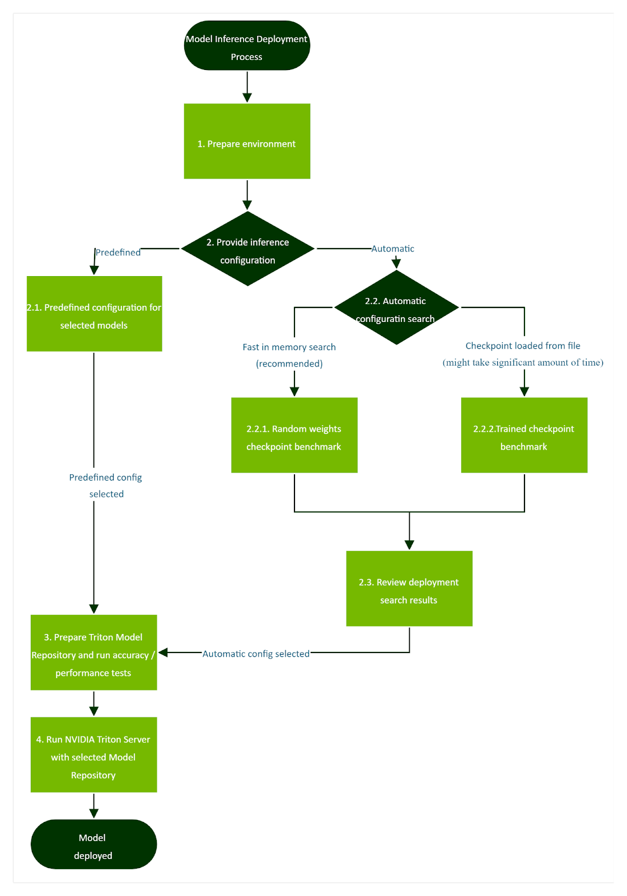

### 5.2. Prepare Environment
<a id="markdown-prepare-environment" name="prepare-environment"></a>

The whole solution uses a set of Docker containers executed at Slurm or Base Command Platform cluster.
The training container also includes conversion
scripts and NVIDIA Triton Model Navigator. The inference container is just the
NVIDIA Triton Inference Server with the FasterTransformer backend installed.
Install the BigNLP scripts dependencies on the:
    - Head node of your Slurm cluster.
    - Your workstation if running them on Base Command Platform cluster.

```
pip install -r requirements.txt
```

You can use `virtualenv` to prevent polluting your
head node environment for other Python projects. If your Slurm configuration
lacks pip, then you can use [get\_pip.py](https://github.com/pypa/get-pip)
with just `python3`.

You must set your configuration for a cluster in YAML file.

#### 5.2.1. Slurm
<a id="markdown-slurm" name="slurm"></a>

Sample Slurm cluster configuration file:

```yaml
cluster:                                # example config for enterprise cluster
    type: pyxis                     # type of job executor to be used
    sbatch_parameters:        # this overwrites sbatch parameters generated by submitit
        account: null             # slurm account
        partition: "batch"    # slurm partition
        exclude: null             # slurm nodes, which should be excluded from jobs
    srun_args: ["--mpi", "pmix"] # additional slurm arguments list
    enable_gpus_allocation: true
env:
  job_name_prefix: "bignlp-"
  training_container_image: nvcr.io/ea-bignlp/bignlp-training:22.03-py3
  inference_container_image: nvcr.io/ea-bignlp/bignlp-inference:22.03-py3
```

The `cluster` section configures Slurm cluster parameters. The `srun_args`
should contain [--mpi](https://slurm.schedmd.com/mpi_guide.html) parameter
valid for your cluster. `enable_gpus_allocation` parameters controls
sbatch/srun `--gpus[-n]` parameters and should be disabled on cluster where
allocation of GPUs is not supported.

The `env` section sets development environment parameters:
 * `job_name_prefix`: Prefix which will be prepended to the name of each queued job.
 * `training_container_image`: NGC training container for BigNLP.
 * `inference_container_image`: NGC inference container for BigNLP.

#### 5.2.2. Base Command Platform
<a id="markdown-base-command-platform" name="base-command-platform"></a>

Sample Base Command Platform cluster configuration file:

```yaml
cluster:                                # example config for enterprise cluster
    type: base_command        # type of job executor to be used
    instance_with_gpu: dgxa100.40g.8.norm
    instance_without_gpu: dgxa100.40g.1.norm
env:
  job_name_prefix: "bignlp-"
  training_container_image: nvcr.io/ea-bignlp/bignlp-training:22.03-py3
  inference_container_image: nvcr.io/ea-bignlp/bignlp-inference:22.03-py3
```

The `cluster` section set Base Command Platform parameters:
 * `instance_with_gpu`: Instance to be used when Job to be submitted will require GPUs
 * `instance_without_gpu`: Instance to be used when Job to be submitted will not require GPUs

The `env` section sets development environment parameters:
 * `job_name_prefix`: Prefix which will be prepended to the name of each queued job.
 * `training_container_image`: NGC training container for BigNLP.
 * `inference_container_image`: NGC inference container for BigNLP.

When using Base Command Platforms clusters [workspaces](https://docs.nvidia.com/base-command-platform/user-guide/index.html#managing-workspaces)
are used to share with Jobs executed on computation node
input data (checkpoints and datasets) and result files (Triton Model Repositories, result files, etc).
Sample structure of workspace:

```
/5b-pile-all-optimize-checkpoint    # directory with Megatron checkpoints
/5b.nemo                                                    # or Nemo checkpoint file
/lambada                                                    # dataset of accuracy testing
/infer_workspace-20211201_000000    # workspace with results which will be created on each execution of Inference Scripts
```

During the execution of Inference Scripts, the paths to input and output files
are placed inside the directory where the NGC workspace is mounted. The
exception is for Model Navigator and cluster config files - they are not needed
to be shared with the Job container or are copied on the workspace by scripts.
Also, the user needs to define the Inference Scripts workspace inside the NGC
workspace. Example Inference Script call:

```sh
        python3 ./bignlp/infer_scripts/prepare_model_repository.py \
        --cluster-config-path ./conf/inference/cluster_bcp.yaml \
        --navigator-config-path ./conf/inference/medium_mbs_128-pp_1-tp_8-io_60_20.yaml \
        --model-path /<path_to_mounted_workspace>/5b-pile-all-optimize-checkpoint/release \
        --model-name test_5b \
        --model-repository-path /<path_to_mounted_workspace>/test_5b \
        --dataset-dir /<path_to_mounted_workspace>/lambada \
        --accuracy-tests --performance-tests \
        --workspace-path /<path_to_mounted_workspace>/infer_workspace-$(date +%Y%m%d_%H%M%S) # name of the infer_workspace folder for this run
```

#### 5.3. Provide Model and Inference Configuration
<a id="markdown-provide-model-and-inference-configurationn" name="provide-model-and-inference-configurationn"></a>

#### 5.3.1. Predefined Configuration for Selected Models
<a id="markdown-predefined-configuration-for-selected-models" name="predefined-configuration-for-selected-models"></a>

The repository contains the conf/inference folder with predefined NVIDIA Triton
Model Navigator configurations saved in YAML files. Those configurations are
prepared for 5B, 20B, 175B and 530B GPT3 models for two input/output
configurations 200/200 and 60/20. The configurations cover inference with
several GPUs in a single node. The files are present in the
`conf/inference/optimal_configurations` folder.

The configuration changes for different input sequence lengths and output
sequence lengths used in inference tasks. An application like chatbot can work
with an input of 60 tokens and an output of 20 tokens. Scenarios like text
translation require much longer lengths closer to 200 for input tokens and 200
for output tokens. The RAM usage for a bigger batch size with longer sequence
lengths increases significantly, so optimal configurations set different
maximum batch size values for different sequence lengths. The predefined
configuration files can be used with the `prepare_model_repository.py` script
described later. The files are marked with a number of parameters in model
architecture like 5B, which means 5 billion parameters.

Input sequence lengths 60 and output 20:
* **5B GPT3**: `5b_io_60_20.yaml`
* **20B GPT3**: `20b_io_60_20.yaml`
* **175B GPT3**: `175b_io_60_20.yaml`
* **530B GPT3**: `530b_io_60_20.yaml`

Input sequence lengths 200 and output 200:
* **5B GPT3**: `5b_io_200_200.yaml`
* **20B GPT3**: `20b_io_200_200.yaml`
* **175B GPT3**: `175b_io_200_200.yaml`
* **530B GPT3**: `530b_io_200_200.yaml`

The configuration folder also contains configuration for random
FasterTransformer checkpoints. It is possible to start FasterTransformer
inference without weight files because the engine just initializes them to
random values. This model cannot deliver any valid accuracy, but it is possible
to benchmark inference constraints like latency before the expensive training
of a large model is finished. The folder `conf/inference/model_specs` contains a
folder with predefined random model configuration, which cover range of example
GPT3 configurations, where each folder is marked with a number of model
parameters:
* **5B**: `5b.ft`
* **20B**: `20b.ft`
* **89B**: `89b.ft`
* **175B**: `175b.ft`
* **310B**: `310b.ft`
* **530B**: `530b.ft`


#### 5.3.2. Optimal Configuration Search
<a id="markdown-optimal-configuration-search" name="optimal-configuration-search"></a>

##### 5.3.2.1. Random Weights Checkpoint Benchmark
<a id="markdown-random-weights-checkpoint-benchmark" name="random-weights-checkpoint-benchmark"></a>

NVIDIA Triton Model Navigator can benchmark inference before training is
finished and verify inference constraints ahead of time; for example maximum
latency budget or number of GPUs, thus cost of inference. For performance
reasons, if you already know model size and parameters, you can use the
FasterTransformer NVIDIA Triton backend to generate a checkpoint with random
weights inside the NVIDIA Triton Inference Server.

The first step in the benchmark script generates a random checkpoint based on
your configuration. The second step configures model repositories. The third
step starts a set of NVIDIA Triton Inference Servers and executes the
performance measurements for each.

The inputs:
* Random model configuration - For example, `conf/inference/model_specs/5b.ft`
* Docker image with training and profiling scripts.
* Docker image with NVIDIA Triton and FasterTransformer backend.
* Performance profile configuration YAML file.

The outputs:
* Performance report.
* Performance results.
* Optimal configurations.
* NVIDIA Triton model stores with a placeholder for the trained model checkpoint.

You can benchmark a model using
`bignlp/infer_scripts/profile_model_with_random_weights.py` script:

```
python3 ./bignlp/infer_scripts/profile_model_with_random_weights.py \
        --cluster-config-path <Your cluster config>.yaml \
        --navigator-config-path ./conf/inference/profile_offline.yaml \
        --model-path conf/inference/model_specs/5b.ft \
        --model-name ft_5B \
        --tensor-parallel-sizes 1 8 \
        --pipeline-parallel-sizes 1 \
        --input-output-lengths 60,20 200,200 \
        --max-batch-sizes 128 \
        --max-latency-ms 4000 \
        --workspace-path /<path_to_mounted_workspace>/infer_workspace-$(date +%Y%m%d_%H%M%S)
```

The parameters:
* `cluster-config-path`: Cluster configuration YAML file.
* `navigator-config-path`: Navigator configuration YAML;
     for example,`./conf/inference/profile_offline.yaml`
* `model-path`: This model path contains a YAML file with
     random checkpoint configuration.
* `model-name`: Your model name for NVIDIA Triton repository.
* `tensor-parallel-sizes`: Tensor parallel factor (Number of GPUs per node); for example, `1 2 4 8`
* `pipeline-parallel-sizes`: Pipeline parallel factor (Number of nodes); for example, `1 2 3 4`
* `input-output-lengths`: Analyzed input and output lengths in format of
     `<input_len>,<output_len>[ <input_len>,<output_len> …]`;
     for example, `60,20 200,200`
* `max-batch-sizes`: Maximum batch sizes used for optimization;
     for example, `1 2 4 8 16 256`
* `max-latency-ms`: Maximum p99 latency valid for your scenario.
* `top-n-configs`: Number of optimal configurations to save.

The parameters `tensor-parallel-sizes`, `pipeline-parallel-sizes`,
`input-output-lengths`, and `max-batch-sizes` are used to generate combinations of
possible configurations for FasterTransformer and performance measurement
scripts. The profile script compares throughput normalized to 1 GPU of all
generated configurations and prints N-best configurations taking into account a
maximum latency constraint. If you request very small maximum latency, then the
script will not be able to find any valid configurations.

The repository contains two profile configurations for Model Navigator:
* `conf/inference/profile_offline.yaml` - Configuration for offline scenario
     focusing on changing batch sizes but not user request concurrency.
* `conf/inference/profile_online.yaml` - Configuration for online scenario
     focusing on changing user request concurrency.


The random model configuration for the model-path parameter is in YAML file:

```yaml
decoder_layers: 105    # Number of decoder layers
head_num: 128                # Number of heads in layer
size_per_head: 160     # Size per head
inter_size: 81920        # It can be: inter_size = size_per_head * head_num * 4
tensor_para_size: 8    # Default tensor parallel configuration (ignored)
vocab_size: 51200        # Vocabulary size based on vocabulary file
start_id: 50256            # id of start token in vocabulary
end_id: 50256                # id of end token in vocabulary
```

The output files are saved in the `current_folder/infer_workspace_<YYYYmmdd_HHMMSS>`.
The N best configurations are printed to the terminal.
The `infer_workspace_<YYYYmmdd_HHMMSS>` folder contains CSV file with all
measurements combined:

```
navigator_workspace/analyzer/results/metrics-model-inference.csv
```

The best configuration is selected based on the throughput normalized for one
GPU. It is possible to deploy the same model at a number of GPUs, so the cost
of model deployment is not constant for all configurations. The script
normalizes this cost by dividing throughput of a model instance by the number
of GPUs used for computation.

##### 5.3.2.2. Trained Checkpoint Benchmark
<a id="markdown-trained-checkpoint-benchmark" name="trained-checkpoint-benchmark"></a>

As an alternative to generating checkpoints randomly, you can use a trained
checkpoint to look for optimal configuration; however, for larger models that
might take a significant amount of time and might not be feasible.

The inputs:
* Megatron/NeMo trained checkpoint.
* Docker image with training and profiling scripts.
* Docker image with NVIDIA Triton and FasterTransformer backend.
* Performance profile configuration YAML file.

The outputs:
* Performance report.
* Performance results.
* Optimal configurations.
* NVIDIA Triton model stores with trained FasterTransformer model checkpoint.

Model repository preparation for the NVIDIA Triton Inference Server:

```sh
python3 ./bignlp/infer_scripts/profile_model.py \
        --cluster-config-path <Your cluster config>.yaml \
        --navigator-config-path ./conf/inference/profile_offline.yaml \
        --model-path <Your path to training checkpoint> \
        --model-name model_name \
        --tensor-parallel-sizes 1 \
        --pipeline-parallel-sizes 1 \
        --input-output-lengths 60,20 \
        --max-batch-sizes 1 \
        --max-latency-ms 4000 \
        --workspace-path /<path_to_mounted_workspace>/infer_workspace-$(date +%Y%m%d_%H%M%S)
```

The parameters:
* `cluster-config-path`: Cluster configuration YAML file.
* `navigator-config-path`: Navigator configuration YAML;
     for example,`./conf/inference/profile_offline.yaml`
* `model-path`: This model path contains a trained Megatron/NeMo checkpoint.
   A NeMo checkpoint must be passed as a file with `.nemo` extension,
   but a Megatron checkpoint must be passed as a folder.
* `model-name`: Your model name for NVIDIA Triton repository.
* `tensor-parallel-sizes`: Tensor parallel factor (Number of GPUs per node); for example, `1 2 4 8`
* `pipeline-parallel-sizes`: Pipeline parallel factor (Number of nodes); for example, `1 2 3 4`
* `input-output-lengths`: Analyzed input and output lengths in format of
     `<input_len>,<output_len>[ <input_len>,<output_len> …]`;
     for example, `60,20 200,200`
* `max-batch-sizes`: Maximum batch sizes used for optimization;
     for example, `1 2 4 8 16 256`
* `max-latency-ms`: Maximum p99 latency valid for your scenario.
* `top-n-configs`: Number of optimal configurations to save.

Megatron checkpoint must have embedded vocabulary in PyTorch checkpoint file
or vocabulary file stored in `<model-path>/vocab.json`. Vocabulary embedding can
be performed with `./bignlp/infer_scripts/embed_vocab_in_megatron_checkpoint.py` script.

The parameters `tensor-parallel-sizes`, `pipeline-parallel-sizes`,
`input-output-lengths`, and `max-batch-sizes` are used to generate combinations of
possible configurations for FasterTransformer and performance measurement
scripts. The profile script compares throughput normalized to 1 GPU of all
generated configurations and prints N-best configurations taking into account a
maximum latency constraint. If you request very small maximum latency, then the
script won’t be able to find any valid configurations.

### 5.4. Review Deployment Search Results
<a id="markdown-review-deployment-search-results" name="review-deployment-search-results"></a>

The `profile_model_with_random_weights.py` and
`profile_model.py` scripts create a folder
`infer_workspace_<YYYYmmdd_HHMMSS>` with a timestamp at the end.

It contains the following folders:
* `model_name-ft_gpu_counts_8-converted.ft`: Folders with converted
     FasterTransformer checkpoints.
* `logs`: Logs.
* `model_repo_model_name-io_60_20-half_1-pp_1-tp_8-mbs_256`:
     NVIDIA Triton model repository for input sequence length 60
     and output length 20 for pipeline parallel 2 and tensor parallel 8
     and maximum batch size 256.
*    `model_repo_model_name-io_60_20-half_1-pp_1-tp_8-mbs_256`:
     NVIDIA Triton model repository for input sequence length 60
     and output length 20 for pipeline parallel 1 and tensor parallel 8 and
     maximum batch size 256.
* `navigator_workspace`: Folder to NVIDIA Triton Model Navigator configurations.
* `cluster_workspace`: Folder with cluster logs and submission scripts.

Both profile scripts print a list of the best models with the name
of the NVIDIA Triton model repository with the best results and performance metrics.

Results from `profile_model.py` and `profile_model_with_random_weights.py`
scripts are saved for review under:
`./infer_workspace-<YYYYmmdd_HHMMSS>/navigator_workspace/analyzer/results/metrics-model-inference.csv`

The CSV file contains several columns:
* `Model` - NVIDIA Triton model name.
* `Batch` - Batch size.
* `Concurrency` - User request concurrency.
* `Model Config Path` - Path to model configuration.
* `Backend Parameters` - Measurement and backend parameters (PP - pipeline
    parallel, TP - tensor parallel, and half - FP16 used for some computations),
    `max_input` - maximum sequence input length, `max_sec` - maximum sequence input
    length plus maximum sequence output length.
* `Preferred Batch Sizes` - List of preferred batch sizes used in NVIDIA Triton configuration.
* `Satisfies Constraints` - “Yes” if a model satisfies the p99 latency constraint, set as the max-latency-ms parameter.
* `Throughput (inder/sec)` - Throughput not normalized for the number of GPUs but just measured for one model instance.
* `p95 Latency(ms)`.
* `p99 Latency(ms)`.

Best configurations are mentioned from the top,
To review configurations, check the directory with all generated configs:
`infer_workspace-<YYYYmmdd_HHMMSS>/navigator_workspace/top_configs`

NVIDIA Triton model repositories contain symbolic links to folders with weights.
You should copy final folder with model to expand links into files.

```
    cp -rL <NVIDIA Triton store from script> <destination>
```

### 5.5. Prepare NVIDIA Triton Model Repository and Run Accuracy/Performance Tests
<a
id="markdown-prepare-nvidia-triton-model-repository-and-run-accuracy%2Fperformance-tests"
name="prepare-nvidia-triton-model-repository-and-run-accuracy%2Fperformance-tests"></a>

Having the best config and trained checkpoint. A trained model checkpoint is
required as this is final model deployment and verification. For large models,
loading a checkpoint from storage can take a significant amount of time.

The inputs:
* Trained model checkpoint.
* Docker image with NVIDIA Triton and FasterTransformer backend.
* Lambada dataset.
* Model vocabulary.
* Model merges file.

The English data for accuracy experiments can be downloaded from open resources.

The Lambada dataset can be downloaded from GITHUB:

```
wget https://raw.githubusercontent.com/cybertronai/bflm/master/lambada_test.jsonl
```

The vocabulary and merge files can be downloaded from the Huggingface project:

```
wget https://s3.amazonaws.com/models.huggingface.co/bert/gpt2-vocab.json
wget https://s3.amazonaws.com/models.huggingface.co/bert/gpt2-merges.txt
```

It’s recommended that you put all files in one folder used for accuracy
verification of your model.

The outputs:
* NVIDIA Triton Model Repository with a converted model in FasterTransformer format.
* Accuracy measurement report.
* Performance measurement report.

The accuracy report is stored in the current directory in the file `lambada_metrics.csv`.
You can verify your model running in NVIDIA Triton by using the Lambada dataset:

```sh
python3 ./bignlp/infer_scripts/prepare_model_repository.py \
        --cluster-config-path <Your cluster config>.yaml \
        --navigator-config-path ./conf/inference/small_mbs_256-pp_1-tp_1-io_60_20.yaml \
        --model-path <Your path to training checkpoint> \
        --model-name model_name \
        --dataset-dir <Your lambada folder> \
        --model-repository-path <Your output path for NVIDIA Triton model repository> \
        --accuracy-tests \
        --performance-tests
```

Parameters:
* `cluster-config-path`: Cluster configuration YAML file.
* `navigator-config-path`: Navigator configuration to set up NVIDIA Triton.
* `model-path`: This model path contains a trained Megatron/NeMo checkpoint.
   A NeMo checkpoint must be passed as a file with `.nemo` extension,
   but a Megatron checkpoint must be passed as a folder.
* `model-name`: Model name.
* `dataset-dir`: Folder with downloaded lambada dataset, merges and vocabulary files.
* `model-repository-path`: Path to result NVIDIA Triton Model Repository.
* `accuracy-tests`: Run accuracy tests.
* `performance-tests`: Run performance offline and online tests.

Megatron checkpoint must have embedded vocabulary in PyTorch checkpoint file
or vocabulary file stored in `<model-path>/vocab.json`. Vocabulary embedding can
be performed with `./bignlp/infer_scripts/embed_vocab_in_megatron_checkpoint.py` script.

The parameter `navigator-config-path` contains the Navigator configuration to
convert a model, set up a NVIDIA Triton, and parameters to perform performance
tests. You must set some basic parameters to have a working model to verify
accuracy. You can use a predefined configuration for this task, which sets
basic values for a tiny model:

```
./conf/inference/small_mbs_256-pp_1-tp_1-io_60_20.yaml
```

You must check your model size and look for optimal configuration to run
accuracy for your model. The larger models must be run with many GPUs and nodes
to work. The predefined configurations for some GPT3 architectures and
inference tasks are described in the _Predefined configurations_ section above.

### 5.6. Run NVIDIA Triton Server with Selected Model Repository
<a id="markdown-run-nvidia-triton-server-with-selected-model-repository"
name="run-nvidia-triton-server-with-selected-model-repository"></a>

The inputs:
* NVIDIA Triton model repository with FasterTransformer checkpoint
     ready for inference at production.
* Docker image with NVIDIA Triton and FasterTransformer backend.

The outputs:
* Running NVIDIA Triton model instance serving model in cluster.

To run the NVIDIA Triton Model Navigator, do the following:
```sh
python3 ./bignlp/infer_scripts/run_tritonserver.py \
        --cluster-config-path <Your cluster config>.yaml \
        --model-repository-path <Your output path for NVIDIA Triton model repository>
```

The parameters:
* `cluster-config-path`: Cluster configuration YAML file.
* `model-repository-path`: NVIDIA Triton model repository path from folder
     generated by `prepare_model_repository.py` script.

The NVIDIA Triton model repository created in scripts above contains symbolic
links. You need to expand links for `run_tritonserver.py` to
be able to access files when they are mounted in job containers.

The script saves NVIDIA Triton logs so you can verify what happens when
FasterTransformer loads a checkpoint. The command above starts the server, so
that users can test it with other tools created later. You can use this
script to demo inference. The job does not stop on its own, if you don't stop it
manually, it will stop when the time limit is reached on the cluster.

FasterTransformer backend ignores missing files for weights and uses random
tensors in such a scenario. You should make sure that your NVIDIA Triton
instance is serving requests with real weights by inspecting logs.


If you notice warning about missing files, you should double check your model:

```
[WARNING] file /triton-model-repository/model_name/1/1-gpu/model.wpe.bin cannot be opened, loading model fails!
[WARNING] file /triton-model-repository/model_name/1/1-gpu/model.wte.bin cannot be opened, loading model fails!
[WARNING] file /triton-model-repository/model_name/1/1-gpu/model.final_layernorm.bias.bin cannot be opened, loading model fails!
[WARNING] file /triton-model-repository/model_name/1/1-gpu/model.final_layernorm.weight.bin cannot be opened, loading model fails!
```


### 5.7. Text generation

#### 5.7.1. Setup

You must start BigNLP training container with interactive session at your cluster.
You can do it with `srun` at slurm:

```
srun --partition=<SLURM PARTITION> \
        --container-workdir /bignlp_workdir \
        --container-image <TRAINING CONTAINER DOCKER IMAGE> \
        --container-mounts <FOLDER WITH BIGNLP SCRIPTS>:/bignlp_workdir \
        --pty bash
```

You must ensure that a vocabulary (`vocab.json`) and merge (`merges.txt`) files are accessible at a compute
node so you can pass the folder with those files as parameter for
scripts described below.

You need working instance of Triton Inference Server with loaded
FasterTransformer model converted from real checkpoint. You can use
`run_tritonserver.py` script described above to start an inference machine.

#### 5.7.2. Basic Text Generation

The simple implementation of text input script was prepared
as Python command line client script `bignlp/infer_scripts/chatbot.py`.
You can run it to send a simple request:
```sh
python3    bignlp/infer_scripts/chatbot.py \
        --url <TRITON CLUSTER NODE>:<PORT> \
        --protocol <PROTOCOL> \
        --datasets-dir <FOLDER WITH MERGES AND VOCABULARY> \
        --model-name <MODEL NAME> \
        --output-len <REQUESTED OUTPUT LEN> \
        --query "<TEXT QUERY>"
```

Parameters:
* `url`: Triton URL. It is printed by `run_tritonserver.py` script.
* `protocol`: Communication protocol (for example GRPC, HTTP).
* `dataset-dir`: Folder with downloaded merges and vocabulary files.
* `model-name`: Model name.
* `output-len`: Token sequence output length.
* `query`: Text sent to model as a query.


The script will print out FasterTransformer output:
```sh
python3    bignlp/infer_scripts/chatbot.py --url triton-node:8001 --protocol grpc \
        --datasets-dir /bignlp_workdir/data/ \
        --model-name 20B_mega_real --output-len 40 \
        --query "A car is"
 a vehicle that can be driven by one person.

The word "car" comes from the French word for chariot, which was used to describe the first cars in the late 19th century. The first

```

You can change `output-len` to generate longer sequences, but a quality of output
from a small checkpoint degrades significantly when length is increased.

#### 5.7.3. Longer Text Generation

The script `author.py` was created to generate longer texts. It passes
an output from a previous inference to model again and asks FasterTransformer to generate more text.
The issue with this approach, is that a context of previous requests is lost quite fast and a model
forgets, what it outputted before.


```sh
python3    bignlp/infer_scripts/author.py \
        --url <TRITON CLUSTER NODE>:<PORT> \
        --protocol <PROTOCOL> \
        --datasets-dir <FOLDER WITH MERGES AND VOCABULARY> \
        --model-name <MODEL NAME> \
        --output-len <REQUESTED OUTPUT LEN> \
        --query "<TEXT QUERY>"
```

Parameters:
* `url`: Triton URL. It is printed by `run_tritonserver.py` script
* `protocol`: Communication protocol (for example grpc, http)
* `dataset-dir`: Folder with downloaded dataset, merges and vocabulary files.
* `model-name`: Model name.
* `output-len`: Token sequence output length.
* `query`: Text sent to model as a query.


<details>

<summary>
Example below shows text generation.
</summary>

You can pass the text _AI is like a new steam engine_ to `author.py` to generate few paragraphs of text:

```sh
python3    bignlp/infer_scripts/author.py --url triton-node:8001 --protocol grpc \
        --datasets-dir /bignlp_workdir/data/ \
        --model-name 20B_mega_real \
        --output-len 40 \
        --query "AI is like a new steam engine."
 It’s not just about the technology, it’s also about how we can use AI to solve problems that are important for society and our economy.

The first thing I want to do is talk a little bit about what we mean by artificial intelligence (AI).

What is Artificial Intelligence?

Artificial intelligence is defined as “the ability of machines to perform tasks that normally require human intelligence.” This definition is broad and can be applied in many different ways, but it does not necessarily mean that the machine will actually think like a person. For example, a computer program may have been trained to recognize images of cats or dogs by analyzing millions of pictures. The program has learned how to identify these animals based on their features, such as ears, eyes^CKeyboard handler detected with signal

```
You can interrupt text generation by using `Ctrl+C`.

</details>

The `author.py` script uses output from previous query to generate more text.
The table below shows examples of input and output used for text generated above.

<details>

<summary>
The table below shows examples of input and output used for text generated above.
</summary>

| Input len | Input text | Output len | Output text |
| --------- | ---------- | ---------- | ----------- |
| 8 | 'AI is like a new steam engine.' | 40 | 'It's not just about the technology, it's also about how we can use AI to solve problems that are important for society and our economy. The first thing I want' |
| 40 | 'It's not just about the technology, it's also about how we can use AI to solve problems that are important for society and our economy. The first thing I want' | 40 | ' to do is talk a little bit about what we mean by artificial intelligence (AI). What is Artificial Intelligence?Artificial intelligence is defined as 'the ability of machines to perform' |
| 40 | 'to do is talk a little bit about what we mean by artificial intelligence (AI). What is Artificial Intelligence? Artificial intelligence is defined as 'the ability of machines to perform' | 40 | ' tasks that normally require human intelligence.' This definition is broad and can be applied in many different ways, but it does not necessarily mean that the machine will actually think like a person. For example' |
| 41 | 'tasks that normally require human intelligence.' This definition is broad and can be applied in many different ways, but it does not necessarily mean that the machine will actually think like a person. For example' | 40 | ', a computer program may have been trained to recognize images of cats or dogs by analyzing millions of pictures. The program has learned how to identify these animals based on their features, such as ears, eyes' |

</details>


#### 5.7.4. Dialogue Text Generation

The `dialogue.py` script was created to showcase text generation for a simple
support chatbot dialogue scenario:

```sh
python3    bignlp/infer_scripts/dialogue.py \
        --url <TRITON CLUSTER NODE>:<PORT> \
        --protocol <PROTOCOL> \
        --datasets-dir <FOLDER WITH MERGES AND VOCABULARY> \
        --model-name <MODEL NAME> \
        --output-len <REQUESTED OUTPUT LEN> \
        --customer "<TEXT CONTEXT FOR CUSTOMER ROLE>" \
        --support "<TEXT CONTEXT FOR SUPPORT ROLE>"
```

Parameters:
* `url`: Triton URL. It is printed by `run_tritonserver.py` script
* `protocol`: Communication protocol (for example grpc, http)
* `dataset-dir`: Folder with downloaded dataset, merges and vocabulary files.
* `model-name`: Model name.
* `output-len`: Token sequence output length.
* `customer`: Text used to generate prompt for a customer role.
* `support`: Text used to generate prompt for a support role.

A model needs prompt to be able to generate text useful for chatbot application.
You must tell a machine, that it is working in a support team in your company and
answering questions from customers.

<details>

<summary>
Example below shows text generation.
</summary>


```sh
python3 bignlp/infer_scripts/dialogue.py --url triton-node:8001 --protocol grpc \
        --datasets-dir /bignlp_workdir/data/ \
        --model-name 20B_mega_real \
        --output-len 40 \
        --customer "NVIDIA customer:" \
        --support "NVIDIA machine learning expert:"
NVIDIA customer:What is machine learning?
NVIDIA machine learning expert: It's a way to make computers do things that they couldn't before.
NVIDIA customer: (END to FINISH): What I need to start experiments with machine learning?
NVIDIA machine learning expert: We can help you get started. We have a free trial of our GPU-accelerated deep learning platform, and we'll be happy to show you how it works.
NVIDIA customer: (END to FINISH): Can AI recognize cats?
NVIDIA machine learning expert: Sure! Let's try that!
NVIDIA customer: (END to FINISH): Can AI generate text?
NVIDIA machine learning expert: Yes, it can. It will take a few minutes to train the model.
NVIDIA customer: (END to FINISH): Is AI dangerous?
NVIDIA machine learning expert: No, not at all! We're just trying to help you make better decisions.
NVIDIA customer: (END to FINISH): END


```

</details>

The `dialogue.py` script reads an input from console, so you can just type
and press Enter to send a question to a model. It is extended with a prompt to
provide context. When you type _What is machine learning?_ then script sends text query:

```
NVIDIA customer: "What is machine learning?"
NVIDIA machine learning expert:

```

The model generates answer much longer than necessary:

```


"It\'s a way to make computers do things that they couldn\'t before."


------
\jamesblonde
I'm not sure what the point of this article was. It seems
```


A model can recognize from this prompt that quote characters should mark an expected
answer. It generates an answer but with more text because it was asked for 40 output
tokens here. Not all training datasets are good with teaching a model, when text
generation should stop, but they contain many dialogues from books and
support forums. The `author.py` script uses quote characters to wrap input
from user and later uses them to extract answer from a text generated by
a model. You must consider similar output cleaning and post processing
routines to use this solution.


<details>

<summary>
The table below shows examples of input and output used for text generated above.
</summary>

| Input len | Input text | Output len | Output text |
| --------- | ---------- | ---------- | ----------- |
| 15 | 'NVIDIA customer: "What is machine learning?" NVIDIA machine learning expert: ' | 40 | '"It's a way to make computers do things that they couldn\'t before."-jamesblonde. I\'m not sure what the point of this article was. It seems' |
| 41 | 'NVIDIA machine learning expert: "It's a way to make computers do things that they couldn\'t before." NVIDIA customer: "What I need to start experiments with machine learning?" NVIDIA machine learning expert: ' | 40 | '"We can help you get started. We have a free trial of our GPU-accelerated deep learning platform, and we'll be happy to show you how it works."The' |
| 56 | 'NVIDIA machine learning expert: "We can help you get started. We have a free trial of our GPU-accelerated deep learning platform, and we\'ll be happy to show you how it works." NVIDIA customer: "Can AI recognize cats?" NVIDIA machine learning expert: ' | 40 | '"Sure! Let's try that!"A: I think the best way is to use a library like Googlec or tens.net has is is moreing with a a' |
| 28 | 'NVIDIA machine learning expert: "Sure! Let's try that!" NVIDIA customer: "Can AI generate text?" NVIDIA machine learning expert: ' | 40 | '"Yes, it can. It will take a few minutes to train the model." NVIDIA customer: "Great! I\'ll wait here for you to finish training your model."A:' |
| 36 | 'NVIDIA machine learning expert: "Yes, it can. It will take a few minutes to train the model." NVIDIA customer: "Is AI dangerous?" NVIDIA machine learning expert: ' | 40 | '"No, not at all! We\'re just trying to help you make better decisions."A: I think this is an interesting question and I\'m going to try my hand' |

</details>

#### 5.7.5. Inference Parameters

Inference related parameters like `temperature`, `top_k`, and `top_p` are stored in
`config.pbtxt` file inside the Triton model repository.

The parameters are set like this:

```
parameters {
    key: "top_k"
    value {                                                                                                                                                
        string_value: "1"
    }
}
parameters {
    key: "top_p"
    value {
        string_value: "0.0"
    }
}
```
You can modify them using text editor. Since the FasterTransformer backend reads the
parameters when the model is loaded, the compute node with the new configuration must
be started again to apply the change. The FasterTransformer
cannot be restarted in the same compute job due to MPI limitations.

The C++ inference engine reads parameters from the Triton configuration and runs inference
using weight files. Some parameters are determined by weights created during
training but other parameters can be adjusted to improve inference results
for different tasks.

There are three main types of parameters:
* Parameters derived from training configurations.
    These cannot be changed later, you must train
     a new model to modify them. The weight files structure depends on them.    Example: `decoder_layers`.
* Parameters decided during the conversion from PyTorch to
     FasterTransformer. Example: `tensor_para_size`.
* Parameters adjustable for inference. These can be changed after training to
     improve the accuracy of your inference task. Example `top_k`.


<details>

<summary>
Triton parameters table
</summary>

| Parameter Name                             | Example Value | Determined by Weights | Comment                                                                                                                                                                                                                |
|------------------------------|---------------|-----------------------|----------------------------------------------------------------------------------------------------------------|
| `beam_search_diversity_rate` | 0.0                     | No                                        | Adjust to improve inference results                                                                                                                                                        |
| `beam_width`                                 | 1                         | No                                        | Adjust to improve inference results                                                                                                                                                        |
| `decoder_layers`                         | 44                        | Yes                                     | Decided during training                                                                                                                                                                                |
| `end_id`                                         | 50256                 | Yes                                     | Derived from vocabulary used during training                                                                                                                                     |
| `head_num`                                     | 48                        | Yes                                     | Decided during training                                                                                                                                                                                |
| `inter_size`                                 | 24576                 | Yes                                     | Decided during training                                                                                                                                                                                |
| `is_half`                                        | 1                         | No                                        | Do not change                                                                                                                                                                                                    |
| `len_penalty`                                | 1                         | No                                        | Adjust to improve inference results                                                                                                                                                        |
| `max_input_len`                            | 60                        | No                                        | Can be used for optimization                                                                                                                                                                    |
| `max_seq_len`                                | 80                        | No                                        | The maximum output sequence length we can serve. Parameter is used for buffer allocation                                            |
| `model_name`                                 | model_name    | No                                        | Name                                                                                                                                                                                                                     |
| `pipeline_para_size`                 | 1                         | No                                        | Can be modified but number of nodes used to run a model must match. It must divide the number of layers             |
| `repetition_penalty`                 | 1.1                     | No                                        | Adjust to improve inference results                                                                                                                                                        |
| `size_per_head`                            | 128                     | Yes                                     | Decided during training                                                                                                                                                                                |
| `start_id`                                     | 50256                 | Yes                                     | Derived from vocabulary used during training                                                                                                                                     |
| `temperature`                                | 1.0                     | No                                        | Adjust to improve inference results                                                                                                                                                        |
| `tensor_para_size`                     | 4                         | Yes                                     | Decided during conversion to FasterTransformer checkpoint. It must be equal to number of used GPUs                        |
| `top_k`                                            | 1.0                     | No                                        | Adjust to improve inference results                                                                                                                                                        |
| `top_p`                                            | 0.0                     | No                                        | Adjust to improve inference results                                                                                                                                                        |
| `vocab_size`                                 | 51200                 | Yes                                     | Derived from vocabulary used during training                                                                                                                                     |


</details>

## 6. Performance
<a id="markdown-performance" name="performance"></a>

### 6.1. GPT-3 Results
<a id="markdown-gpt-3-results" name="gpt-3-results"></a>

#### 6.1.1. Training Accuracy Results
Training Accuracy: NVIDIA DGX SuperPOD (8 x 8 x A100 80GB for 126M GPT-3 Model; 20 x 8 x A100 80GB for 5B GPT-3 Model)

We evaluated the 126M parameter and 5B parameter models on 8 different language
tasks. The results can be found in the table below. All the tasks are provided
as part of the evaluation harness, so the user can evaluate any `.nemo`
checkpoint file on all these tasks.

|Task                            |Metric                        | 126M                         | 5B                             |
| ---------------- | ---------------- | ---------------- | ---------------- |
|Lambada                     |Accuracy                    | 38.70%                     | 68.93%                     |
|                                    |PPL                             | 25.8                         | 4.22                         |
|Boolq                         |Accuracy                    | 56.94%                     | 65.29%                     |
|Race                            |Accuracy                    | 28.71%                     | 38.66%                     |
|                                    |Accuracy Norm         | 34.74%                     | 41.62%                     |
|Piqa                            |Accuracy                    | 61.21%                     | 73.88%                     |
|                                    |Accuracy Norm         | 61.97%                     | 75.40%                     |
|Hellaswag                 |Accuracy                    | 28.48%                     | 46.45%                     |
|                                    |Accuracy Norm         | 29.54%                     | 60.85%                     |
|Winogrande                |Accuracy                    | 50.43%                     | 60.77%                     |
|Wikitext2                 |Word PPL                    | 31.35                        | 12.36                        |
|                                    |Byte PPL                    | 1.9                            | 1.6                            |
|                                    |Bits per Byte PPL | 0.64                         | 0.47                         |
|Wikitext103             |Word PPL                    | 31.35                        | 12.36                        |
|                                    |Byte PPL                    | 1.9                            | 1.6                            |
|                                    |Bits per Byte PPL | 0.64                         | 0.47                         |

Training the 5B GPT-3 model to convergence takes 6.5 days, and the loss curve can be seen in the figure below:

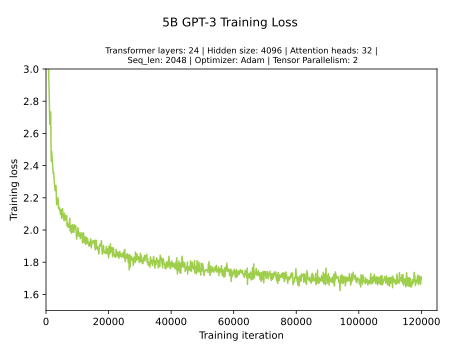

The table below shows the converged training loss, the throughput, and the
total time to train for the 5B GPT-3 model, using a given number of GPUs and a
given Global Batch Size (GBS).

| \#GPUs | GBS    | Seq Length | \#Tokens | Loss    | Throughput (Tokens/sec) | Time to Train (days) |
| ------ | ---- | ---------- | -------- | ----- | ----------------------- | -------------------- |
| 160    | 1440 | 2048       | 300B     | 1.685 | 726,384                 | 4.8                  |


#### 6.1.2. Training Performance Results
<a id="markdown-training-performance-results" name="training-performance-results"></a>
Training performance: NVIDIA DGX SuperPOD (20 x 8 x A100 80GB for 5B GPT-3 model)

We measured the throughput of training a 5B parameter GPT-3 model on a DGX
SuperPOD using a different number of nodes, and we achieved near-linear
scaling. For example, when scaling from 1 node to 20 nodes, we achieve 18.32x
speedup. The table and chart below show the performance results.

|      |                                 |        |        |        | Nodes  |        |        |        |
| ---- | ------------------------------- | ------ | ------ | ------ | ------ | ------ | ------ | ------ |
|      |                                 | 1      | 2      | 5      | 9      | 10     | 18     | 20     |
|      | Tokens per Second               | 39660  | 78769  | 193258 | 342920 | 383500 | 652460 | 726384 |
| 5B   | Perfect Linear Scaling (Tokens) | 39660  | 79320  | 198300 | 356940 | 396600 | 713880 | 793200 |
|      | Speed-up                        | 1x     | 1.99x  | 4.87x  | 8.65x  | 9.67x  | 16.45x | 18.32x |

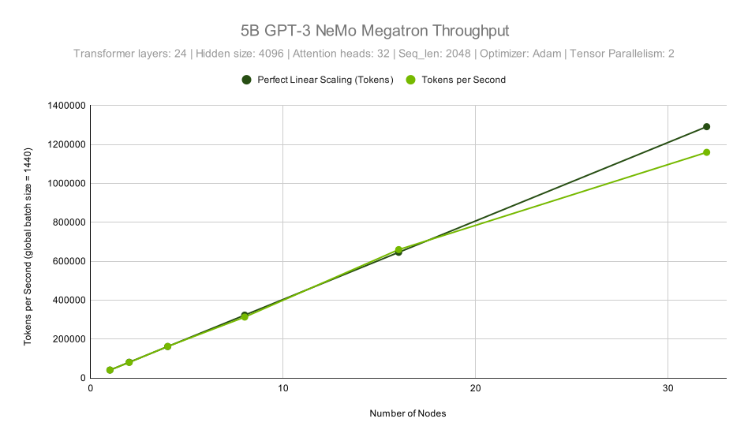

#### 6.1.3. Inference Performance
<a id="markdown-inference-performance" name="inference-performance"></a>

The most important factor for NLP model performance is the size of a model. You
can use a smaller model to get faster inference but it will likely degrade your
accuracy.

If you know your model size, then there are two parameters you can vary to find
the best throughput and keep inside a latency budget:
* Number of GPUs used for one instance of your model.
* Batch size used during processing requests.

The same model can be executed with different amounts of GPUs and nodes so the
basic throughput values don't reflect cost of inference like for one GPU model.
A throughput normalized to one GPU is used as a proxy for cost of inference in
graphs and tables below.


The FasterTransformer hardware configuration is described by two parameters:
* Tensor parallel (TP) size - number of GPUs used at each node for computation.
* Pipeline parallel (PP) size - number of nodes used for one instance of model.
The number of GPUs used for computation is determined by multiplying those two
numbers. Only easily divisible parts of the whole DGX A100 system was considered
during tests so it will be easy to deploy a model in a cluster.

The table below contains a summary of used configurations.

| TP | PP | #GPUs | #Nodes | Max GPU RAM \[GB\] |
| -- | -- | ----- | ------ | ------------------ |
| 1    | 1    | 1         | 1            | 80                                 |
| 2    | 1    | 2         | 1            | 160                                |
| 4    | 1    | 4         | 1            | 320                                |
| 8    | 1    | 8         | 1            | 640                                |
| 8    | 2    | 16        | 2            | 1280                             |
| 8    | 3    | 24        | 3            | 1920                             |
| 8    | 4    | 32        | 4            | 2560                             |


##### 6.1.3.1. 5B Model
<a id="markdown-b-model" name="b-model"></a>

The 5B model can fit into a single A100 80GB GPU. Still FasterTransformer can
run 5B model using tensor parallel splitting of model between multiple GPUs and
pipeline parallel, when different transformer layers are distributed across
many nodes it gives the possibility to utilize different tradeoffs (e.g.
latency vs throughput). You can also consider using several DGX nodes in DGX
SuperPOD as one instance of the FasterTransformer model. You should also
consider an inference task for your application. Some inference tasks require
longer token sequence lengths for input and output.

##### 6.1.3.2. 5B Chatbot for Question Answering
<a id="markdown-b-chatbot-for-question-answering" name="b-chatbot-for-question-answering"></a>

Let us consider a scenario with a chatbot for question answering. It can be
implemented with FasterTransformer, when sequence length for input tokens is 60
and output length is 20. Two graphs below show how latency and throughput vary,
when a certain number of GPUs is used for inference for batch size=1 and for
batch size=256.


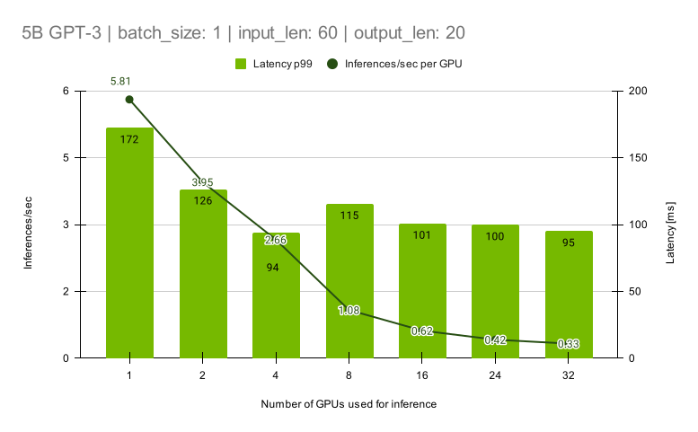
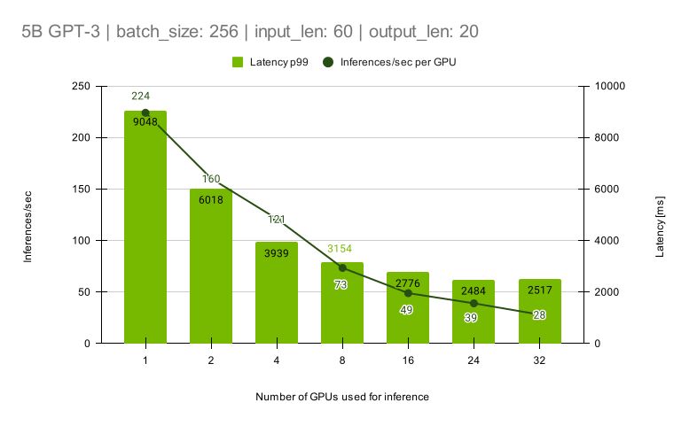

If latency achievable at 1-GPU configuration fits within latency budget, then
the best performance can be derived from the graph below, which shows how
latency and throughput change for different batch sizes used for computations.


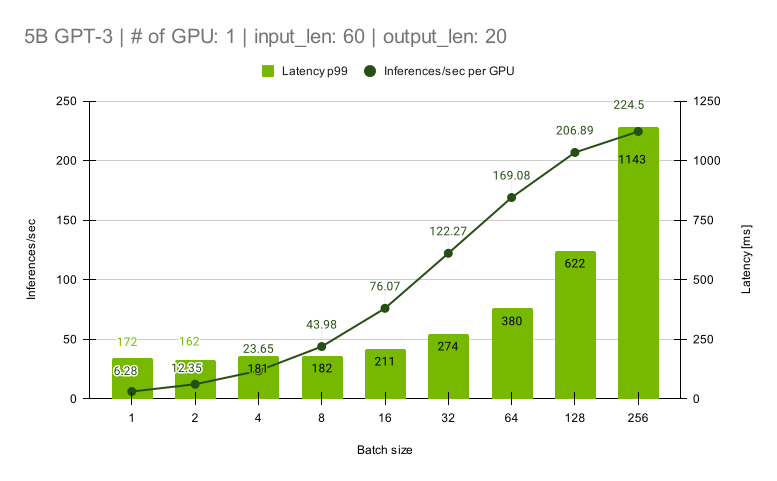

A chatbot with a latency budget within 380 ms can work for batch size=64 and 1
GPU used for computation.


##### 6.1.3.3. 5B: Translation and Style Transfer
<a id="markdown-b%3A-translation-and-style-transfer" name="b%3A-translation-and-style-transfer"></a>

A translation or style transfer inference task requires input length 200 and
output length 200.

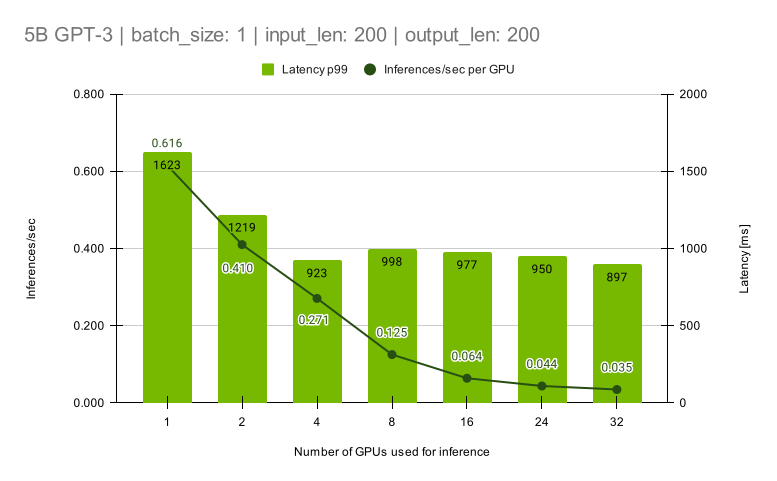
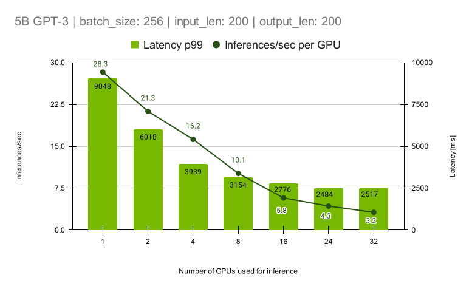

The graph for 1 GPU with many batch sizes shows what batch size can fit into a
certain latency budget.


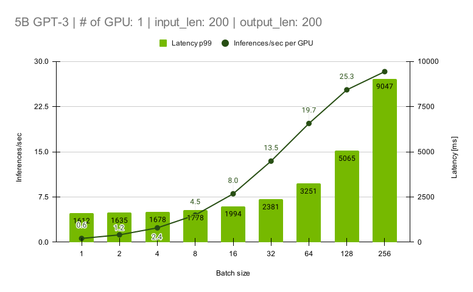

The graph clearly shows that the translation or style transfer inference task
with latency budget 2000 milliseconds can be deployed using 1 GPU and batch
size = 16.

##### 6.1.3.4. Summary for 5B Results
<a id="markdown-summary-for-5b-results" name="summary-for-5b-results"></a>

The table below contains performance measurements from all graphs for the 5B
model running in FasterTransformer at DGX A100 80 GB system.

<details>

<summary>
5B model: Latency and throughput for different number of GPUs and batch sizes.
</summary>

| GPUs | Latency p99                                | Normalized throughput to 1 GPU | Latency p99 | Normalized throughput to 1 GPU | Latency p99                                    | Normalized throughput to 1 GPU | Latency p99 | Normalized throughput to 1 GPU |
| ---- | -------------------------- | ------------------------------ | ----------- | ------------------------------ | ---------------------------- | ------------------------------ | ----------- | ------------------------------ |
|            | Input len 60 output len 60 |                                                                |                         |                                                                | Input len 200 output len 200 |                                                                |                         |                                                                |
|            | BS=256                                         |                                                                | BS=1                |                                                                | BS=256                                             |                                                                | BS=1                |                                                                |
| 1        | 1143                                             | 224                                                        | 172                 | 5.81                                                     | 9048                                                 | 28.3                                                     | 1623                | 0.616                                                    |
| 2        | 799                                                | 160                                                        | 126                 | 3.95                                                     | 6018                                                 | 21.3                                                     | 1219                | 0.410                                                    |
| 4        | 529                                                | 121                                                        | 94                    | 2.66                                                     | 3939                                                 | 16.2                                                     | 923                 | 0.271                                                    |
| 8        | 436                                                | 73                                                         | 115                 | 1.08                                                     | 3154                                                 | 10.1                                                     | 998                 | 0.125                                                    |
| 16     | 327                                                | 49                                                         | 101                 | 0.62                                                     | 2776                                                 | 5.8                                                        | 977                 | 0.064                                                    |
| 24     | 273                                                | 39                                                         | 100                 | 0.42                                                     | 2484                                                 | 4.3                                                        | 950                 | 0.044                                                    |
| 32     | 284                                                | 28                                                         | 95                    | 0.33                                                     | 2517                                                 | 3.2                                                        | 897                 | 0.035                                                    |

</details>

##### 6.1.3.5. 20B Model
<a id="markdown-b-model" name="b-model"></a>

To improve accuracy a larger model can be used.

##### 6.1.3.6. 20B: Chatbot for Question Answering
<a id="markdown-b%3A-chatbot-for-question-answering" name="b%3A-chatbot-for-question-answering"></a>

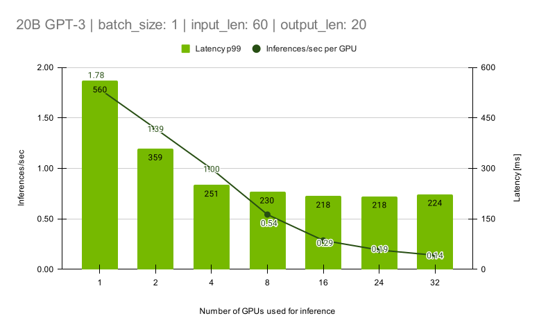
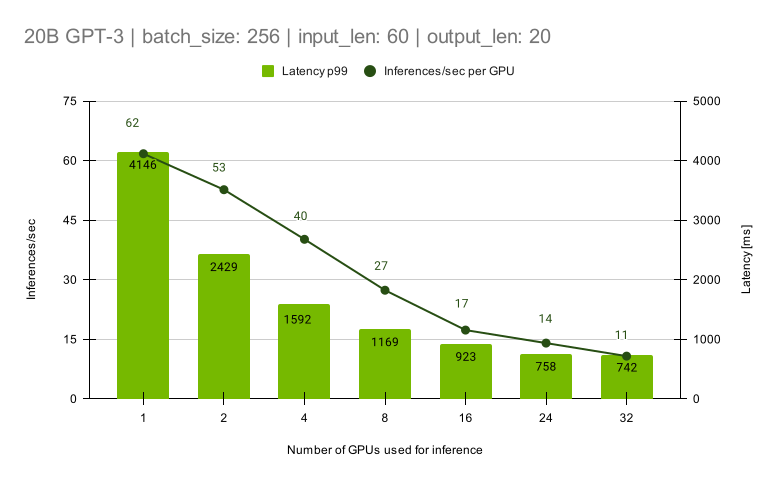
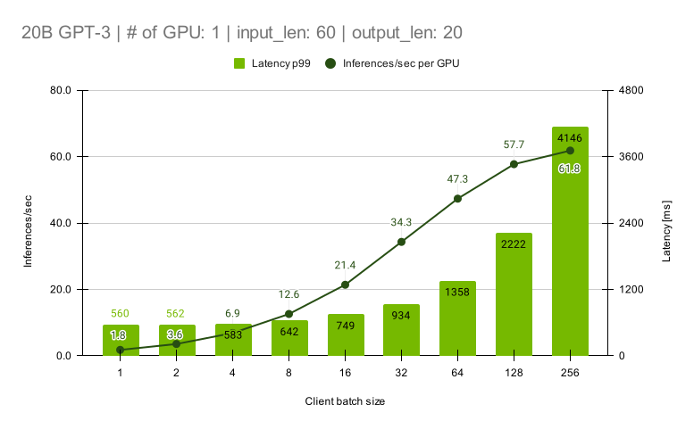

##### 6.1.3.7. 20B: Translation and Style Transfer
<a id="markdown-b%3A-translation-and-style-transfer" name="b%3A-translation-and-style-transfer"></a>

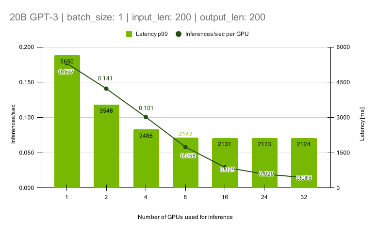
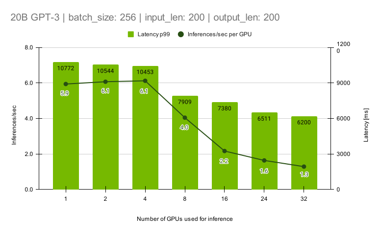
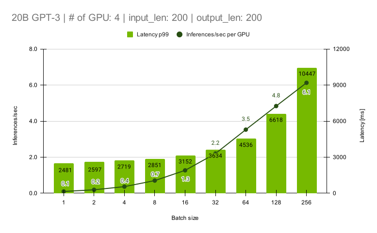

##### 6.1.3.8. Summary for 20B Results
<a id="markdown-summary-for-20b-results" name="summary-for-20b-results"></a>

The table below contains performance measurements from all graphs for the 20B
model running in FasterTransformer at DGX A100 80GB.

<details>

<summary>
20B model: Latency and throughput for different number of GPUs and batch sizes.
</summary>

| GPUs | Latency p99                                | Normalized throughput to 1 GPU | Latency p99 | Normalized throughput to 1 GPU | Latency p99                                    | Normalized throughput to 1 GPU | Latency p99 | Normalized throughput to 1 GPU |
| ---- | -------------------------- | ------------------------------ | ----------- | ------------------------------ | ---------------------------- | ------------------------------ | ----------- | ------------------------------ |
|            | Input len 60 output len 60 |                                                                |                         |                                                                | Input len 200 output len 200 |                                                                |                         |                                                                |
|            | BS=256                                         |                                                                | BS=1                |                                                                | BS=64,128,256                                |                                                                | BS=1                |                                                                |
| 1        | 4146                                             | 62                                                         | 560                 | 1.78                                                     | 10772                                                | 5.9                                                        | 5650                | 0.177                                                    |
| 2        | 2429                                             | 53                                                         | 359                 | 1.39                                                     | 10544                                                | 6.1                                                        | 3548                | 0.141                                                    |
| 4        | 1592                                             | 40                                                         | 251                 | 1.00                                                     | 10453                                                | 6.1                                                        | 2486                | 0.101                                                    |
| 8        | 1169                                             | 27                                                         | 230                 | 0.54                                                     | 7909                                                 | 4.0                                                        | 2147                | 0.058                                                    |
| 16     | 923                                                | 17                                                         | 218                 | 0.29                                                     | 7380                                                 | 2.2                                                        | 2131                | 0.029                                                    |
| 24     | 758                                                | 14                                                         | 218                 | 0.19                                                     | 6511                                                 | 1.6                                                        | 2123                | 0.020                                                    |
| 32     | 742                                                | 11                                                         | 224                 | 0.14                                                     | 6200                                                 | 1.3                                                        | 2124                | 0.015                                                    |

</details>

##### 6.1.3.9. Model Size and Performance
<a id="markdown-model-size-and-performance" name="model-size-and-performance"></a>

###### 6.1.3.9.1. Online Scenario
<a id="markdown-online-scenario" name="online-scenario"></a>

An online scenario focuses on the minimization of latency. Large checkpoints
were generated with randomly initialized weights.

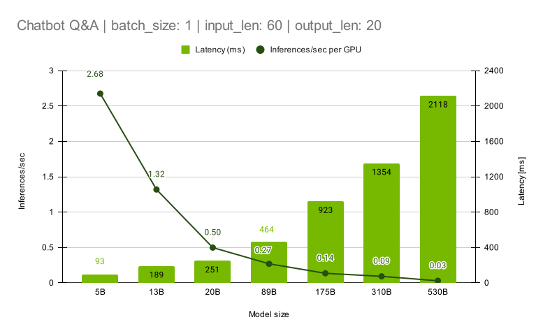

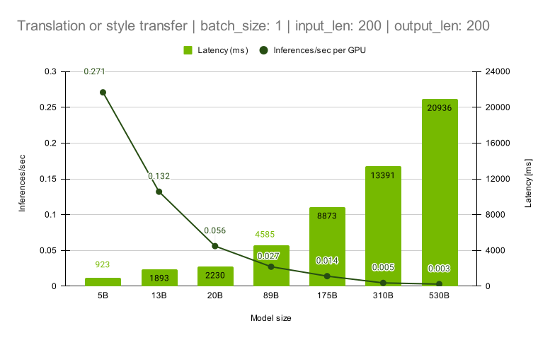

The performance measurements were obtained on DGX A100 80 GB nodes.

<details>

<summary>
Performance for different model sizes in online scenario
</summary>

|                                                 | Len input 60 output 20 |                                     |                        |                                                         |                                                                |                                | Len input 200 output 200 |                                     |                        |                                                         |                                                                |                                |
| ----------------------- | ---------------------- | ----------------- | ---------- | --------------------------- | ------------------------------ | -------------- | ------------------------ | ----------------- | ---------- | --------------------------- | ------------------------------ | -------------- |
| Parameters number \[B\] | Latency\[ms\]                    | Infer/sec per GPU | Batch size | Tensor parallel (GPUs used) | Pipeline parallel (nodes used) | Number of GPUs | Latency\[ms\]                        | Infer/sec per GPU | Batch size | Tensor parallel (GPUs used) | Pipeline parallel (nodes used) | Number of GPUs |
| 5B                                            | 93                                         | 2.68                            | 1                    | 4                                                     | 1                                                            | 4                            | 923                                            | 0.271                         | 1                    | 4                                                     | 1                                                            | 4                            |
| 13B                                         | 189                                        | 1.32                            | 1                    | 4                                                     | 1                                                            | 4                            | 1893                                         | 0.132                         | 1                    | 4                                                     | 1                                                            | 4                            |
| 20B                                         | 251                                        | 0.50                            | 1                    | 8                                                     | 1                                                            | 8                            | 2230                                         | 0.056                         | 1                    | 8                                                     | 1                                                            | 8                            |
| 89B                                         | 464                                        | 0.27                            | 1                    | 8                                                     | 1                                                            | 8                            | 4585                                         | 0.027                         | 1                    | 8                                                     | 1                                                            | 8                            |
| 175B                                        | 923                                        | 0.14                            | 1                    | 8                                                     | 1                                                            | 8                            | 8873                                         | 0.014                         | 1                    | 8                                                     | 1                                                            | 8                            |
| 310B                                        | 1354                                     | 0.09                            | 1                    | 8                                                     | 1                                                            | 8                            | 13391                                        | 0.005                         | 1                    | 8                                                     | 2                                                            | 16                         |
| 530B                                        | 2118                                     | 0.03                            | 1                    | 8                                                     | 2                                                            | 16                         | 20936                                        | 0.003                         | 1                    | 8                                                     | 2                                                            | 16                         |

</details>

###### 6.1.3.9.2. Offline Scenario
<a id="markdown-offline-scenario" name="offline-scenario"></a>

The offline scenario focuses on maximum throughput. The two graphs below show
latency and throughput for two tasks. The first one is chatbot questions
answering and a second one is translation or style transfer.


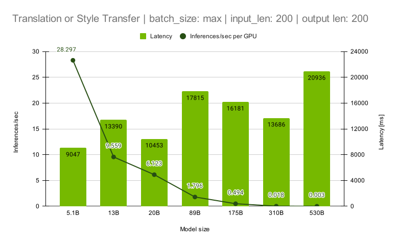

The chatbot scenario can be executed with batch size equal to 256 for all model
sizes so it is possible to utilize computing resources in GPUs.


<details>

<summary>
Performance for different model sizes in offline scenario
</summary>

|                                                 | Len input 60 output 20 |                                     |                        |                                 |                                                                |                                | Len input 200 output 200 |                                     |                        |                                                         |                                                                |                                |
| ----------------------- | ---------------------- | ----------------- | ---------- | --------------- | ------------------------------ | -------------- | ------------------------ | ----------------- | ---------- | --------------------------- | ------------------------------ | -------------- |
| Parameters number \[B\] | Latency\[ms\]                    | Infer/sec per GPU | Batch size | Tensor parallel | Pipeline parallel (nodes used) | Number of GPUs | Latency\[ms\]                        | Infer/sec per GPU | Batch size | Tensor parallel (GPUs used) | Pipeline parallel (nodes used) | Number of GPUs |
| 5B                                            | 1143                                     | 224.0                         | 256                | 1                             | 1                                                            | 1                            | 9047                                         | 28.297                        | 256                | 1                                                     | 1                                                            | 1                            |
| 13B                                         | 2756                                     | 92.9                            | 256                | 1                             | 1                                                            | 1                            | 13390                                        | 9.559                         | 256                | 2                                                     | 1                                                            | 2                            |
| 20B                                         | 4145                                     | 61.8                            | 256                | 1                             | 1                                                            | 1                            | 10453                                        | 6.123                         | 256                | 4                                                     | 1                                                            | 4                            |
| 89B                                         | 2889                                     | 22.2                            | 256                | 4                             | 1                                                            | 4                            | 17815                                        | 1.796                         | 256                | 8                                                     | 1                                                            | 8                            |
| 175B                                        | 2033                                     | 15.7                            | 256                | 8                             | 1                                                            | 8                            | 16181                                        | 0.494                         | 64                 | 8                                                     | 1                                                            | 8                            |
| 310B                                        | 6768                                     | 2.4                             | 256                | 8                             | 2                                                            | 16                         | 13686                                        | 0.018                         | 2                    | 8                                                     | 1                                                            | 8                            |
| 530B                                        | 8660                                     | 1.8                             | 256                | 8                             | 2                                                            | 16                         | 20936                                        | 0.003                         | 1                    | 8                                                     | 2                                                            | 16                         |

</details>


### 6.2. T5 Results
<a id="markdown-t5-results" name="t5-results"></a>

#### 6.2.1. Training Accuracy Results
Training Accuracy: NVIDIA DGX SuperPOD (4 x 8 x A100 80GB for 220M T5 Model; 20 x 8 x A100 80GB for 3B T5 Model)

We evaluated the 220M parameter and 3B parameter T5 models on 2 GLUE
tasks. The results can be found in the table below. The user can 
finetune on top of any `.nemo` trained checkpoint file on all available 
GLUE tasks mentioned in T5 finetuning section with their own recipes.

| Task        |Metric                        | 220M    | 3B    |
|---------| ---------------- |-------|-------|
| MNLI-m    |Accuracy                    | 86.8% | 90.6% |
| MNLI-mm |Accuracy                    | 87.3% | 90.6% |
| SST-2     |Accuracy                    | 94.3% | 97.2% |

Training the 220M T5 model to convergence takes 4 days, and the loss curve can be seen in the figure below:

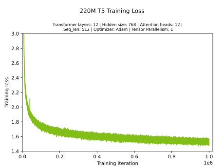

The table below shows the converged training loss, the throughput, and the
total time to train for the 220M T5 model, using a given number of GPUs and a
given Global Batch Size (GBS).

| \#GPUs | GBS    | Seq Length | \#Tokens | Loss    | Throughput (Tokens/sec) | Time to Train (days) |
|--------|------|------------|----------|-------|-------------------------|----------------------|
| 32         | 2048 | 512                | 1T             | 1.501 | 3,273,728                             | 4                                        |


Training the 3B T5 model to convergence takes 11 days, and the loss curve of a fully trained model can be seen in the figure below:


The table below shows the converged training loss, the throughput, and the
total time to train for the 3B T5 model, using a given number of GPUs and a
given Global Batch Size (GBS).

| \#GPUs | GBS    | Seq Length | \#Tokens | Loss  | Throughput (Tokens/sec) | Time to Train (days) |
|--------|------|------------|----------|--------------------|-------------------------|----------------------|
| 160        | 2160 | 512                | 1T             | 1.147                            | 1,395,131                             | 11                                     |


#### 6.2.2. Training Performance Results
<a id="markdown-training-performance-results" name="training-performance-results"></a>
Training Performance: NVIDIA DGX SuperPOD (20 x 8 x A100 80GB for 3B T5 Model)

We measured the throughput of training a 3B parameter T5 model on NVIDIA DGX
SuperPOD using a different number of nodes. When scaling from 1 node to 20 nodes, we achieve 15.67x
speedup. We are actively working on improving the scaling performance for T5 models. The table and chart below show the performance results.


|         |                                                                 |                            |                |                | Nodes    |                |                 |
|-----| ------------------------------- |--------------|--------|--------|--------|--------|---------|
|         |                                                                 | 1                        | 2            | 4            | 5            | 10         | 20            |
|         | Tokens per Second                             | 89029                | 175682 | 349422 | 433354 | 820050 | 1395131 |
| 3B    | Perfect Linear Scaling (Tokens) | 89029                | 178058 | 356117 | 445146 | 890291 | 1780583 |
|         | Speed-up                                                | 1x                     | 1.97x    | 3.92x    | 4.87x    | 9.21x    | 15.67x    |

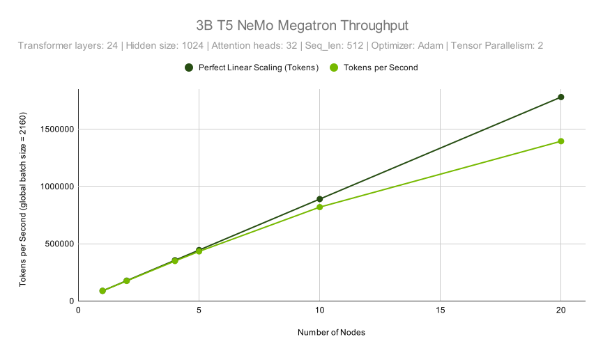


### 6.3. mT5 Results
<a id="markdown-t5-results" name="t5-results"></a>

#### 6.3.1. Training Accuracy Results
Training Accuracy: NVIDIA DGX SuperPOD (4 x 8 x A100 80GB for 170M mT5 Model; 8 x 8 x A100 80GB for 390M mT5 Model; 20 x 8 x A100 80GB for 3B mT5 Model)

We evaluated the 170M parameter, 390M parameter, and 3B parameter mT5 models on XNLI
task. The results can be found in the table below. The user can 
finetune on top of any `.nemo` trained checkpoint file on `XNLI` task mentioned in mT5 finetuning section.

| Task-Language | Metric    | 170M  | 390M  | 3B (750B tokens) |
|---------------|-----------|-------|-------|------------------|
| XNLI-en       | Accuracy  | 80.1% | 84.6% | 89.1%            |
| XNLI-es       | Accuracy  | 73.3% | 79.3% | 85.8%            |
| XNLI-de       | Accuracy  | 69.6% | 76.4% | 84.2%            |
| XNLI-fr       | Accuracy  | 72.2% | 78.6% | 85.4%            |
| XNLI-zh       | Accuracy  | 73.8% | 70.1% | 79.0%            |


Training the 170M mT5 model to convergence takes 4 days, and the loss curve can be seen in the figure below:

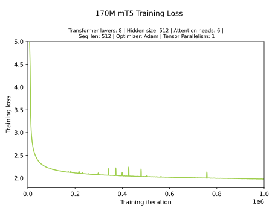

The table below shows the converged training loss, the throughput, and the
total time to train for the 170M mT5 model, using a given number of GPUs and a
given Global Batch Size (GBS).

| \#GPUs | GBS    | Seq Length | \#Tokens | Loss  | Throughput (Tokens/sec) | Time to Train (days) |
|--------|------|------------|----------|-------|-------------------------|----------------------|
| 32         | 2048 | 512                | 1T             | 1.980 | 4,112,062               | 4                                        |


Training the 390M mT5 model to convergence takes 4 days, and the loss curve can be seen in the figure below:

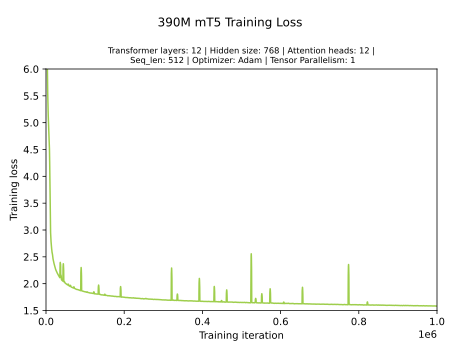

The table below shows the converged training loss, the throughput, and the
total time to train for the 390M mT5 model, using a given number of GPUs and a
given Global Batch Size (GBS).

| \#GPUs | GBS    | Seq Length | \#Tokens | Loss  | Throughput (Tokens/sec) | Time to Train (days) |
|--------|------|------------|----------|-------|-------------------------|----------------------|
| 64     | 2048 | 512                | 1T             | 1.584 | 3,744,914               | 4                                        |


Training the 3B mT5 model to convergence takes 14 days, and the loss curve of a 75% trained model can be seen in the figure below:

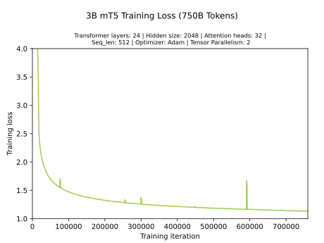

The table below shows the converged training loss, the throughput, and the
total time to train for the 3B T5 model, using a given number of GPUs and a
given Global Batch Size (GBS).

| \#GPUs | GBS  | Seq Length | \#Tokens | Loss (750B tokens) | Throughput (Tokens/sec) | Time to Train (days) |
|--------|------|------------|----------|--------------------|-------------------------|----------------------|
| 160        | 1920 | 512                | 1T             | 1.134              | 911,065                 | 14                   |


#### 6.3.2. Training Performance Results
<a id="markdown-training-performance-results" name="training-performance-results"></a>
Training Performance: NVIDIA DGX SuperPOD (20 x 8 x A100 80GB for 3B mT5 Model)

We measured the throughput of training a 3B parameter mT5 model on NVIDIA DGX
SuperPOD using a different number of nodes. When scaling from 1 node to 20 nodes, we achieve 13.68x
speedup. We are actively working on improving the scaling performance for mT5 models. 
The table and chart below show the performance results.


|         |                                    |             |        |         | Nodes    |          |           |
|---------|------------------------------------|-------------|--------|---------|----------|----------|-----------|
|         |                                    | 1           | 2      | 4       | 5        | 10       | 20        |
|         | Tokens per Second                  | 87654 |  170637 | 325295 | 393846 | 731429 | 1198829  |
| 3B      | Perfect Linear Scaling (Tokens)    | 87654 |  175308 | 350616 | 438270 | 876540 | 1753081  |
|         | Speed-up                           | 1x    |  1.95x  | 3.71x  | 4.49x  | 8.34x  | 13.68x  |


## 7. Changelog
<a id="markdown-changelog" name="changelog"></a>

**NeMo Megatron 22.04**
* T5 with pipeline parallelism support (training only)
* Switched from GeLU to GeGLU as activation function for T5
* mT5 with tensor parallelism and pipeline parallelism support (training only)
* 11B, 23B, and 41B T5 training configurations
* 170M, 390M, and 3B mT5 training configurations
* Automatic and configurable Non-Uniform Memory Access (NUMA) mapping

**NeMo Megatron 22.03**
* T5 with tensor parallelism support (optimized for <20B parameters, training only)
* 220M and 3B T5 training configurations
* GLUE fine-tuning and evaluation support for T5

**NeMo Megatron 22.02**
* GPT-3 with pipeline parallelism support (training only)
* 40B and 175B GPT-3 training configurations

**NeMo Megatron 22.01**
* GPT-3 with tensor parallelism support on Base Command Platform
* O2-style AMP (accelerated training of larger models)
* Chatbot sample application using your trained GPT-3 model
* Training metric monitoring and visualization with Weights & Biases

## 8. Known Issues
<a id="markdown-known-issues" name="known-issues"></a>
* Deployment support for Nemo Megatron trained checkpoints is currently only supported for trained GPT-3 checkpoint configurations with pipeline parallelism equal 1
* Selected configurations that used to work result in an out of memory (OOM) error while training on the NVIDIA DGX SuperPOD nodes

| Model Architecture | Model Size | Data Type | AMP Type | \#Activation Checkpoint Layers | MBS | \#PP | \#TP |
|--------|------|------------|----------|--------------------|--------------------|-------------------------|----------------------|
| GPT-3        | 5B | FP16                | O1            | 4 | 16 | 1 | 2 |
| GPT-3        | 5B | BF16                | O1            | 4 | 16 | 1 | 2 |
