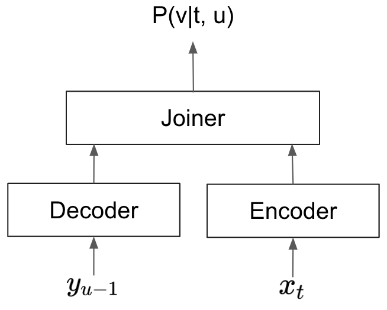
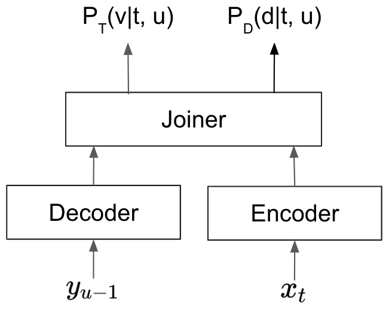

# Unveiling NVIDIA NeMo's Parakeet-TDT -- Turbocharged ASR with Unrivaled Accuracy

Earlier this month, we announced [Parakeet](https://huggingface.co/collections/nvidia/parakeet-659711f49d1469e51546e021), a cutting-edge collection of state-of-the-art ASR models built by [NVIDIA's NeMo](https://nvidia.github.io/NeMo/) toolkit, developed jointly with [Suno.ai](http://suno.ai/). Today, we're thrilled to announce the latest addition to the Parakeet family -- [Parakeet TDT](https://huggingface.co/nvidia/parakeet-tdt-1.1b). Parakeet TDT achieves unrivaled accuracy while running more than 70% faster over our previous best model, making it a great choice for powering speech recognition engines in diverse environments.


The "TDT" in Parakeet-TDT is short for "Token-and-Duration Transducer", a novel sequence modeling architecture developed by NVIDIA and is open-sourced through [NVIDIA's NeMo](https://nvidia.github.io/NeMo/) toolkit. Our research on TDT models, presented in a [paper](https://arxiv.org/abs/2304.06795) at the ICML 2023 conference, showcases the superior speed and recognition accuracy of TDT models compared to conventional Transducers of similar sizes. 

To put things in perspective, our Parakeet-TDT model with 1.1 billion parameters outperforms similar-sized Parakeet-RNNT-1.1b in accuracy, as measured as the average performance among 9 benchmarks on the [HuggingFace Leaderboard](https://huggingface.co/spaces/hf-audio/open_asr_leaderboard). Notably, Parakeet-TDT is the first model to achieve an average WER below 7.0 on the leaderboard. Additionally, it achieves an impressive real-time factor (RTF) of 8.8e-3, 64% faster than Parakeet-RNNT-1.1b's RTF of 14.4e-3. Remarkably, Parakeet-TDT's RTF is even 40% faster than Parakeet-RNNT-0.6b (RTF 12.3), despite the latter having about half the model size.

<figure markdown>
  
  <figcaption><b>Figure 1.</b> <i> HuggingFace Leaderboard as of 01/31/2024. </i></figcaption>
</figure>

## Use Parakeet-TDT model in your code

To run speech recognition with Parakeet-TDT, NVIDIA NeMo needs to be installed as a pip package as shown below. Cython and PyTorch (2.0 and above) should be installed before attempting to install NeMo Toolkit.

```bash 
pip install nemo_toolkit['asr']
```

Once NeMo is installed, you can use Parakeet-TDT to recognize your audio files as follows:
```python
import nemo.collections.asr as nemo_asr
asr_model = nemo_asr.models.ASRModel.from_pretrained(model_name="nvidia/parakeet-tdt-1.1b")
transcript = asr_model.transcribe(["some_audio_file.wav"])
```


## Understanding Token-and-Duration Transducers

Token-and-Duration Transducers (TDT) represent a significant advancement over traditional Transducer models by drastically reducing wasteful computations during the recognition process. To grasp this improvement, let's delve into the workings of a typical Transducer model.

<figure markdown>
  {align="center" width=300}
  <figcaption><b>Figure 2.</b> <i>Transducer Model Architecture</i></figcaption>
</figure>

Transducer models, as illustrated in Figure 2, consist of an encoder, a decoder, and a joiner. During speech recognition, the encoder processes audio signals, extracting crucial information from each frame. The decoder extracts information from already predicted text. The joiner then combines the outputs from the encoder and decoder, and predict a text token for each audio frame. From the joiner's perspective, a frame typically covers 40 to 80 milliseconds of audio signal, while on average people speak a word per 400 milliseconds. This discrepancy makes it so that certain frames don't associate with any text output. For those frames, the Transducer would predict a "blank" symbol. A typical sequence of predictions of a Transducer looks something like,

<code>
_ _ _ _ NVIDIA _ _ _ _ is _ _ _  a _ _  great _ _ _ _ _  place _ _ _ _ to work _ _ _
</code>

where <code>\_</code> represents the blank symbol. To generate the final recognizion output, the model would delete all the blanks, and generate the output

<code>
NVIDIA is a great place to work
</code>

As we can see, there are many blanks symbols in the original output and this means the Transducer model wasted a lot of time on "blank frames" -- frames for which the model predicts blanks which don't contribute to the final output.

<figure markdown>
  {align="center" width=300}
  <figcaption><b>Figure 3.</b> <i>TDT Model Architecture</i></figcaption>
</figure>


TDT is designed to mitigate wasted computation by intelligently detecting and skipping blank frames during recognition. As Figure 3 shows, when a TDT model processes a frame, it simultaneously predicts two things: 

<ol type="1">
<li>probability of token P<sub>T</sub>(v|t, u): the token that should be
predicted at the current frame;</li>
<li>probability of duration P<sub>D</sub>(d|t, u): the number of frames the
current token lasts before the model can make the next token prediction. 
</ol>

The TDT model is trained to maximize the number of frames skipped by using the
duration prediction while maintaining the same recognition accuracy.
For example in the example above, unlike a conventional Transducer that predict
a token for every speech frame, the TDT model can simply the process as follows,

<code>
frame 1:&nbsp;  predict token=\_, &nbsp;&nbsp;&nbsp;&nbsp;    duration=4 <br>
frame 5:&nbsp;  predict token=NVIDIA, duration=5 <br>
frame 10: predict token=is,&nbsp;&nbsp;&nbsp;&nbsp;     duration=4 <br>
frame 14: predict token=a,&nbsp;&nbsp;&nbsp;&nbsp;&nbsp;      duration=3 <br>
frame 17: predict token=great,&nbsp;  duration=6 <br>
frame 23: predict token=place,&nbsp;  duration=5 <br>
frame 28: predict token=to,&nbsp;&nbsp;&nbsp;&nbsp;     duration=1 <br>
frame 29: predict token=work,&nbsp;&nbsp;   duration=4 <br>
frame 33: reached the end of audio, recognition completed.
</code>

In this toy example, TDT can reduce the number of predictions the model have to make
from 33 to 8. In our extensive experiments with TDT models, we see this
optimization indeed leads to a substantial acceleration in recognition speed.
Our research has also demonstrated that TDT models exhibit enhanced robustness
to noisy speech and token repetitions in the text compared to traditional
Transducer models. Note, this blog post simplies certain aspects of Transducer models
in order to better illustrate the design differences between
Transducers and TDT, and we would refer interested readers to our
[paper](https://arxiv.org/abs/2309.09950) for technical details. 


## Additional Resources

* [HuggingFace ASR Leaderboard](https://huggingface.co/spaces/hf-audio/open_asr_leaderboard)
* [HuggingFace ASR Leaderboard Evaluation](https://github.com/huggingface/open_asr_leaderboard)
* [NeMo Parakeet Models on HuggingFace](https://huggingface.co/models?library=nemo&sort=trending&search=parakee)
* [NVIDIA NeMo Webpage](https://github.com/NVIDIA/NeMo)
* [NVIDIA NeMo ASR Documentation](https://docs.nvidia.com/deeplearning/nemo/user-guide/index.html)
* Papers:
    * [Efficient Sequence Transduction by Jointly Predicting Tokens and Durations](https://arxiv.org/abs/2304.06795)
    * [Fast Conformer with Linearly Scalable Attention for Efficient Speech Recognition](https://arxiv.org/abs/2305.05084)
    * [Investigating End-to-End ASR Architectures for Long Form Audio Transcription](https://arxiv.org/abs/2309.09950)
