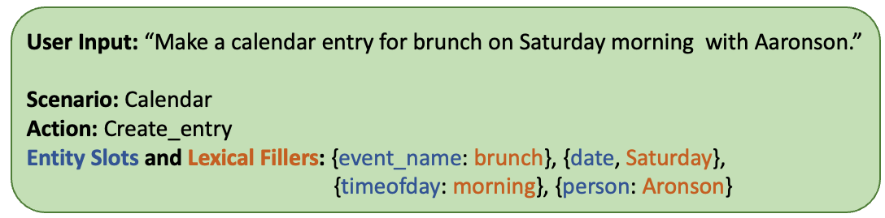

Spoken Language Understanding (SLU)
====================================

Spoken language understanding (SLU) is similar to natural language understanding (NLU), in the sense that they both try to understand and extract semantic information from user input. However, different from NLU that has natural language text as input, SLU deals with audio input. SLU is an essential component for voice assistants, and it's more challengng than its NLU counterpart as SLU doesn't have access to grouth-truth transcriptions of the audio.

One of the most representative tasks in SLU is **Intent Classification and Slot Filling**, which aims to not only recognize the user's intention, but also detect entity slots and their corresponding lexical fillers. Below is an example:

The full documentation tree is as follows:

.. toctree::
   :maxdepth: 8

   models
   datasets
   results
   configs
   api
   resources

.. include:: resources.rst
