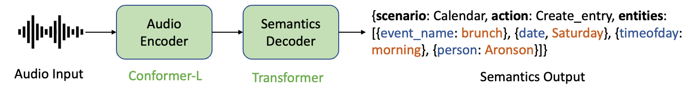

Models
======

There are mainly two approaches towards SLU, where we can either use an End-to-End (E2E) model that directly predicts sematics from audio, or use a cascading model composed of an ASR model followed by an NLU model. E2E methods are preferred over cascading models, since it reduces error propagation from ASR to NLU and thus have better performance.

Our E2E model in NeMo is based on an **Encoder-Decoder** framework, where a Conformer module is used as the encoder to extract audio features, and a Transformer Decoder is applied on top of the audio features to predict the semantics.

The output semantics is a Python dictionary object flattened as a string representation, so that the problem can be formulated as a sequence-to-sequence problem.

The model then can be trained by Negative Log-Likelihood (NLL) Loss with teacher forcing.
