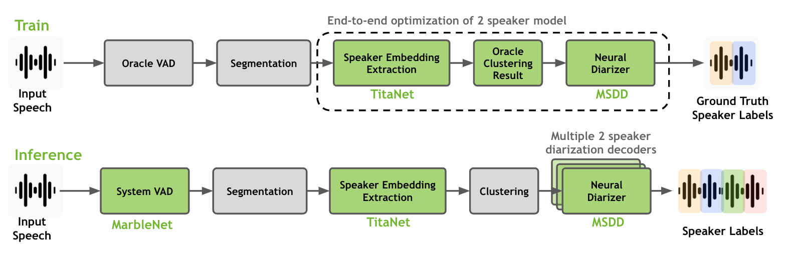

Datasets
========

Data Preparation for Speaker Diarization Training (For End-to-End Diarization)  
------------------------------------------------------------------------------

Speaker diarization training and inference both require the same type of manifest files. This manifest file can be created by using the script in ``<NeMo_git_root>/scripts/speaker_tasks/pathfiles_to_diarize_manifest.py``. The following example shows how to run ``pathfiles_to_diarize_manifest.py`` by providing path list files.

.. code-block:: bash
  
  python NeMo/scripts/speaker_tasks/pathfiles_to_diarize_manifest.py \
    --add_duration \
    --paths2audio_files="/path/to/audio_file_path_list.txt" \
    --paths2rttm_files="/path/to/rttm_file_list.txt" \
    --manifest_filepath="/path/to/manifest_filepath/train_manifest.json"

All three arguments are required. Note that we need to maintain consistency on unique filenames for every field (key) by only changing the filename extensions. For example, if there is an audio file named ``abcd01.wav``, the rttm file should be named as ``abcd01.rttm`` and the transcription file should be named as ``abcd01.txt``. 

- Example audio file path list ``audio_file_path_list.txt``

.. code-block:: bash

  /path/to/abcd01.wav
  /path/to/abcd02.wav
  

To train a diarization model, one needs to provide Rich Transcription Time Marked (RTTM) files as ground truth label files. Here is one line from a RTTM file as an example:

.. code-block:: bash

  SPEAKER TS3012d.Mix-Headset 1 32.679 0.671 <NA> <NA> MTD046ID <NA> <NA>

Make a list of RTTM files for the audio files you have in ``audio_file_path_list.txt``.

- Example RTTM file path list ``rttm_file_path_list.txt``

.. code-block:: bash
  
  /path/to/abcd01.rttm
  /path/to/abcd02.rttm

.. note::
  We expect all the provided files (e.g. audio, rttm, text) to have the same base name and the name should be unique (uniq-id).

As an output file, ``train_manifest.json`` will have the following line for each audio file:

.. code-block:: bash

  {"audio_filepath": "/path/to/abcd01.wav", "offset": 0, "duration": 90, "label": "infer", "text": "-", "num_speakers": 2, "rttm_filepath": "/path/to/rttm/abcd01.rttm"}

For end-to-end speaker diarization training, the manifest file described in this section fullfils the requirements for the input manifest file. 
For cascaded speaker diarization training (TS-VAD style), the manifest file should be further processed to generate session-wise manifest files.

Manifest JSON files for MSDD (TS-VAD style model) Training
----------------------------------------------------------

This section is about formatting a dataset for cascaded diarization training (e.g., TS-VAD, MSDD, etc.). To train or fine-tune the speaker diarization system, you could either train/fine-tune speaker embedding extractor model separately or you can train/fine-tune speaker embedding extractor and neural diarizer at the same time.

* To train or fine-tune a speaker embedding extractor model separately, please go check out these pages: :doc:`Speech Classification Datasets <../speech_classification/datasets>` and :doc:`Speaker Recognition Datasets <../speaker_recognition/datasets>` for preparing datasets for training and validating VAD and speaker embedding models respectively.   

As shown in the above figure, a full-fledged speaker diarization process through speaker embedding extractor, clustering algorithm and neural diarizer. Note that only speaker embedding extractor and neural diarizer are trainable models and they can be train/fine-tune together on diarization datasets. We recommend to use a speaker embedding extractor model that is trained on large amount of single-speaker dataset and use it for training a neural diarizer model. 

For training MSDD, we need one more step of trucating the source manifest into even shorter chunks. After generating a session-wise manifest file, we need to break down each session-wise manifest file into a split manifest file containing start time and duration of the split samples due to memory capacity. More importantly, since MSDD only uses pairwise (two-speaker) model and data samples, we need to split RTTM files if there are more than two speakers.

Note that you should specify window length and shift length of the base scale of your MSDD model when you generate the manifest file for training samples. More importantly, ``step_count`` determines how many steps (i.e., base-scale segments) are in a split data sample. If ``step_count`` is too long, you might not be able to load a single sample in a batch.

.. code-block:: bash

  python NeMo/scripts/speaker_tasks/create_msdd_train_dataset.py \ 
    --input_manifest_path='path/to/train_manifest.json' \
    --output_manifest_path='path/to/train_manifest.50step.json' \
    --pairwise_rttm_output_folder='path/to/rttm_output_folder' \
    --window=0.5 \
    --shift=0.25 \
    --step_count=50 

All arguments are required to generate a new manifest file. Specify a session-wise diarization manifest file to ``--input_manifest_path`` and specify an output file name in ``--output_manifest_path``. In the folder that is specified for ``--pairwise_rttm_output_folder``, the script will create multiple two-speaker RTTM files from the given RTTM file and create manifest file that only contains two speakers in the specified RTTM range. 

For example, if ``abcd01.wav`` has three speakers (``1911,1988,192``), the three RTTM files will be created: ``abcd01.1911_1988.rttm``, ``abcd01.1911_192.rttm`` and ``abcd01.1988_192.rttm``. Subsequently, the segments will be only generated from the newly generated two-speaker RTTM files.

Specify ``window`` and ``shift`` of the base-scale in your MSDD model. In this example, we use default setting of ``window=0.5`` and ``shift=0.25`` and ``step_count=50``. Here are example lines in the output file ``/path/to/train_manifest.50step.json``.

- Example manifest file ``train_manifest.50step.json``.

.. code-block:: bash
    
    {"audio_filepath": "/path/to/abcd01.wav", "offset": 0.007, "duration": 14.046, "label": "infer", "text": "-", "num_speakers": 2, "rttm_filepath": "simulated_train/abcd01.1919_1988.rttm"}
    {"audio_filepath": "/path/to/abcd01.wav", "offset": 13.553, "duration": 16.429, "label": "infer", "text": "-", "num_speakers": 2, "rttm_filepath": "simulated_train/abcd01.1919_1988.rttm"}
    {"audio_filepath": "/path/to/abcd02.wav", "offset": 0.246, "duration": 15.732, "label": "infer", "text": "-", "num_speakers": 2, "rttm_filepath": "path/to/rttm_output_folder/abcd02.777_5694.rttm"}
    {"audio_filepath": "/path/to/abcd02.wav", "offset": 15.478, "duration": 14.47, "label": "infer", "text": "-", "num_speakers": 2, "rttm_filepath": "path/to/rttm_output_folder/abcd02.777_5694.rttm"}

Prepare the msdd training dataset for both train and validation. After the training dataset is prepared, you can train an MSDD model with the following script:

.. code-block:: bash

  python ./multiscale_diar_decoder.py --config-path='../conf/neural_diarizer' --config-name='msdd_5scl_15_05_50Povl_256x3x32x2.yaml' \ 
    trainer.devices=1 \ 
    trainer.max_epochs=20  \ 
    model.base.diarizer.speaker_embeddings.model_path="titanet_large" \ 
    model.train_ds.manifest_filepath="<train_manifest_path>" \ 
    model.validation_ds.manifest_filepath="<dev_manifest_path>" \ 
    model.train_ds.emb_dir="<train_temp_dir>" \ 
    model.validation_ds.emb_dir="<dev_temp_dir>" \ 
    exp_manager.name='sample_train' \ 
    exp_manager.exp_dir='./msdd_exp' \

In the above example training session, we use ``titanet_large`` model as a pretrained speaker embedding model.

Data Preparation for Diarization Inference: for Both End-to-end and Cascaded Systems
------------------------------------------------------------------------------------

As in dataset preparation for diarization trainiing, diarization inference is based on Hydra configurations which are fulfilled by ``.yaml`` files. See :doc:`NeMo Speaker Diarization Configuration Files <./configs>` for setting up the input Hydra configuration file for speaker diarization inference. Input data should be provided in line delimited JSON format as below:
	
.. code-block:: bash

  {"audio_filepath": "/path/to/abcd.wav", "offset": 0, "duration": null, "label": "infer", "text": "-", "num_speakers": null, "rttm_filepath": "/path/to/rttm/abcd.rttm", "uem_filepath": "/path/to/uem/abcd.uem"}

In each line of the input manifest file, ``audio_filepath`` item is mandatory while the rest of the items are optional and can be passed for desired diarization setting. We refer to this file as a manifest file. This manifest file can be created by using the script in ``<NeMo_git_root>/scripts/speaker_tasks/pathfiles_to_diarize_manifest.py``. The following example shows how to run ``pathfiles_to_diarize_manifest.py`` by providing path list files.

.. code-block:: bash
   
    python pathfiles_to_diarize_manifest.py --paths2audio_files /path/to/audio_file_path_list.txt \ 
                                            --paths2txt_files /path/to/transcript_file_path_list.txt \ 
                                            --paths2rttm_files /path/to/rttm_file_path_list.txt \ 
                                            --paths2uem_files /path/to/uem_file_path_list.txt \  
                                            --paths2ctm_files /path/to/ctm_file_path_list.txt \ 
                                            --manifest_filepath /path/to/manifest_output/input_manifest.json 

The ``--paths2audio_files`` and ``--manifest_filepath`` are required arguments. Note that we need to maintain consistency on unique filenames for every field (key) by only changing the filename extensions. For example, if there is an audio file named ``abcd.wav``, the rttm file should be named as ``abcd.rttm`` and the transcription file should be named as ``abcd.txt``. 

- Example audio file path list ``audio_file_path_list.txt``

.. code-block:: bash

  /path/to/abcd01.wav
  /path/to/abcd02.wav

- Example RTTM file path list ``rttm_file_path_list.txt``

.. code-block:: bash
  
  /path/to/abcd01.rttm
  /path/to/abcd02.rttm
   

The path list files containing the absolute paths to these WAV, RTTM, TXT, CTM and UEM files should be provided as in the above example. ``pathsfiles_to_diarize_manifest.py`` script will match each file using the unique filename (e.g. ``abcd``). Finally, the absolute path of the created manifest file should be provided through Hydra configuration as shown below:

.. code-block:: yaml
   
	diarizer.manifest_filepath="path/to/manifest/input_manifest.json"

The following are descriptions about each field in an input manifest JSON file.

.. note::
	We expect all the provided files (e.g. audio, rttm, text) to have the same base name and the name should be unique (uniq-id).

``audio_filepath`` (Required):
  
  a string containing absolute path to the audio file.

``num_speakers`` (Optional):
  
  If the number of speakers is known, provide the integer number or assign null if not known. 
	
``rttm_filepath`` (Optional):
  
  To evaluate a diarization system with known rttm files, one needs to provide Rich Transcription Time Marked (RTTM) files as ground truth label files. If RTTM files are provided, the diarization evaluation will be initiated. Here is one line from a RTTM file as an example:

.. code-block:: bash

  SPEAKER TS3012d.Mix-Headset 1 331.573 0.671 <NA> <NA> MTD046ID <NA> <NA>

``text`` (Optional):

  Ground truth transcription for diarization with ASR inference. Provide the ground truth transcription of the given audio file in string format

.. code-block:: bash

  {"text": "this is an example transcript"}

``uem_filepath`` (Optional):

  The UEM file is used for specifying the scoring regions to be evaluated in the given audio file.
  UEMfile follows the following convention: ``<uniq-id> <channel ID> <start time> <end time>``. ``<channel ID>`` is set to 1.

  Example lines of UEM file:

.. code-block:: bash
  
    TS3012d.Mix-Headset 1 12.31 108.98
    TS3012d.Mix-Headset 1 214.00 857.09

``ctm_filepath`` (Optional):
    
  The CTM file is used for the evaluation of word-level diarization results and word-timestamp alignment. The CTM file follows this convention: ``<session name> <channel ID> <start time> <duration> <word> <confidence> <type of token> <speaker>``. Note that the ``<speaker>`` should exactly match speaker IDs in RTTM. Since confidence is not required for evaluating diarization results, we assign ``<confidence>`` the value ``NA``. If the type of token is words, we assign ``<type of token>`` as ``lex``.  

  Example lines of CTM file:

.. code-block:: bash
  
   TS3012d.Mix-Headset 1 12.879 0.32 okay NA lex MTD046ID
   TS3012d.Mix-Headset 1 13.203 0.24 yeah NA lex MTD046ID
