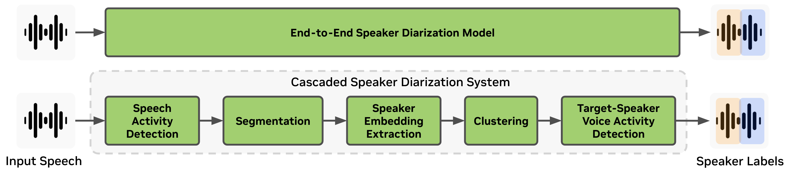

Speaker Diarization
===================

Speaker Diarization Overview
----------------------------
Speaker diarization is the process of segmenting audio recordings by speaker labels and aims to answer the question “who spoke when?”. Speaker diarization makes a clear distinction when it is compared with speech recognition. As shown in the figure below, before we perform speaker diarization, we know “what is spoken” yet we do not know “who spoke it”. Therefore, speaker diarization is an essential feature for a speech recognition system to enrich the transcription with speaker labels. 

.. image:: images/asr_sd_diagram.png
        :align: center
        :width: 800px
        :alt: Speaker diarization pipeline- VAD, segmentation, speaker embedding extraction, clustering
 
To figure out "who spoke when", speaker diarization systems need to capture the characteristics of unseen speakers and tell apart which regions in the audio recording belong to which speaker. To achieve this, speaker diarization systems extract voice characteristics, count the number of speakers, then assign the audio segments to the corresponding speaker index.

Types of Speaker Diarization Systems 
------------------------------------

1. End-to-End Speaker Diarization System:

End-to-end speaker diarization systems pursue a much more simplified version of a system where a single neural network model accepts raw audio signals and outputs speaker activity for each audio frame. Therefore, end-to-end diarization models have an advantage in ease of optimization and depoloyments.

Curently, NeMo Speech AI provides the following end-to-end speaker diarization models:

- **Sortformer Diarizer** : A transformer-based model that estimates speaker labels from the given audio input giving the speaker indexes in arrival-time order.

2. Cascaded Speaker Diarization System:

Traditional cascaded (also referred to as modular or pipelined) speaker diarization systems consist of multiple modules such as a speaker activity detection (SAD) module and a speaker embedding extractor module. 
On top of the clustering diarizer, target-speaker voice activity detection (VAD) is performed to generate the final speaker labels. Cascaded speaker diarization systems are more challenging to optimize all together and deploy but still has advantage of having less restriction on the number of speakers and session length.

Cascaded NeMo Speech AI speaker diarization system consists of the following modules:   

- **Voice Activity Detector (VAD)**: A trainable model which detects the presence or absence of speech to generate timestamps for speech activity from the given audio recording.  

- **Speaker Embedding Extractor**: A trainable model that extracts speaker embedding vectors containing voice characteristics from raw audio signal.   

- **Clustering Module**: A non-trainable module that groups speaker embedding vectors into a number of clusters.   

- **Neural Diarizer (TS-VAD)**: A trainable model that estimates speaker labels from the given features. In general, this module is performing target-speaker VAD task to generate the final speaker labels.  

The full documentation tree is as follows:

.. toctree::
   :maxdepth: 8

   models
   datasets
   results
   configs
   api
   resources

.. include:: resources.rst
