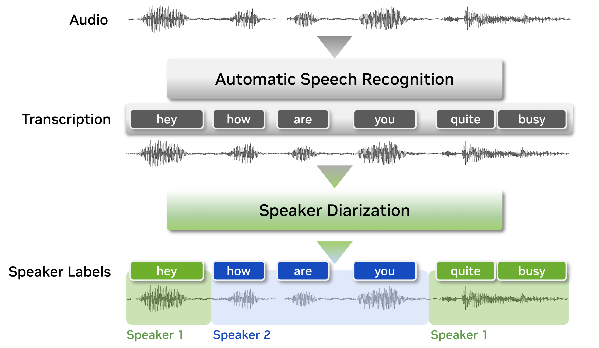

Speaker Diarization
===================

Speaker diarization is the process of segmenting audio recordings by speaker labels and aims to answer the question “who spoke when?”. Speaker diarization makes a clear distinction when it is compared with speech recognition. As shown in the figure below, before we perform speaker diarization, we know “what is spoken” yet we do not know “who spoke it”. Therefore, speaker diarization is an essential feature for a speech recognition system to enrich the transcription with speaker labels. 

    
    
To figure out "who spoke when", speaker diarization systems need to capture the characteristics of unseen speakers and tell apart which regions in the audio recording belong to which speaker. To achieve this, speaker diarization systems extract voice characteristics, count the number of speakers, then assign the audio segments to the corresponding speaker index.

The following figure shows the overall data flow of the NeMo speaker diarization pipeline. 

.. image:: images/sd_pipeline.png
        :align: center
        :width: 800px
        :alt: Speaker diarization pipeline- VAD, segmentation, speaker embedding extraction, clustering

NeMo speaker diarization system consists of the following modules:   

- **Voice Activity Detector (VAD)**: A trainable model which detects the presence or absence of speech to generate timestamps for speech activity from the given audio recording.  

- **Speaker Embedding Extractor**: A trainable model that extracts speaker embedding vectors containing voice characteristics from raw audio signal.   

- **Clustering Module**: A non-trainable module that groups speaker embedding vectors into a number of clusters.   

- **Neural Diarizer**: A trainable model that estimates speaker labels from the given features.   

Speaker diarization evaluation can be done in two different modes depending on the VAD settings:   

- **oracle VAD**: Speaker diarization based on ground-truth VAD timestamps     
- **system VAD**: Speaker diarization based on the results from a VAD model     

The full documentation tree is as follows:

.. toctree::
   :maxdepth: 8

   models
   datasets
   results
   configs
   api
   resources

.. include:: resources.rst
