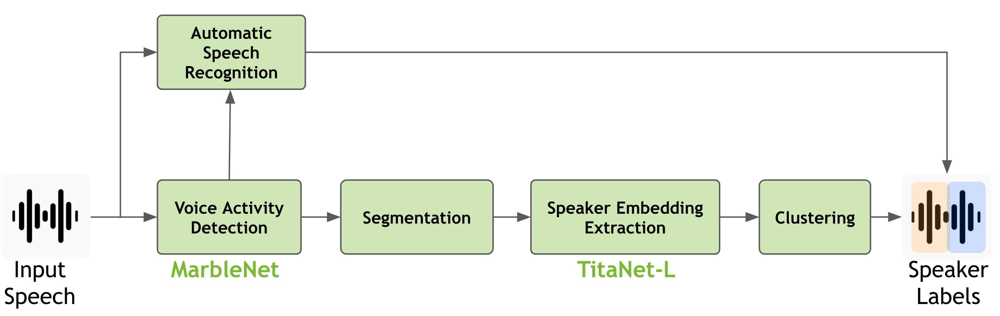

Speaker Diarization
==================================

Speaker Diarization (SD) is the task of segmenting audio recordings by speaker labels, that is Who Speaks When?

A diarization system consists of a **Voice Activity Detection (VAD)** model to get the time stamps of audio where speech is being spoken while ignoring the background noise and 
a **Speaker Embeddings** model to get speaker embeddings on speech segments obtained from VAD time stamps. 
These speaker embeddings would then be clustered into clusters based on number of speakers present in the audio recording.

In NeMo we support both **oracle VAD** and **non-oracle VAD** diarization. 

The full documentation tree is as follows:

.. toctree::
   :maxdepth: 8

   models
   datasets
   results
   configs
   api

Resource and Documentation Guide
--------------------------------

Hands-on speaker diarization tutorial notebooks can be found under ``<NeMo_git_root>/tutorials/speaker_tasks/``.

There are tutorials for peformming inference using :ref:`MarbleNet_model` and :ref:`SpeakerNet_model`, 
and how one can get ASR transcriptions combined with Speaker labels along with voice activity time stamps with NeMo asr collections.

Most of the tutorials can be run on Google Colab by specifying the link to the notebooks' GitHub pages on Colab.

If you are looking for information about a particular model used for speaker diarization inference, or would like to find out more about the model
architectures available in the `nemo_asr` collection, check out the :doc:`Models <./models>` page.

Documentation on dataset preprocessing can be found on the :doc:`Datasets <./datasets>` page.
NeMo includes preprocessing scripts for several common ASR datasets, and this page contains instructions on running
those scripts.
It also includes guidance for creating your own NeMo-compatible dataset, if you have your own data.

Information about how to load model checkpoints (either local files or pretrained ones from NGC), perform inference, as well as a list
of the checkpoints available on NGC are located on the :doc:`Checkpoints <./results>` page.

Documentation for configuration files specific to the ``nemo_asr`` models can be found on the
:doc:`Configuration Files <./configs>` page.
