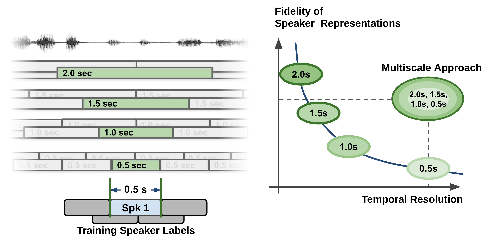
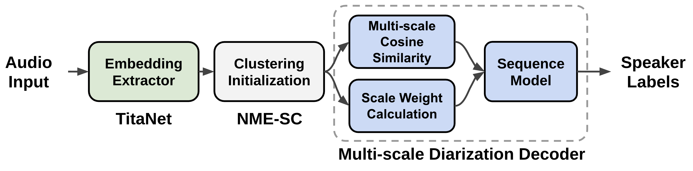
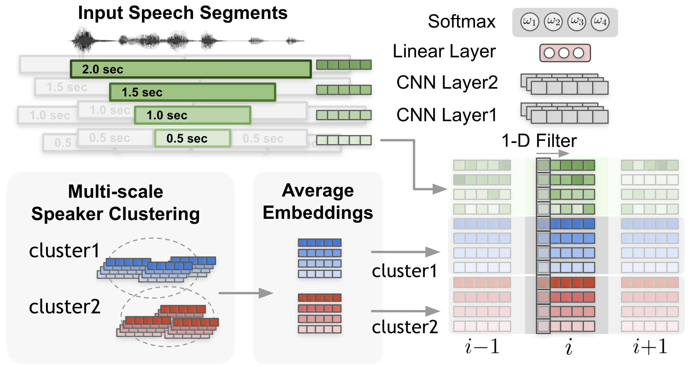
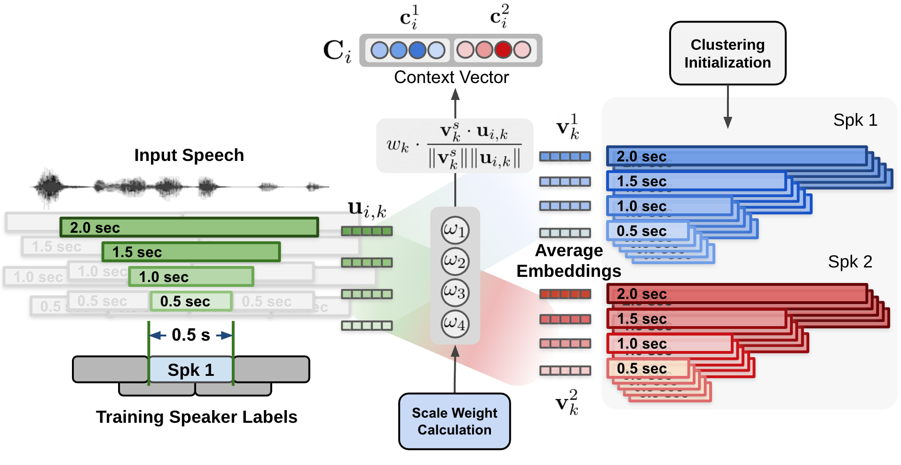
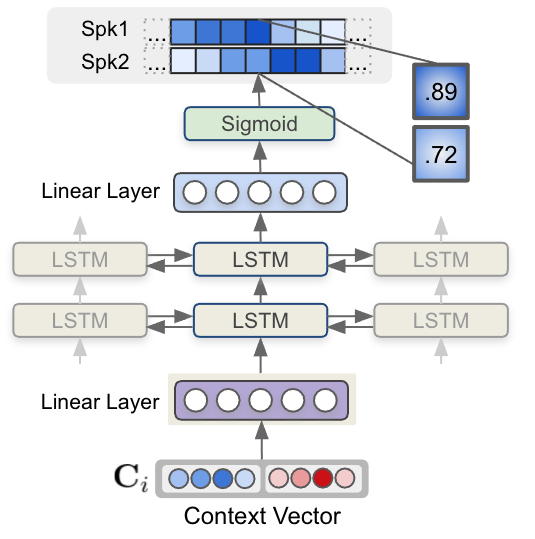

Models
======

This section gives a brief overview of the supported speaker diarization models in NeMo's ASR collection.

Currently speaker diarization pipeline in NeMo involves `MarbleNet <../speech_classification/models.html#marblenet-vad>`__ model for Voice Activity Detection (VAD) and `TitaNet <../speaker_recognition/models.html#titanet>`__ models for speaker embedding extraction and `Multi-scale Diarizerion Decoder` for neural diarizer,  which will be explained in this page.

.. _Multi_Scale_Diarization_Decoder:

Multi-Scale Diarization Decoder
-------------------------------

.. image:: images/sd_pipeline.png
        :align: center
        :width: 800px
        :alt: Speaker diarization pipeline- VAD, segmentation, speaker embedding extraction, clustering

Speaker diarization system needs to produce very accurate timestamps since speaker turns can be extremely short in conversational settings. Human conversation often involves very short back-channel words such as “yes”, “uh-huh” or “oh” and these words are very challenging for machines to transcribe and tell the speaker. Therefore, while segmenting audio recordings in terms of speaker identity, speaker diarization requires fine-grained decisions on relatively short segments, ranging from a few tenths of a second to several seconds. Making accurate, fine-grained decisions on such short audio segments is challenging because it is less likely to capture reliable speaker traits from the very short audio segments. We will discuss how this problem can be addressed by introducing a new technique called the multi-scale approach and multiscale diarization decoder to handle multi-scale inputs.

Extracting long audio segments is desirable in terms of the quality of speaker characteristics. However, the length of audio segments also limits the granularity, which leads to a coarse unit length for speaker label decisions. Therefore, speaker diarization systems are challenged by a trade-off between temporal resolution and the fidelity of the speaker representation, as depicted in the curve shown in the figure below. During the speaker feature extraction process in the speaker diarization pipeline, the temporal resolution is inevitably sacrificed by taking a long speech segment to obtain high-quality speaker representation vectors. In plain and simple language, if we try to be very accurate on voice characteristics then we need to look into a longer span of time. However, at the same time, if we look into a longer span of time, we have to make a decision on a fairly long span of time and this leads to coarse decisions (temporal resolution is low). This can be easily understood if we think about the fact that even human listeners cannot accurately tell who is speaking if only half a second of recorded speech is given.

In traditional diarization systems, an audio segment length ranges from 1.5~3.0 seconds since such numbers make a good compromise between the quality of speaker characteristics and temporal resolution. We refer to this type of segmentation method as a single-scale approach. Even with an overlap technique, the single-scale segmentation limits the temporal resolution to 0.75~1.5 seconds, which leaves room for improvement in terms of temporal accuracy. Having a coarse temporal resolution not only deteriorates the performance of diarization but also decreases speaker counting accuracy since short speech segments are not captured properly. More importantly, such coarse temporal resolution in the speaker timestamps makes the matching between the decoded ASR text and speaker diarization result more error-prone.   

To tackle the problem, the multi-scale approach is proposed to cope with such a trade-off by extracting speaker features from multiple segment lengths and then combining the results from multiple scales. The multi-scale approach is fulfilled by employing multi-scale segmentation and extracting speaker embeddings from each scale. The left side of the above figure shows how four different scales in a multi-scale segmentation approach are performed. During the segment affinity calculation process, all the information from the longest scale to the shortest scale is combined, yet a decision is made only for the shortest segment range. When combining the features from each scale, the weight of each scale largely affects the speaker diarization performance. 

Since scale weights largely determine the accuracy of the speaker diarization system, the scale weights should be set to have the maximized speaker diarization performance. Hence, we came up with a novel multi-scale diarization system called multiscale diarization decoder :cite:`sd-models-park2022multi` that dynamically determines the importance of each scale at each timestep. 

Multiscale diarization decoder takes the multiple speaker embedding vectors from multiple scales and then estimates desirable scale weights. Based on the estimated scale weights, speaker labels are generated. Hence, the proposed system weighs more on the large scale if the input signals are considered to have more accurate information on the certain scales.

The data flow of the multiscale speaker diarization system is shown in the above figure. Multi-scale segments are extracted from audio input, and corresponding speaker embedding vectors for multi-scale audio input are generated by using speaker embedding extractor (TitaNet). Followingly, the extracted multi-scale embeddings are processed by clustering algorithm to provide initializing clustering result to MSDD module. MSDD module uses cluster-average speaker embedding vectors to compare these with input speaker embedding sequences. The scale weights for each step is estimated to weigh the importance of each scale. Finally, the sequence model is trained to output speaker label probabilities for each speaker.

A neural network model named multi-scale diarization decoder (MSDD) is trained to take advantage of a multi-scale approach by dynamically calculating the weight of each scale. MSDD takes the initial clustering results and compares the extracted speaker embeddings with the cluster-average speaker representation vectors. 

Most importantly, the weight of each scale at each time step is determined through a scale weighting mechanism where the scale weights are calculated from a 1-D convolutional neural networks (CNNs) applied to the multi-scale speaker embedding inputs and the cluster average embeddings as described in the above figure.

The estimated scale weights are applied to cosine similarity values calculated for each speaker and each scale. The above figure shows the process of calculating the context vector by applying the estimated scale weights on cosine similarity calculated between cluster-average speaker embedding and input speaker embeddings. 

Aside from CNN-based weighting scheme, MSDD implementation in NeMo toolkit allows multiple options for calculating scale weights ``model.msdd_module.weighting_scheme``:

- ``conv_scale_weight``: Default setting. Use 1-D CNN filters to calculate scale weights.   

- ``attn_scale_weight``: Calculate the scale weights by applying an attention mechanism between cluster-average embeddings and input embeddings. This can be viewed as attention values for scale at each timestep.  

Finally, each context vector for each step is fed to a multi-layer LSTM model that generates per-speaker speaker existence probability. The figure below shows how speaker label sequences are estimated by LSTM model and context vector input.

In NeMo toolkit, MSDD implementation has multiple options for the context vector by specifying ``model.msdd_module.context_vector_type``:

- ``cos_sim``: As described in this document, scale weights are applied to cosine similarity values between cluster-average embedding vectors and input embedding vectors. Default is ``cos_sim``.   

- ``elem_prod``: The scale weights are directly applied to speaker embedding vectors then a weighted speaker embedding vector is calculated for both cluster-average embedding vectors and input embedding vectors. Finally, elementwise product between the cluster-average weighted speaker embedding vector and input multi-scale embedding vector are calculated and fed to LSTMs as a context vector for each step.   

MSDD is designed with the following aspects in mind:

* **Flexible number of speakers**: MSDD employs pairwise inference to diarize conversation with arbitrary numbers of speakers. For example, if there are 4 speakers, 6 pairs will be extracted, and inference results from MSDD are averaged to obtain results for each of the 4 speakers.

* **Overlap-aware diarization**: MSDD independently estimates the probability of two speaker labels of two speakers at each step. This enables overlap detection where two speakers are speaking at the same time.

* **Pretrained speaker embedding model**: MSDD is based on the pretrained embedding extractor (TitaNet) model. By using a pretrained speaker model, we can leverage the neural network weights learned from a relatively large amount of single-speaker speech data. In addition, MSDD is designed to be optimized with a pretrained speaker to fine-tune the entire speaker diarization system on a domain-specific diarization dataset. 

* **End-to-end training of diarization model**: Since all the arithmetic operations in MSDD support gradient calculation, a speaker embedding model can be attached to the computational graph of an MSDD model and can be jointly trained from the loss calculated from speaker label outputs. 

* **Superior temporal resolution for uniform segmentation approach**: While single-scale clustering diarizer shows the best performance at 1.5-second segment length where unit decision length is 0.75 second (half-overlap), the multi-scale approach has unit decision length of 0.25 second. The temporal resolution can be even more enhanced by using shorter shift length which requires more steps and resources. Note that merely applying 0.5-second segment length to a single-scale diarizer significantly drops the diarization performance due to the degraded fidelity of speaker features. 

* **Performance improvement from clustering diarizer**: Diarization Error Rate (DER) is calculated by comparing hypothesis timestamps and ground-truth timestamps. MSDD can reduce the diarization error rate up to 60% on two speaker datasets when compared to the single-scale clustering diarizer.  
 
References
-----------

.. bibliography:: ../asr_all.bib
    :style: plain
    :labelprefix: SD-MODELS
    :keyprefix: sd-models-

