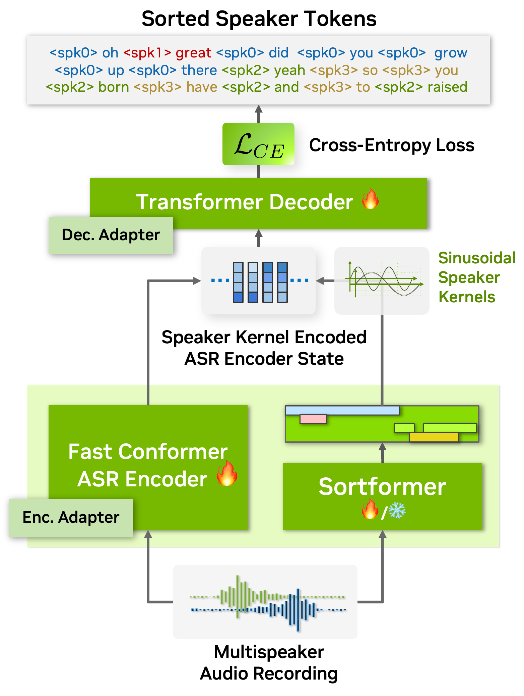
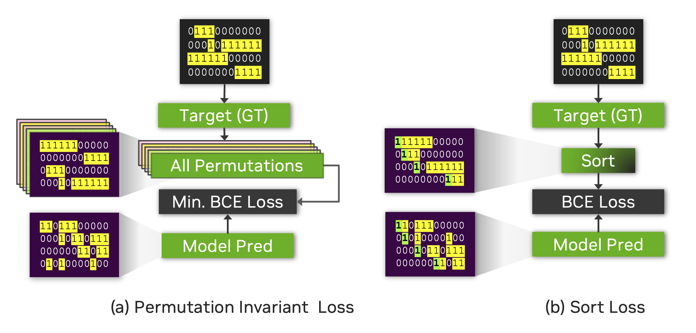
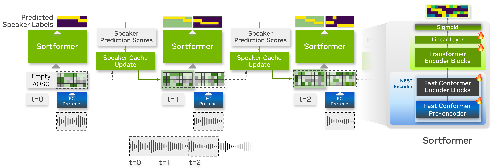

Models
======

This section gives a brief overview of the supported speaker diarization models in NeMo's ASR collection.

Currently NeMo Speech AI supports two types of speaker diarization systems:

1. **End-to-end Speaker Diarization:** Sortformer Diarizer 

Sortformer is a Transformer encoder-based end-to-end speaker diarization model that generates predicted speaker labels directly from input audio clips. 
We offer offline and online versions of Sortformer Diarizer. Online version of Sortformer diarizer can also be used for offline diarization by setting a long enough chunk size.

2. **Cascaded (Pipelined) Speaker Diarization:** Clustering diarizer with Multi-Scale Diarization Decoder (MSDD)

The speaker diarization pipeline in NeMo Speech AI involves the use of the :doc:`MarbleNet <../speech_classification/models>` model for Voice Activity Detection (VAD), the :doc:`TitaNet <../speaker_recognition/models>` model for speaker embedding extraction, and the Multi-Scale Diarization Decoder for neural diarization, all of which are explained on this page.

.. _Sortformer Diarizer:

Sortformer Diarizer
-------------------
Speaker diarization is all about figuring out who's speaking when in an audio recording. In the world of automatic speech recognition (ASR), this becomes even more important for handling conversations with multiple speakers. Multispeaker ASR (also known as speaker-attributed or multitalker ASR) uses this process to not just transcribe what's being said, but also to label each part of the transcript with the right speaker.

As ASR technology continues to advance, speaker diarization is increasingly becoming part of the ASR workflow itself. Some systems now handle speaker labeling and transcription at the same time during decoding. This means you not only get accurate text—you're also getting insights into who said what, making it more useful for conversational analysis.

However, despite significant advancements, integrating speaker diarization and ASR into a unified, seamless system remains a considerable challenge. A key obstacle lies in the need for extensive high-quality, annotated audio data featuring multiple speakers. Acquiring such data is far more complex than collecting monaural-speaker datasets. This challenge is particularly pronounced for low-resource languages and domains like healthcare, where strict privacy regulations further constrain data availability.

On top of that, many real-world use cases need these models to handle really long audio files—sometimes hours of conversation at a time. Training on such lengthy data is even more complicated because it's hard to find or annotate. This creates a big gap between what's needed and what's available, making multispeaker ASR one of the toughest nuts to crack in the field of speech technology.

.. image:: images/intro_comparison.png
        :align: center
        :width: 800px
        :alt: Intro Comparison

To tackle the complexities of multispeaker automatic speech recognition (ASR), we introduce `Sortformer <https://arxiv.org/abs/2409.06656>`__, a new approach that incorporates *Sort Loss* and techniques to align timestamps with text tokens. Traditional approaches like permutation-invariant loss (PIL) face challenges when applied in batchable and differentiable computational graphs, especially since token-based objectives struggle to incorporate speaker-specific attributes into PIL-based loss functions.

To address this, we propose an arrival time sorting (ATS) approach. In this method, speaker tokens from ASR outputs and speaker timestamps from diarization outputs are sorted by their arrival times to resolve permutations. This approach allows the multispeaker ASR system to be trained or fine-tuned using token-based cross-entropy loss, eliminating the need for timestamp-based or frame-level objectives with PIL.

.. image:: images/ats.png
        :align: center
        :width: 600px
        :alt: Arrival Time Sort

The ATS-based multispeaker ASR system is powered by an end-to-end neural diarizer model, Sortformer, which generates speaker-label timestamps in arrival time order (ATO). To train the neural diarizer to produce sorted outputs, we introduce Sort Loss, a method that creates gradients enabling the Transformer model to learn the ATS mechanism.

Additionally, as shown in the above figure, our diarization system integrates directly with the ASR encoder. By embedding speaker supervision data as speaker kernels into the ASR encoder states, the system seamlessly combines speaker and transcription information. This unified approach improves performance and simplifies the overall architecture.

As a result, our end-to-end multispeaker ASR system is fully or partially trainable with token objectives, allowing both the ASR and speaker diarization modules to be trained or fine-tuned using these objectives. Additionally, during the multispeaker ASR training phase, no specialized loss calculation functions are needed when using Sortformer, as frameworks for standard single-speaker ASR models can be employed. These compatibilities greatly simplify and accelerate the training and fine-tuning process of multispeaker ASR systems. 

On top of all these benefits, *Sortformer* can be used as a stand-alone end-to-end speaker diarization model. By training a Sortformer diarizer model especially on high-quality simulated data with accurate time-stamps, you can boost the performance of multi-speaker ASR systems, just by integrating the *Sortformer* model as *Speaker Supervision* model in a computation graph.

In this tutorial, we will walk you through the process of training a Sortformer diarizer model with toy dataset. Before starting, we will introduce the concepts of Sort-Loss calculation and the Hybrid loss technique.

.. image:: images/sortformer.png
        :align: center
        :width: 500px
        :alt: Sortformer Model with Hybrid Loss

*Sort Loss* is designed to compare the predicted outputs with the true labels, typically sorted in arrival-time order or another relevant metric. The key distinction that *Sortformer* introduces compared to previous end-to-end diarization systems such as `EEND-SA <https://arxiv.org/pdf/1909.06247>`__, `EEND-EDA <https://arxiv.org/abs/2106.10654>`__ lies in the organization of class presence :math:`\mathbf{\hat{Y}}`.

The figure below illustrates the difference between *Sort Loss* and permutation-invariant loss (PIL) or permutation-free loss.

- PIL is calculated by finding the permutation of the target that minimizes the loss value between the prediction and the target.

- *Sort Loss* simply compares the arrival-time-sorted version of speaker activity outputs for both the prediction and the target. Note that sometimes the same ground-truth labels lead to different target matrices for *Sort Loss* and PIL.

For example, the figure below shows two identical source target matrices (the two matrices at the top), but the resulting target matrices for *Sort Loss* and PIL are different.

.. _Streaming Sortformer Diarizer:

Streaming Sortformer Diarizer
-----------------------------

`Streaming Sortformer <https://www.arxiv.org/pdf/2507.18446>`__ is a streaming version of Sortformer diarizer. To handle live audio, Streaming Sortformer processes the sound in small, overlapping chunks. It employs an Arrival-Order Speaker Cache (AOSC) that stores frame-level acoustic embeddings for all speakers previously detected in the audio stream. This allows the model to compare speakers in the current chunk with those in the previous ones, ensuring a person is consistently identified with the same label throughout the stream. 

.. image:: images/cache_fifo_chunk.png
        :align: center
        :width: 800px
        :alt: Chunk-wise processing with AOSC and FIFO buffer in Streaming Sortformer inference

Streaming Sortformer employs a pre-encoder layer in the Fast-Conformer to generate a speaker cache. At each step, speaker cache is filtered to only retain the high-quality speaker cache vectors. Aside from speaker-cache management part, Streaming Sortformer follows the architecture of the offline version of Sortformer.

Below is the animated heatmap illustrating real-time speaker diarization for a three-speaker conversation using Streaming Sortformer. The heatmap shows how activities of speakers are detected in the current chunk and updated in the Arrival-Order Speaker Cache and FIFO queue.

.. image:: images/aosc_3spk_example.gif
        :align: center
        :width: 800px
        :alt: Streaming Sortformer Animated

.. _Multi_Scale_Diarization_Decoder:

Multi-Scale Diarization Decoder
-------------------------------

.. image:: images/sd_pipeline.png
        :align: center
        :width: 800px
        :alt: Speaker diarization pipeline- VAD, segmentation, speaker embedding extraction, clustering

Speaker diarization system needs to produce very accurate timestamps since speaker turns can be extremely short in conversational settings. Human conversation often involves very short back-channel words such as "yes", "uh-huh" or "oh" and these words are very challenging for machines to transcribe and tell the speaker. Therefore, while segmenting audio recordings in terms of speaker identity, speaker diarization requires fine-grained decisions on relatively short segments, ranging from a few tenths of a second to several seconds. Making accurate, fine-grained decisions on such short audio segments is challenging because it is less likely to capture reliable speaker traits from the very short audio segments. We will discuss how this problem can be addressed by introducing a new technique called the multi-scale approach and multiscale diarization decoder to handle multi-scale inputs.

Extracting long audio segments is desirable in terms of the quality of speaker characteristics. However, the length of audio segments also limits the granularity, which leads to a coarse unit length for speaker label decisions. Therefore, speaker diarization systems are challenged by a trade-off between temporal resolution and the fidelity of the speaker representation, as depicted in the curve shown in the figure below. During the speaker feature extraction process in the speaker diarization pipeline, the temporal resolution is inevitably sacrificed by taking a long speech segment to obtain high-quality speaker representation vectors. In plain and simple language, if we try to be very accurate on voice characteristics then we need to look into a longer span of time. However, at the same time, if we look into a longer span of time, we have to make a decision on a fairly long span of time and this leads to coarse decisions (temporal resolution is low). This can be easily understood if we think about the fact that even human listeners cannot accurately tell who is speaking if only half a second of recorded speech is given.

In traditional diarization systems, an audio segment length ranges from 1.5~3.0 seconds since such numbers make a good compromise between the quality of speaker characteristics and temporal resolution. We refer to this type of segmentation method as a single-scale approach. Even with an overlap technique, the single-scale segmentation limits the temporal resolution to 0.75~1.5 seconds, which leaves room for improvement in terms of temporal accuracy. Having a coarse temporal resolution not only deteriorates the performance of diarization but also decreases speaker counting accuracy since short speech segments are not captured properly. More importantly, such coarse temporal resolution in the speaker timestamps makes the matching between the decoded ASR text and speaker diarization result more error-prone.   
.. image:: images/ms_trade_off.png
        :align: center
        :width: 800px
        :alt: Speaker diarization pipeline- VAD, segmentation, speaker embedding extraction, clustering

To tackle the problem, the multi-scale approach is proposed to cope with such a trade-off by extracting speaker features from multiple segment lengths and then combining the results from multiple scales. The multi-scale approach is fulfilled by employing multi-scale segmentation and extracting speaker embeddings from each scale. The left side of the above figure shows how four different scales in a multi-scale segmentation approach are performed. During the segment affinity calculation process, all the information from the longest scale to the shortest scale is combined, yet a decision is made only for the shortest segment range. When combining the features from each scale, the weight of each scale largely affects the speaker diarization performance. 

Since scale weights largely determine the accuracy of the speaker diarization system, the scale weights should be set to have the maximized speaker diarization performance. Hence, we came up with a novel multi-scale diarization system called multiscale diarization decoder :cite:`sd-models-park2022multi` that dynamically determines the importance of each scale at each timestep. 

Multiscale diarization decoder takes the multiple speaker embedding vectors from multiple scales and then estimates desirable scale weights. Based on the estimated scale weights, speaker labels are generated. Hence, the proposed system weighs more on the large scale if the input signals are considered to have more accurate information on the certain scales.

.. image:: images/data_flow.png
        :align: center
        :width: 800px
        :alt: Speaker diarization pipeline- VAD, segmentation, speaker embedding extraction, clustering

The data flow of the multiscale speaker diarization system is shown in the above figure. Multi-scale segments are extracted from audio input, and corresponding speaker embedding vectors for multi-scale audio input are generated by using speaker embedding extractor (TitaNet). Followingly, the extracted multi-scale embeddings are processed by clustering algorithm to provide initializing clustering result to MSDD module. MSDD module uses cluster-average speaker embedding vectors to compare these with input speaker embedding sequences. The scale weights for each step is estimated to weigh the importance of each scale. Finally, the sequence model is trained to output speaker label probabilities for each speaker.

.. image:: images/scale_weight_cnn.png
        :align: center
        :width: 800px
        :alt: A figure explaining CNN based scale weighting mechanism

A neural network model named multi-scale diarization decoder (MSDD) is trained to take advantage of a multi-scale approach by dynamically calculating the weight of each scale. MSDD takes the initial clustering results and compares the extracted speaker embeddings with the cluster-average speaker representation vectors. 

Most importantly, the weight of each scale at each time step is determined through a scale weighting mechanism where the scale weights are calculated from a 1-D convolutional neural networks (CNNs) applied to the multi-scale speaker embedding inputs and the cluster average embeddings as described in the above figure.

.. image:: images/weighted_sum.png
        :align: center
        :width: 800px
        :alt: A figure explaining weighted sum of cosine similarity values

The estimated scale weights are applied to cosine similarity values calculated for each speaker and each scale. The above figure shows the process of calculating the context vector by applying the estimated scale weights on cosine similarity calculated between cluster-average speaker embedding and input speaker embeddings. 

Aside from CNN-based weighting scheme, MSDD implementation in NeMo toolkit allows multiple options for calculating scale weights ``model.msdd_module.weighting_scheme``:

- ``conv_scale_weight``: Default setting. Use 1-D CNN filters to calculate scale weights.   

- ``attn_scale_weight``: Calculate the scale weights by applying an attention mechanism between cluster-average embeddings and input embeddings. This can be viewed as attention values for scale at each timestep.  

Finally, each context vector for each step is fed to a multi-layer LSTM model that generates per-speaker speaker existence probability. The figure below shows how speaker label sequences are estimated by LSTM model and context vector input.

.. image:: images/sequence_model.png
        :align: center
        :width: 400px
        :alt: Speaker diarization pipeline- VAD, segmentation, speaker embedding extraction, clustering

In NeMo toolkit, MSDD implementation has multiple options for the context vector by specifying ``model.msdd_module.context_vector_type``:

- ``cos_sim``: As described in this document, scale weights are applied to cosine similarity values between cluster-average embedding vectors and input embedding vectors. Default is ``cos_sim``.   

- ``elem_prod``: The scale weights are directly applied to speaker embedding vectors then a weighted speaker embedding vector is calculated for both cluster-average embedding vectors and input embedding vectors. Finally, elementwise product between the cluster-average weighted speaker embedding vector and input multi-scale embedding vector are calculated and fed to LSTMs as a context vector for each step.   

References
-----------

.. bibliography:: ../asr_all.bib
    :style: plain
    :labelprefix: SD-MODELS
    :keyprefix: sd-models-

