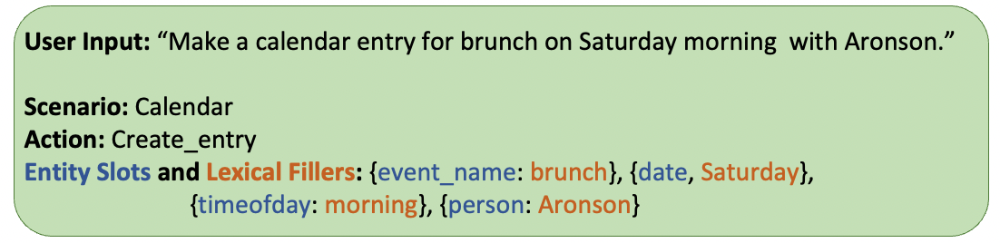

Speech Intent Classification and Slot Filling
==============================================

**Intent Classification and Slot Filling** aims to not only recognize the user's intention, but also detect entity slots and their corresponding lexical fillers. Below is an example:

Different from its counterpart in Natural Language Understanding (NLU) that takes text as input, here the model predicts the semantics directly from audio input. 

The full documentation tree is as follows:

.. toctree::
   :maxdepth: 8

   models
   datasets
   results
   configs
   api
   resources

.. include:: resources.rst
