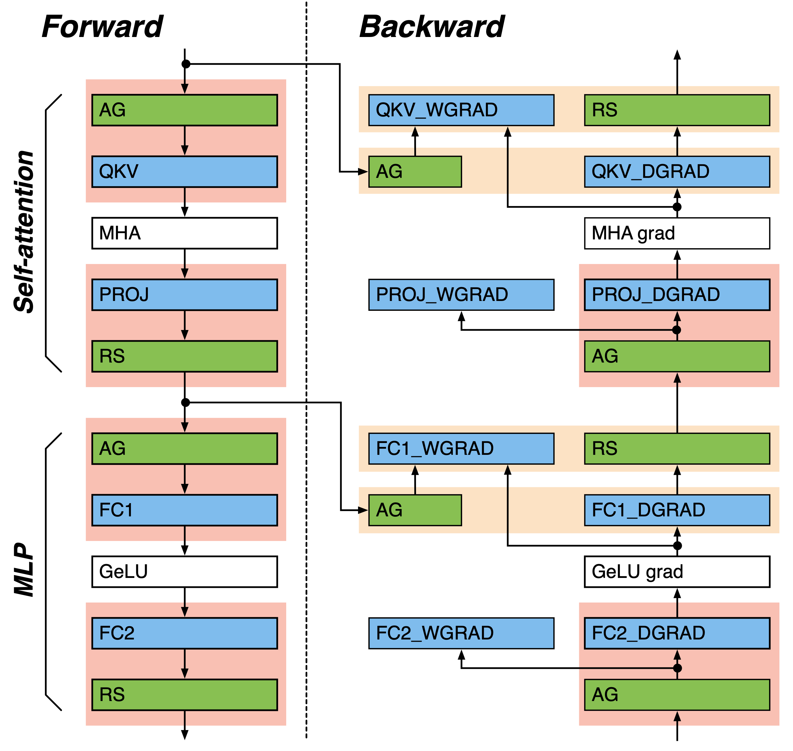
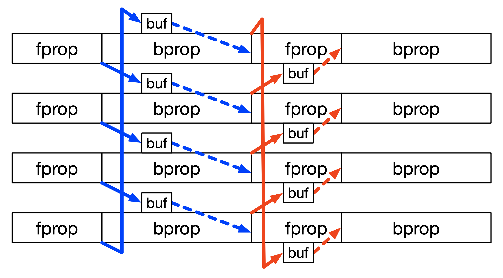

Communication Overlap
=====================

Data-parallel Communication Overlap
-----------------------------------

NeMo supports the overlap of the data-parallel (DP) communications with the computations in LLM training.
NeMo features Distributed Optimizer that distributes optimizer states and the high-precision master parameters across GPUs. This introduces two types of data-parallel communications: reduce-scatter of gradients and all-gather of updated parameters.
The DP communication is chunked by the granularity of a Transformer layer and overlaps each communication chunk with computation.
This overlap method exposes only one DP communication chunk ensuring efficient large-scale LLM training.
When training with pipeline-parallelism, the granularity of DP communication becomes the Transformer layers per virtual pipeline stage.

DP communication overlap settings can be inspected in Megatron Core via the `DistributedDataParallelConfig` class:
`DistributedDataParallelConfig <https://github.com/NVIDIA/Megatron-LM/blob/main/megatron/core/distributed/distributed_data_parallel_config.py>`_.
DP gradient reduce-scatter and parameter all-gather overlaps are enabled when setting ``overlap_grad_sync=True`` and ``overlap_param_gather=True``, respectively.
The precision of gradient reduce-scatter is controlled by ``grad_reduce_in_fp32``. When ``grad_reduce_in_fp32=False``, gradients are reduced in `bf16`, leading to improved performance in large-scale training compared to the default `fp32` precision.
When training in fp8 computing precision, setting ``fp8_param_gather=True`` conducts the parameter all-gather in fp8, reducing the all-gather overhead by half.

To modify these configurations, manually update the training recipe as follows:

.. code-block:: python

    from nemo.collections import llm
    from functools import partial

    # Load training recipe
    recipe = partial(llm.llama3_8b.pretrain_recipe)()

    recipe.strategy.ddp_config.overlap_grad_sync = False  # Default is True
    recipe.strategy.ddp_config.overlap_param_gather = False  # Default is True
    # Similar changes can be made for other DDP configurations.

Tensor-parallel Communication Overlap
-------------------------------------

Tensor parallelism, used with the sequence-parallel activation sharding (``sequence_parallel=True``), introduces activation (gradient) all-gather and reduce-scatter as shown in the below figure.
NeMo provides various options to overlap the tensor-parallel (TP) communications with computation.
The TP communication without direct computation dependency are overlapped with the computation in bulk (the linear layer and TP communication pairs in the yellow boxes).
The bulk TP communication is enabled by default.
The other TP communications with direct computation dependency are overlapped in pipelined fashion (the linear layer and TP communication pairs in the red boxes).
The TP communication and computation are chunked and the chunks are overlapped in pipeline.
In the pipelined overlap, the activation (gradient) tensor all-gather is replaced with multiple steps of input P2P ring exchanges, and reduce-scatter is replaced with multiple steps of GEMM output P2P ring exchanges followed by a reduction of the received outputs.
In case of the reduce-scatter overlap, NeMo also provides the option to pipeline-overlap using chunks of reduce-scatter, which exposes one reduce-scatter chunk.

TP communication overlap configurations are added via the callback `MegatronCommOverlapCallback <https://github.com/NVIDIA/NeMo/blob/main/nemo/lightning/pytorch/callbacks/megatron_comm_overlap.py#L61>`_.
Pipelined TP communication overlap is implemented in Transformer Engine and can be enabled by setting ``tp_comm_overlap=True``.
The individual bulk, pipelined all-gather, and reduce-scatter operations can be enabled or disabled using ``tp_comm_overlap_cfg``.
For detailed configuration, refer to `TransformerLayerTPOverlapCfg <https://github.com/NVIDIA/NeMo/blob/main/nemo/collections/llm/recipes/tp_overlap_configs/userbuffers.py#L64>`_.

To modify these configurations, manually update the training recipe as follows:

.. code-block:: python

    from nemo.collections import llm
    from functools import partial
    from nemo.lightning.pytorch.callbacks.megatron_comm_overlap import MegatronCommOverlapCallback

    # Load training recipe
    recipe = partial(llm.llama3_8b.pretrain_recipe)()

    # Remove existing MegatronCommOverlapCallback
    recipe.trainer.callbacks = [
        callback for callback in recipe.trainer.callbacks
        if not isinstance(callback, MegatronCommOverlapCallback)
    ]

    # Append new callback with updated configuration
    recipe.trainer.callbacks.append(
        MegatronCommOverlapCallback(tp_comm_overlap=False)
    )

Pipeline-parallel Communication Overlap
---------------------------------------

Pipelining introduces P2P activation (gradient) sends and receives between pipeline-parallel (PP) GPUs.
The PP communication frequency increases when increasing the virtual-pipeline-parallel size because the number of Transformer layers executed per micro-batch decreases.
This increasing PP communication overhead and it cancels off the reduced the pipeline bubbles with virtual pipelining.
NeMo supports the overlap of the PP communications with non-dependant computations in the 1F1B stage (the body of pipelining, where 1X forward and 1X backward micro-batch executions are interleaved).
The PP communications in pipeline fill and flush are still exposed.

The PP communication overlap is enabled when setting ``overlap_p2p_comm=True``. Also, setting ``batch_p2p_comm=False`` uses separate kernels for the send and the receive, which further improves the communication efficiency and GPU resource utilization.
NeMo supports PP communication overlap only with virtual pipelining, where PP communication becomes the performance bottleneck.
Please refer `GPT3 training config file <https://github.com/NVIDIA/NeMo-Framework-Launcher/blob/main/launcher_scripts/conf/training/gpt3/175b.yaml>`_ that uses the PP communication overlap.

Similar to TP communication overlap, PP communication overlap configurations are added via the callback `MegatronCommOverlapCallback <https://github.com/NVIDIA/NeMo/blob/main/nemo/lightning/pytorch/callbacks/megatron_comm_overlap.py#L61>`_.
The PP communication overlap is enabled when setting ``overlap_p2p_comm=True``. Also, setting ``batch_p2p_comm=False`` uses separate kernels for the send and the receive, which further improves the communication efficiency and GPU resource utilization.
NeMo supports PP communication overlap only with virtual pipelining, where PP communication becomes the performance bottleneck.

To modify these configurations, manually update the training recipe as follows:

.. code-block:: python

    from nemo.collections import llm
    from functools import partial
    from nemo.lightning.pytorch.callbacks.megatron_comm_overlap import MegatronCommOverlapCallback

    # Load training recipe
    recipe = partial(llm.llama3_8b.pretrain_recipe)()

    # Remove existing MegatronCommOverlapCallback
    recipe.trainer.callbacks = [
        callback for callback in recipe.trainer.callbacks
        if not isinstance(callback, MegatronCommOverlapCallback)
    ]

    # Append new callback with updated configuration
    recipe.trainer.callbacks.append(
        MegatronCommOverlapCallback(overlap_p2p_comm=True, batch_p2p_comm=False)
    )

Context-parallel Communication Overlap
--------------------------------------

Context parallelism partitions activations (gradients) on all layers in the sequence domain. This introduces all-gather and reduce-scatter of activations (gradients) in self-attention forward- and back-propagations.
NeMo hides the context-parallel (CP) communications under the self-attention computation. 
Like the TP communication overlaps, the CP communications are chunked then pipeline-overlapped with the self-attention computation, where the all-gather and the reduce-scatter of activations (gradients) are replaced with P2P ring exchanges of data.

The CP communication overlap is default enabled when context parallelism is used (``context_parallel_size > 1``).
