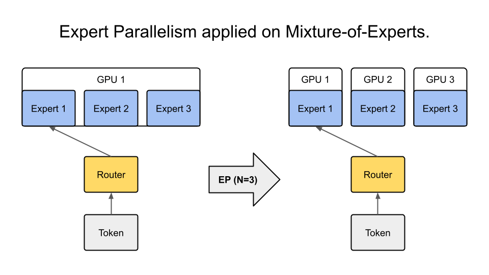

.. _parallelisms:

Parallelisms
============

NeMo Megatron supports various data-parallel and model-parallel deep learning workload deployment methods, which can be mixed together arbitrarily.

Data Parallelism
----------------

Data Parallelism (DP) replicates the model across multiple GPUs.
Data batches are evenly distributed between GPUs and the data-parallel GPUs process them independently.
While the computation workload is efficiently distributed across GPUs, inter-GPU communication is required in order to keep the model replicas consistent between training steps.

Distributed Data Parallelism
^^^^^^^^^^^^^^^^^^^^^^^^^^^^

Distributed Data Parallelism (DDP) keeps the model copies consistent by synchronizing parameter gradients across data-parallel GPUs before each parameter update.
More specifically, it sums the gradients of all model copies using all-reduce communication collectives.

.. image:: ../nlp/nemo_megatron/images/ddp.gif
    :align: center
    :width: 800px
    :alt: Distributed Data Parallel

Distributed Optimizer
^^^^^^^^^^^^^^^^^^^^^

Distributed optimizer is a memory-optimized data-parallel deployment method.
It shards the optimizer states and the high-precision master parameters across data-parallel GPUs instead replicating them.
At the parameter optimizer step, each data-parallel GPU updates its shard of parameters.
Since each GPU needs its own gradient shard, the distributed optimizer conducts reduce-scatter of the parameter gradients instead of all-reduce of them.
Then, the updated parameter shards are all-gathered across data-parallel GPUs.
This approach significantly reduces the memory need of large-scale LLM training.
Also, when the precision of the gradient is higher than the parameter precision, the split execution of gradient reduce-scatter and parameter all-gather can reduce the total communication volume.
This split collective execution increases the total computation to overlap with the communication, which improves the overlap opportunity.

Enable Data Parallelism
~~~~~~~~~~~~~~~~~~~~~~~

In NeMo Framework, DDP is the default parallel deployment method.
This means that the total number of GPUs corresponds to the size of the DP group, and training an LLM with model parallelism decreases the size of the DP group.

Currently, NeMo Framework supports optimizer distribution only for Adam optimizer.
To enable the distributed adam optimizer, set
``model.optim.name=distributed_fused_adam`` in the model
configuration. It can be configured with the following options:

===========================  =========  ==================================================================================================================================
Option                       Default    Description
===========================  =========  ==================================================================================================================================
``dtype``                    fp32       Optimizer state datatype
``grad_sync_dtype``          ``dtype``  Gradient reduce-scatter datatype
``overlap_grad_sync``        True       Overlap gradient reduce-scatter with compute
``overlap_param_sync``       False      Overlap parameter all-gather with compute
``bucket_cap_mb``            100        Buffer size (in MiB) for internal state and workspaces. Larger buckets have lower runtime overheads but may increase memory usage.
``contiguous_param_buffer``  False      Allocate parameters as views into a large buffer. Helps avoid some data copies.
``contiguous_grad_buffer``   True       Allocate parameter gradients as views into a large buffer. Helps avoid some data copies.
===========================  =========  ==================================================================================================================================

See the keyword arguments in `Apex DistributedFusedAdam <https://github.com/NVIDIA/apex/blob/master/apex/contrib/optimizers/distributed_fused_adam.py>`_ and `NeMo MegatronDistributedFusedAdam <https://github.com/NVIDIA/NeMo/blob/main/nemo/core/optim/distributed_adam.py>`_ for a full list of distributed optimizer options.

Implement Data Parallelism
~~~~~~~~~~~~~~~~~~~~~~~~~~

DDP in NeMo Framework uses either PyTorch
`DistributedDataParallel <https://pytorch.org/docs/stable/generated/torch.nn.parallel.DistributedDataParallel.html>`_
(default) or a custom implementation (if custom multi-precision
training is enabled with ``megatron_amp_O2``).

The distributed optimizer in NeMo Framework is built on top of
`DistributedFusedAdam <https://github.com/NVIDIA/apex/blob/master/apex/contrib/optimizers/distributed_fused_adam.py>`_
from Apex.

Fully-Shared Data Parallelism
^^^^^^^^^^^^^^^^^^^^^^^^^^^^^

NeMo Framework supports Fully-Sharded Data Parallelism (FSDP), which shards parameter gradients and low-precision parameters for computation. This is in addition to the model states that the distributed optimizer shards, including optimizer states and high-precision parameters.
Since FSDP shards the entire model states, it ensures linear model state memory savings with increasing DP size.
FSDP is preferred for LLM training with unbalanced workloads between pipeline stages (or Transformer layers) or with a large vocabulary size, where pipelining would cause significant computation bubbles due to workload imbalance.
Additionally, FSDP eliminates the need to search for performance-optimal mappings with 3D parallelism (TP/PP/DP) because it operates within a single parallelization domain.

NeMo Framework uses `PyTorch's FSDP interface <https://pytorch.org/tutorials/intermediate/FSDP_tutorial.html>`_ to shard LLM model states, flattening the parameters of each transformer layer and partitioning them across data-parallel GPUs.
FSDP introduces collective operations across data-parallel GPUs, including all-gather for parameter computation and reduce-scatter for parameter gradients.
The all-gather operation occurs during both the network forward and back-propagation phases, while the gradient reduce-scatter operation happens only during back-propagation.
These FSDP communications are overlapped with transformer layer computations.

Setting ``fsdp=true`` enables FSDP.
The mixed precision recipe can be set by ``precision`` knob, which determines both the computation and communication precisions.
Also, one can use ``grad_reduce_dtype`` to override the gradient reduction precision specifically.

Model Parallelism
-----------------

Model Parallelism (MP) is a distributed model deployment method that partitions the model parameters across GPUs to reduce the need of per-GPU memory.
NeMo Framework supports various model-parallel methods, which can be mixed to maximize LLM training performance.

Tensor Parallelism
^^^^^^^^^^^^^^^^^^

Tensor Parallelism (TP) is a model-parallel partitioning method that distributes the parameter tensor of an individual layer across GPUs.
In addition to reducing model state memory usage, it also saves activation memory as the per-GPU tensor sizes shrink.
However, the reduced per-GPU tensor size increases CPU overhead due to smaller per-GPU kernel workloads.

Enable Tensor Parallelism
~~~~~~~~~~~~~~~~~~~~~~~~~

To enable TP in the NeMo Framework, configure the ``tensor_model_parallel_size`` parameter in the model configuration. This parameter determines the number of GPUs among which the model's tensors are partitioned.

Set ``tensor_model_parallel_size`` to greater than ``1`` to enable intra-layer model parallelism.

   .. code-block:: yaml

       tensor_model_parallel_size: 1  # Example to enable Tensor Parallelism

The configuration file can be adjusted here: `NeMo Megatron GPT Config <https://github.com/NVIDIA/NeMo/blob/main/examples/nlp/language_modeling/conf/megatron_gpt_config.yaml#L65>`__.

Implement Tensor Parallelism
~~~~~~~~~~~~~~~~~~~~~~~~~~~~

NeMo Framework integrates TP through the implementation from Megatron Core. To understand how TP is activated within transformer blocks, refer to the code in the following repository: `Megatron-LM Transformer Block <https://github.com/NVIDIA/Megatron-LM/blob/main/megatron/core/transformer/transformer_block.py>`__.

For detailed API usage and additional configurations, consult the `Megatron Core Developer Guide <https://docs.nvidia.com/Megatron-Core/developer-guide/latest/api-guide/tensor_parallel.html>`_.

FSDP with Tensor Parallelism
~~~~~~~~~~~~~~~~~~~~~~~~~~~~

NeMo Framework supports FSDP along with TP. This is done by restricting the model state sharding to the data-parallel domain.
Using FSDP with TP can be helpful when the model doesn't have sufficient parallelism to deploy on a large-scale training system with the data-parallel mapping. For example, running a model with the global batch size of 1024 on 2048 GPUs.
Also, TP enables FSDP feasibility by reducing the model state size and the activation size per GPU, thus lower the FSDP communication overhead and the activation memory overhead.

Using both FSDP and TP works by enabling FSDP (``fsdp=true``) and setting ``tensor_model_parllel_size > 1``.
Unset the ``CUDA_DEVICE_MAX_CONNECTIONS`` environment variable to set the number of GPU kernel queues, allowing the overlap of FSDP communication with computation kernels.

Pipeline Parallelism
^^^^^^^^^^^^^^^^^^^^

Pipeline Parallelism (PP) is a technique that assigns consecutive layers or segments of a neural network to different GPUs. This division allows each GPU to process different stages of the network sequentially.

.. image:: ../nlp/nemo_megatron/images/pp.gif
    :align: center
    :width: 800px
    :alt: Pipeline Parallel

Enable Pipeline Parallelism
~~~~~~~~~~~~~~~~~~~~~~~~~~~

To utilize Pipeline Parallelism (PP) in NeMo Framework, set the ``pipeline_model_parallel_size`` parameter in the model's configuration. This parameter specifies the number of GPUs among which the model's layers are distributed.

Set ``pipeline_model_parallel_size`` to a value greater than ``1`` to enable inter-layer model parallelism.

   .. code-block:: yaml

       pipeline_model_parallel_size: 1  # Example to enable Pipeline Parallelism

Adjust the configuration accordingly here: `NeMo Megatron GPT Config <https://github.com/NVIDIA/NeMo/blob/main/examples/nlp/language_modeling/conf/megatron_gpt_config.yaml#L66>`__.

Interleaved Pipeline Parallel Schedule
~~~~~~~~~~~~~~~~~~~~~~~~~~~~~~~~~~~~~~

To minimize the pipeline bubble, the computation on each GPU can be divided into multiple subsets of layers (referred to as model chunks), rather than a single contiguous block. For instance, instead of each GPU processing a continuous set of four layers, it might handle two model chunks with two layers each.

   .. code-block:: yaml

       virtual_pipeline_model_parallel_size: 2 # Set for interleaved pipeline

For more insights into this approach, see our detailed blog: `Scaling Language Model Training <https://developer.nvidia.com/blog/scaling-language-model-training-to-a-trillion-parameters-using-megatron/#pipeline_parallelism>`_.

Implement Pipeline Parallelism
~~~~~~~~~~~~~~~~~~~~~~~~~~~~~~

The NeMo Framework implementation of PP leverages functionalities from Megatron Core. For a practical example of how PP is implemented within transformer blocks in NeMo, you can inspect the following codebase: `Megatron-LM Transformer Block <https://github.com/NVIDIA/Megatron-LM/blob/main/megatron/core/transformer/transformer_block.py>`_.

For more detailed API usage and configurations related to PP, visit the `Megatron Core Developer Guide <https://docs.nvidia.com/Megatron-Core/developer-guide/latest/api-guide/tensor_parallel.html>`_.

Expert Parallelism
^^^^^^^^^^^^^^^^^^
Expert Parallelism (EP) is a type of model parallelism that distributes experts of an MoE across GPUs.
Unlike other model-parallel techniques, EP is applied to only the expert layers thus does not impact the parallel mapping of the rest of layers.

Enable Expert Parallelism
~~~~~~~~~~~~~~~~~~~~~~~~~

To enable EP, set ``model.expert_model_parallel_size`` to the expert parallel size you want. For example, if the model has six experts (``model.num_moe_experts=6``), then setting ``model.expert_model_parallel_size=3`` results in each GPU processing two experts. The number of experts should be divisible by the expert parallel size.

   .. code-block:: yaml

       expert_model_parallel_size: 3  # Set EP to 3

For further information on configuration, refer to the following documentation: `NeMo Megatron GPT Config <https://github.com/NVIDIA/NeMo/blob/main/examples/nlp/language_modeling/conf/megatron_gpt_config.yaml#L68>`__.

Implement Expert Parallelism
~~~~~~~~~~~~~~~~~~~~~~~~~~~~

The NeMo Framework implementation of EP uses functionality from Megatron Core. Please consult the `Megatron Core MoE layer <https://github.com/NVIDIA/Megatron-LM/blob/e2ec14ab5690fead7e33760b0f8fb20c83b4fd1f/megatron/core/transformer/moe/moe_layer.py#L29>`_ for more MoE implementation details.

Activation Partitioning
-----------------------

In LLM training, a large memory space is needed to store the input activations of the network layers.
NeMo Framework provides effective activation distribution methods, which is critical in training LLM with a large sequence length or large per-GPU micro-batch size.

Sequence Parallelism
^^^^^^^^^^^^^^^^^^^^

Sequence Parallelism (SP) extends tensor-level model parallelism by distributing computing load and activation memory across multiple GPUs along the sequence dimension of transformer layers. This method is particularly useful for portions of the layer that have previously not been parallelized, enhancing overall model performance and efficiency.

Enable Sequence Parallelism
~~~~~~~~~~~~~~~~~~~~~~~~~~~

To utilize SP in NeMo Framework, set the ``sequence_parallel`` parameter to ``True`` in the model's configuration. Note that this feature is effective only when the tensor parallel size (``tensor_model_parallel_size``) is greater than ``1``.

   .. code-block:: yaml

       sequence_parallel: True  # Enable Sequence Parallelism

For further information on configuration, refer to the following documentation: `NeMo Megatron GPT Config <https://github.com/NVIDIA/NeMo/blob/main/examples/nlp/language_modeling/conf/megatron_gpt_config.yaml#L66>`__.

Implement Sequence Parallelism
~~~~~~~~~~~~~~~~~~~~~~~~~~~~~~

The NeMo Framework implementation of SP utilizes functionality from Megatron Core. For an in-depth look at how Sequence Parallelism is integrated into the Megatron Core architecture, you can examine the source code here: `Megatron-LM Sequence Parallel Source Code <https://github.com/NVIDIA/Megatron-LM/blob/main/megatron/core/tensor_parallel/layers.py>`_.

Context Parallelism
^^^^^^^^^^^^^^^^^^^

Context Parallelism (CP) is a method for parallelizing the processing of neural network activations across multiple GPUs, partitioning the input tensors in the sequence dimension.
Unlike SP, which partitions the activations of specific layers, CP divides the activations of all layers.

Enable Context Parallelism
~~~~~~~~~~~~~~~~~~~~~~~~~~

To activate CP in the NeMo Framework, set the ``context_parallel_size`` parameter in the model configuration. This parameter specifies the number of GPUs among which the model's sequence activations are distributed.

Set ``context_parallel_size`` to a value greater than ``1`` to enable sequence-wide model parallelism.

   .. code-block:: yaml

       context_parallel_size: 1  # Example to enable Context Parallelism

The configuration can be found and modified here: `NeMo Megatron Core Context Config <https://docs.nvidia.com/Megatron-Core/developer-guide/latest/api-guide/context_parallel.html>`_.

Implement Context Parallelism
~~~~~~~~~~~~~~~~~~~~~~~~~~~~~

NeMo Framework leverages functionalities from both Megatron Core and Transformer Engine to implement CP efficiently. During forward propagation, each GPU handles a segment of the sequence, storing only the necessary Key and Value (KV) pairs. In the backward pass, these KV pairs are reassembled across GPUs using advanced communication schemes like all-gather and reduce-scatter transformed into point-to-point communications in a ring topology. This method reduces the memory footprint significantly while maintaining computational efficiency.

Visit our source code for more insights into the implementation:
- `Megatron Core wrappers for Transformer Engine <https://github.com/NVIDIA/Megatron-LM/blob/main/megatron/core/transformer/custom_layers/transformer_engine.py>`_
- `Transformer Engine attention modules <https://github.com/NVIDIA/TransformerEngine/blob/main/transformer_engine/pytorch/attention.py>`_

Parallelism Nomenclature
^^^^^^^^^^^^^^^^^^^^^^^^

The following figure illustrates some terms that you may encounter in the NeMo Megatron codebase.

