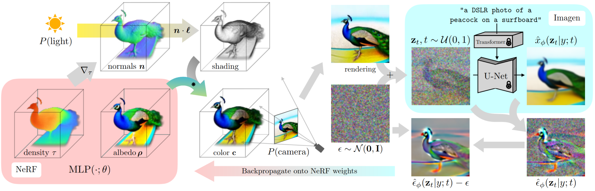

DreamFusion
===========

Model Introduction
-------------------
DreamFusion  :cite:`mm-models-df-poole2022dreamfusion` uses a pretrained text-to-image diffusion model to perform
text-to-3D synthesis. The model uses a loss based on probability density distillation that enables the use of a 2D
diffusion model as a prior for optimization of a parametric image generator.

Using this loss in a DeepDream-like procedure, the model optimizes a randomly-initialized 3D model
(a Neural Radiance Field, or NeRF) via gradient descent such that its 2D renderings from random angles achieve a low
loss. The resulting 3D model of the given text can be viewed from any angle, relit by arbitrary illumination, or composited
into any 3D environment. This approach requires no 3D training data and no modifications to the image diffusion model,
demonstrating the effectiveness of pretrained image diffusion models as priors.

Dreamfusion models can be instantiated using the :class:`~nemo.collections.multimodal.models.nerf.dreamfusion.DreamFusion` class.

Image guidance
^^^^^^^^^^^^^^
This section of DreamFusion pertains to the initial phase where the model interprets and translates text inputs into visual concepts.
Utilizing a diffusion based text-to-image model, DreamFusion processes the text input, extracts key visual elements, and translates these into initial 2D images.
The process ensures that the generated 3D models are not only accurate in terms of the text description but also visually coherent and detailed by conditioning
the 2D image based on the view angle.

NeRF (foreground) network
^^^^^^^^^^^^^^^^^^^^^^^^^
The Neural Radiance Fields (NeRF) network is at the heart of DreamFusion's 3D rendering capabilities.
In DreamFusion, the NeRF network takes the 2D images generated from the textual description and constructs a 3D model.
This model is represented as a continuous volumetric scene function, which encodes the color and density of points in space,
allowing for highly detailed and photorealistic renderings.

Background layer
^^^^^^^^^^^^^^^^
DreamFusion can leverage a background layer dedicated to background modeling.

In scenarios where a dynamic background is needed, DreamFusion can be configured to use a secondary NeRF network to generate a background.
This network functions in parallel to the primary NeRF network, focusing on creating a coherent and contextually appropriate backdrop for the main scene.
It dynamically adjusts to lighting and perspective changes, maintaining consistency with the foreground model.

Alternatively, DreamFusion allows for the integration of a static background color, which is particularly useful in scenarios where the focus is predominantly on the object being generated, and a non-distracting backdrop is desirable.
Implementing a static color background involves setting a uniform chromatic value that encompasses the periphery of the 3D model.
This approach simplifies the rendering process and can be beneficial in reducing computational load while maintaining focus on the primary object.

Materials network
^^^^^^^^^^^^^^^^^
The material network in DreamFusion is responsible for adding realism to the 3D models by accurately simulating the physical properties of different materials.
This network takes into account various aspects like texture, reflectivity, and transparency.
By doing so, it adds another layer of detail, making the objects generated by DreamFusion not just structurally accurate but also visually and tactilely realistic.

Renderer layer
^^^^^^^^^^^^^^
The renderer layer functions as the culminating stage in DreamFusion's processing pipeline.
It translates the synthesized volumetric data from the NeRF and material networks into perceptible imagery.
Employing ray-tracing algorithms, this layer computes the interaction of light with the 3D scene,
producing images that exhibit sophisticated attributes like accurate shadow casting,
dynamic lighting, and perspective-correct renderings.

Model Configuration
-------------------

DreamFusion models can be instantiated using the :class:`~nemo.collections.multimodal.models.nerf.dreamfusion.DreamFusion` class.
The model configuration file is organized into the following sections:

.. code-block:: yaml

  _target_: nemo.collections.multimodal.models.nerf.dreamfusion.DreamFusion
  defaults:
    - nerf: torchngp
    - background: static
    - material: basic_shading
    - renderer: torchngp_raymarching
    - guidance: sd_huggingface
    - optim: adan
    - loss: dreamfusion
    - data: data
    - _self_

  ### model options
  resume_from_checkpoint:
  prompt: 'a hamburger'
  negative_prompt: ''
  front_prompt: ', front view'
  side_prompt: ', side view'
  back_prompt: ', back view'
  update_extra_interval: 16
  guidance_scale: 100
  export_video: False

  iters: ${trainer.max_steps}
  latent_iter_ratio: 0.2
  albedo_iter_ratio: 0.0
  min_ambient_ratio: 0.1
  textureless_ratio: 0.2

  data:
    train_dataset:
      width: 64
      height: 64
    val_dataset:
      width: 800
      height: 800
    test_dataset:
      width: 800
      height: 800

- ``defaults``: Defines default modules for different components like nerf, background, material, etc.
- ``resume_from_checkpoint``: Path to a checkpoint file to initialize the model with.
- ``prompt``: Main textual input for the model describing the object to generate.
- ``negative_prompt``: Textual input describing what to avoid in the generated object.
- ``front_prompt``, ``side_prompt``, ``back_prompt``: Textual inputs that are appended to the prompts for more detailed orientation guidance.
- ``update_extra_interval``: Interval for updating internal module parameters.
- ``guidance_scale``: The guidance scaled used with the diffusion model.
- ``export_video``: Boolean to determine whether to export a 360 video of the generated object.
- ``iters``, ``latent_iter_ratio``, ``albedo_iter_ratio``, ``min_ambient_ratio``, ``textureless_ratio``: Various ratios and parameters defining iteration behavior and visual characteristics of the output.
- ``data``: Defines dataset dimensions for training, validation, and testing.

The behavior of the pipeline can be precisely adjusted by fine-tuning the parameters of various components in the default section.
Some components support different backends and implementations, the full components catalog can be viewed in the config directory ``{NEMO_ROOT/examples/multimodal/generative/nerf/conf/model}``.

Image guidance
^^^^^^^^^^^^^^

.. code-block:: yaml

  _target_: nemo.collections.multimodal.modules.nerf.guidance.stablediffusion_huggingface_pipeline.StableDiffusion
  precision: ${trainer.precision}
  model_key: stabilityai/stable-diffusion-2-1-base
  t_range: [0.02, 0.98]

- ``precision``: Sets the precision of computations (e.g., FP32 or FP16).
- ``model_key``: Specifies the pre-trained model to use for image guidance.
- ``t_range``: Range of threshold values for guidance stability.

NeRF (foreground) network
^^^^^^^^^^^^^^^^^^^^^^^^^

.. code-block:: yaml

  _target_: nemo.collections.multimodal.modules.nerf.geometry.torchngp_nerf.TorchNGPNerf
  num_input_dims: 3
  bound: 1
  density_activation: exp
  blob_radius: 0.2
  blob_density: 5
  normal_type: central_finite_difference

  encoder_cfg:
    encoder_type: 'hashgrid'
    encoder_max_level:
    log2_hashmap_size: 19
    desired_resolution: 2048
    interpolation: smoothstep

  sigma_net_num_output_dims: 1
  sigma_net_cfg:
    num_hidden_dims: 64
    num_layers: 3
    bias: True

  features_net_num_output_dims: 3
  features_net_cfg:
    num_hidden_dims: 64
    num_layers: 3
    bias: True

Describes the NeRF network's architecture, including the density activation function, network configuration, and the specification of the sigma and features networks.

Background layer
^^^^^^^^^^^^^^^^

.. code-block:: yaml

  _target_: nemo.collections.multimodal.modules.nerf.background.static_background.StaticBackground
  background: [0, 0, 1]

Static background, where the background key is the RGB color.

.. code-block:: yaml

  _target_: nemo.collections.multimodal.modules.nerf.background.torchngp_background.TorchNGPBackground

  encoder_type: "frequency"
  encoder_input_dims: 3
  encoder_multi_res: 6

  num_output_dims: 3
  net_cfg:
    num_hidden_dims: 32
    num_layers: 2
    bias: True

Dynamic background, where the background is generated by a NeRF network.

Materials network
^^^^^^^^^^^^^^^^^

.. code-block:: yaml

  _target_: nemo.collections.multimodal.modules.nerf.materials.basic_shading.BasicShading

Defines the basic shading model for the material network. The basic shading model supports textureless, lambertian and phong shading.

Renderer layer
^^^^^^^^^^^^^^

.. code-block:: yaml

  _target_: nemo.collections.multimodal.modules.nerf.renderers.torchngp_volume_renderer.TorchNGPVolumeRenderer
  bound: ${model.nerf.bound}
  update_interval: 16
  grid_resolution: 128
  density_thresh: 10
  max_steps: 1024
  dt_gamma: 0

Configures the renderer, specifying parameters like update interval, grid resolution, and rendering thresholds.

DreamFusion-DMTet
-----------------
NeRF models integrate geometry and appearance through volume rendering. As a result,
using NeRF for 3D modeling can be less effective when it comes to capturing both the intricate details of a surface as well as
its material and texture.

DMTet finetunning disentangles the learning of geometry and appearance models, such that both a fine surface and a rich
material/texture can be generated. To enable such a disentangled learning, a hybrid scene representation of
[DMTet](https://nv-tlabs.github.io/DMTet/) is used.

The DMTet model maintains a deformable tetrahedral grid that encodes a discretized signed distance function and a
differentiable marching tetrahedra layer that converts the implicit signed distance representation to the explicit
surface mesh representation.

Model Configuration
^^^^^^^^^^^^^^^^^^^

DreamFusion models can be instantiated using the same class as DreamFusion :class:`~nemo.collections.multimodal.models.nerf.dreamfusion.DreamFusion`.
However, the following changes to the training pipeline are necessary:

.. code-block:: yaml

  _target_: nemo.collections.multimodal.models.nerf.dreamfusion.DreamFusion
  defaults:
    - nerf: torchngp
    - background: torchngp
    - material: basic_shading
    - renderer: nvdiffrast            # (1)
    - guidance: sd_huggingface
    - optim: adan
    - loss: dmtet                     # (2)
    - data: data
    - _self_

  ### model options
  resume_from_checkpoint: "/results/DreamFusion/checkpoints/DreamFusion-step\=10000-last.ckpt"   # (3)
  prompt: 'a hamburger'
  negative_prompt: ''
  front_prompt: ', front view'
  side_prompt: ', side view'
  back_prompt: ', back view'
  update_extra_interval: 16
  guidance_scale: 100
  export_video: False

  iters: ${trainer.max_steps}
  latent_iter_ratio: 0.0
  albedo_iter_ratio: 0
  min_ambient_ratio: 0.1
  textureless_ratio: 0.2

  data:
    train_dataset:
      width: 512         # (4)
      height: 512        # (4)
    val_dataset:
      width: 800
      height: 800
    test_dataset:
      width: 800
      height: 800

We note the following changes:
1. The rendering module was changed from a volumetric based one to a rasterization based one (nvdiffrast).
2. The model loss is changed to account for the changes in the geometry representation.
3. DreamFusion-DMTet finetunes a pretrained DreamFusion model, the pretrained checkpoint is provided using ``resume_from_checkpoint``.
4. The training shape is incrased to 512x512

References
----------

.. bibliography:: ../mm_all.bib
    :style: plain
    :filter: docname in docnames
    :labelprefix: MM-MODELS-DF
    :keyprefix: mm-models-df-
