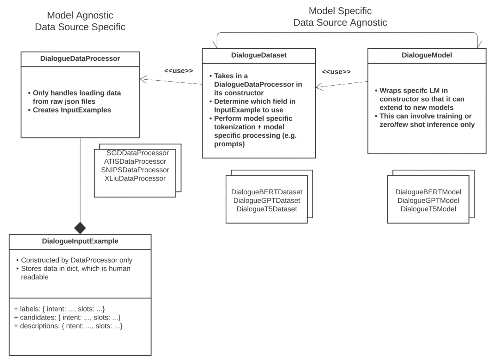

.. _dialogue:

Dialogue tasks
======================================

This module consists of various tasks that are related to dialogue. 

**Module Design**

We decided to group dialogue tasks into a common module instead of having a module for each because they share many things in common, meaning that there can be more re-use of code. 
This design can also support easier extension of this module, as developers can work on components of their interest while utilizing other components of dialogue pipeline. 
In particular, we wanted to decouple the task-dependent, model-independent components of DataProcessor and InputExample from the model-dependent, task-independent components of Model and Dataset.

**Supported Tasks** 

Supported tasks fall into broad categories of intent / domain classification with slot filling, intent classification as well as sequence generation.

For each category of tasks, there exists several Data Processors to convert raw data from various sources into a common format as well as Dialogue Models that approachs the task in various ways.

Currently, the supported task categories are:

+----------------------------------------------------------+----------------------------------+----------------------------------------------------------------------------------+----------------------------------------------------------------------+------------------------------------------+
| **Task Category**                                        | **Tasks**                        |   **Models**                                                                     | **Supported Options for model.language_model.pretrained_model_name** | **Supported options for model.library**  |                                                                       
+----------------------------------------------------------+----------------------------------+----------------------------------------------------------------------------------+----------------------------------------------------------------------+------------------------------------------+
| Domain / Intent Classification                           | Schema Guided Dialogue           | Dialogue GPT Classification Model                                                | gpt2, gpt2-{medium, large, xl}, microsoft/DialoGPT-{small, medium}   | Huggingface, Megatron                    |
+ with slot filling                                        +----------------------------------+----------------------------------------------------------------------------------+----------------------------------------------------------------------+------------------------------------------+
|                                                          | Assistant                        | SGDQA (BERT-Based Schema Guided Dialogue Question Answering model)               | bert-base-cased                                                      | Megatron                                 |
+                                                          +----------------------------------+----------------------------------------------------------------------------------+----------------------------------------------------------------------+------------------------------------------+
|                                                          |                                  | Intent Slot Classification Model                                                 | bert-base-uncased                                                    | Megatron                                 |
+----------------------------------------------------------+----------------------------------+----------------------------------------------------------------------------------+----------------------------------------------------------------------+------------------------------------------+
| Intent Classification                                    | Zero Shot Food Ordering          | Dialogue GPT Classification Model                                                | gpt2, gpt2-{medium, large, xl}, microsoft/DialoGPT-{small, medium}   | Huggingface, Megatron                    |
+                                                          +----------------------------------+----------------------------------------------------------------------------------+----------------------------------------------------------------------+------------------------------------------+
|                                                          | Omniverse Design                 | Dialogue Nearest Neighbour Model                                                 | sentence-transformers/*                                              | Huggingface                              |
+                                                          +----------------------------------+----------------------------------------------------------------------------------+----------------------------------------------------------------------+------------------------------------------+
|                                                          |                                  | Dialogue Zero Shot Intent Model (Based on MNLI pretraining)                      | bert-base-uncased                                                    | Huggingface, Megatron                    |
+----------------------------------------------------------+----------------------------------+----------------------------------------------------------------------------------+----------------------------------------------------------------------+------------------------------------------+
| Sequence Generation                                      | Schema Guided Dialogue Generation| Dialogue GPT Generation Model                                                    | gpt2, gpt2-{medium, large, xl}, microsoft/DialoGPT-{small, medium}   | Huggingface, Megatron                    |
+                                                          +----------------------------------+----------------------------------------------------------------------------------+----------------------------------------------------------------------+------------------------------------------+
|                                                          | MS Marco NLGen                   | Dialogue S2S Generation Model                                                    | facebook/bart-{base, large}, t5-{small, base, large, 3b, 11b}        | Huggingface, Megatron                    |
+----------------------------------------------------------+----------------------------------+----------------------------------------------------------------------------------+----------------------------------------------------------------------+------------------------------------------+

**Configuration** 

Example of model configuration file for training the model can be found at: `NeMo/examples/nlp/dialogue/conf/dialogue_config.yaml <https://github.com/NVIDIA/NeMo/blob/stable/examples/nlp/dialogue/conf/dialogue_config.yaml>`__.

Because the Dialogue module contains a wide variety of models and tasks, there are a large number of configuration parameters to adjust (some of which only applies to some models/some tasks)

In the configuration file, define the parameters of the training and the model, although most of the default values will work well.
For various task-model combination, only a restricted set of config args will apply. Please read the configuration file for comments on which config args you would need for each model and task.

The configuration can be roughly grouped into a few categories:

- Parameters that describe the training process, such as how many gpus to use: **trainer**
- Parameters that describe the model: **model**
- Parameters that describe optimization: **model.optim**
- Parameters that describe the task: **model.dataset**
- Parameters that describe the dataloaders: **model.train_ds**, **model.validation_ds**, **model.test_ds**,
- Parameters that describe the training experiment manager that log training process: **exp_manager**

Arguments that very commonly need to be edited for all models and tasks

- :code:`do_training`: perform training or only testing
- :code:`trainer.devices`: number of GPUs (int) or list of GPUs e.g. [0, 1, 3]
- :code:`model.dataset.task`: Task to work on [sgd, assistant, zero_shot, ms_marco, sgd_generation, design, mellon_qa]
- :code:`model.dataset.data_dir`: the dataset directory
- :code:`model.dataset.dialogues_example_dir`: the directory to store prediction files
- :code:`model.dataset.debug_mode`: whether to run in debug mode with a very small number of samples [True, False]
- :code:`model.language_model.pretrained_model_name`: language model to use, which causes different Dialogue Models to be loaded (see table above for options in each model class) 
- :code:`model.library`: library to load language model from [huggingface or megatron]
- :code:`model.language_model.lm_checkpoint`: specifying a trained checkpoint (.bin / .ckpt / .nemo). The only exception is for DialogueZeroShotIntentModel, which can be configured at :code:`model.original_nemo_checkpoint`` instead For trained checkpoints, see :code:`list_available_models()`` for each model class and then downloading the file to a local directory

**Obtaining data**

Task: Schema Guided Dialogue (SGD) / SGD Generation

:code: `git clone https://github.com/google-research-datasets/dstc8-schema-guided-dialogue.git`

Task: MS Marco

Please download the files below and unzip them into a common folder (for model.dataset.data_dir)

https://msmarco.blob.core.windows.net/msmarco/train_v2.1.json.gz
https://msmarco.blob.core.windows.net/msmarco/dev_v2.1.json.gz
https://msmarco.blob.core.windows.net/msmarco/eval_v2.1_public.json.gz

Then remove unused samples (optional, but otherwise, this would require significantly more CPU RAM ~25GB)

:code: `python ../NeMo/examples/nlp/dialogue/remove_ms_marco_samples_without_wellFormedAnswers.py --filename train_v2.1.json`
:code: `python ../NeMo/examples/nlp/dialogue/remove_ms_marco_samples_without_wellFormedAnswers.py --filename dev_v2.1.json`

Task: Assistant 

:code: `git clone https://github.com/xliuhw/NLU-Evaluation-Data`

Then unzip it 

Finally, convert the dataset into the required format

.. code::

    python examples/nlp/intent_slot_classification/data/import_datasets.py
        --source_data_dir=`source_data_dir` \
        --target_data_dir=`target_data_dir` \
        --dataset_name='assistant'

- :code:`source_data_dir`: the directory location of the your dataset
- :code:`target_data_dir`: the directory location where the converted dataset should be saved

Unfortunately other datasets are currently not available publically 

**Training/Testing a model**

Please try the example Dialogue model in a Jupyter notebook (can run on `Google's Colab <https://colab.research.google.com/github/NVIDIA/NeMo/tree/stable/tutorials/nlp/Dialogue.ipynb>`__).

Connect to an instance with a GPU (**Runtime** -> **Change runtime type** -> select **GPU** for the hardware accelerator).

An example script on how to train the model can be found here: `NeMo/examples/nlp/dialogue/dialogue.py <https://github.com/NVIDIA/NeMo/blob/stable/examples/nlp/dialogue/dialogue.py>`__.

The following is an example of the command for training the model:

Code for training a model with three public datasets (from above) are available in the Jupyter/Colab notebook `Google's Colab <https://colab.research.google.com/github/NVIDIA/NeMo/tree/stable/tutorials/nlp/Dialogue.ipynb>`__)

.. code::

    python examples/nlp/dialogue/dialogue.py \
           do_training=True \
           model.dataset.task=sgd \
           model.dataset.debug_mode=True \
           model.language_model.pretrained_model_name=gpt2 \
           model.data_dir=<PATH_TO_DATA_DIR> \
           model.dataset.dialogues_example_dir=<PATH_TO_DIALOGUES_EXAMPLE_DIR> \
           trainer.devices=[0] \
           trainer.accelerator='gpu'
