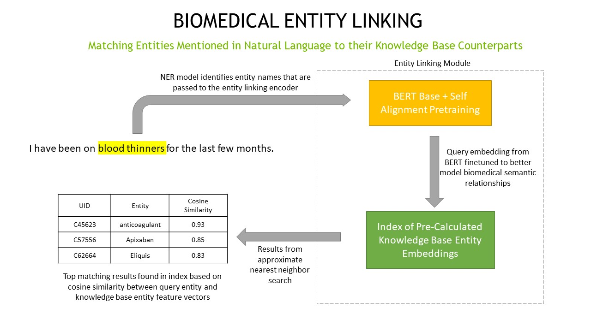

.. _entity_linking:

Entity Linking
====================================

Entity linking is the process of matching concepts mentioned in natural language to their unique IDs and canonical forms stored 
in a knowledge base. For example, an entity linking model might match the phrase ``blood thinners`` mentioned in conversation 
to the knowledge base concept UID45623 anticoagulant. Entity linking applications range from helping automate ingestion of 
large amounts of data to assisting in real time concept normalization.

Within NeMo we use the entity linking approach described in Liu et. al's NAACL 2021 "`Self-alignment Pre-training for Biomedical Entity Representations <https://arxiv.org/abs/2010.11784v2>`_" :cite:`nlp-entity_linking-liu2021selfalignment`. 
The main idea behind this approach is to reshape an initial concept embedding space such that synonyms of the same concept are 
pulled closer together and unrelated concepts are pushed further apart. The concept embeddings from this reshaped space can then 
be used to build a knowledge base embedding index. 

Our BERT-base + Self Alignment Pretraining implementation allows you to train an entity linking encoder. We also provide example code
on building an index with `Medical UMLS <https://www.nlm.nih.gov/research/umls/index.html>`_ concepts `NeMo/examples/nlp/entity_linking/build_index.py <https://github.com/NVIDIA/NeMo/tree/stable/examples/nlp/entity_linking/build_index.py>`__.

Please try the example Entity Linking model in a Jupyter notebook (can run on `Google's Colab <https://colab.research.google.com/github/NVIDIA/NeMo/blob/v1.0.2/tutorials/nlp/Entity_Linking_Medical.ipynb>`__).

Connect to an instance with a GPU (**Runtime** -> **Change runtime type** -> select **GPU** for the hardware accelerator).

An example script on how to train the model can be found here: `NeMo/examples/nlp/entity_linking <https://github.com/NVIDIA/NeMo/tree/stable/examples/nlp/entity_linking>`__.

References
----------

.. bibliography:: nlp_all.bib
    :style: plain
    :labelprefix: nlp-entity_linking
    :keyprefix: nlp-entity_linking-
