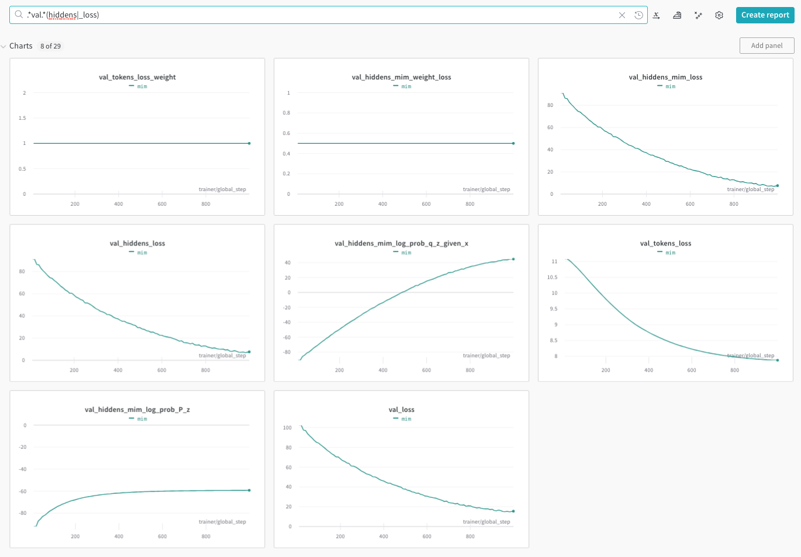

Hiddens Module
==============

The hiddens module allows to add **hidden transformations** and **hidden losses** to Megatron encoder-decoder models.
Hidden transformations are transformations that are applied to the output of the encoder.
Hidden losses are losses that are applied to the outputs of the hidden transformations.
A common use case for hidden transformations is to train a Mutual Information Machine (MIM)
or a Variational Auto-Encoder (VAE) models.

Quick Start
-----------

Below is an example command of training a MIM model with BART data augmentation (i.e., includes masking the input):

.. code-block:: bash

    python examples/nlp/language_modeling/megatron_bart_pretraining.py \
        trainer.devices=2 \
        trainer.accelerator=gpu \
        trainer.log_every_n_steps=1 \
        trainer.val_check_interval=10 \
        trainer.limit_val_batches=2 \
        trainer.accumulate_grad_batches=1 \
        trainer.max_steps=10 \
        trainer.precision=16 \
        trainer.gradient_clip_val=1.0 \
        exp_manager.exp_dir=/results/megatron_mim \
        model.micro_batch_size=2 \
        model.global_batch_size=4 \
        model.seq_length=128 \
        model.encoder.num_layers=4 \
        model.encoder.hidden_size=64 \
        model.encoder.arch=perceiver \
        model.encoder.num_attention_heads=8 \
        model.decoder.num_layers=4 \
        model.decoder.hidden_size=64 \
        model.decoder.num_attention_heads=8 \
        model.data.data_impl=text_mmap \
        model.data.data_prefix=[1.0,/data/wiki.txt] \
        model.data.splits_string=\'\"800,100,100\"\' \
        model.data.whole_word_masking=False \
        model.tokenizer.library=sentencepiece \
        model.tokenizer.model=/data/spm_64k_all_langs_plus_en.model \
        ++model.hiddens.enc_output_name=z \
        ++model.hiddens.transform.q_z_given_x.cls_name=cond_gaussian \
        ++model.hiddens.transform.q_z_given_x.hidden_size=64 \
        ++model.hiddens.loss.mim.cls_name=a_mim \
        ++model.hiddens.loss.mim.loss_weight=1.0

The last 5 lines in the above command enable sampling with reparameterization (`cond_gauss` hidden transformation)
and MIM loss where the hidden part of the loss is weighted by `1.0`.

The above example will produce the following plots in Weights and Biases:

See below detailed description of usage and configuration format.

High Level Description
----------------------

Megatron encoder-decoder models directly pass the output of the encoder to the decoder.
The hidden transformations provides a mechanism to add transformations and losses to the encoder outputs.
This is achieved my naming the output of the encoder (`hiddens`) and any provided hidden transformation.
Each hidden transformation is defined over expected existing outputs and produces a new set of outputs.
This allows us to define losses on any of the named outputs (i.e., the outputs of the encoder or any of the transformations).

Detailed Description
--------------------

Features
^^^^^^^^

1. Hidden transformations and losses can be added to any Megatron encoder-decoder model.
2. Externally implemented transformations and losses can easily be registered and used.
3. Transformations (and losses) order is supported to allow one transformation to use the output of another.
4. All transformations' outputs are named, allowing for easy access in losses or other transformations (encoder raw output defaults to `hiddens`, and respective `hiddens_mask`).
5. All loss outputs are logged, allowing for easy monitoring of the training and validation process.
6. Transformations' outputs can be used in more than one loss. 
7. The joint loss supports weighting the terms, and is computed as follows: `loss = hiddens.tokens_loss_weight * tokens_loss_weight + \sum_i hiddens.loss[i].loss_weight * hiddens.loss[i].loss`.
8. Detailed error messages are provided. Please check raised exceptions and log outputs. Errors will be raised if:

    * The same named output is used more than once.
    * A loss is expected an undefined named output.
    * A Mismatch in a transformation or loss constructor parameters.

Configuring Hidden Transformations and Losses
^^^^^^^^^^^^^^^^^^^^^^^^^^^^^^^^^^^^^^^^^^^^^

A detailed example can be found in : `NeMo/examples/nlp/language_modeling/conf/megatron_hiddens_base_config.yaml <https://github.com/NVIDIA/NeMo/tree/stable/examples/nlp/language_modeling/conf/megatron_hiddens_base_config.yaml>`__.
Below is the content of the config file above:

.. code-block:: yaml

    # this file main purpose is documentation, and it should not be used directly 
    enc_output_name: z # name of key in hidden transforms output to pass to decoder (default: hiddens). e.g., z for VAE/MIM.
    tokens_loss_weight: 1.0 # weight of tokens loss (if not specified defaults to 1.0)
    # the lists below are useful for adding multiple transforms and losses according to order
    # if order is not important, you can use a single dictionary in the list with multiple keys
    transform: # a list of dictionaries of transforms (or a joint dictionary) to apply to hiddens (list enforces order)
    # - <transform_name>: # name of transform
    #     cls_name: <a registered transformation class name> # class name
    #     <transform_param>: <transform_value> # transform parameters
    #     ...
      - q_z_given_x: # Gaussian posterior with reparameterization
          cls_name: cond_gaussian # class name
          hidden_size: 512 # hidden size of the encoder
          min_logvar: -6.0 # minimum log variance
      - logP_cls: # logP classifier logits
          cls_name: guided_cls
          input_name: hiddens
          attr_name: logP
        QED_cls: # QED classifier logits
          cls_name: guided_cls
          input_name: hiddens
          attr_name: QED
    loss: # a list of dictionaries of loss terms (or a joint dictionary) to add to reconstruction loss (list enforces order)
    # - <loss_name>: # name of loss
    #     cls_name: <a registered loss class name> # class name
    #     <loss_param>: <loss_value> # loss parameters
    #     ...
    # below is example where order of losses does not matter so a single dictionary is enough
        mim: # A-MIM example
            cls_name: a_mim
            loss_weight: 1.0 # weight of the MIM latent loss
        vae: # VAE example
            cls_name: vae
            min_kl_value: null # minimum KL value if a float is provided
            loss_weight: 1e-2 # weight of KL term in loss
        logP_cls: # logP classifier loss (cross entropy)
            cls_name: guided_cls_loss
            input_name: logP
            loss_weight: 0.1
        QED_cls: # QED classifier loss (cross entropy)
            cls_name: guided_cls_loss
            input_name: logP
            loss_weight: 0.1

Listing Registered Hidden Transformations and Losses
^^^^^^^^^^^^^^^^^^^^^^^^^^^^^^^^^^^^^^^^^^^^^^^^^^^^

The hidden transformations and losses are should be registered in the `hiddens` module.
To check available (i.e., registered) transformation and losses use the following python code:

.. code-block:: python

    from nemo.collections.nlp.modules.common.hiddens import get_registered_hiddens

    # List all registered hidden transformations and losses
    print(get_registered_hiddens())
    # {
    #     "loss": ["a_mim", "vae"],
    #     "transform": ["cond_gaussian"],
    # }

Implementing and Registering a Custom Hidden Transformation or Loss
^^^^^^^^^^^^^^^^^^^^^^^^^^^^^^^^^^^^^^^^^^^^^^^^^^^^^^^^^^^^^^^^^^^

Implementing a custom hidden transformation or loss is straightforward.

* Example for a hidden transformation: `NeMo/nemo/collections/nlp/modules/common/megatron/hiddens/megatron_hidden_transform.py <https://github.com/NVIDIA/NeMo/tree/stable/nemo/collections/nlp/modules/common/megatron/hiddens/megatron_hidden_transform.py>`__.
* Examples for hidden losses: `NeMo/nemo/collections/nlp/modules/common/megatron/hiddens/megatron_hidden_loss.py <https://github.com/NVIDIA/NeMo/tree/stable/nemo/collections/nlp/modules/common/megatron/hiddens/megatron_hidden_loss.py>`__.

Generally speaking, the custom hidden transformation or loss should inherit from `MegatronBaseHiddenTransform` or `MegatronBaseHiddenLoss` respectively.
Before using the classes, they should be registered in the `hiddens` module as described above.

.. code-block:: python

    from nemo.collections.nlp.modules.common.hiddens import (
        register_hidden_loss, 
        register_hidden_transform,
        MegatronBaseHiddenTransform,
        MegatronBaseHiddenLoss,
    )

    class MyTransform(MegatronBaseHiddenTransform):
        ...
    
    class MyLoss(MegatronBaseHiddenLoss):
        ...
    
    # Registering a new hidden transformation MyTransform
    # e.g., class_path = "nemo.collections.nlp.modules.common.hiddens.MyTransform"
    class_path = MyTransform.__module__ + '.' + MyTransform.__qualname__
    # The command below will allow the use of `my_transform` as a config `cls_name` value for a transformation
    register_hidden_transform(cls_name="my_transform", class_path=MyTransform)

    # Registering a new hidden loss MyLoss
    # e.g., class_path = "nemo.collections.nlp.modules.common.hiddens.MyLoss"
    class_path = MyLoss.__module__ + '.' + MyLoss.__qualname__
    # The command below will allow the use of `my_loss` as a config `cls_name` value for a loss
    register_hidden_loss(cls_name="my_loss", class_path=MyLoss)
