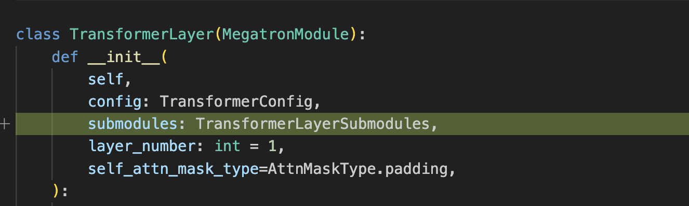
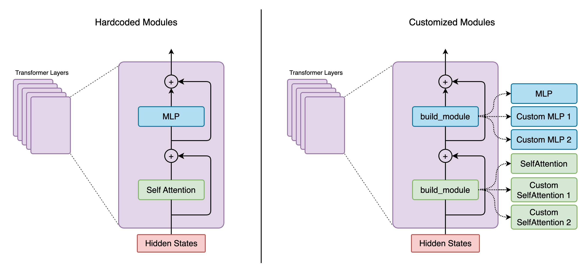
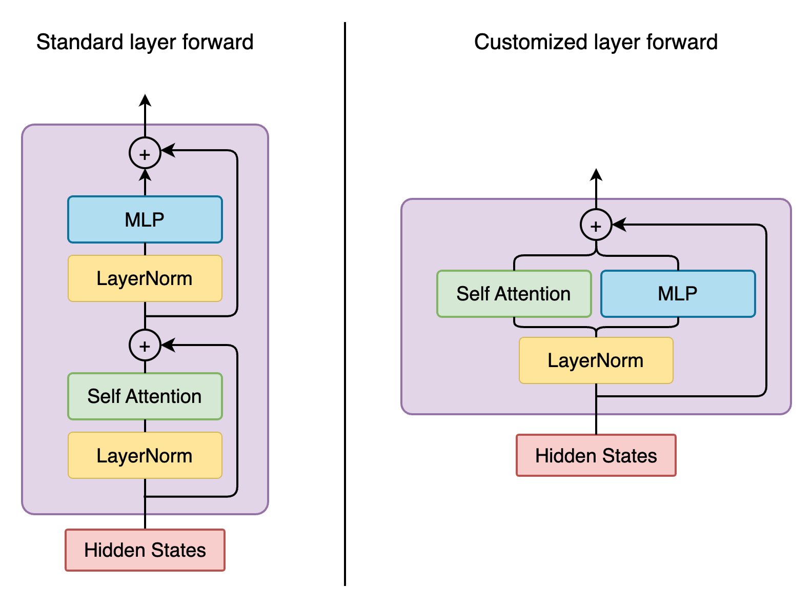

Megatron Core Customization
---------------------------

Megatron Core (Mcore) offers a range of functionalities, one of the most notable being the ability for users to train Transformer models on an epic scale. Users can enable decoder/GPT variants by using ``megatron.core.models.gpt.GPTModel`` (Mcore GPTModel) to initialize the model, and then pretrain/load weights into the model. Mcore GPTModel adopts the typical GPT structure, beginning with embedding layer, positional encoding, followed by a series of transformer layers and finally output layer.

In the rapidly advancing world of LLM, it is increasingly important to experiment with various configurations of the transformer block within each transformer layer. Some of these configurations involve the use of different module classes. While it is possible to achieve this with “if else” statements in Mcore, doing so makes Mcore less readable and less maintainable in the long term. Mcore spec intends to solve this challenge by allowing users to specify a customization of the transformer block in each layer, without modifying code in mcore. 
We will dive more into the details of mcore spec in the first section of this blog. Then, we will demonstrate the usefulness of mcore spec using Falcon as an example.

What is Mcore Spec
^^^^^^^^^^^^^^^^^^

The Mcore spec system requires a “specification” to define the initialization of the mcore GPTModel modules (such as layer, self_attention, MLP, etc.) and their submodules. This allows users to customize these components by providing their own specifications. 

Here is a diff snippet from the original merge request for mcore spec. We can see the extra parameter needed at initialization for mcore GPTModel (megatron/core/models/gpt/gpt_model.py):

Where the required ``transformer_layer_spec`` (for mcore GPTModel layer) looks like: ::

    gpt_layer_with_transformer_engine_spec = ModuleSpec(
        module=TransformerLayer,
        submodules=TransformerLayerSubmodules(
            self_attention=ModuleSpec(
                module=SelfAttention,
                params={"attn_mask_type": AttnMaskType.causal},
                submodules=SelfAttentionSubmodules(
                    linear_qkv=TELayerNormColumnParallelLinear,
                    dot_product_attention=TEDotProductAttention,
                    linear_proj=TERowParallelLinear,
                ),
            ),
            self_attn_bda=get_bias_dropout_add,
            mlp=ModuleSpec(
                module=MLP,
                submodules=MLPSubmodules(
                    linear_fc1=TELayerNormColumnParallelLinear, linear_fc2=TERowParallelLinear,
                ),
            ),
            mlp_bda=get_bias_dropout_add,
        ),
    )

The spec system introduces a new approach to module initialization. Here is a before-and-after comparison of self attention initialization (megatron/core/transformer/transformer_layer.py) as example:

.. image:: mr2.png
  :alt: 
  :width: 600px

Instead of hard coding the ``SelfAttention`` class, we are using a ``build_module`` function to build our ``self.self_attention`` inside the layer.
The initialization of a layer has become (megatron/core/transformer/transformer_block.py): ::

    def build_layer(layer_spec, layer_number):
        return build_module(layer_spec, config=self.config, layer_number=layer_number,)

instead of hard coding the ``TransformerLayer`` class.

There are several elements in mcore spec system we are covering in the following subsections.

Submodules
""""""""""
When building modules (such as transformer layers, attention or MLP), we need to provide a python dataclass to specify the submodules (if any) to use. Mcore GPTModel uses the ``TransformerLayerSubmodules`` as a template for layer submodules. Similarly, there are ``SelfAttentionSubmodules``, ``CrossAttentionSubmodules``, ``MLPSubmodules``, etc.

``TransformerLayerSubmodules`` is a python dataclass, listing all the possible customizable components that you may need in your transformer block: ::

    @dataclass
    class TransformerLayerSubmodules:
        input_layernorm: Union[ModuleSpec, type] = IdentityOp
        self_attention: Union[ModuleSpec, type] = IdentityOp
        self_attn_bda: Union[ModuleSpec, type] = IdentityFuncOp

        pre_cross_attn_layernorm: Union[ModuleSpec, type] = IdentityOp
        cross_attention: Union[ModuleSpec, type] = IdentityOp
        cross_attn_bda: Union[ModuleSpec, type] = IdentityFuncOp

        pre_mlp_layernorm: Union[ModuleSpec, type] = IdentityOp
        mlp: Union[ModuleSpec, type] = IdentityOp
        mlp_bda: Union[ModuleSpec, type] = IdentityFuncOp

All layer submodules are initialized as ``IdentityOp`` or ``IdentityFuncOp`` which allows the user to leave these modules as is without being modified. Mcore GPTModel’s ``TransformerLayer`` initializes every listed submodule. In the case you don’t need certain submodules, you can ignore it in your layer spec (which will be covered in the next section), leaving it ``IdentityOp`` (or ``IdentityFuncOp``).

ModuleSpec
""""""""""

ModuleSpec is the basic configurable building block of the spec system which enables nesting. This is perfect for ``TransformerLayer`` which could have multiple configurable submodules (like ``Attention``, ``MLP``, etc.). Next, we show how to create the spec for a module. Mcore provides ``ModuleSpec`` class (megatron/core/transformer/spec_utils.py) as shown below. The docstrings give descriptions of the components in a ModuleSpec. ::
    
    @dataclass
    class ModuleSpec:
        """This is a Module Specification dataclass.

        Specification defines the location of the module (to import dynamically)
        or the imported module itself. It also defines the params that need to be
        passed to initialize the module.

        Args:
            module (Union[Tuple, type]): A tuple describing the location of the
                module class e.g. `(module.location, ModuleClass)` or the imported
                module class itself e.g. `ModuleClass` (which is already imported
                using `from module.location import ModuleClass`).
            params (dict): A dictionary of params that need to be passed while init.
            submodules (type): A dataclass that contains the names of submodules that comprise the module (specified by this `ModuleSpec`) and their corresponding `ModuleSpec`s.

        """

        module: Union[Tuple, type]
        params: dict = field(default_factory=lambda: {})
        submodules: type = None

Remember how we create the mcore GPTModel layer spec: ::

    gpt_layer_with_transformer_engine_spec = ModuleSpec(
        module=TransformerLayer,
        submodules=TransformerLayerSubmodules(
            self_attention=ModuleSpec(
                module=SelfAttention,
                params={"attn_mask_type": AttnMaskType.causal},
                submodules=SelfAttentionSubmodules(
                    linear_qkv=TELayerNormColumnParallelLinear,
                    dot_product_attention=TEDotProductAttention,
                    linear_proj=TERowParallelLinear,
                ),
            ),
            self_attn_bda=get_bias_dropout_add,
            mlp=ModuleSpec(
                module=MLP,
                submodules=MLPSubmodules(
                    linear_fc1=TELayerNormColumnParallelLinear, linear_fc2=TERowParallelLinear,
                ),
            ),
            mlp_bda=get_bias_dropout_add,
        ),
    )

We are doing two things here

1. assigning the ``module``, which is the ``TransformerLayer`` class used in mcore GPTModel
2. initializing the ``TransformerLayerSubmodules`` with desired submodules overwriting the ``IdentityOp``/``IdentityFuncOps`` (whatever not specified here will remain as identity operations)

Notice that the ``self_attention`` module contains submodules within itself, so we create a ``ModuleSpec`` to initialize ``self_attention`` in the same way as a GPT layer.

Next step, build the modules.

Build Module
""""""""""""

``build_module`` in ``megatron/core/transformer/spec_utils.py`` builds the module according to the given config and spec. If the module in ``ModuleSpec`` is an instantiable class (among many other cases it handles), ``build_module`` tries to create an instance of the class using:

- all provided configuration (params in ``ModuleSpec``, args, kwargs passed to ``build_module``. Some configs are wrapped within ``TransformerConfig`` class)
- the ``submodules`` field in ``ModuleSpec``, if it is present, is passed as an argument to that submodule’s class so that it can be used to initialize those modules.

Let’s take layer initialization as an example. GPTModel passes the layer spec and the provided configs to ``TransformerBlock`` and layers are built using ``build_module``. Mcore GPTModel uses ``gpt_layer_with_transformer_engine_spec`` shown in the example above. According to the spec, ``module=TransformerLayer`` says the ``TransformerLayer`` class should be initialized with provided configs and the ``TransformerLayerSubmodules``. Inside the ``TransformerLayer.__init__``, layer submodules are built using build_module.

Customization Examples
^^^^^^^^^^^^^^^^^^^^^^
Using Mcore Spec, we can customize model initialization and model forward.

Let’s take Falcon as an example to see how to create its layers using mcore GPTModel with spec. There are several differences between a Falcon transformer layer and a conventional GPTModel transformer layer. Customizing these Falcon model variants would be difficult to achieve without mcore spec.

- Some Falcon variants use parallel attention where the attention and MLP are parallel instead of sequential
- Some Falcon variants have the output of ``input_layernorm`` fed to both MLP and self attention in parallel, therefore we cannot use the default fused layernorm + linear ``TELayerNormColumnParallelLinear`` class in Falcon layer spec
- Some Falcon variants have one ``input_layernorm`` before attn and another ``mlp_layernorm`` before MLP
- Some Falcon variants have an extra ``post_self_attn_layernorm`` submodule
  

Customizing model initialization
""""""""""""""""""""""""""""""""
Here we show how modules can be customized at initialization using spec:

For the Falcon example, we instantiate the ``TransformerLayerSubmodule`` dataclass and manually add the extra attribute - ``post_self_attn_layernorm`` (A cleaner alternative could also be to subclass ``TransformerLayerSubmodules`` dataclass and then add to it another attribute - ``post_self_attn_layernorm``). We specify the classes/modules we want for each submodule in our falcon layer. In the end, we specify the layer class to be our own ``FalconTransformerLayer`` and pass in the submodules to create the ``ModuleSpec``. ::
    
    def get_falcon_layer_spec() -> ModuleSpec:
        falcon_submodules = TransformerLayerSubmodules(
            input_layernorm=TENorm,
            self_attention=ModuleSpec(
                module=SelfAttention,
                params={"attn_mask_type": AttnMaskType.causal},
                submodules=SelfAttentionSubmodules(
                    linear_qkv=TEColumnParallelLinear,
                    core_attention=TEDotProductAttention,
                    linear_proj=TERowParallelLinear,
                ),
            ),
            self_attn_bda=get_bias_dropout_add,
            pre_mlp_layernorm=TENorm,
            mlp=ModuleSpec(
                module=MLP, submodules=MLPSubmodules(linear_fc1=TEColumnParallelLinear, linear_fc2=TERowParallelLinear,),
            ),
            mlp_bda=get_bias_dropout_add,
        )
        # falcon-rw-1b/7b uses post_self_attn_layernorm that is not included in TransformerLayerModules.
        falcon_submodules.post_self_attn_layernorm = TENorm
        return ModuleSpec(module=FalconTransformerLayer, submodules=falcon_submodules)

Customizing model forward
"""""""""""""""""""""""""

Here is a diagram showing the forward functions of conventional Mcore GPTModel v.s. Falcon. 

To achieve that, we create ``FalconTransformerLayer``, subclass it from mcore ``TransformerLayer`` and override:

- ``__init__``: we can reuse most of TransformerLayer's initialization, but we need to handle the creation of the extra ``post_self_attn_layernorm``
- ``forward()``: to reconfigure the computation graph

It is necessary to subclass your own transformer layer from mcore ``TransformerLayer`` class.

Full implementation from NeMo repo: ::

    class FalconTransformerLayer(TransformerLayer):
        def __init__(
            self,
            config: TransformerConfig,
            submodules: TransformerLayerSubmodules,
            layer_number: int = 1,
            self_attn_mask_type=AttnMaskType.padding,
        ):
            super().__init__(config=config, submodules=submodules, layer_number=layer_number)

            if hasattr(self.config, 'new_decoder_architecture'):
                self.new_decoder_architecture = self.config.new_decoder_architecture
            else:
                self.new_decoder_architecture = None
            if hasattr(self.config, 'parallel_attention'):
                self.parallel_attention = self.config.parallel_attention
            else:
                self.parallel_attention = None

            if self.new_decoder_architecture or self.parallel_attention:
                self.post_self_attn_layernorm = None
            else:
                self.post_self_attn_layernorm = build_module(
                    submodules.post_self_attn_layernorm,
                    config=self.config,
                    hidden_size=self.config.hidden_size,
                    eps=self.config.layernorm_epsilon,
                )
            if self.new_decoder_architecture:
                self.pre_mlp_layernorm = build_module(
                    submodules.pre_mlp_layernorm,
                    config=self.config,
                    hidden_size=self.config.hidden_size,
                    eps=self.config.layernorm_epsilon,
                )
            else:
                self.pre_mlp_layernorm = None

        def forward(
            self,
            hidden_states,
            attention_mask,
            context=None,
            context_mask=None,
            rotary_pos_emb=None,
            inference_params=None,
        ):

            residual = hidden_states

            mlp_ln_output = None
            if self.new_decoder_architecture:
                mlp_ln_output = self.pre_mlp_layernorm(hidden_states)

            input_layernorm_output = self.input_layernorm(hidden_states)

            input_mlp_ln = input_layernorm_output

            attention_output_with_bias = self.self_attention(
                input_layernorm_output,
                attention_mask=attention_mask,
                inference_params=inference_params,
                rotary_pos_emb=rotary_pos_emb,
            )

            with self.bias_dropout_add_exec_handler():
                hidden_states = self.self_attn_bda(self.training, self.config.bias_dropout_fusion)(
                    attention_output_with_bias, residual, self.config.hidden_dropout
                )

            if not self.new_decoder_architecture:
                if self.parallel_attention:
                    layernorm_output = input_mlp_ln
                else:
                    residual = hidden_states
                    layernorm_output = self.post_self_attn_layernorm(hidden_states)

            else:
                layernorm_output = mlp_ln_output

            mlp_output_with_bias = self.mlp(layernorm_output)

            # falcon specific:
            if self.new_decoder_architecture or self.parallel_attention:
                mlp_output = mlp_output_with_bias[0]
                attn_output = attention_output_with_bias[0]
                mlp_output_without_bias = mlp_output + attn_output
                mlp_output_with_bias = (mlp_output_without_bias, None)

            with self.bias_dropout_add_exec_handler():
                hidden_states = self.mlp_bda(self.training, self.config.bias_dropout_fusion)(
                    mlp_output_with_bias, residual, self.config.hidden_dropout
                )

            output = make_viewless_tensor(inp=hidden_states, requires_grad=hidden_states.requires_grad, keep_graph=True)

            return output, context
