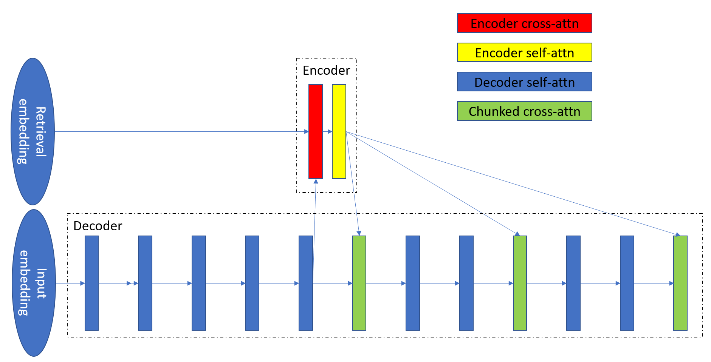

NeMo RETRO Model
================

The Retrieval-Enhanced Transformer (RETRO) model is an autoregressive language model that takes into account document chunks retrieved from a large 
corpus when making predictions. The RETRO model has a similar architecture to the GPT model, but it includes an encoder that encodes the retrieved 
context and cross-attention layers that integrate the context to improve the model's output. Below is a simple diagram of the RETRO model architecture.

For more detailed information on the model, please refer to the `RETRO paper <https://arxiv.org/abs/2112.04426>`_ :cite:`nlp-retro-borgeaud2021improving` by Deepmind. 
The NeMo RETRO Model is an open-source implementation of the paper, and it has the following differences/features compared to Deepmind's proposed implementation:

1. The NeMo RETRO Model is built on top of NeMo Megatron code, allowing for efficient training of large language models in a cluster environment.
2. The NeMo RETRO Model uses `Faiss <https://github.com/facebookresearch/faiss>`_ :cite:`nlp-retro-jegou2022faiss` as the K$N search library, which can be accelerated by GPUs. 
3. The NeMo RETRO uses `RoPe relative positional encoding <https://arxiv.org/abs/2104.09864>`_ :cite:`nlp-retro-su2021roformer`. 
4. The NeMo RETRO uses `SentenceTransformers <https://www.sbert.net>`_ :cite:`nlp-retro-reimers2019sentence` as the retriever encoder.
5. The NeMo RETRO supports `mu-Transfer <https://openreview.net/pdf?id=Bx6qKuBM2AD>`_ :cite:`nlp-retro-yang2022tensor`, allowing for scalable training of the RETRO model via Zero-Shot Hyperparameter Transfer.

Quick start
************
Steps below demonstrate training and evaluating a NeMo RETRO model

Data pre-processing
-------------------

Step 1: Collect training data
^^^^^^^^^^^^^^^^^^^^^^^^^^^^^

The RETRO model uses two types of data: training data, which typically consists of 64-token chunks, and retrieval data, which typically consists of 128-token chunks.
The training data is used to train the model, while the retrieval data is used to supplement the language model. 
It's possible to use the same data for both training and retrieval, as long as duplicates are removed properly, as described below. 
Both types of data are stored in a loose JSON format, with each line containing a single text sample. For example:

.. code-block:: json
    {"src": "www.nvidia.com", "text": "The quick brown fox", "type": "Eng", "id": "0", "title": "First Part"}
    {"src": "The Internet", "text": "jumps over the lazy dog", "type": "Eng", "id": "42", "title": "Second Part"}
The name of the text field of the json can be changed by using the ``--json-key`` flag in ``preprocess_data_for_megatron.py``.  The other metadata are optional and are not used in training.

Step 2: Convert training data into memory map format
^^^^^^^^^^^^^^^^^^^^^^^^^^^^^^^^^^^^^^^^^^^^^^^^^^^^

The loose json is then processed into a binary format for training and retrieval. To convert the json into mmap, cached index file. 
Set the ``--dataset-impl`` flag to `retmmap`, which is the memory map format dedicated for RETRO model. 

An example script to prepare data for RETRO training is:

.. code-block:: bash
    python scripts/nlp_language_modeling/preprocess_data_for_megatron.py \
        --input=/dataset/pubmed_train.jsonl \
        --json-keys=text \
        --tokenizer-library=megatron \
        --apply-ftfy \
        --dataset-impl=retmmap \
        --merge-file=/dataset/gpt2-merges.txt \
        --vocab-file=/dataset/gpt2-vocab.json \
        --tokenizer-type=GPT2BPETokenizer \
        --output-prefix=/result/pubmed_train \
        --need-pad-id \
        --append-eod \
        --retrieval-db \
        --chunk_size=64 \
        --workers=48
The RETRO model processes chunked documents using 64 tokens as the default chunk size. The RETRO memory map dataset will add padding 
tokens to the end of each document to make it a multiple of 64. The ``--need-pad-id`` argument adds a padding token to the tokenizer
if it doesn't already have one. The ``--append-eod`` argument controls whether to add ``end-of-document`` tokens to the preprocessed 
data, and the ``--retrieval-db`` argument indicates whether to create a retrieval database for the preprocessed data. If ``--retrieval-db``
is used, it will add an additional 64 padding tokens at the end of the document. The ``--chunk_size`` and ``--workers`` arguments 
control the size of the data chunks to be processed and the number of worker processes to use, respectively.

Following is the retro memory map index data format:

.. list-table::
   :widths: 25 25 25 25 25 25

   * - 'MMIDRET\x00\x00' (header 9 bytes)
     - 1 (version 8 byte)
     - dtype code :sup:`1` (1 byte)
     - sentence count (8 byte)
     - chunk size (8 byte)
     - chunk count (8 byte)
   * - retrieved db :sup:`2` (1 byte)
     - number of tokens for each of sentences ( int32 array)
     - start of sentence address in byte (int64 array)	
     - start of chunk id (int64 array)
     - chunk id address in byte (int64 array)
     -

:sup:`1` 1: np.uint8, 2: np.int8, 3: np.int16, 4: np.int32, 5: np.int64, 6: np.float, 7: np.double, 8: np.uint16

:sup:`2` When building the indexed dataset, we pad each sentence to be a multiple of ``chunk_size`` with ``pad_id`` from the tokenizer. 
The number of tokens for each sentence includes the padded token ids. For retrieval data, there is an extra ``chunk_size`` padding at 
the end of each sentence, and the ``retrieved_db`` flag is set to True. However, the number of tokens for each sentence excludes this extra ``chunk_size`` padding.

Following is the retro memory map binary data format:

.. list-table::
   :widths: 65

   * - token id array for sentence 0,1, 2 ... (dtype :sup:`3` array)

:sup:`3` np.uint16 vocab_size < 65500 else np.int32

Step 3: Create Faiss index for retrieval data
^^^^^^^^^^^^^^^^^^^^^^^^^^^^^^^^^^^^^^^^^^^^^^

After creating the memory map retrieval data binary file and index files, we can build a Faiss index that can quickly find the K-nearest neighbors of a given
chunk ID based on a query embedding vector. Because the retrieval data is typically very large, we break this process down into three steps.

Step 3.1: Train the Faiss index structure
~~~~~~~~~~~~~~~~~~~~~~~~~~~~~~~~~~~~~~~~~

In this step, it uses a subset of the retrieval data to train a empty Faiss index. An example script is:

.. code-block:: bash
    python scripts/nlp_language_modeling/build_retrieval_index.py \
        --input_file=/result/pubmed_train_text_document  \
        --tokenizer-library=megatron \
        --tokenizer-type=GPT2BPETokenizer \
        --merge-file=/dataset/gpt2-merges.txt \
        --vocab-file=/dataset/gpt2-vocab.json \
        --percent=1.0 \
        --sentence_transformer_model=all-mpnet-base-v2 \
        --batch_size=1024 \
        --train_index_size=2000000 \
        --workers=2 \
        --devices=0,1,2,3,4,5,6,7 \
        --stage=0 \
        --output_file=/result/pubmed_faiss_learn.index
This command is used to build an empty Faiss index using the 2000000 training data in ``pubmed_train_text_document``. 
The ``all-mpnet-base-v2`` sentence transformer model is used to encode the chunk tokens into an embedding vector. 
The index will be saved in the result directory as ``pubmed_faiss_learn.index``. This command specifies using 8 GPUs to train the Faiss index.

Step 3.2: Add retrieval data into sharding index
~~~~~~~~~~~~~~~~~~~~~~~~~~~~~~~~~~~~~~~~~~~~~~~~

This step adds all the retrieval data to the empty Faiss index created in the previous step. An example script is:

.. code-block:: bash
    python scripts/nlp_language_modeling/build_retrieval_index.py \
        --input_file=/result/pubmed_train_text_document  \
        --tokenizer-library=megatron \
        --tokenizer-type=GPT2BPETokenizer \
        --merge-file=/dataset/gpt2-merges.txt \
        --vocab-file=/dataset/gpt2-vocab.json \
        --percent=1.0 \
        --sentence_transformer_model=all-mpnet-base-v2 \
        --batch_size=1024 \
        --shard_id=0 \
        --total_shards=10 \
        --workers=2 \
        --devices=0,1,2,3,4,5,6,7 \
        --stage=1 \
        --learned_index=/result/pubmed_faiss_learn.index \
        --output_file=/result/pubmed_faiss_shard0.save
This command breaks the retrieval data into ``total_shards`` shards and adds the data in the shard specified by ``shard_id``. 
The result is saved to a file specified by ``output_file``. In the example above, 10 sharding indexes are created.

Step 3.3: Merge the sharding indexes into final Faiss index
~~~~~~~~~~~~~~~~~~~~~~~~~~~~~~~~~~~~~~~~~~~~~~~~~~~~~~~~~~~

This step merges all the sharding indexes created in the previous step into the final Faiss index.  An example script is:

.. code-block:: bash
    python scripts/nlp_language_modeling/build_retrieval_index.py \
        --stage=2 \
        --devices=0,1,2,3,4,5,6,7 \
        --learned_index=/result/pubmed_faiss_learn.index \
        --shard_index_input=/result/pubmed_faiss_shard \
        --output_file=/result/pubmed_faiss_final.index
Step 4: Build KNN index
^^^^^^^^^^^^^^^^^^^^^^^

During training, it is inefficient to run a query to find the K-nearest neighbor chunk IDs for each training data point. 
This can be pre-calculated by building a KNN index before training. The KNN index maps the training data chunk IDs to the K-nearest neighbor chunk IDs 
in the retrieval data. As with building the Faiss index, this process is divided into two steps.

Following is the KNN index data format:

.. list-table::
   :widths: 25 25 25 25 45

   * - 'KNNRETM\x00\x00' (header 9 bytes)
     - 1 (version 8 byte)
     - K number of neighbors (8 byte)
     - Number chunks (8 byte)
     - Map to K retrieval data chunk IDs, shape (number_chunks, K) ( int64 array)

Step 4.1: Build KNN sharding index
~~~~~~~~~~~~~~~~~~~~~~~~~~~~~~~~~~

The KNN index is built using the memory-mapped training data created by the ``preprocess_data_for_megatron.py`` script and the Faiss index 
file for the retrieval data built by the ``build_retrieval_index.py`` script.

An example script is:

.. code-block:: bash
    python scripts/nlp_language_modeling/build_knn_map_index.py \
        --input_file=/result/pubmed_eval_text_document  \
        --tokenizer-library=megatron \
        --tokenizer-type=GPT2BPETokenizer \
        --merge-file=/dataset/gpt2-merges.txt \
        --vocab-file=/dataset/gpt2-vocab.json \
        --process_chunk_size=10000 \
        --sentence_transformer_model=all-mpnet-base-v2 \
        --batch_size=1024 \
        --K_neighbors=50 \
        --workers=2 \
        --devices=0,1,2,3,4,5,6,7 \
        --remove_duplicate \
        --dedup_margin=70 \
        --nprobe=100 \
        --shard_id=0 \
        --total_shards=10 \
        --stage=1 \
        --output_file=/dataset/pubmed_knn_shard0.save \
        --faiss_index=/result/pubmed_faiss_final.index
In this example, the training data is broken into ``total_shards`` shards, and the KNN index is calculated for the shard specified by ``shard_id``. 
The result is saved to a file specified by ``output_file``. In the example above, 10 KNN sharding indexes are created.

Use the ``remove_duplicate`` flag if the training data and retrieval data are the same to remove neighbors from the same document.

Step 4.2: Merge KNN sharding index into final KNN index
~~~~~~~~~~~~~~~~~~~~~~~~~~~~~~~~~~~~~~~~~~~~~~~~~~~~~~~~

An example script is:

.. code-block:: bash
    python scripts/nlp_language_modeling/build_knn_map_index.py  \
    --stage=2 \
    --output_file=pubmed_knn_final.save \
    --shard_index_input=pubmed_knn_shard
Train NeMo RETRO Model
-----------------------

Once the training data, retrieval data, KNN index, and Faiss index are prepared, we are ready to train the RETRO model. In the NeMo implementation, 
the RETRO model can be pre-trained with or without the `mu-Transfer <https://openreview.net/pdf?id=Bx6qKuBM2AD>`_ :cite:`nlp-retro-yang2022tensor` feature. We will introduce both ways.

The table below lists some of the common parameters that can be configured for model pre-training.

+----------------------------------+-------------+----------------------------------------------------------------------------------------+
| **Parameter**                    | **Default** | **Description**                                                                        |
+==================================+=============+========================================================================================+
| model.micro_batch_size           | 4           | the micro batch size used for training                                                 |
+----------------------------------+-------------+----------------------------------------------------------------------------------------+
| model.tensor_model_parallel_size | 1           | tensor model parallel size                                                             |
+----------------------------------+-------------+----------------------------------------------------------------------------------------+
| model.encoder_seq_length         | 2048        | token sequence length                                                                  |
+----------------------------------+-------------+----------------------------------------------------------------------------------------+
| model.chunk_size                 | 64          | the chunk size used to retrieve                                                        |
+----------------------------------+-------------+----------------------------------------------------------------------------------------+
| model.enc_num_layers             | 4           | total number of encoder layers                                                         |
+----------------------------------+-------------+----------------------------------------------------------------------------------------+
| model.dec_num_layers             | 6           | total number of decoder layers                                                         |
+----------------------------------+-------------+----------------------------------------------------------------------------------------+
| model.enc_cross_attention        | [3]         | layer numbers for cross attention in encoder                                           |
+----------------------------------+-------------+----------------------------------------------------------------------------------------+
| model.dec_cross_attention        | [3,4,5]     | layer numbers for chunked cross attention in decoder                                   |
+----------------------------------+-------------+----------------------------------------------------------------------------------------+
| model.add_position_embedding     | FALSE       | whether to add the absolute position encoding                                          |
+----------------------------------+-------------+----------------------------------------------------------------------------------------+
| model.hidden_size                | 768         | model hidden size                                                                      |
+----------------------------------+-------------+----------------------------------------------------------------------------------------+
| model.ffn_hidden_size            | 3072        | model FFN hidden size. Usually 4 * hidden_size                                         |
+----------------------------------+-------------+----------------------------------------------------------------------------------------+
| model.num_attention_heads        | 12          | number of attention heads                                                              |
+----------------------------------+-------------+----------------------------------------------------------------------------------------+
| model.init_method_std            | 0.02        | standard deviation of the zero mean normal distribution used for weight initialization |
+----------------------------------+-------------+----------------------------------------------------------------------------------------+
| model.hidden_dropout             | 0.1         | dropout probability for hidden state transformer                                       |
+----------------------------------+-------------+----------------------------------------------------------------------------------------+
| model.attention_dropout          | 0.1         | dropout probability in the attention layer                                             |
+----------------------------------+-------------+----------------------------------------------------------------------------------------+
| model.ffn_dropout                | 0           | dropout probability in the feed-forward layer                                          |
+----------------------------------+-------------+----------------------------------------------------------------------------------------+

Option 1: Train the NeMo RETRO model *without* mu-Transfer
^^^^^^^^^^^^^^^^^^^^^^^^^^^^^^^^^^^^^^^^^^^^^^^^^^^^^^^^^^^^

An example RETRO pre-training script is:

.. code-block:: bash
    python examples/nlp/language_modeling/megatron_retro_pretraining.py \
        trainer.devices=8 \
        trainer.num_nodes=2 \
        trainer.accelerator=gpu \
        trainer.max_steps=800000 \
        trainer.precision=16 \
        exp_manager.exp_dir=/result/retro_model \
        model.apply_query_key_layer_scaling=False \
        model.tensor_model_parallel_size=8 \
        model.optim.name=adamw \
        model.enc_num_layers=2 \
        model.dec_num_layers=32 \
        model.enc_cross_attention=[0] \
        model.dec_cross_attention=[8,11,14,17,20,23,26,29,31] \
        model.hidden_size=4096 \
        model.ffn_hidden_size=16384 \
        model.num_attention_heads=32 \
        model.tokenizer.merge_file=/dataset/gpt2-merges.txt \
        model.tokenizer.vocab_file=/dataset/gpt2-vocab.json \
        model.data.data_prefix=[/result/pubmed_eval_text_document] \
        model.data.knn_index=[dataset/pubmed_knn_final.save] \
        model.data.retrieval_prefix=/result/pubmed_eval_text_document \
        model.micro_batch_size=8
During the training, launch Tensorboard to monitor training like so:

.. code-block:: bash
    tensorboard --logdir /result/retro_model --bind_all
.. note:: Weights and Biases (WandB) is supported too. Add ``exp_manager.create_wandb_logger=True`` to the model training arguments to enable it.

After the training, the model nemo file can be found at the result checkpoint directory.

Option 2: Train the NeMo RETRO model *with* mu-Transfer
^^^^^^^^^^^^^^^^^^^^^^^^^^^^^^^^^^^^^^^^^^^^^^^^^^^^^^^^

`mu-Transfer <https://openreview.net/pdf?id=Bx6qKuBM2AD>`_ :cite:`nlp-retro-yang2022tensor` paper proposed a method to zero-shot transfer hyperparameter to train a larger model.
This can be done in 3 steps in NeMo RETRO implementation. 

Step 1. find optimal hyper parameter for a small base model
~~~~~~~~~~~~~~~~~~~~~~~~~~~~~~~~~~~~~~~~~~~~~~~~~~~~~~~~~~~~~

Use the pre-training code in Option 1, either manually or automatically ind a set of optimal hyperparameter for a small base RETRO 
model. This is can be done cheaply ans fast due to the small model size.

Step 2. calculate the shape file that can be used to run mu-Transfer 
~~~~~~~~~~~~~~~~~~~~~~~~~~~~~~~~~~~~~~~~~~~~~~~~~~~~~~~~~~~~~~~~~~~~~

The shape file determines which hyperparameters will be scaled up, allowing the model to adjust the learning rate, weight scaling factor, etc.

Here is an example shape file calculation script:

.. code-block:: bash
    python examples/nlp/language_modeling/megatron_retro_cal_shape.py \
        trainer.devices=8 \
        trainer.num_nodes=1 \
        trainer.accelerator=gpu \
        exp_manager.exp_dir=/result/retro_model \
        base_model.enc_num_layers=2 \
        delta_model.enc_num_layers=2 \
        base_model.dec_num_layers=32 \
        delta_model.dec_num_layers=32 \
        base_model.tensor_model_parallel_size=8 \
        delta_model.tensor_model_parallel_size=8 \
        base_model.dec_cross_attention=[8,11,14,17,20,23,26,29,31] \
        delta_model.dec_cross_attention=[8,11,14,17,20,23,26,29,31] \
        base_model.enc_cross_attention=[0] \
        delta_model.enc_cross_attention=[0] \
        base_model.hidden_size=768 \
        base_model.ffn_hidden_size=3072 \
        delta_model.hidden_size=96 \
        delta_model.ffn_hidden_size=384 \
        base_model.num_attention_heads=16 \
        delta_model.num_attention_heads=16 \
        model.shape_file=tp8_32depth_o1_rel_shape_info.yaml 
In this example, the ``base_model`` refers to the small base model for which an optimal set of hyperparameters has been determined. 
The ``delta_model`` refers to a model with certain hyperparameters that have been scaled up or down. In this case, 
the ``hidden_size`` and ``ffn_hidden_size`` have been changed in the ``delta_model``, allowing these two parameters to be scaled freely later.

Step 3. Pretrain mu-Transfer RETRO model
~~~~~~~~~~~~~~~~~~~~~~~~~~~~~~~~~~~~~~~~~

Once the shape file is created, we can start training a RETRO model.  The model training can be scale up freely using the hyperparameters 
specified by the delta model and the shape file. 

An example mu-Transfer pre-training script is:

.. code-block:: bash
    python examples/nlp/language_modeling/megatron_retro_mutransfer_pretrain.py \
        trainer.devices=8 \
        trainer.num_nodes=2 \
        trainer.accelerator=gpu \
        trainer.max_steps=500000 \
        trainer.precision=16 \
        exp_manager.exp_dir=/result/retro_model \
        model.apply_query_key_layer_scaling=False \
        model.tensor_model_parallel_size=8 \
        model.optim.name=muadamw \
        model.enc_num_layers=2 \
        model.dec_num_layers=32 \
        model.enc_cross_attention=[0] \
        model.dec_cross_attention=[8,11,14,17,20,23,26,29,31] \
        model.hidden_size=4096 \
        model.ffn_hidden_size=16384 \
        model.num_attention_heads=32 \
        model.tokenizer.merge_file=/dataset/gpt2-merges.txt \
        model.tokenizer.vocab_file=/dataset/gpt2-vocab.json \
        model.data.data_prefix=[/result/pubmed_eval_text_document] \
        model.data.knn_index=[dataset/pubmed_knn_final.save] \
        model.data.retrieval_prefix=/result/pubmed_eval_text_document \
        model.micro_batch_size=8 \
        model.shape_file=tp8_32depth_o1_rel_shape_info.yaml
.. note:: We have chosen to use ``muadamw`` as the optimizer for use with the mu-transfer method.  Currently, only ``muadam`` and ``muadamw`` are supported. 

Similarly to the pre-training in Option 1, the model nemo file can be found at the result checkpoint directory after training is complete.

Run NeMo RETRO Model Inference
-------------------------------

Once the NeMo RETRO model has been trained, we can put it into inference mode and experiment with it. 
During inference, we are not limited to the static Faiss index that we built earlier for KNN queries. 
We can feed any external data to the model as retrieval context. NeMo RETRO implementation supports dynamic retrieval service, 
allowing users to add, reset, and query new documents on the fly.

We have built a simple web client that makes it easy for users to play around with the model. Here is an example script to launch the server:

.. code-block:: bash
    python examples/nlp/language_modeling/megatron_retro_eval.py \
        trainer.devices=8 \
        trainer.num_nodes=1 \
        trainer.accelerator=gpu \
        trainer.precision=16 \
        retro_model_file=megatron_retro.nemo \
        tensor_model_parallel_size=8 \
        pipeline_model_parallel_size=1 \
        retrieval_service.sentence_bert.devices=\'0,1,2,3,4,5,6,7\' \
        retrieval_service.services.0.faiss_devices=\'0,1,2,3,4,5,6,7\' \
        retrieval_service.services.1.faiss_devices=\'0,1,2,3,4,5,6,7\' \
        retrieval_service.services.0.faiss_index=/result/pubmed_faiss_final.index \
        retrieval_service.services.0.retrieval_index=/result/pubmed_eval_text_document \
        retrieval_service.neighbors=2 \
        retrieval_service.pad_tokens=True \
        retrieval_service.store_retrieved=True \
        server=True \
        web_server=True \
        share=True \
        username=test \
        password=test123
Set the retro_model_file to use the nemo file generated in the pre-training step. After launching the server, copy-paste the URL from 
the terminal into your browser. Use the specified username and password to log in and have fun experimenting with the RETRO model.

References
************

.. bibliography:: ../../nlp_all.bib
    :style: plain
    :labelprefix: nlp-retro
    :keyprefix: nlp-retro-
