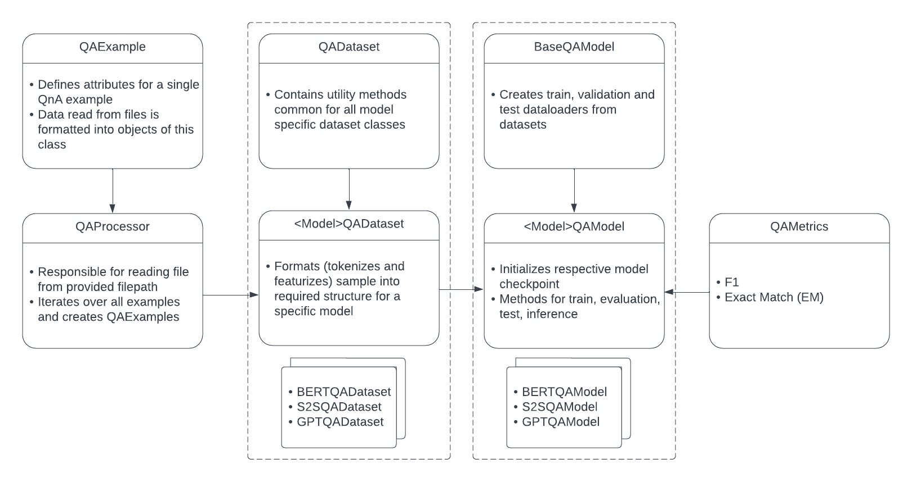

.. _question_answering:

Question Answering
==================

Given a context and a natural language query, we want to generate an answer for the query
Depending on how the answer is generated, the task can be broadly divided into two types:

1. Extractive Question Answering
2. Generative Question Answering

**Extractive Question Answering with BERT-like models**

Given a question and a context, both in natural language, predict the span within the context with a start and end position which indicates the answer to the question.
For every word in our training dataset the model predicts:

- likelihood this word is the start of the span 
- likelihood this word is the end of the span

**Generative Question Answering with S2S and GPT-like models**

Given a question and a context, both in natural language, generate an answer for the question. Unlike the BERT-like models, there is no constraint that the answer should be a span within the context.

Supported Tasks
---------------

+----------------------------------+-----------------+----------------------------------------------------------------------+------------------------------------------+
| **Task**                         |   **Models**    | **Supported Options for model.language_model.pretrained_model_name** | **Supported options for model.library**  |                                                                       
+----------------------------------+-----------------+----------------------------------------------------------------------+------------------------------------------+
| Extractive Question Answering    | BERTQAModel     | bert-{base, large}-{cased, uncased}, roberta{base, large}            | Huggingface, Megatron                    |
+----------------------------------+-----------------+----------------------------------------------------------------------+------------------------------------------+
| Generative Question Answering    | S2SQAModel      | t5-{small, base, large}, bart-{base, large}                          | Huggingface                              |
+----------------------------------+-----------------+----------------------------------------------------------------------+------------------------------------------+
|                                  | GPTQAModel      | gpt2, gpt2-{medium, large, xl}                                       | Huggingface                              |
+----------------------------------+-----------------+----------------------------------------------------------------------+------------------------------------------+

Available models
----------------

Following BERT-like models are available for Extractive Question-Answering

.. list-table::
   :widths: 5 10
   :header-rows: 1

   * - Model
     - Pretrained Checkpoint
   * - qa_squadv1.1_bertbase
     - https://ngc.nvidia.com/catalog/models/nvidia:nemo:qa_squadv1_1_bertbase
   * - qa_squadv2.0_bertbase
     - https://ngc.nvidia.com/catalog/models/nvidia:nemo:qa_squadv2_0_bertbase
   * - qa_squadv1.1_bertlarge
     - https://ngc.nvidia.com/catalog/models/nvidia:nemo:qa_squadv1_1_bertlarge
   * - qa_squadv2.0_bertlarge
     - https://ngc.nvidia.com/catalog/models/nvidia:nemo:qa_squadv2_0_bertlarge
   * - qa_squadv1.1_megatron_cased
     - https://ngc.nvidia.com/catalog/models/nvidia:nemo:qa_squadv1_1_megatron_cased
   * - qa_squadv2.0_megatron_cased
     - https://ngc.nvidia.com/catalog/models/nvidia:nemo:qa_squadv2_0_megatron_cased
   * - qa_squadv1.1_megatron_uncased
     - https://ngc.nvidia.com/catalog/models/nvidia:nemo:qa_squadv1_1_megatron_uncased
   * - qa_squadv2.0_megatron_uncased
     - https://ngc.nvidia.com/catalog/models/nvidia:nemo:qa_squadv2_0_megatron_uncased

Module Design
-------------

The module is decouple data and model components to support idependent integration of various model achitectures and datasets.
QAProcessor, QAExample, and the base QADataset modules are responsible for model-independent data handling utilites like loading SQuAD format dataset files and parsing examples.
<Model>QADataset modules handle model-specific data formatting.
Similarly, the BaseQAModel module handles common model tasks like creating dataloader, and the <Model>QAModel modules handle model architecture-specific functions like trainig, testing, and evaluation.

Configuration
-------------

The default sample model training configuration can be found at: `NeMo/examples/nlp/question_answering/conf/qa_conf.yaml`

The configuration defines parameters for the following main components:

- :code:`model.dataset`: parameters that describe the dataset being used, ex. max sequence length, max query length, max answer length
- :code:`model.train_ds`, :code:`model.validation_ds`, :code:`model.test_ds`: parameters for the dataloaders, ex. batch size, source filepath
- :code:`model.language_model`, :code:`model.tokenizer`: language model and the tokenizer to be used for initializing the model
- :code:`model.optim`: optimiation parameters, ex. learning rate, scheduler, weight decay
- :code:`model.token_classifier`: used only for the BERTQAModel, defines the span prediction head for extractive question answering
- :code:`trainer`: defines the training process, ex. number of gpus, epochs, etc.
- :code:`exp_manager`: describes the experiment manager for logging training progress and checkpointing

Arguments that very commonly need to be edited for all models and datasets

- :code:`do_training`: perform training or only testing
- :code:`trainer.devices`: number of GPUs (int) or list of GPUs e.g. [0, 1, 3]
- :code:`model.library`: library to load language model from [huggingface or megatron]
- :code:`model.language_model.pretrained_model_name`: pretrained QA model from ``list_available_models()`` or path to a ``.nemo`` file (Check the ``Available Models`` section for some of the available checkpoints)  
- :code:`model.language_model.lm_checkpoint`: specifying a trained checkpoint (.bin / .ckpt / .nemo)
- :code:`model.<train_ds/validation_ds/test_ds>.file`: filepath for loading respective datasets
- :code:`model.<train_ds/validation_ds/test_ds>.num_samples`: the number of samples to use from the training dataset (use ``-1`` to specify all samples)
- :code:`model.dataset.use_cache`: if ``True``, features will be loaded from a cache file if it exists and created features will be dumped to the cache file
- :code:`model.dataset.version_2_with_negative`: boolean indicating whether dataset contains unanswerable questions (yes if set to ``True``)
- :code:`model.dataset.check_if_answer_in_context`: boolean indicating whether the context spans that do not have the answer text in them should be considered as negative examples (set to ``True`` for datasets of extractive nature like SQuAD and ``False`` for datasets of generative nature like MS-MARCO)
- :code:`model.dataset.doc_stride`: stride for splitting long documents into chunks
- :code:`model.dataset.max_query_length`: questions exceeding this value will be truncated
- :code:`model.dataset.max_answer_length`: ground truth answers exceeding this value will be truncated
- :code:`model.dataset.max_seq_length`: maximum allowed sequence length for input to the model including context, query, and answer
- :code:`model.tokens_to_generate`: maximum answer tokens to be generated for the generative models

Data Format
-----------

The QA models expect datasets to be present in the SQuAD format. For using datasets other than the standard SQuAD v1.1 and v2.0, the datasets should be first converted into the SQuAD format.

The following is an example of the expected SQuAD data format (JSON file):

.. code::

    {
        "data": [
            {
                "title": "Super_Bowl_50",
                "paragraphs": [
                    {
                        "context": "Super Bowl 50 was an American football game to determine the champion of the National Football League (NFL) for the 2015 season. The American Football Conference (AFC) champion Denver Broncos defeated the National Football Conference (NFC) champion Carolina Panthers 24\u201310 to earn their third Super Bowl title. The game was played on February 7, 2016, at Levi's Stadium in the San Francisco Bay Area at Santa Clara, California. As this was the 50th Super Bowl, the league emphasized the \"golden anniversary\" with various gold-themed initiatives, as well as temporarily suspending the tradition of naming each Super Bowl game with Roman numerals (under which the game would have been known as \"Super Bowl L\"), so that the logo could prominently feature the Arabic numerals 50.",
                        "qas": [
                            {
                                "question": "Where did Super Bowl 50 take place?",
                                "is_impossible": "false",
                                "id": "56be4db0acb8001400a502ee",
                                "answers": [
                                    {
                                        "answer_start": "403",
                                        "text": "Santa Clara, California"
                                    }
                                ]
                            },
                            {
                                "question": "What was the winning score of the Super Bowl 50?",
                                "is_impossible": "true",
                                "id": "56be4db0acb8001400a502ez",
                                "answers": [
                                ]
                            }
                        ]
                    }
                ]
            }
        ]
    }

.. Note::

   For datasets of generative nature where the answer might not be an exact span within the context, the :code:`answer_start` field can be set to -1.

Downloading Datasets
--------------------

Following sections describes how to download the SQuAD datasets, along with an example of converting a non-SQuAD dataset (MS-MARCO) into the SQuAD format for the QA models.

**SQuAD Dataset**

To perform training of the Question Answering model on the SQuAD dataset, you must first download it from https://rajpurkar.github.io/SQuAD-explorer or run:

.. code::

    python NeMo/examples/nlp/question_answering/get_squad.py 

There are two versions: 

- SQuAD version 1.1, which does not contain questions without the answer and has 100,000+ question-answer pairs on 500+ articles.
- SQuAD version 2.0, which combines the 100,000 questions from SQuAD 1.1 with over 50,000 unanswerable questions. To do well with 
  SQuAD 2.0, a system must not only answer questions when possible, but also determine when no answer is supported by the paragraph 
  and abstain from answering.

After downloading the files, you should have a :code:`squad` data folder that contains the following four files for training and
evaluation:

.. code::
    
    .
    |--squad
         |-- v1.1/train-v1.1.json
         |-- v1.1/dev-v1.1.json
         |-- v2.0/train-v2.0.json
         |-- v2.0/dev-v2.0.json

**MS-MARCO Dataset**

MS-MARCO(Microsoft Machine Reading Comprehension) is a large scale dataset focused on machine reading comprehension, question answering, and passage ranking. MS-MARCO consists of 1,010,916 queries generated from real, anonymized Bing user queries. The contexts are extracted from real web documents and the answers are generated by humans.

For downloading the MS-MARCO dataset, Terms of Use need to be accepted at https://microsoft.github.io/msmarco/. 

The dataset files can be downloaded from: 
  - https://msmarco.blob.core.windows.net/msmarco/train_v2.1.json.gz
  - https://msmarco.blob.core.windows.net/msmarco/dev_v2.1.json.gz

The QA models expect data in SQuAD format. The MS-MARCO dataset is originally not in the SQuAD format. The dataset has the following structure:

.. code::
    
    {
        "answers":["A corporation is a company or group of people authorized to act as a single entity and recognized as such in law."],
        "passages":[
            {
                "is_selected":0,
                "url":"http:\/\/www.wisegeek.com\/what-is-a-corporation.htm",
                "passage_text":"A company is incorporated in a specific nation, often within the bounds of a smaller subset of that nation, such as a state or province. The corporation is then governed by the laws of incorporation in that state. A corporation may issue stock, either private or public, or may be classified as a non-stock corporation. If stock is issued, the corporation will usually be governed by its shareholders, either directly or indirectly."},
            ...
            }],
        "query":". what is a corporation?",
        "query_id":1102432,
        "query_type":"DESCRIPTION",
        "wellFormedAnswers":"[]"
    }

The conversion to SQuAD format can be performed using the following script:

.. code::

    python NeMo/examples/nlp/question_answering/convert_msmarco_to_squad_format.py \
        --msmarco_train_input_filepath=/path/to/msmarco_train_v2.1.json \
        --msmarco_dev_input_filepath=/path/to/msmarco_dev_v2.1.json \
        --converted_train_save_path=/path/to/msmarco_squad_format_train.json \
        --converted_dev_save_path=/path/to/msmarco_squad_format_dev.json \
        --exclude_negative_samples=False \
        --keep_only_relevant_passages=False

.. Note::

   - setting :code:`exclude_negative_samples` to ``True`` will exclude samples from the MS-MARCO dataset that do not have a answer
   - setting :code:`keep_only_relevant_passages` to ``True`` will exclude passages that have ``is_selected=0`` in the MS-MARCO dataset

Training, Validation, Testing 
-----------------------------

A step-by-step guide to training and testing QA models, as well as running inference can be found at `NeMo/tutorials/nlp/Question_Answering.ipynb`. Following is an example of training a QA model using the example script provided at `NeMo/examples/nlp/question_answering/question_answering.py`:

.. code:: 

    python NeMo/examples/nlp/question_answering/question_answering.py \
        do_training=true \
        model.train_ds.file=<PATH_TO_DATASET> \
        model.validation_ds.file=<PATH_TO_DATASET> \
        model.test_ds.file=<PATH_TO_DATASET> \
        model.train_ds.batch_size=16 \
        model.train_ds.num_samples=-1 \
        model.validation_ds.batch_size=16 \
        model.validation_ds.num_samples=-1 \
        model.test_ds.num_samples=16 \
        model.test_ds.batch_size=-1 \
        model.language_model.pretrained_model_name=<PRETRAINED_MODEL_NAME> \
        model.dataset.use_cache=false \
        model.dataset.version_2_with_negative=true \
        model.dataset.check_if_answer_in_context=true \
        trainer.max_epochs=3 \
        trainer.max_steps=-1 \
        trainer.precision=16 \
        trainer.devices=[0] \
        trainer.accelerator="gpu"

.. Note::

   - :code:`version_2_with_negative` should be set based on whether the dataset contains unanswerable questions or not, ex. set to ``True`` for SQuAD v2.0 and ``False`` for SQuAD v1.1
   - :code:`check_if_answer_in_context` should be set according to the extractive or generative nature of the dataset, ex. set to ``True`` for SQuAD datasets and ``False`` for the MS-MARCO dataset
   - :code:`do_training` can be set to ``False`` for running only testing on the test dataset without training

Following is an example of running inference using the example script at `NeMo/examples/nlp/question_answering/question_answering.py`:

.. code:: 

    python NeMo/examples/nlp/question_answering/question_answering.py \
        pretrained_model=<PRETRAINED_MODEL> \
        do_training=false \
        model.test_ds.file=<PATH_TO_DATASET> \
        model.test_ds.num_samples=1 \
        model.test_ds.batch_size=-1 \
        trainer.devices=[0] \
        trainer.accelerator="gpu"

During evaluation of the :code:`validation_ds` and :code:`test_ds`, the script generates the following metrics:

- :code:`Exact Match (EM)`
- :code:`F1`

More details about these metrics can be found `here <https://en.wikipedia.org/wiki/F-score>`__.
