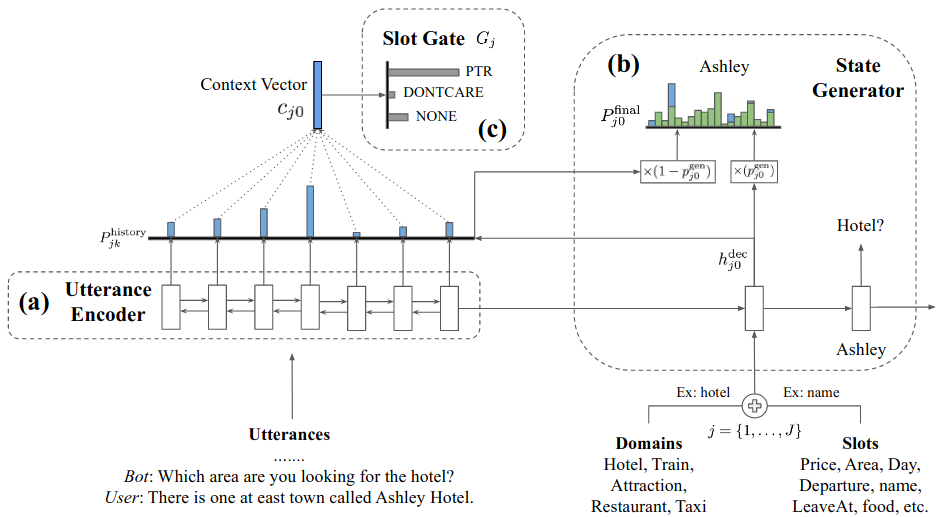

Tutorial
========

Introduction
------------

The goal of **Dialog State Tracking (DST)** :cite:`nlp-dst-henderson2015machine` \
is to build a representation of the status of the ongoing conversation \
being a sequence of utterances exchanged between dialog participants. \
In another words, the goal of DST system is to capture user goals and intentions and encode them as a set of \
**slots** along with the corresponding **values**.

.. figure:: dst_multiwoz_example.png

   Fig. 1: An exemplary, multi-domain dialog along with the associated state tracking (source: \
   :cite:`nlp-dst-wu2019transferable`)

In this tutorial we will focus on a multi-domain dialogue MultiWOZ dataset :cite:`nlp-dst-budzianowski2018multiwoz` \
and show how one can train a TRADE model :cite:`nlp-dst-wu2019transferable`, \
being one of the recent, state of the art models. \
**Multi-domain** setting introduces several challanges, with the most important coming from the need for \
**multi-turn mapping**. In a **single-turn mapping** scenario the (**domain**, **slot**, **value**) triplet can be \
inferred from a single turn. In multi-turn this assumption does not hold and the DST system must infer those from \
multiple turns, possibly spanning over several different domains.

The MultiWOZ Dataset
--------------------

The Multi-Domain Wizard-of-Oz dataset (`MultiWOZ`_) is a collection of human-to-human conversations spanning over \
7 distinct domains and containing over 10,000 dialogues.
The original MultiWOZ 2.0 dataset was introduced in :cite:`nlp-dst-budzianowski2018multiwoz`.
However, in this tutorial we will utilize MultiWOZ 2.1  :cite:`nlp-dst-eric2019multiwoz`, which is an updated version of MultiWOZ 2.0. They have fixed several issues with the original dataset including errors in states, utterances, value canonicalization etc.). Our model can also get trained on MultiWOZ 2.0.

.. _MultiWOZ: https://www.repository.cam.ac.uk/handle/1810/294507

The MultiWOZ dataset covers the following domains:
1. restaurant
2. hotel
3. attraction
4. taxi
5. train
6. hospital
7. police.

This division propagates further on the type of intents:
* inform (∗)
* request (∗)
* select (123)
* recommend (123)
* not found (123)
* request booking info (123)
* offer booking (1235)
* inform booked (1235)
* decline booking (1235)
* welcome (∗)
* greet (∗)
* bye (∗)
* reqmore (∗).

As well as slots:
* inform (∗)
* address (∗)
* postcode (∗)
* phone (∗)
* name (1234)
* no of choices (1235)
* area (123)
* pricerange (123)
* type (123)
* internet (2)
* parking (2)
* stars (2)
* open hours (3)
* departure (45)
* destination (45)
* leave after (45)
* arrive by (45)
* no of people (1235)
* reference no. (1235)
* trainID (5)
* ticket price (5)
* travel time (5)
* department (7)
* day (1235)
* no of days (123).

Please note that some of the actions and slots are associated with particular domain(s), whereas some are universal, \
i.e. domain independent. The latter ones are denoted with (∗).

MultiWOZ offers 10,438 dialogues, with 115,434 turns in total. \
Dialogues are generally classified into single and multi-domain dialogues. \
Dialogue length distribution is varying from 1 to 31, with around 70%of dialogues have more than 10 turns. \
The average number of turns are 8.93 and 15.39 for single and multi-domain dialogues. \

Each dialogue consists of a goal, multiple user and system utterances as well as a belief state and set of dialogue \
acts with slots per turn. Additionally, each dialog is supported with a task description. \
Moreover, it contains both system and user dialogue act annotations (the latter introduced in MultiWOZ 2.1).

The TRADE model
---------------

The **TRA**\nsferable **D**\ialogue stat\ **E** generator  (TRADE)  is a model designed specially for the multi-domain \
task-oriented dialogue state tracking problem. \
The model generates dialogue states from utterances and history. It learns embeddings for domains and slots, and also \
benefits from copy mechanism to facilitate knowledge transfer between domains. It enables the model to predict
\(**domain**, **slot**, **value**) triplets not encountered during training in a given domain.

   Fig. 2: Architecture of the TRADE model (source: :cite:`nlp-dst-wu2019transferable`)

The model is composed of an three main components:

 * an **utterance encoder**,
 * a **slot gate**, and
 * a **state generator**.  

The **utterance encoder** is a bi-directional Gated Recurrent Unit (GRU), returning both \
context words and and an aggregated context vector encoding the whole dialogue history.

The **state generator** also uses GRU to predict the value for each(domain, slot) pair. Generator employ a soft-gated \
pointer-generator copying to combine a **distribution over the vocabulary** and a **distribution over the dialogue \
history** into a single output distribution.

Finally, the **slot gate** is a simple classifier that maps a context  vector taken from the encoder hidden states \
to a probability  distribution  over three classes: *ptr*, *none*,  and *dontcare*.

Data Pre-processing
-------------------

First, you need to download `MULTIWOZ2.1.zip` from the `MultiWOZ2.1`_ project website. It contains the data for \
MultiWOZ 2.1 dataset. Alternatively, you can download `MULTIWOZ2.zip` compressed file from `MultiWOZ2.0`_ which \
contain the older version of this dataset.

.. _MultiWOZ2.1: https://www.repository.cam.ac.uk/handle/1810/294507

.. _MultiWOZ2.0: https://www.repository.cam.ac.uk/handle/1810/280608

Next, we need to preprocess and reformat the dataset, what will result in division of data into three splits:

 * traininig split (8242 dialogs in the ``train_dials.json`` file)
 * validation split (1000 dialogs in the ``val_dials.json`` file)
 * test split (999 dialogs in the ``test_dials.json`` file)

In order to preprocess the MultiWOZ dataset you can use the provided `process_multiwoz`_ script:

.. _process_multiwoz: https://github.com/NVIDIA/NeMo/tree/master/examples/nlp/dialogue_state_tracking/multiwoz/process_multiwoz.py

.. code-block:: bash

    cd examples/nlp/dialogue_state_tracking/multiwoz
    python process_multiwoz.py

.. note::
    By default, the script assumes that you will copy and extract data into the \
    ``~/data/state_tracking/multiwoz2.1/`` \
    folder and it will store results in the ``~/data/state_tracking/multiwoz2.1`` folder. \
    Both those can be overridden by passing the command line ``source_data_dir`` and ``target_data_dir`` arguments \
    respectively. Both MultiWOZ 2.0 and MultiWOZ 2.1 can get processed with the same script.

Building the NeMo Graph
-----------------------

The NeMo training graph consists of the following six modules including data layer, encoder, decoder, and losses:

 * data_layer (:class:`nemo.collection.nlp.nm.data_layers.MultiWOZDataLayer`)
 * encoder (:class:`nemo.backends.pytorch.common.EncoderRNN`)
 * decoder (:class:`nemo.collection.nlp.nm.trainables.TRADEGenerator`)
 * gate_loss_fn (:class:`nemo.backends.pytorch.common.losses.CrossEntropyLossNM`)
 * ptr_loss_fn (:class:`nemo.collections.nlp.nm.losses.MaskedLogLoss`)
 * total_loss_fn (:class:`nemo.collection.nlp.nm.losses.LossAggregatorNM`)

Training
--------

In order to train an instance of the TRADE model on the MultiWOZ 2.1 dataset simply run the \
'dialogue_state_tracking_trade'_ script:

.. _dialogue_state_tracking_trade: https://github.com/NVIDIA/NeMo/blob/master/examples/nlp/dialogue_state_tracking/dialogue_state_tracking_trade.py

.. code-block:: bash

    cd examples/nlp/dialogue_state_tracking
    python dialogue_state_tracking_trade.py 

.. note::
    Analogically, the script reads that the ``~/data/state_tracking/multiwoz2.1`` folder by default.
    This path can be overridden by passing the command line ``data_dir``.

Metrics and Results
-------------------

In the following table we compare the results achieved by our TRADE model implementation with the results reported \
in the original paper :cite:`nlp-dst-wu2019transferable`. Additionally, as the authors were relying on the MultiWOZ 2.0
dataset, the table includes also results achieved by TRADE model on MultiWOZ 2.1 dataset reported in the
:cite:`nlp-dst-eric2019multiwoz` paper. We used the same parameters as the original implementation.
The main difference is that our model does not use pre-trained embeddings which seems not to affect the \
performance of the model. The other difference is that we used SquareAnnealing for the learning policy instead of \
fixed learning rate.

Following :cite:`nlp-dst-wu2019transferable`, we used two main metrics to evaluate the model performance:

 * **Joint Goal Accuracy** compares the predicted dialogue states to the ground truth at each dialogue turn, and the
   output is considered correct if and only if **all the predicted values exactly match** the ground truth values. 
 * **Slot Accuracy** independently compares each (domain, slot, value) triplet to its ground truth label.

+------------------------------------+--------+--------+--------+--------+--------+--------+--------+--------+
|                                    | MultiWOZ 2.0                      | MultiWOZ 2.1                      |
+                                    +--------+--------+--------+--------+--------+--------+--------+--------+
|                                    | Test            |Development      |  Test           |Development      |
+                                    +--------+--------+--------+--------+--------+--------+--------+--------+
| TRADE implementation               | Goal   | Slot   | Goal   | Slot   | Goal   | Slot   | Goal   | Slot   |
+====================================+========+========+========+========+========+========+========+========+
| :cite:`nlp-dst-wu2019transferable` | 48.62% | 96.92% | --     | --     | --     | --     | --     | --     |
+------------------------------------+--------+--------+--------+--------+--------+--------+--------+--------+
| :cite:`nlp-dst-eric2019multiwoz`   | 48.60% | --     | --     | --     | 45.60% | --     | --     | --     |
+------------------------------------+--------+--------+--------+--------+--------+--------+--------+--------+
| NeMo                               | 48.92% | 97.03% | 50.96% | 97.17% | 47.25% | 96.80% | 51.38% | 97.21% |
+------------------------------------+--------+--------+--------+--------+--------+--------+--------+--------+

.. note::
    During training the TRADE model uses an additional supervisory signal, enforcing the Slot Gate to properly \
    classify context vector. The `process_multiwoz`_ script extracts that additional information from the dataset,
    and the `dialogue_state_tracking_trade`_ script reports the **Gating Accuracy** as well.

References
----------

.. bibliography:: nlp_all.bib
    :style: plain
    :labelprefix: NLP-DST
    :keyprefix: nlp-dst-
