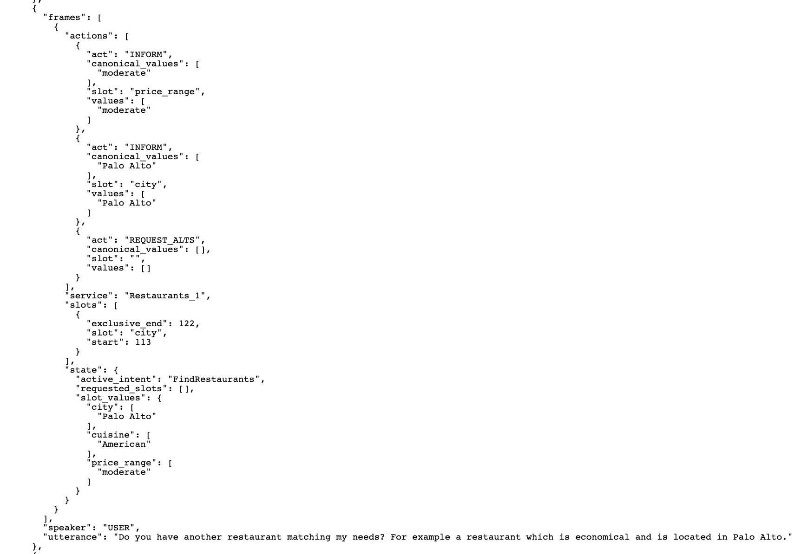
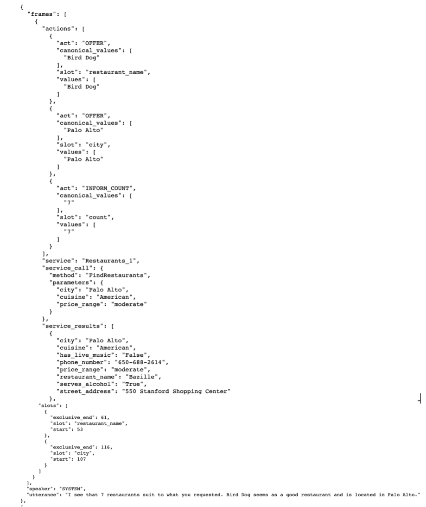
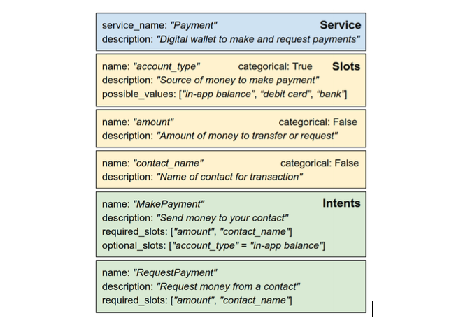

TRADE Tutorial
==============

Introduction
------------

The goal of **Dialog State Tracking (DST)** :cite:`nlp-dst-henderson2015machine` \
is to build a representation of the status of the ongoing conversation \
being a sequence of utterances exchanged between dialog participants. \
In another words, the goal of DST system is to capture user goals and intentions and encode them as a set of \
**slots** along with the corresponding **values**. DST is considered an important module for most of the goal-oriented dialogue systems.

.. figure:: dst_multiwoz_example.png

   Fig. 1: An exemplary, multi-domain dialog along with the associated state tracking (source: \
   :cite:`nlp-dst-wu2019transferable`)

In this tutorial we will focus on a multi-domain dialogue MultiWOZ dataset :cite:`nlp-dst-budzianowski2018multiwoz` \
and show how one can train a TRADE model :cite:`nlp-dst-wu2019transferable`, \
being one of the recent, state of the art models. \
**Multi-domain** setting introduces several challanges, with the most important coming from the need for \
**multi-turn mapping**. In a **single-turn mapping** scenario the (**domain**, **slot**, **value**) triplet can be \
inferred from a single turn. In multi-turn this assumption does not hold and the DST system must infer those from \
multiple turns, possibly spanning over several different domains.

The MultiWOZ Dataset
--------------------

The Multi-Domain Wizard-of-Oz dataset (`MultiWOZ`_) is a collection of human-to-human conversations spanning over \
7 distinct domains and containing over 10,000 dialogues.
The original MultiWOZ 2.0 dataset was introduced in :cite:`nlp-dst-budzianowski2018multiwoz`.
However, in this tutorial we will utilize MultiWOZ 2.1  :cite:`nlp-dst-eric2019multiwoz`, which is an updated version of MultiWOZ 2.0. They have fixed several issues with the original dataset including errors in states, utterances, value canonicalization etc.). Our model can also get trained on MultiWOZ 2.0.

.. _MultiWOZ: https://www.repository.cam.ac.uk/handle/1810/294507

The MultiWOZ dataset covers the following domains:
 1. restaurant
 2. hotel
 3. attraction
 4. taxi
 5. train
 6. hospital
 7. police

As well as the following slots:
 * inform (∗)
 * address (∗)
 * postcode (∗)
 * phone (∗)
 * name (1234)
 * no of choices (1235)
 * area (123)
 * pricerange (123)
 * type (123)
 * internet (2)
 * parking (2)
 * stars (2)
 * open hours (3)
 * departure (45)
 * destination (45)
 * leave after (45)
 * arrive by (45)
 * no of people (1235)
 * reference no. (1235)
 * trainID (5)
 * ticket price (5)
 * travel time (5)
 * department (7)
 * day (1235)
 * no of days (123).

Please note that some of the actions and slots are associated with particular domain(s), whereas some are universal, \
i.e. domain independent. The latter ones are denoted with (∗).

MultiWOZ offers 10,438 dialogues, with 115,434 turns in total. \
Dialogues are generally classified into single and multi-domain dialogues. \
Dialogue length distribution is varying from 1 to 31, with around 70% of dialogues have more than 10 turns. \
The average number of turns are 8.93 and 15.39 for single and multi-domain dialogues. \

Each dialogue consists of a goal, multiple user and system utterances as well as a belief state and set of dialogue \
acts with slots per turn. Additionally, each dialog is supported with a task description. \
Moreover, it contains both system and user dialogue act annotations (the latter introduced in MultiWOZ 2.1).

TRADE Model
-----------

The **TRA**\nsferable **D**\ialogue stat\ **E** generator (TRADE) :cite:`nlp-dst-wu2019transferable`  is a model \
designed specially for the multi-domain \
task-oriented dialogue state tracking problem. \
The model generates dialogue states from utterances and history. It learns embeddings for domains and slots, and also \
benefits from copy mechanism to facilitate knowledge transfer between domains. It enables the model to predict
\(**domain**, **slot**, **value**) triplets not encountered during training in a given domain.

.. figure:: dst_trade_architecture.png

   Fig. 2: Architecture of the TRADE model (source: :cite:`nlp-dst-wu2019transferable`)

The model is composed of three main components:

 * **Utterance Encoder**,
 * **Slot Gate**, and
 * **State Generator**.

The **utterance encoder** is a bi-directional Gated Recurrent Unit (GRU), returning both \
context words and and an aggregated context vector encoding the whole dialogue history.

The **state generator** also uses GRU to predict the value for each(domain, slot) pair. Generator employ a soft-gated \
pointer-generator copying to combine a **distribution over the vocabulary** and a **distribution over the dialogue \
history** into a single output distribution.

Finally, the **slot gate** is a simple classifier that maps a context  vector taken from the encoder hidden states \
to a probability  distribution  over three classes: *ptr*, *none*,  and *dontcare*.

Data Pre-processing
-------------------

First, you need to download `MULTIWOZ2.1.zip` from the `MultiWOZ2.1`_ project website. It contains the data for \
MultiWOZ 2.1 dataset. Alternatively, you can download `MULTIWOZ2.zip` compressed file from `MultiWOZ2.0`_ which \
contain the older version of this dataset.

.. _MultiWOZ2.1: https://www.repository.cam.ac.uk/handle/1810/294507

.. _MultiWOZ2.0: https://www.repository.cam.ac.uk/handle/1810/280608

Next, we need to preprocess and reformat the dataset, what will result in division of data into three splits:

 * traininig split (8242 dialogs in the ``train_dials.json`` file)
 * development/validation split (1000 dialogs in the ``dev_dials.json`` file)
 * test split (999 dialogs in the ``test_dials.json`` file)

In order to preprocess the MultiWOZ dataset you can use the provided `process_multiwoz.py`_ script:

.. _process_multiwoz.py: https://github.com/NVIDIA/NeMo/tree/master/examples/nlp/dialogue_state_tracking/data/multiwoz/process_multiwoz.py

.. code-block:: bash

    cd examples/nlp/dialogue_state_tracking/data/multiwoz
    python process_multiwoz.py \
        --source_data_dir <path to MultoWOZ dataset> \
        --target_data_dir <path to store the processed data>

.. note::
    Argument `--source_data_dir` specifies the folder where you have copied and extracted data into. \
    It will store the processed dataset in the folder given by `--target_data_dir`. \
    Both MultiWOZ 2.0 and MultiWOZ 2.1 datasets can get processed with the same script.

Building the NeMo Graph
-----------------------

The NeMo training graph consists of the following six modules including data layer, encoder, decoder, and losses:

 * data_layer (:class:`nemo.collection.nlp.nm.data_layers.MultiWOZDataLayer`)
 * encoder (:class:`nemo.backends.pytorch.common.EncoderRNN`)
 * decoder (:class:`nemo.collection.nlp.nm.trainables.TRADEGenerator`)
 * gate_loss_fn (:class:`nemo.backends.pytorch.common.losses.CrossEntropyLossNM`)
 * ptr_loss_fn (:class:`nemo.collections.nlp.nm.losses.MaskedLogLoss`)
 * total_loss_fn (:class:`nemo.collection.nlp.nm.losses.LossAggregatorNM`)

Training
--------

In order to train an instance of the TRADE model on the MultiWOZ dataset and evaluate on its test data simply run \
the `dialogue_state_tracking_trade.py`_ script with default parameters:

.. _dialogue_state_tracking_trade.py: https://github.com/NVIDIA/NeMo/tree/master/examples/nlp/dialogue_state_tracking/dialogue_state_tracking_trade.py

.. code-block:: bash

    cd examples/nlp/dialogue_state_tracking
    python dialogue_state_tracking_trade.py \
        --data_dir <path to the data> \
        --work_dir <path to store the experiment logs and checkpoints> \
        --eval_file_prefix <test or dev>

You may find the list of parameters in the example file and update them as see fits. \
By default the script would train the model for 10 epochs on 1 single gpu. \
The police and hospital domains are excluded from the training by default as they do not exist in the development set. \
The list of the domains can get updated in the example.

Evaluating Checkpoints
----------------------

By default a folder named "checkpoints" would get created under the working folder specified by `--work_dir` and \
checkpoints are stored under it. To do evaluation a checkpoint on test or dev set, \
you may run the same script by passing `--checkpoint_dir` and setting `--num_epochs` as zero to avoid the training:

.. code-block:: bash

    cd examples/nlp/dialogue_state_tracking
    python dialogue_state_tracking_trade.py \
        --data_dir <path to the data> \
        --checkpoint_dir <path to checkpoint folder> \
        --eval_file_prefix <test or dev> \
        --eval_batch_size <batch size for evaluation> \
        --num_epochs 0

Metrics and Results
-------------------

In the following table we compare the results achieved by our TRADE model implementation with the results reported \
in the original paper :cite:`nlp-dst-wu2019transferable`. We trained our models for 10 epochs on a single GPU with 16GB memory. \
As the authors reported results on just MultiWOZ 2.0 dataset, we ran the original implementation on MultiWOZ 2.1 dataset \
and reported those too.

We used the same parameters as the original implementation. There are some differences between our implementation and \
the original one. The main difference is that our model does not use pre-trained embeddings which seems not to affect \
the performance of the model. The other difference is that we used SquareAnnealing for the learning policy instead of \
fixed learning rate. Additionally, we create the vocabulary just based on the training data while the default for the \
original one is to create vocabulary from all the data including test and development sets. The main reason behind \
the improvement of our model in terms of accuracy is utilizing better learning rate policy. When we used fixed \
learning rate in our implementation, we got similar results as the original one.

We also did some improvements to the implementation of the model to have faster training. It makes our implementation \
significantly faster than the original one. Additionally, NeMo supports multi-GPU training which enables even faster \
training time. It should be noted that learning rate needs to get \
increased if you want to use multi-GPU training because of having larger batch size.

Following :cite:`nlp-dst-wu2019transferable`, we used two main metrics to evaluate the model performance:

 * **Joint Goal Accuracy** compares the predicted dialogue states to the ground truth at each dialogue turn, and the
   output is considered correct if and only if **all the predicted values exactly match** the ground truth values. 
 * **Slot Accuracy** independently compares each (domain, slot, value) triplet to its ground truth label.

+---------------------------------------------+--------+--------+--------+--------+--------+--------+--------+--------+
|                                             | MultiWOZ 2.0                      | MultiWOZ 2.1                      |
+                                             +--------+--------+--------+--------+--------+--------+--------+--------+
|                                             | Test            |Development      |  Test           |Development      |
+                                             +--------+--------+--------+--------+--------+--------+--------+--------+
| TRADE implementations                       | Goal   | Slot   | Goal   | Slot   | Goal   | Slot   | Goal   | Slot   |
+=============================================+========+========+========+========+========+========+========+========+
| Original :cite:`nlp-dst-wu2019transferable` | 48.62% | 96.92% | 48.76% | 96.95% | 45.31% | 96.57% | 49.15% | 97.04% |
+---------------------------------------------+--------+--------+--------+--------+--------+--------+--------+--------+
| NeMo's Implementation of TRADE              | 49.78% | 97.06% | 50.44% | 97.15% | 47.77% | 96.82% | 50.85% | 97.21% |
+---------------------------------------------+--------+--------+--------+--------+--------+--------+--------+--------+

You may find the checkpoints for the trained models on MultiWOZ 2.0 and MultiWOZ 2.1 datasets on NGC:

    **MultiWOZ 2.0**: https://ngc.nvidia.com/catalog/models/nvidia:trade___dialogue_state_tracker___multiwoz_2_0
    **MultiWOZ 2.1**: https://ngc.nvidia.com/catalog/models/nvidia:trade___dialogue_state_tracker___multiwoz_2_1

.. note::
    During training, TRADE model uses an additional supervisory signal, enforcing the Slot Gate to properly \
    predict special values for like **don't care** or **none** for the slots. The `process_multiwoz.py`_ script extracts the additional labels from the dataset and `dialogue_state_tracking_trade.py`_ script reports the **Gating Accuracy** as well.

References
----------

.. bibliography:: nlp_all_refs.bib
    :style: plain
    :labelprefix: NLP-DST
    :keyprefix: nlp-dst-

SGD Tutorial
============

Introduction
------------

A task-oriented dialogue system is a conversational system that can perform a conversation with a user and provide task- (or domain-)specific information. For example, it can book a table in a restaurant or buy a train ticket.
One of the main building blocks of a task-oriented dialogue system is a Dialogue State Tracker (DST).
DST should not only understand what the user just said but also remember what was said before.
DST carries the information about what intent the user has in the conversation, for example, find a restaurant or book a plane ticket,
and what slots along with the corresponding values were mentioned in the dialogue.

The Schema-Guided Dialogue Dataset
----------------------------------

In this tutorial, we are using the Schema-Guided Dialogue (SGD) dataset :cite:`nlp-sgd-rastogi2019towards` that contains over 16k multi-domain goal-oriented conversations across 16 domains.
The data represents conversations between a user and a virtual assistant, and it can be used for various dialogue management tasks:
intent prediction, slot filling, dialogue state tracking, policy imitation learning, language generation. 

One part of the dialogues in the dataset spans across only a single domain dialogues, use ``--task_name sgd_single_domain`` to use such dialogues. Another part focuses only on dialogues that span across multiple domains during a single conversation, 
``--task_name sgd_multi_domain`` to train and evaluate on the multi-domain task. ``--task_name sgd_all`` will use all available dialogues for training and evaluation.

An example of the data format could be found `here <https://raw.githubusercontent.com/google-research-datasets/dstc8-schema-guided-dialogue/master/train/dialogues_001.json>`_.
Every dialogue contains the following information:

* **dialogue_id** - a unique dialogue identifier
* **services** - list of services mentioned in the dialogue
* **turns** - a dialogue is comprised of multiple dialogue turns, where a single turn consists of user and systems utterances frames.
* **frames** - each frame contains system or user utterance with assotiated annotraion.
    
    * Each **user** frame containts the following information (values in brackets are from the user frame example in Fig. 1, note some values in the state are coming from the previous dialogue turns):
        
        * **actions** - a list with the following values:
            
            * act - user's intent or act (INFORM)
            * slot - slot names (price_range)
            * values - a list of slot values (moderate)
            * canonical_values (optional) - slot values in their canonicalized form as used by the service
        
        * **service** - service name for the current user utterance (Restaurants_1)
        * **slots** - a list of slot spans in the user utterance, only provided for non-categorical slots. Each slot span contains the following fields:
            
            * slot - non-categorical slot name (city)
            * start/exclusive_end - start/end character index of the non-categorical slot value in the current user utterance (113/122)
        
        * **state** - dialogue state:
            
            * active_intent -  name of an active user intent (FindRestaurants)
            * requested_slots - a list of slots requested be the user in the current turn
            * slot_values - dictionary of slot name - slot value pairs ({"city": ["Palo Alto"], "cuisine": ["American"], "price_range": ["moderate"]}) 
    
    * Each **system** frame containts the following information ((values in brackets are from the system frame example in Fig. 2):
        
        * **actions** - a list with the following values:
            
            * act - system act (OFFER)
            * slot - slot names (restaurant_name)
            * values - a list of slot values (Bird Dog)
            * canonical_values (optional) - slot values in their canonicalized form as used by the service
        
        * **service** - service name for the current turn (Restaurants_1)
        * **service_call** (optional) - request sent to the service:
            
            * method - a name of the intent or function of the service or API being executed (FindRestaurants)
            * parameters - a dictionary of slot name -slot value pairs in their canonicalized form ({"city": ["Palo Alto"], "cuisine": ["American"], "price_range": ["moderate"]})
        
        * **service_results** - results of a service call:
            
            {"city": "Palo Alto",
            "cuisine": "American",
            "has_live_music": "False",
            "phone_number": "650-688-2614",
            "price_range": "moderate",
            "restaurant_name": "Bazille",
            "serves_alcohol": "True",
            "street_address": "550 Stanford Shopping Center"}
        
        * **slots** - a list of slot spans in the system utterance, only provided for non-categorical slots. Each slot span contains the following fields:
            
            * slot - non-categorical slot name (city)
            * start/exclusive_end - start/end character index of the non-categorical slot value in the current user utterance (113/122)

* **speaker** - identifies whether a user or a system is speaking
* **utterance** - user or system utterance

    
    Fig. 1: An example of a user frame (source: `a user frame from one of the dialogues <https://raw.githubusercontent.com/google-research-datasets/dstc8-schema-guided-dialogue/master/train/dialogues_001.json>`_).

    Fig. 2: An example of a system frame (source: `a system frame from one of the dialogues <https://raw.githubusercontent.com/google-research-datasets/dstc8-schema-guided-dialogue/master/train/dialogues_001.json>`_).

To find more details and download the dataset, use `this link <https://github.com/google-research-datasets/dstc8-schema-guided-dialogue>`_.

Baseline model
--------------

The SGD dataset for every dataset split (train, dev, test) provides detailed schema files (see `this for an example here <https://github.com/google-research-datasets/dstc8-schema-guided-dialogue/blob/master/train/schema.json>`_).
These files contain information about slots supported by every service, possible values for categorical slots, along with the supported intents.
Besides that, the schemas provide a natural language description of the slots, intents, and services; these descriptions are
utilized by the model to get schema embeddings. Thus, before starting the model training, the training script will create schema embeddings. By default the schema embedding generation
will be performed every time you run the training script, to skip the schema generation step for all subsequent training script runs, use ``--no_overwrite_schema_emb_files``.
(see `nlp/data/datasets/sgd_dataset/schema_processor.py <https://github.com/NVIDIA/NeMo/blob/master/nemo/collections/nlp/data/datasets/sgd_dataset/schema_processor.py>`_ for more implementation details). 

    Fig. 3: A schema example for a digital wallet service, (source: :cite:`nlp-sgd-rastogi2019towards`)

Another preprocessing step that could be done once and skipped for all future training runs (if you're not changing anything that could affect it) is the dialogues preprocessing step, i.e. breaking dialogues into dialogue turns and collecting labels and features for a particular turn. Use ``no_overwrite_dial_files``
to overwrite the generated dialogues to skip this step (see `nemo/collections/nlp/data/datasets/sgd_dataset/data_processor.py <https://github.com/NVIDIA/NeMo/blob/master/nemo/collections/nlp/data/datasets/sgd_dataset/data_processor.py>`_ for implementation details).

During training, the Baseline model introduced in :cite:`nlp-sgd-rastogi2019towards` relies on the current user and system utterances and service schemas, compared to the TRADE model that uses all dialogue history.
The SGD model is learning to understand and extract from the dialogue the following things:

- active intent
- requested slots
- categorical slots
- non-categorical slots

Note that for every abovementioned slot, the model predicts slot status and slot value. Only if the slot status is predicted to be active, the associated slot value is taken into account.

Model components:

- **SGDEncoder** - uses a BERT model to encode user utterance. By default, the SGD model uses the pre-trained BERT base cased model from `Hugging Face Transformers <https://huggingface.co/transformers/>`_ to get embedded representations for schema elements and also to encode user utterance. The SGDEncoder returns encoding of the whole user utterance using 'CLS' token and embedded representation of every token in the utterance.
- **SGDDecoder** - returns logits for predicted elements by conditioning on the encoded utterance

Training
--------
In order to train the Baseline SGD model on a single domain task and evaluate on its dev and test data, run:

.. code-block:: bash

    cd examples/nlp/dialogue_state_tracking
    python dialogue_state_tracking_sgd.py \
        --task_name sgd_single_domain \
        --data_dir PATH_TO/dstc8-schema-guided-dialogue \
        --schema_embedding_dir PATH_TO/dstc8-schema-guided-dialogue/embeddings/ \
        --dialogues_example_dir PATH_TO/dstc8-schema-guided-dialogue/dialogue_example_dir \
        --eval_dataset dev_test

Metrics
-------
Metrics used for automatic evaluation of the model :cite:`nlp-sgd-rastogi2020schema`:

- **Active Intent Accuracy** - the fraction of user turns for which the active intent has been correctly predicted.
- **Requested Slot F1** - the macro-averaged F1 score for requested slots over all eligible turns. Turns with no requested slots in ground truth and predictions are skipped.
- **Average Goal Accuracy** For each turn, we predict a single value for each slot present in the dialogue state. This is the average accuracy of predicting the value of a slot correctly.
- **Joint Goal Accuracy** - the average accuracy of predicting all slot assignments for a given service in a turn correctly.

The evaluation results are shown for Seen Services (all services seen during model training), Unseen Services (services not seen during training), and All Services (the combination of Seen and Unseen Services).
Note, during the evaluation, the model first generates predictions and writes them to a file in the same format as the original dialogue files, and then uses these files to compare the predicted dialogue state to the ground truth.

Model Improvements
------------------

Model features added to get better performance results or increase model flexibility:

- data augmentation
- system retrieval mechanism
- ability to make schema embeddings trainable during the model training
- adding an attention layer between the encoder and the model heads

Data augmentation is done offline with `examples/nlp/dialogue_state_tracking/data/sgd/dialogue_augmentation.py <https://github.com/NVIDIA/NeMo/blob/master/examples/nlp/dialogue_state_tracking/data/sgd/dialogue_augmentation.py>`_.
We used 10x as augmentation factor.

Data augmentation
-----------------
The data augmentation is done offline with `examples/nlp/dialogue_state_tracking/data/sgd/dialogue_augmentation.py <https://github.com/NVIDIA/NeMo/blob/master/examples/nlp/dialogue_state_tracking/data/sgd/dialogue_augmentation.py>`_. 
It supports modifications on dialogue utterance segments, that are either non-categorical slot values or regular words. When a segment is modified, all future references of the old word in the dialogue are also 
altered along with all affected dialogue meta information, e.g. dialogue states, to preserve semantic consistency. This is done by first building a tree structure over the dialogue which stores all relevant meta information.    
Currently, we provide one function each for changing either a non-categorical slot value or a regular word:
``get_new_noncat_value()`` is used to replace a non-categorical value by a different value from the same service slot.  
``num2str()`` is used to replace a regular word that is a number with its string representation, e.g. '11' becomes 'eleven'.
The script allows the user to easily extend the set of functions by custom ones, e.g. deleting words could be realized by a function that 
replaces a regular word by the empty string ''.  
The input arguments include configuration settings that determine how many augmentation sweeps are done on the dataset and the probability of modifying a word.
For our experiments we used 9 augmentation sweeps (and concatenated it with the original dataset) at 100% modification rate, resulting in a dataset 10x as large:

.. code-block:: bash

    cd examples/nlp/dialogue_state_tracking/data/sgd
    python dialogue_augmentation.py \
        --input_dir <sgd/train> \
        --repeat 9 \
        --replace_turn_prob 1.0 \
        --replace_word_prob 1.0 \
        --concat_orig_dialogue

Results on Single Domain
------------------------
The following table shows results of the SGD baseline and that of some NeMo model features. The focus was to improve seen services.
We use * to denote the issue fixed in NeMo that occurred in the original TensorFlow implementation of SGD for single domain.
In the original version of the single domain task, the evaluation falsely classified two services ``Travel_1`` and ``Weather_1`` as Seen Services   
although they are never seen in the training data. By fixing this, the Joint Goal Accuracy on Seen Services increased.  

Seen Services

+------------------------------------------------------------------------+-----------------+---------------+-----------+------------+
|                                                                        |                        Dev set                           |
+                                                                        +-----------------+---------------+-----------+------------+
| SGD baseline implementations                                           | Active Int Acc  | Req Slot F1   | Aver GA   | Joint GA   |
+========================================================================+=================+===============+===========+============+
| Original SGD trained on single domain task                             |      99.06      |     98.67     |   88.08   |    68.58   |
+------------------------------------------------------------------------+-----------------+---------------+-----------+------------+
| NeMo's Implementation of the Baseline*                                 |      98.91      |     99.60     |   90.71   |    70.94   |
+------------------------------------------------------------------------+-----------------+---------------+-----------+------------+
| NeMo baseline + system retrieval*                                      |      98.94      |     99.52     |   95.72   |    85.34   |
+------------------------------------------------------------------------+-----------------+---------------+-----------+------------+
| NeMo baseline + system retrieval + attention head*                     |      98.99      |     99.66     |   96.26   |    86.81   |
+------------------------------------------------------------------------+-----------------+---------------+-----------+------------+
| NeMo baseline + system retrieval + data augmentation*                  |      98.89      |     99.70     |   96.23   |    86.53   |
+------------------------------------------------------------------------+-----------------+---------------+-----------+------------+
| NeMo baseline + system retrieval + attention head + data augmentation* |     98.95       |     99.70     |   94.96   |    88.06   |
+------------------------------------------------------------------------+-----------------+---------------+-----------+------------+

Unseen Services

+------------------------------------------------------------------------+-----------------+---------------+-----------+------------+
|                                                                        |                        Dev set                           |
+                                                                        +-----------------+---------------+-----------+------------+
| SGD baseline implementations                                           | Active Int Acc  | Req Slot F1   | Aver GA   | Joint GA   |
+========================================================================+=================+===============+===========+============+
| Original SGD trained on single domain task                             |       94.8      |      93.6     |   66.03   |   28.05    |
+------------------------------------------------------------------------+-----------------+---------------+-----------+------------+
| NeMo's Implementation of the Baseline*                                 |       94.75     |      93.46    |   65.33   |   32.18    |
+------------------------------------------------------------------------+-----------------+---------------+-----------+------------+
| NeMo baseline + system retrieval*                                      |      94.74      |    93.49      |   67.55   |   34.68    |
+------------------------------------------------------------------------+-----------------+---------------+-----------+------------+
| NeMo baseline + system retrieval + attention head*                     |      92.39      |    94.04      |   68.47   |   33.41    |
+------------------------------------------------------------------------+-----------------+---------------+-----------+------------+
| NeMo baseline + system retrieval + data augmentation*                  |      94.94      |     93.97     |   65.73   |   30.89    |
+------------------------------------------------------------------------+-----------------+---------------+-----------+------------+
| NeMo baseline + system retrieval + attention head + data augmentation* |     92.68       |    94.55      |    69.59  |   32.76    |
+------------------------------------------------------------------------+-----------------+---------------+-----------+------------+

All Services

+------------------------------------------------------------------------+-----------------+---------------+-----------+------------+
|                                                                        |                        Dev set                           |
+                                                                        +-----------------+---------------+-----------+------------+
| SGD baseline implementations                                           | Active Int Acc  | Req Slot F1   | Aver GA   | Joint GA   |
+========================================================================+=================+===============+===========+============+
| Original SGD trained on single domain task                             |       96.6      |     96.5      |   77.6    |    48.6    |
+------------------------------------------------------------------------+-----------------+---------------+-----------+------------+
| NeMo's Implementation of the Baseline*                                 |       96.56     |     96.13     |   76.49   |    49.05   |
+------------------------------------------------------------------------+-----------------+---------------+-----------+------------+
| NeMo baseline + system retrieval*                                      |      96.57      |     96.12     |   79.93   |    56.73   |
+------------------------------------------------------------------------+-----------------+---------------+-----------+------------+
| NeMo baseline + system retrieval + attention head*                     |      95.26      |    96.49      |   80.68   |    56.65   |
+------------------------------------------------------------------------+-----------------+---------------+-----------+------------+
| NeMo baseline + system retrieval + data augmentation*                  |      96.66      |     96.46     |   79.14   |    55.11   |
+------------------------------------------------------------------------+-----------------+---------------+-----------+------------+
| NeMo baseline + system retrieval + attention head + data augmentation* |     95.41       |    96.79      |   81.47   |    56.83   |
+------------------------------------------------------------------------+-----------------+---------------+-----------+------------+

.. note::
    This tutorial is based on the code from `examples/nlp/dialogue_state_tracking/dialogue_state_tracking_sgd.py  <https://github.com/NVIDIA/NeMo/blob/master/examples/nlp/dialogue_state_tracking/dialogue_state_tracking_sgd.py>`_

References
----------

.. bibliography:: nlp_all_refs.bib
    :style: plain
    :labelprefix: NLP-SGD
    :keyprefix: nlp-sgd-
