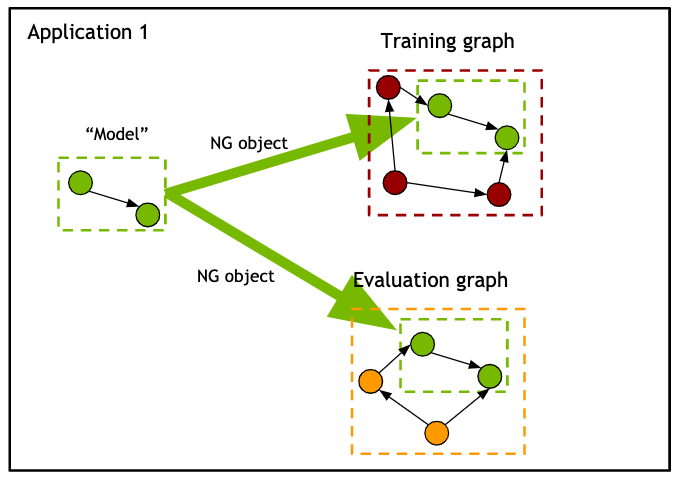

Neural Graphs
=============

The Neural Graph is a high-level abstract concept empowering the user to build graphs consisting of many,
interconnected Neural Modules.
Once the user defines a graph, its topology is “frozen”, i.e. connections between modules cannot change.
If a user wants to change the topology - he/she can build another graph, potentially spanned over the same modules.
At the same time, he can reuse and nest one graph into another.

.. figure:: neural_graphs_general.png

The import/export/save/restore options combined with the lightweight API make Neural Graphs
a perfect tool for rapid prototyping and experimentation.

There are two Jupyter Notebook tutorials focusing on different aspects of the Neural Graphs functionality.

Tutorial I: The basic functionality
-----------------------------------

In this first part of the Neural Graphs (NGs) tutorial we will focus on a simple example:
training TaylorNet module to approximate a sine wave function.
We will build a simple "model graph" and show how we can nest it into another graphs.

This part covers the following:
 * how to create a Neural Graph object
 * how to activate/deactivate graph context (in various ways)
 * how to bind NG inputs and outpus (in various ways)
 * how to nest one graph (representing the our "trainable model") into training and validation graphs

Tutorial II: The advanced functionality
---------------------------------------

In this first part of the Neural Graphs (NGs) tutorial we will focus on a more complex example:
training of an End-to-End Convolutional Neural Acoustic Model called JASPER.
We will build a "model graph" and show how we can nest it into another graphs, how we can freeze/unfreeze modules,
use graph configuration and save/load graph checkpoints.

This part covers the following:
 * how to nest one graph into another
 * how to serialize and deserialize a graph
 * how to export and import serialized graph configuration to/from YAML files
 * how to save and load graph checkpoints (containing weights of the Trainable NMs)
 * how to freeze/unfreeze modules in a graph
 
Additionally, we will show how use `AppState` to list all the modules and graphs we have created in the scope of
our application.

.. note::
    Both tutorial notebooks can be found in the `nemo/examples/neural_graphs` folder.
