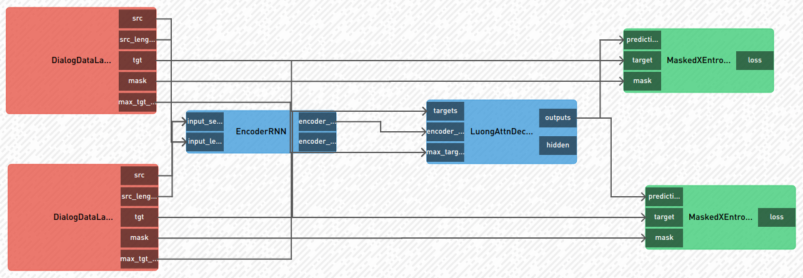

例子
========

NeMo 应用程序包含三个步骤：

    (1) 创建神经模块
    (2) 创建使用张量（“激活元”）的模型，把神经模块串成图
    (3) 触发一个操作, 例如：训练或者推理

Hello World 
------------

这个例子展现了如何构建一个模型，学习 y=sin(x) 的泰勒系数。

.. code-block:: python

    import nemo

    # 用支持的后端初始化 Neural Factory
    nf = nemo.core.NeuralModuleFactory()

    # 初始化必要的神经模块
    # RealFunctionDataLayer 默认为 f=torch.sin，从 x=[-4, 4] 采样
    dl = nemo.tutorials.RealFunctionDataLayer(
        n=10000, batch_size=128)
    fx = nemo.tutorials.TaylorNet(dim=4)
    loss = nemo.tutorials.MSELoss()

    # 描述激活流
    x, y = dl()
    p = fx(x=x)
    lss = loss(predictions=p, target=y)

    # SimpleLossLoggerCallback 打印损失函数值到控制台
    callback = nemo.core.SimpleLossLoggerCallback(
        tensors=[lss],
        print_func=lambda x: print(f'Train Loss: {str(x[0].item())}'))

    # 触发“训练”操作
    nf.train([lss], callbacks=[callback],
             optimization_params={"num_epochs": 3, "lr": 0.0003},
             optimizer="sgd")

简单的聊天机器人
-----------------

这是个把 `PyTorch的聊天机器人教程 <https://pytorch.org/tutorials/beginner/chatbot_tutorial.html>`_ 改成适配于 NeMo 框架的例子。它解释了要如何训练和评估。

模型可以由下图表示，模型有:

    * 两个数据层（一个做训练一个做推理）,
    * 编码器和解码器（训练和推理共享）,
    * 两个损失函数模块（一个做训练一个做推理）。

在训练过程中，模型会打印:

    * **SOURCE**: 模型输入
    * **PREDICTED RESPONSE**: 模型输出
    * **TARGET**: 目标输出

.. code-block:: python

    import os
    import sys
    import gzip
    import shutil
    import nemo

    # 获取数据
    data_file = "movie_data.txt"
    if not os.path.isfile(data_file):
        with gzip.open("../../tests/data/movie_lines.txt.gz", 'rb') as f_in:
            with open(data_file, 'wb') as f_out:
                shutil.copyfileobj(f_in, f_out)

    # 配置
    config = {
        "corpus_name": "cornell",
        "datafile": data_file,
        "attn_model": 'dot',
        "hidden_size": 512,
        "encoder_n_layers": 2,
        "decoder_n_layers": 2,
        "dropout": 0.1,
        "voc_size": 6104 + 3,
        "batch_size": 128,
        "num_epochs": 15,
        "optimizer_kind": "adam",
        "learning_rate": 0.0003,
        "tb_log_dir": "ChatBot",
    }

    # 初始化 neural factory
    nf = nemo.core.NeuralModuleFactory()

    # 初始化神经模块
    dl = nemo.tutorials.DialogDataLayer(**config)
    encoder = nemo.tutorials.EncoderRNN(**config)
    decoder = nemo.tutorials.LuongAttnDecoderRNN(**config)
    L = nemo.tutorials.MaskedXEntropyLoss()
    decoderInfer = nemo.tutorials.GreedyLuongAttnDecoderRNN(**config)

    # 参数共享: 在训练解码器和自回归推理解码器之间做参数共享
    decoderInfer.tie_weights_with(decoder, list(decoder.get_weights().keys()))

    # 描述激活流
    src, src_lengths, tgt, mask, max_tgt_length = dl()
    encoder_outputs, encoder_hidden = encoder(input_seq=src,
                                              input_lengths=src_lengths)
    outputs, hidden = decoder(targets=tgt, encoder_outputs=encoder_outputs,
                              max_target_len=max_tgt_length)
    loss = L(predictions=outputs, target=tgt, mask=mask)

    # 运行推理解码器得到输出
    outputs_inf, _ = decoderInfer(encoder_outputs=encoder_outputs)

    # 定义回调函数打印中间结果到控制台
    def outputs2words(tensors, vocab):
        source_ids = tensors[1][:, 0].cpu().numpy().tolist()
        response_ids = tensors[2][:, 0].cpu().numpy().tolist()
        tgt_ids = tensors[3][:, 0].cpu().numpy().tolist()
        source = list(map(lambda x: vocab[x], source_ids))
        response = list(map(lambda x: vocab[x], response_ids))
        target = list(map(lambda x: vocab[x], tgt_ids))
        source = ' '.join([s for s in source if s != 'EOS' and s != 'PAD'])
        response = ' '.join([s for s in response if s != 'EOS' and s != 'PAD'])
        target = ' '.join([s for s in target if s != 'EOS' and s != 'PAD'])
        print(f"Train Loss:{str(tensors[0].item())}")
        print(f"SOURCE: {source} <---> PREDICTED RESPONSE: {response} "
              f"<---> TARGET: {target}")

    callback = nemo.core.SimpleLossLoggerCallback(
        tensors=[loss, src, outputs_inf, tgt],
        print_func=lambda x: outputs2words(x, dl.voc.index2word)
    )

    # 开始训练
    nf.train(
        tensors_to_optimize=[loss],
        callbacks=[callback],
        optimizer="adam",
        optimization_params={"num_epochs": config["num_epochs"], "lr": 0.001})

.. note::
    你可以在 `nemo/examples` 下面找到更多例子

