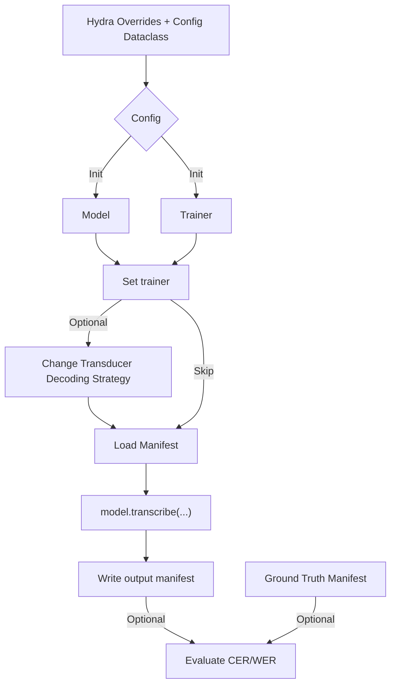

# Automatic Speech Recognition

This directory contains example scripts to train ASR models using various methods such as Connectionist Temporal Classification loss, RNN Transducer Loss.

Speech pre-training via self supervised learning, voice activity detection and other sub-domains are also included as part of this domain's examples.

# ASR Model inference execution overview

The inference scripts in this directory execute in the following order. When preparing your own inference scripts, please follow this order for correct inference.

During restoration of the model, you may pass the Trainer to the restore_from / from_pretrained call, or set it after the model has been initialized by using `model.set_trainer(Trainer)`.