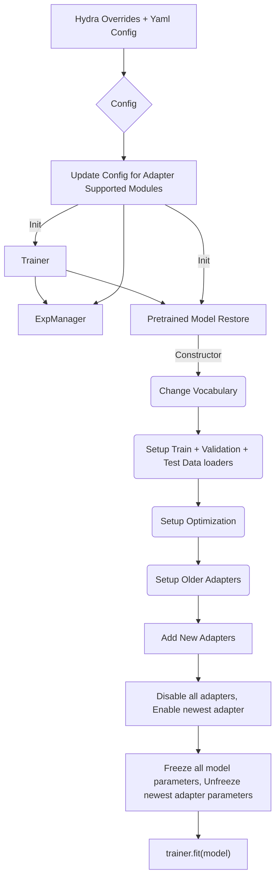
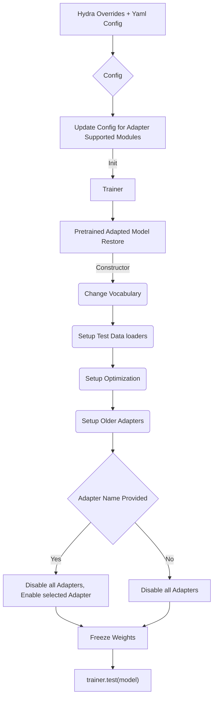

# ASR Adapters support

This examples directory contains scripts to enable Adapters support for supported ASR models in NeMo.

For further discussion of what are adapters, how they are trained and how are they used, please refer to the ASR tutorials.

# Train one-or-more adapters to a pre-trained model.

Using the `train_asr_adapter.py` script, you can provide the path to a pre-trained model, a config to define and add an adapter module to this pre-trained model, some information to setup datasets for training / validation - and then easily add any number of adapter modules to this network.

**Note**: In order to train multiple adapters on a single model, provide the `model.nemo_model` (in the config) to be a previously adapted model ! Ensure that you use a new unique `model.adapter.adapter_name` in the config.

## Training execution flow diagram

# Evaluate adapted models

In order to easily evaluate adapted models, you can use the `eval_asr_adapter.py` script, which takes in the path / name of an adapted model, and then selects one of the any number of adapter names to evaluate over.

## Evaluation execution flow diagram

**Note**: If you with to evaluate the base model (with all adapters disabled), simply pass `model.adapter.adapter_name=null` to the config of this script to disable all adapters and evaluate just the base model.
