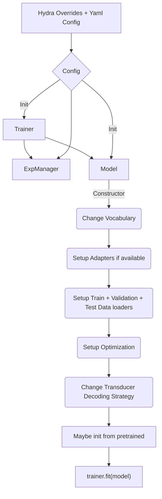

# ASR with Hybrid Transducer/CTC Models

This directory contains example scripts to train ASR models with two decoders of Transducer and CTC Loss. 

Currently supported models are - 

* Character based Hybrid RNNT/CTC model
* Subword based Hybrid RNNT/CTC model

# Model execution overview

The training scripts in this directory execute in the following order. When preparing your own training-from-scratch / fine-tuning scripts, please follow this order for correct training/inference.

During restoration of the model, you may pass the Trainer to the restore_from / from_pretrained call, or set it after the model has been initialized by using `model.set_trainer(Trainer)`.