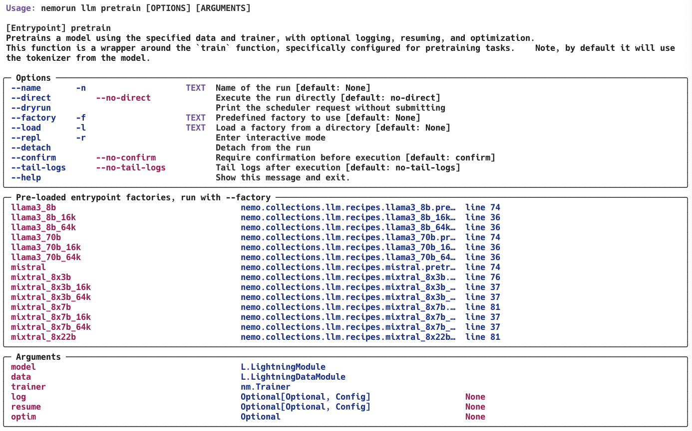
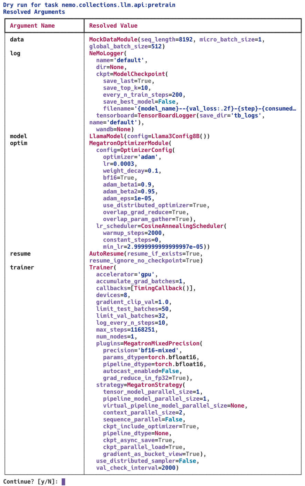
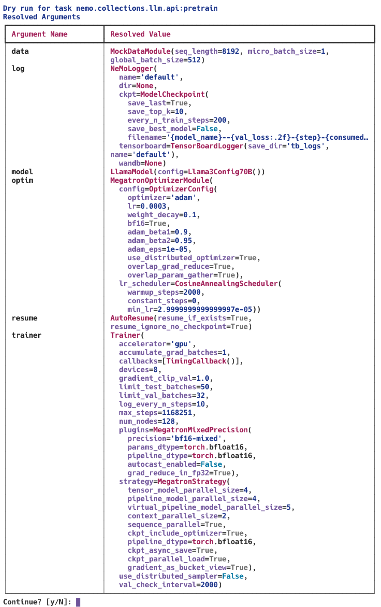

# Pre-training

### Listing the available recipes for pretraining

```bash
nemorun llm pretrain --help
```




### Run pre-training with a default recipe

```bash
nemorun llm pretrain --factory llama3_8b
```



We can also call the factory function with custom parameters:

```bash
nemorun llm pretrain --factory "llama3_70b(num_nodes=128)"
```




### Create and run a custom recipe

We can create a script that contains a custom recipe. See [custom_recipe.py](custom_recipe.py) for an example.

Note that we end the script with a call to `run.cli.main()`, which uses the same syntax as the CLI but allows us to provide specific defaults. We still can overwrite any parameter using the syntax `param=value`. We can set nested parameters using dotted notation, e.g. `trainer.max_steps=2000`.

When running the custom_recipe.py file, it will execute the `custom_llama3_8b` recipe by default. However, you can select different recipes or modify parameters using the following methods:

1. To select the `custom_llama3_70b` recipe:
   ```bash
   python custom_recipe.py --factory custom_llama3_70b
   ```
   This will automatically call the `custom_llama3_70b` function defined in the script.

2. To overwrite any parameter:
   ```bash
   python custom_recipe.py trainer.max_steps=2000
   ```

3. You can even apply transformations when triggering the CLI as if it's Python code:
   ```bash
   python custom_recipe.py "trainer.max_steps=*2"
   ```

These options provide flexibility in customizing your pretraining recipe directly from the command line.