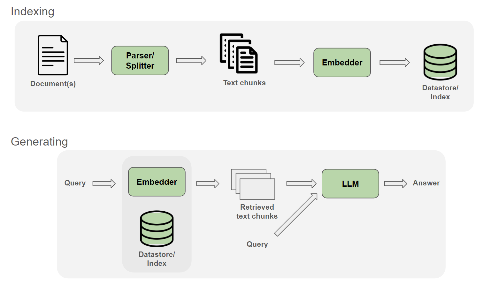

RAG with NeMo
================

Retrieval-augmented generation (RAG) is a technique for enhancing the accuracy and reliability of generative AI models with facts fetched from external sources. With NeMo, we can employ a text embedder and an LLM trained with NeMo Framework to set up a RAG pipeline.
This document illustrates how NeMo models can be used with LlamaIndex, a popular RAG library, for a retrieval-based text generation application.

## Quick Start

In this example, we set up a pipeline that lets us index a document file (e.g., a manual, repository documentation) then ask questions and details in the document.

The only dependency in this example is LlamaIndex, which can be installed with:
```
!pip install llama-index
```

A general RAG pipeline includes an Indexing step, in which the corpus document(s) are processed, embedded and indexed, and Generating step, in which given a query, the relevant neighbors text chunks are retrieved from the index to provide context to the query and fed into the LLM to generate answers. Below we walk through these two steps of the pipeline.

<p align="center">
        
</p>

### Indexing data


The first step is processing and indexing the corpus document(s). To do so, set the path to the embedder checkpoint, corpus document(s), index saving directory and relevant arguments, then run the following command. Below we explain in more details the steps run within the script.


```
python examples/nlp/rag/rag_indexing.py \
        trainer.devices=1 \
        trainer.precision='bf16-mixed' \
        indexing.embedder.model_path='/path/to/checkpoints/embedder_model.nemo' \
        indexing.embedder.embed_batch_size=128 \
        indexing.data.data_path='/path/to/data' \
        indexing.data.chunk_size=256 \
        indexing.data.chunk_overlap=10 \
        indexing.index_path='/path/to/index'
```

Inside the script, the following steps are run.

First, the document is read into LlamaIndex's `SimpleDirectoryReader` object.

```
print("Loading documents.")
documents = SimpleDirectoryReader(cfg.indexing.data.data_path).load_data()
```

We then set up how the corpus document(s) will be split into smaller chunks, by setting splitter type, chunk size, and chunk overlap values.

```
print("Setting text transformation.")
Settings.text_splitter = SentenceSplitter()
Settings.chunk_size = cfg.indexing.data.chunk_size
Settings.chunk_overlap = cfg.indexing.data.chunk_overlap
```

We then load the trained embedder NeMo model. Currently, this script only supports `.nemo` checkpoints. The wrapper around NeMo embedder to work with LLamaIndex interface is implemented at `nemo/collections/nlp/models/rag/custom_embedder.py`. We can try different embedding batch size to balance the number of samples embedded at once and embedding speed.

```
print("Loading embedding models.")
model_path = cfg.indexing.embedder.model_path
embed_batch_size = cfg.indexing.embedder.embed_batch_size
embed_model = NeMoEmbeddings(model_path = model_path, cfg = cfg, embed_batch_size = embed_batch_size)
Settings.embed_model = embed_model
```

Next, we will index the corpus document(s), simply by using the LlamaIndex `VectorStoreIndex.from_documents()` method. Under the hood, this method will split the corpus document(s) into smaller chunks having a pre-defined chunk size, batch them and feed them to the embedder, then put the output embeddings into an index. In this example, we use the built-in LlamaIndex's in-memory vector store to save the index. We can also use external vector stores, such as Milvus, Qdrant, etc. See more at [LlamaIndex Vector Stores](https://docs.llamaindex.ai/en/stable/module_guides/storing/vector_stores/).          


```
print("Indexing data.")
index = VectorStoreIndex.from_documents(documents, show_progress=True)
```

After indexing, we save the index to disk that later we can load to be used with an LLM.

```
print("Saving index to disk.")
index_path = cfg.indexing.index_path
index.storage_context.persist(persist_dir=index_path)
```


###  Generation

After processing and indexing the document, we can have a NeMo LLM model to interact with the corpus document(s) through RAG, such as asking details within the documents. To do so, set the path to the LLM checkpoint, save index, and a query to ask and run the following command. Below we explain in more details the steps run within the script.

```
python examples/nlp/rag/rag_eval.py \
        trainer.devices=1 \
        trainer.precision='bf16-mixed' \
        indexing.embedder.model_path='/path/to/checkpoints/embedder_model.nemo' \
        indexing.index_path='/path/to/index' \
        generating.llm.model_path='/path/to/checkpoints/llm_model.nemo' \
        generating.inference.greedy=False \
        generating.inference.temperature=1.0 \
        generating.query='Which art schools did I applied to?'
```

Inside the script, the following steps are run.


First, the LLM is loaded from `generating.llm.model_path`. Currently the script only works with `.nemo` checkpoints. The wrapper around NeMo LLM to work with LLamaIndex interface is implemented at `nemo/collections/nlp/models/rag/custom_llm.py`. 

```
print("Loading LLM.")
model_path = cfg.generating.llm.model_path
Settings.llm = NeMoLLM(model_path = model_path, cfg = cfg)
```

Then we load the index saved on disk in the previous indexing step. If using Milvus database, it can also be loaded at this step.
```
print("Loading index from disk.")
index_path = cfg.indexing.index_path
storage_context = StorageContext.from_defaults(persist_dir=index_path)
index = load_index_from_storage(storage_context)
```

Finally, we will retrieve the relevant contexts and generate answers for the query using LlamaIndex's `query_engine.query()` method. Under the hood, this method automatically embeds the query with the defined embedder, then retrieve the k relevant contexts from the index, and add those contexts to a predefined template along with the query before feeding them to the LLM for generation. We can set the number of relevant contexts to be retrieved by setting the argument `similarity_top_k` value.
```
print("Responding to query using relevant contexts.")
query_engine = index.as_query_engine(similarity_top_k=3)
response = query_engine.query(query)
print(response)
```

Below is an example of the default template by LlamaIndex to feed a query and relevant contexts to the LLM. This template can be modified following LlamaIndex's documentation [Prompts RAG](https://docs.llamaindex.ai/en/stable/examples/prompts/prompts_rag/).


```
Context information is below.
---------------------
{context_str 1}
{context_str 2}
...
---------------------
Given the context information and not prior knowledge, answer the query.
Query: {query_str}
Answer:
```