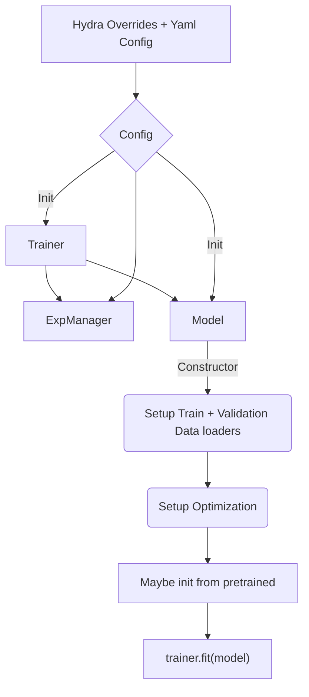

# Speech Separation

This directory contains example script to train speech separation models. Current recipe supports transformer based speech separation model ([SepFormer](https://arxiv.org/abs/2010.13154)).

## Manifest format
In order to train the model on your dataset, prepare nemo compatible train and validation manifest json files.

A sample manifest file is shown below for speech separation containing two sources. Each line is a training example. `audio_filepath` and `duration` fields are required where as others are optional. Audiofiles specified in `audio_filepath` are linearly mixed after scaling with respective `scale_factor` to form the mixed input for model.

```json
{"audio_filepath": ["<absolute_path_to>/445c0206.wav", "<absolute_path_to>/22gc0105.wav"], "duration": [4.162, 5.34], "scale_factor": [7.814, 6.043], "speaker": ["445", "22g"], "text": ["we're not prepared to be advocates for the k g b", "even if japanese investors don't sell dollars somebody else will he says"]}
{"audio_filepath": ["<absolute_path_to>/420c020h.wav", "<absolute_path_to>/442c0203.wav"], "duration": [8.471, 6.442], "scale_factor": [4.465, 3.994], "speaker": ["420", "442"], "text": ["in over the counter trading friday the company's common closed at ten dollars and twenty five cents a share down fifty cents", "the bank holding company slated another fifty million dollar sale next tuesday"]}
```

## Model execution overview

The training scripts in this directory execute in the following order. When preparing your own training-from-scratch / fine-tuning scripts, please follow this order for correct training/inference.



During restoration of the model, you may pass the Trainer to the restore_from / from_pretrained call, or set it after the model has been initialized by using `model.set_trainer(Trainer)`.