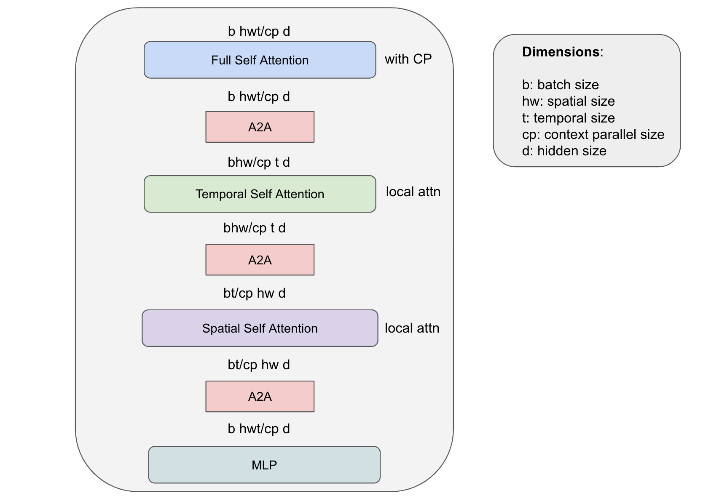

Diffusion Training Framework
=============

Overview
--------

The NeMo Diffusion Training Framework provides a scalable training platform for diffusion models with transformer backbones.  Our new features streamline the training process, allowing developers to efficiently train state-of-the-art models with ease. 

Some of the features we currently support include:

- Energon Dataloader for Webscale Dataloading
- Model and Data Parallelism
- Model Architectures: Original DiT, MovieGen 30B+ parameters, Spatio-Temporal DiT

Performance
---------------

We benchmarked 7B and 28B DiT cross attention models with context length 8k and 64k on 32 H100 DGX nodes.

- 8k context length corresponds to latent of 256 frames of 256px video.
- 64k context length corresponds to latent of 256 frames 1024px video.

.. list-table::
   :header-rows: 1
   :widths: 15 15 25 15 15

   * - Model size
     - Context length
     - Training config
     - GPU util. (TFLOPS/s)
     - Throughput (token/s/GPU)
   * - DiT 7B
     - 8k
     - baseline, no optimization
     - OOM
     - 
   * - DiT 7B
     - 8k
     - TP=2 SP
     - 519
     - 10052
   * - DiT 7B
     - 74k
     - TP=2 SP CP=4
     - 439
     - 3409
   * - DiT 28B
     - 8k
     - TP4 PP4
     - 468
     - 2510
   * - DiT 28B
     - 64k
     - FSDP act ckpt
     - 445
     - 1386

**Legend:**
- **FSDP**: Fully Sharded Data Parallelism
- **CP**: Context Parallelism
- **TP**: Tensor Parallelism
- **SP**: Sequence Parallelism
- **PP**: Pipeline Parallelism
- **EP**: Expert Parallelism
- **distop**: mcore distributed optmizer
- **act ckpt**: activation checkpointing

Features Status:
^^^^^^^^^^^^^^^

We support image/video diffusion training with all parallelism strategies. 

+---------------------------+------------------+
| Parallelism               | Status           |
+===========================+==================+
| FSDP                      | ✅ Supported     |
+---------------------------+------------------+
| CP+TP+SP+FSDP             | ✅ Supported     |
+---------------------------+------------------+
| CP+TP+SP+distopt          | ✅ Supported     |
+---------------------------+------------------+
| CP+TP+SP+PP+distopt       | ✅ Supported     |
+---------------------------+------------------+
| CP+TP+SP+PP+distopt+EP    | ✅ Supported     |
+---------------------------+------------------+
| CP+TP+SP+FSDP+EP          | ✅ Supported     |
+---------------------------+------------------+

Training Stages:
^^^^^^^^^^^^^^^^

+---------------+----------------------+-----------------+-----------------+
| Model Size    | Modality             | sequence length | Status          |
+===============+======================+=================+=================+
| DiT 5B, 30B+  | 256px image          | 256             | ✅ Supported    |
+---------------+----------------------+-----------------+-----------------+
| DiT 5B, 30B+  | 256px image+video    | 8k              | ✅ Supported    |
+---------------+----------------------+-----------------+-----------------+
| DiT 5B, 30B+  | 768px image+video    | 74k+            | ✅ Supported    |
+---------------+----------------------+-----------------+-----------------+

Energon Dataloader for Webscale Dataloading
-------------------------------------------

Webscale Dataloading
^^^^^^^^^^^^^^^^^^^^

Megatron-Energon is an optimized multi-modal dataloader for large-scale deep learning with Megatron. Energon allows for distributed loading of large training training data for multi-modal model training. Energon allows for blending many datasets together and distributing the dataloading workflow across multiple cluster nodes/processes while ensuring reproducibility and resumability. You can learn more about how to prepare your own image / video webdataset for diffusion training `here <data/readme.rst>`_.

Dataloader Checkpointing
^^^^^^^^^^^^^^^^^^^^^^^^

One of Energon's key features is its ability to save and restore its state. This functionality is crucial for long-running training processes, making the dataloader robust and recoverable after interruptions. By allowing checkpointing of the dataloader status, Energon ensures that training can be resumed from where it left off, saving time and computational resources in case of unexpected shutdowns or planned pauses in the training process. This makes it especially useful for large scale training as it requires several training jobs for end-to-end training.

Parallel Configuration
^^^^^^^^^^^^^^^^^^^^^^

Energon's architecture allows it to efficiently distribute data across multiple processing units, ensuring that each GPU or node receives a balanced workload. This parallelization not only increases the overall throughput of data processing but also helps in maintaining high utilization of available computational resources.

Mixed Image-Video Training
------------------------------

Our dataloader provides support for mixed image-video training by using the NeMo packed sequence feature to pack together images and videos of varying length into the same microbatch. The sequence packing mechanism uses the THD attention kernel, which allows us to increase the model FLOPs utilization (MFU) and efficiently process data with varying length.

.. image:: assets/mixed_training.png
   :alt: Mixed image-video dataloading strategy
   :scale: 50%
   :align: center

Model and Data Parallelism
--------------------------
NeMo provides support for training models using tensor parallelism, sequence parallelism, pipeline parallelism, and context parallelism. To support pipeline parallelism with conditional diffusion training, we duplicate the conditional embeddings across the pipeline stages, and perform an all-reduce during the backward pass. This approach uses more compute, but it has a lower communication cost than sending the conditional embeddings through different pipeline stages. 

.. image:: assets/pipeline_conditioning.png
   :alt: Conditioning mechanism for pipeline parallelism
   :scale: 50%
   :align: center

Model Architectures
-------------------

DiT
^^^
We implement an efficient version of the Diffusion Transformer (DiT) [1]_ with several variants to provide users with flexibility in exploring various model architectures.

The current supported architectures include:

- DiT adaLN-Zero (original DiT) [1]_
- DiT adaLN-Zero with Cross attention
- MovieGen [2]_
- Spatio-Temporal DiT (ST-DiT)

In the architectures using DiT adaLN-Zero, we also use a QK-layernorm for training stability for video diffusion training. We also provide an option to use cross-attention with additional conditioning information (i.e. text embeddings) for text-to-video training with the original DiT formulation. 

We also support MovieGen [2]_ training with a Llama-based model architecture that leverages FSDP for large model training (i.e. 30B+ parameters). 

Our framework allows for customizing the DiT architecture while maintaining its scalability, enabling training large DiT models on long sequence lengths. We provide functionality for ST-DiT, which utilizes spatial self attention and temporal self attention blocks operating on the spatial and temporal sequence dimensions, respectively. 
There are various challenges that emerge with specialized architectures. In the case of ST-DiT, one major challenge is that the spatial and temporal context lengths are much smaller than full input sequence length. This leads to a large communication cost when using CP for a small amount of computation. The P2P communication in context parallel is exposed and leads to longer training step times. For efficient training of ST-DiT, we propose a novel hybrid parallelism strategy, which leverages A2A communication and local attention computation for spatial and temporal self attention while using P2P communications with context parallelism in a ring topology. This approach reduces the bandwidth requirement by factor of hw/cp for temporal attention and t/cp for spatial attention while enjoying the benefits of context parallelism to split the workload of computing full self attention.

.. Data preparation
.. --------------------------

.. We expect data to be in this webdataset format. For more information about webdataset and energon dataset, please refer to https://github.com/NVIDIA/Megatron-Energon

.. Here we demonstrate a step by step example of how to prepare a dummy image dataset.

.. .. code-block:: bash

..     torchrun --nproc-per-node 2 nemo/collections/diffusion/data/prepare_energon_dataset.py --factory prepare_dummy_image_dataset

.. this will generate a folder a tar files. .pth contains image/video latent representations encode by image/video tokenizer, .json contains metadata including text caption, resolution, aspection ratio, and .pickle contains text embeddings encoded by language model like T5.

.. .. code-block:: bash

..    shard_000.tar
..    ├── samples/sample_0000.pth
..    ├── samples/sample_0000.pickle
..    ├── samples/sample_0000.json
..    ├── samples/sample_0001.pth
..    ├── samples/sample_0001.pickle
..    ├── samples/sample_0001.json
..    └── ...
..    shard_001.tar   

.. The following is a sample command to prepare prepare webdataset into energon dataset:

.. .. code-block:: bash

..    # energon prepare . --num-workers 192
..    Found 369057 tar files in total. The first and last ones are:
..    - 0.tar
..    - 99999.tar
..    If you want to exclude some of them, cancel with ctrl+c and specify an exclude filter in the command line.
..    Please enter a desired train/val/test split like "0.5, 0.2, 0.3" or "8,1,1": 1,0,0
..    Indexing shards  [####################################]  369057/369057
..    Sample 0, keys:
..    - .json
..    - .pickle
..    - .pth
..    Sample 1, keys:
..    - .json
..    - .pickle
..    - .pth
..    Found the following part types in the dataset: .json, .pth, .pickle
..    Do you want to create a dataset.yaml interactively? [Y/n]: Y
..    The following dataset classes are available:
..    0. CaptioningWebdataset
..    1. CrudeWebdataset
..    2. ImageClassificationWebdataset
..    3. ImageWebdataset
..    4. InterleavedWebdataset
..    5. MultiChoiceVQAWebdataset
..    6. OCRWebdataset
..    7. SimilarityInterleavedWebdataset
..    8. TextWebdataset
..    9. VQAOCRWebdataset
..    10. VQAWebdataset
..    11. VidQAWebdataset
..    Please enter a number to choose a class: 1
..    The dataset you selected uses the following sample type:

..    class CrudeSample(dict):
..       """Generic sample type to be processed later."""

..    CrudeWebdataset does not need a field map. You will need to provide a `Cooker` for your dataset samples in your `TaskEncoder`.
..    Furthermore, you might want to add `subflavors` in your meta dataset specification.

Model Training
--------------------------

docker container is required for training. You can obtain it from https://catalog.ngc.nvidia.com/orgs/nvidia/containers/nemo. Diffusion training uses ``nvcr.io/nvidia/nemo:cosmos.01``. It contains crucial dependencies for training to work.

training on single node inside container
^^^^^^^^^^^^^^^^^^^^^^

training on single node inside container is good for interactive developement and debugging

.. code-block:: bash

   docker run --gpus all --shm-size 32g --ipc=host -it -v `pwd`:/workspace/nemo -w /workspace/nemo nvcr.io/nvidia/nemo:cosmos.01 /bin/bash

.. raw:: html

    

      
example output

.. code-block:: text
    :class: collapsible-code

    Unable to find image 'nvcr.io/nvidia/nemo:cosmos.01' locally
    cosmos.01: Pulling from nvidia/nemo
    Digest: sha256:290b5745f4ed5f2f2953baf18f7a597896a73c014e3b6b9902dbd097e0914642
    Status: Downloaded newer image for nvcr.io/nvidia/nemo:cosmos.01
    
    =============
    == PyTorch ==
    =============
    
    NVIDIA Release 24.10 (build 114410972)
    PyTorch Version 2.5.0a0+e000cf0
    Container image Copyright (c) 2024, NVIDIA CORPORATION & AFFILIATES. All rights reserved.
    Copyright (c) 2014-2024 Facebook Inc.
    Copyright (c) 2011-2014 Idiap Research Institute (Ronan Collobert)
    Copyright (c) 2012-2014 Deepmind Technologies    (Koray Kavukcuoglu)
    Copyright (c) 2011-2012 NEC Laboratories America (Koray Kavukcuoglu)
    Copyright (c) 2011-2013 NYU                      (Clement Farabet)
    Copyright (c) 2006-2010 NEC Laboratories America (Ronan Collobert, Leon Bottou, Iain Melvin, Jason Weston)
    Copyright (c) 2006      Idiap Research Institute (Samy Bengio)
    Copyright (c) 2001-2004 Idiap Research Institute (Ronan Collobert, Samy Bengio, Johnny Mariethoz)
    Copyright (c) 2015      Google Inc.
    Copyright (c) 2015      Yangqing Jia
    Copyright (c) 2013-2016 The Caffe contributors
    All rights reserved.
    
    Various files include modifications (c) NVIDIA CORPORATION & AFFILIATES.  All rights reserved.
    
    This container image and its contents are governed by the NVIDIA Deep Learning Container License.
    By pulling and using the container, you accept the terms and conditions of this license:
    https://developer.nvidia.com/ngc/nvidia-deep-learning-container-license
    
    NOTE: CUDA Forward Compatibility mode ENABLED.
     Using CUDA 12.6 driver version 560.35.03 with kernel driver version 550.120.
     See https://docs.nvidia.com/deploy/cuda-compatibility/ for details.

    root@73020056c9d4:/workspace/nemo#

.. raw:: html

    

launch training

.. code-block:: bash

    PYTHONPATH=.:$PYTHONPATH torchrun --nproc-per-node=2 nemo/collections/diffusion/train.py --yes --factory train_mock trainer.strategy.tensor_model_parallel_size=1 trainer.strategy.context_parallel_size=1 trainer.strategy.sequence_parallel=False model.config.num_layers=1 data.global_batch_size=8 model.config.hidden_size=1024 data.seq_length=1024 data.task_encoder.seq_length=1024 model.config.num_layers=1

.. raw:: html

    

      
example output

.. code-block:: text
    :class: collapsible-code

    W1114 19:42:06.073000 322 torch/distributed/run.py:793]
    W1114 19:42:06.073000 322 torch/distributed/run.py:793] *****************************************
    W1114 19:42:06.073000 322 torch/distributed/run.py:793] Setting OMP_NUM_THREADS environment variable for each process to be 1 in default, to avoid your system being overloaded, please further tune the variable for optimal performance in your application as needed.
    W1114 19:42:06.073000 322 torch/distributed/run.py:793] *****************************************
    /usr/local/lib/python3.10/dist-packages/megatron/core/tensor_parallel/layers.py:290: FutureWarning: `torch.cuda.amp.custom_fwd(args...)` is deprecated. Please use `torch.amp.custom_fwd(args..., device_type='cuda')` instead.
      def forward(ctx, input, weight, bias, allreduce_dgrad):
    /usr/local/lib/python3.10/dist-packages/megatron/core/tensor_parallel/layers.py:301: FutureWarning: `torch.cuda.amp.custom_bwd(args...)` is deprecated. Please use `torch.amp.custom_bwd(args..., device_type='cuda')` instead.
      def backward(ctx, grad_output):
    /usr/local/lib/python3.10/dist-packages/megatron/core/tensor_parallel/layers.py:393: FutureWarning: `torch.cuda.amp.custom_fwd(args...)` is deprecated. Please use `torch.amp.custom_fwd(args..., device_type='cuda')` instead.
      def forward(
    /usr/local/lib/python3.10/dist-packages/megatron/core/tensor_parallel/layers.py:433: FutureWarning: `torch.cuda.amp.custom_bwd(args...)` is deprecated. Please use `torch.amp.custom_bwd(args..., device_type='cuda')` instead.
      def backward(ctx, grad_output):
    /usr/local/lib/python3.10/dist-packages/megatron/core/tensor_parallel/layers.py:290: FutureWarning: `torch.cuda.amp.custom_fwd(args...)` is deprecated. Please use `torch.amp.custom_fwd(args..., device_type='cuda')` instead.
      def forward(ctx, input, weight, bias, allreduce_dgrad):
    /usr/local/lib/python3.10/dist-packages/megatron/core/tensor_parallel/layers.py:301: FutureWarning: `torch.cuda.amp.custom_bwd(args...)` is deprecated. Please use `torch.amp.custom_bwd(args..., device_type='cuda')` instead.
      def backward(ctx, grad_output):
    /usr/local/lib/python3.10/dist-packages/megatron/core/tensor_parallel/layers.py:393: FutureWarning: `torch.cuda.amp.custom_fwd(args...)` is deprecated. Please use `torch.amp.custom_fwd(args..., device_type='cuda')` instead.
      def forward(
    /usr/local/lib/python3.10/dist-packages/megatron/core/tensor_parallel/layers.py:433: FutureWarning: `torch.cuda.amp.custom_bwd(args...)` is deprecated. Please use `torch.amp.custom_bwd(args..., device_type='cuda')` instead.
      def backward(ctx, grad_output):
    [NeMo W 2024-11-14 19:42:12 ssm:31] The package `megatron.core` was not imported in this environment which is needed for SSMs.
    [NeMo W 2024-11-14 19:42:15 nemo_logging:361] /usr/local/lib/python3.10/dist-packages/torch/functional.py:534: UserWarning: torch.meshgrid: in an upcoming release, it will be required to pass the indexing argument. (Triggered internally at /opt/pytorch/pytorch/aten/src/ATen/native/TensorShape.cpp:3595.)
          return _VF.meshgrid(tensors, **kwargs)  # type: ignore[attr-defined]
    
    Dry run for task nemo.collections.llm.api:train
    Resolved Arguments
    Dry run for task nemo.collections.llm.api:train
    Resolved Arguments
    ┏━━━━━━━━━━━━━━━━━━━━━━┳━━━━━━━━━━━━━━━━━━━━━━━━━━━━━━━━━━━━━━━━━━━━━━━━━━━━━━━━━━━━━━┓
    ┃ Argument Name        ┃ Resolved Value                                               ┃
    ┡━━━━━━━━━━━━━━━━━━━━━━╇━━━━━━━━━━━━━━━━━━━━━━━━━━━━━━━━━━━━━━━━━━━━━━━━━━━━━━━━━━━━━━┩
    │ data                 │ VideoLatentFakeDataModule(                                   │
    │                      │   model_config=DiTLlama5BConfig(                             │
    │                      │     use_cpu_initialization=True,                             │
    │                      │     num_layers=1,                                            │
    │                      │     hidden_size=1024,                                        │
    │                      │     max_frames=1),                                           │
    │                      │   seq_length=1024,                                           │
    │                      │   micro_batch_size=1,                                        │
    │                      │   global_batch_size=8,                                       │
    │                      │   task_encoder=BasicDiffusionTaskEncoder(seq_length=1024))   │
    │ log                  │ NeMoLogger(                                                  │
    │                      │   name='default',                                            │
    │                      │   log_dir='nemo_experiments/train_mock',                     │
    │                      │   explicit_log_dir=None,                                     │
    │                      │   version=None,                                              │
    │                      │   use_datetime_version=True,                                 │
    │                      │   log_local_rank_0_only=False,                               │
    │                      │   log_global_rank_0_only=False,                              │
    │                      │   files_to_copy=None,                                        │
    │                      │   update_logger_directory=True,                              │
    │                      │   ckpt=None,                                                 │
    │                      │   tensorboard=None,                                          │
    │                      │   wandb=None,                                                │
    │                      │   extra_loggers=[])                                          │
    │ model                │ DiTModel(                                                    │
    │                      │   config=DiTLlama5BConfig(                                   │
    │                      │     use_cpu_initialization=True,                             │
    │                      │     num_layers=1,                                            │
    │                      │     hidden_size=1024,                                        │
    │                      │     max_frames=1))                                           │
    │ model_transform      │ None                                                         │
    │ optim                │ MegatronOptimizerModule(                                     │
    │                      │   config=OptimizerConfig(                                    │
    │                      │     lr=0.0001,                                               │
    │                      │     weight_decay=0,                                          │
    │                      │     bf16=True,                                               │
    │                      │     params_dtype=torch.bfloat16,                             │
    │                      │     use_distributed_optimizer=True))                         │
    │ resume               │ AutoResume(                                                  │
    │                      │   resume_if_exists=True,                                     │
    │                      │   resume_past_end=True,                                      │
    │                      │   resume_ignore_no_checkpoint=True)                          │
    │ tokenizer            │ None                                                         │
    │ trainer              │ Trainer(                                                     │
    │                      │   devices='auto',                                            │
    │                      │   num_nodes=1,                                               │
    │                      │   accelerator='gpu',                                         │
    │                      │   strategy=MegatronStrategy(                                 │
    │                      │     tensor_model_parallel_size=1,                            │
    │                      │     pipeline_model_parallel_size=1,                          │
    │                      │     context_parallel_size=1,                                 │
    │                      │     sequence_parallel=False,                                 │
    │                      │     ddp=DistributedDataParallelConfig(                       │
    │                      │       grad_reduce_in_fp32=True,                              │
    │                      │       overlap_grad_reduce=True,                              │
    │                      │       overlap_param_gather=True,                             │
    │                      │       check_for_nan_in_grad=True,                            │
    │                      │       with_megatron_fsdp_code_path=True,                     │
    │                      │       data_parallel_sharding_strategy='MODEL_AND_OPTIMIZER_… │
    │                      │     pipeline_dtype=torch.bfloat16),                          │
    │                      │   plugins=<nemo.lightning.pytorch.plugins.mixed_precision.M… │
    │                      │ object at 0x76a56627bca0>,                                   │
    │                      │   num_sanity_val_steps=0,                                    │
    │                      │   limit_val_batches=0,                                       │
    │                      │   val_check_interval=1.0,                                    │
    │                      │   max_epochs=10000,                                          │
    │                      │   log_every_n_steps=1,                                       │
    │                      │   callbacks=[ModelCheckpoint(                                │
    │                      │     monitor='global_step',                                   │
    │                      │     save_top_k=3,                                            │
    │                      │     mode='max',                                              │
    │                      │     every_n_train_steps=1000,                                │
    │                      │     filename='{global_step}'), PreemptionCallback(),         │
    │                      │ TimingCallback(),                                            │
    │                      │ MegatronCommOverlapCallback(tp_comm_overlap=False)])         │
    └──────────────────────┴──────────────────────────────────────────────────────────────┘
    Launching None...
    ┏━━━━━━━━━━━━━━━━━━━━━━┳━━━━━━━━━━━━━━━━━━━━━━━━━━━━━━━━━━━━━━━━━━━━━━━━━━━━━━━━━━━━━━┓
    ┃ Argument Name        ┃ Resolved Value                                               ┃
    ┡━━━━━━━━━━━━━━━━━━━━━━╇━━━━━━━━━━━━━━━━━━━━━━━━━━━━━━━━━━━━━━━━━━━━━━━━━━━━━━━━━━━━━━┩
    │ data                 │ VideoLatentFakeDataModule(                                   │
    │                      │   model_config=DiTLlama5BConfig(                             │
    │                      │     use_cpu_initialization=True,                             │
    │                      │     num_layers=1,                                            │
    │                      │     hidden_size=1024,                                        │
    │                      │     max_frames=1),                                           │
    │                      │   seq_length=1024,                                           │
    │                      │   micro_batch_size=1,                                        │
    │                      │   global_batch_size=8,                                       │
    │                      │   task_encoder=BasicDiffusionTaskEncoder(seq_length=1024))   │
    │ log                  │ NeMoLogger(                                                  │
    │                      │   name='default',                                            │
    │                      │   log_dir='nemo_experiments/train_mock',                     │
    │                      │   explicit_log_dir=None,                                     │
    │                      │   version=None,                                              │
    │                      │   use_datetime_version=True,                                 │
    │                      │   log_local_rank_0_only=False,                               │
    │                      │   log_global_rank_0_only=False,                              │
    │                      │   files_to_copy=None,                                        │
    │                      │   update_logger_directory=True,                              │
    │                      │   ckpt=None,                                                 │
    │                      │   tensorboard=None,                                          │
    │                      │   wandb=None,                                                │
    │                      │   extra_loggers=[])                                          │
    │ model                │ DiTModel(                                                    │
    │                      │   config=DiTLlama5BConfig(                                   │
    │                      │     use_cpu_initialization=True,                             │
    │                      │     num_layers=1,                                            │
    │                      │     hidden_size=1024,                                        │
    │                      │     max_frames=1))                                           │
    │ model_transform      │ None                                                         │
    │ optim                │ MegatronOptimizerModule(                                     │
    │                      │   config=OptimizerConfig(                                    │
    │                      │     lr=0.0001,                                               │
    │                      │     weight_decay=0,                                          │
    │                      │     bf16=True,                                               │
    │                      │     params_dtype=torch.bfloat16,                             │
    │                      │     use_distributed_optimizer=True))                         │
    │ resume               │ AutoResume(                                                  │
    │                      │   resume_if_exists=True,                                     │
    │                      │   resume_past_end=True,                                      │
    │                      │   resume_ignore_no_checkpoint=True)                          │
    │ tokenizer            │ None                                                         │
    │ trainer              │ Trainer(                                                     │
    │                      │   devices='auto',                                            │
    │                      │   num_nodes=1,                                               │
    │                      │   accelerator='gpu',                                         │
    │                      │   strategy=MegatronStrategy(                                 │
    │                      │     tensor_model_parallel_size=1,                            │
    │                      │     pipeline_model_parallel_size=1,                          │
    │                      │     context_parallel_size=1,                                 │
    │                      │     sequence_parallel=False,                                 │
    │                      │     ddp=DistributedDataParallelConfig(                       │
    │                      │       grad_reduce_in_fp32=True,                              │
    │                      │       overlap_grad_reduce=True,                              │
    │                      │       overlap_param_gather=True,                             │
    │                      │       check_for_nan_in_grad=True,                            │
    │                      │       with_megatron_fsdp_code_path=True,                     │
    │                      │       data_parallel_sharding_strategy='MODEL_AND_OPTIMIZER_… │
    │                      │     pipeline_dtype=torch.bfloat16),                          │
    │                      │   plugins=<nemo.lightning.pytorch.plugins.mixed_precision.M… │
    │                      │ object at 0x718506b145e0>,                                   │
    │                      │   num_sanity_val_steps=0,                                    │
    │                      │   limit_val_batches=0,                                       │
    │                      │   val_check_interval=1.0,                                    │
    │                      │   max_epochs=10000,                                          │
    │                      │   log_every_n_steps=1,                                       │
    │                      │   callbacks=[ModelCheckpoint(                                │
    │                      │     monitor='global_step',                                   │
    │                      │     save_top_k=3,                                            │
    │                      │     mode='max',                                              │
    │                      │     every_n_train_steps=1000,                                │
    │                      │     filename='{global_step}'), PreemptionCallback(),         │
    │                      │ TimingCallback(),                                            │
    │                      │ MegatronCommOverlapCallback(tp_comm_overlap=False)])         │
    └──────────────────────┴──────────────────────────────────────────────────────────────┘
    Launching None...
    GPU available: True (cuda), used: True
    TPU available: False, using: 0 TPU cores
    HPU available: False, using: 0 HPUs
    `Trainer(val_check_interval=1.0)` was configured so validation will run at the end of the training epoch..
    [NeMo W 2024-11-14 19:42:15 nemo_logger:123] No version folders would be created under the log folder as 'resume_if_exists' is enabled.
    [NeMo I 2024-11-14 19:42:15 nemo_logger:145] Experiments will be logged at nemo_experiments/train_mock/default
    [NeMo W 2024-11-14 19:42:15 nemo_logger:173] "update_logger_directory" is True. Overwriting tensorboard logger "save_dir" to nemo_experiments/train_mock
    [NeMo W 2024-11-14 19:42:15 resume:215] There were no checkpoints found in checkpoint_dir or no checkpoint folder at checkpoint_dir :nemo_experiments/train_mock/default/checkpoints. Training from scratch.
    [NeMo I 2024-11-14 19:42:15 megatron_strategy:310] Fixing mis-match between ddp-config & mcore-optimizer config
    [NeMo I 2024-11-14 19:42:15 megatron_init:396] Rank 0 has data parallel group : [0, 1]
    [NeMo I 2024-11-14 19:42:15 megatron_init:402] Rank 0 has combined group of data parallel and context parallel : [0, 1]
    [NeMo I 2024-11-14 19:42:15 megatron_init:407] All data parallel group ranks with context parallel combined: [[0, 1]]
    [NeMo I 2024-11-14 19:42:15 megatron_init:410] Ranks 0 has data parallel rank: 0
    [NeMo I 2024-11-14 19:42:15 megatron_init:418] Rank 0 has context parallel group: [0]
    [NeMo I 2024-11-14 19:42:15 megatron_init:421] All context parallel group ranks: [[0], [1]]
    [NeMo I 2024-11-14 19:42:15 megatron_init:422] Ranks 0 has context parallel rank: 0
    [NeMo I 2024-11-14 19:42:15 megatron_init:429] Rank 0 has model parallel group: [0]
    [NeMo I 2024-11-14 19:42:15 megatron_init:430] All model parallel group ranks: [[0], [1]]
    [NeMo I 2024-11-14 19:42:15 megatron_init:439] Rank 0 has tensor model parallel group: [0]
    [NeMo I 2024-11-14 19:42:15 megatron_init:443] All tensor model parallel group ranks: [[0], [1]]
    [NeMo I 2024-11-14 19:42:15 megatron_init:444] Rank 0 has tensor model parallel rank: 0
    [NeMo I 2024-11-14 19:42:15 megatron_init:464] Rank 0 has pipeline model parallel group: [0]
    [NeMo I 2024-11-14 19:42:15 megatron_init:476] Rank 0 has embedding group: [0]
    [NeMo I 2024-11-14 19:42:15 megatron_init:482] All pipeline model parallel group ranks: [[0], [1]]
    [NeMo I 2024-11-14 19:42:15 megatron_init:483] Rank 0 has pipeline model parallel rank 0
    [NeMo I 2024-11-14 19:42:15 megatron_init:484] All embedding group ranks: [[0], [1]]
    [NeMo I 2024-11-14 19:42:15 megatron_init:485] Rank 0 has embedding rank: 0
    Initializing distributed: GLOBAL_RANK: 0, MEMBER: 1/2
    ----------------------------------------------------------------------------------------------------
    distributed_backend=nccl
    All distributed processes registered. Starting with 2 processes
    ----------------------------------------------------------------------------------------------------
    
    Initializing distributed: GLOBAL_RANK: 1, MEMBER: 2/2
    LOCAL_RANK: 1 - CUDA_VISIBLE_DEVICES: [0,1]
    [NeMo W 2024-11-14 19:42:16 nemo_logging:361] /usr/local/lib/python3.10/dist-packages/torch/random.py:183: UserWarning: CUDA reports that you have 2 available devices, and you have used fork_rng without explicitly specifying which devices are being used. For safety, we initialize *every* CUDA device by default, which can be quite slow if you have a lot of CUDAs. If you know that you are only making use of a few CUDA devices, set the environment variable CUDA_VISIBLE_DEVICES or the 'devices' keyword argument of fork_rng with the set of devices you are actually using. For example, if you are using CPU only, set device.upper()_VISIBLE_DEVICES= or devices=[]; if you are using device 0 only, set CUDA_VISIBLE_DEVICES=0 or devices=[0].  To initialize all devices and suppress this warning, set the 'devices' keyword argument to `range(torch.cuda.device_count())`.
          warnings.warn(message)
    
    LOCAL_RANK: 0 - CUDA_VISIBLE_DEVICES: [0,1]
    [NeMo W 2024-11-14 19:42:16 megatron_strategy:324] Could not copy Trainer's 'max_steps' to LR scheduler's 'max_steps'. If you are not using an LR scheduler, this warning can safely be ignored.
    [NeMo I 2024-11-14 19:42:16 num_microbatches_calculator:218] setting number of microbatches to constant 4
    [NeMo I 2024-11-14 19:42:16 megatron_parallel:550]  > number of parameters on (tensor, pipeline) model parallel rank (0, 0): 40950336
    [NeMo I 2024-11-14 19:42:16 utils:259] Setting up DistributedDataParallel with config DistributedDataParallelConfig(grad_reduce_in_fp32=True, overlap_grad_reduce=True, overlap_param_gather=True, align_param_gather=False, use_distributed_optimizer=True, check_for_nan_in_grad=True, bucket_size=134217728, average_in_collective=False, fp8_param_gather=False, with_megatron_fsdp_code_path=True, data_parallel_sharding_strategy='MODEL_AND_OPTIMIZER_STATES')
    [NeMo I 2024-11-14 19:42:16 param_and_grad_buffer:630] Number of buckets for gradient all-reduce / reduce-scatter: 2
    [NeMo I 2024-11-14 19:42:16 param_and_grad_buffer:637] Params for bucket 1 (2610752 elements, dtype torch.bfloat16):
    [NeMo I 2024-11-14 19:42:16 param_and_grad_buffer:639]     module.t_embedder.1.linear_1.weight
    [NeMo I 2024-11-14 19:42:16 param_and_grad_buffer:639]     module.t_embedder.1.linear_1.bias
    [NeMo I 2024-11-14 19:42:16 param_and_grad_buffer:639]     module.t_embedder.1.linear_2.weight
    [NeMo I 2024-11-14 19:42:16 param_and_grad_buffer:639]     module.t_embedder.1.linear_2.bias
    [NeMo I 2024-11-14 19:42:16 param_and_grad_buffer:639]     module.fps_embedder.1.linear_1.weight
    [NeMo I 2024-11-14 19:42:16 param_and_grad_buffer:639]     module.fps_embedder.1.linear_1.bias
    [NeMo I 2024-11-14 19:42:16 param_and_grad_buffer:639]     module.fps_embedder.1.linear_2.weight
    [NeMo I 2024-11-14 19:42:16 param_and_grad_buffer:639]     module.fps_embedder.1.linear_2.bias
    [NeMo I 2024-11-14 19:42:16 param_and_grad_buffer:639]     module.x_embedder.weight
    [NeMo I 2024-11-14 19:42:16 param_and_grad_buffer:639]     module.x_embedder.bias
    [NeMo I 2024-11-14 19:42:16 param_and_grad_buffer:639]     module.pos_embedder.emb_t.weight
    [NeMo I 2024-11-14 19:42:16 param_and_grad_buffer:639]     module.pos_embedder.emb_h.weight
    [NeMo I 2024-11-14 19:42:16 param_and_grad_buffer:639]     module.pos_embedder.emb_w.weight
    [NeMo I 2024-11-14 19:42:16 param_and_grad_buffer:639]     module.final_layer_linear.weight
    [NeMo I 2024-11-14 19:42:16 param_and_grad_buffer:639]     module.final_layer_linear.bias
    [NeMo I 2024-11-14 19:42:16 param_and_grad_buffer:639]     module.affline_norm.weight
    [NeMo I 2024-11-14 19:42:16 param_and_grad_buffer:637] Params for bucket 2 (38339584 elements, dtype torch.bfloat16):
    [NeMo I 2024-11-14 19:42:16 param_and_grad_buffer:639]     module.decoder.layers.0.self_attention.linear_proj.weight
    [NeMo I 2024-11-14 19:42:16 param_and_grad_buffer:639]     module.decoder.layers.0.self_attention.linear_qkv.weight
    [NeMo I 2024-11-14 19:42:16 param_and_grad_buffer:639]     module.decoder.layers.0.cross_attention.linear_proj.weight
    [NeMo I 2024-11-14 19:42:16 param_and_grad_buffer:639]     module.decoder.layers.0.cross_attention.linear_q.weight
    [NeMo I 2024-11-14 19:42:16 param_and_grad_buffer:639]     module.decoder.layers.0.cross_attention.linear_kv.weight
    [NeMo I 2024-11-14 19:42:16 param_and_grad_buffer:639]     module.decoder.layers.0.mlp.linear_fc1.weight
    [NeMo I 2024-11-14 19:42:16 param_and_grad_buffer:639]     module.decoder.layers.0.mlp.linear_fc2.weight
    [NeMo I 2024-11-14 19:42:16 param_and_grad_buffer:639]     module.decoder.layers.0.adaLN.ln.weight
    [NeMo I 2024-11-14 19:42:16 param_and_grad_buffer:639]     module.decoder.layers.0.adaLN.adaLN_modulation.1.weight
    [NeMo I 2024-11-14 19:42:16 utils:259] Setting up optimizer with config OptimizerConfig(optimizer='adam', lr=0.0001, min_lr=None, decoupled_lr=None, decoupled_min_lr=None, weight_decay=0, fp16=False, bf16=True, params_dtype=torch.float32, loss_scale=None, initial_loss_scale=4294967296, min_loss_scale=1.0, loss_scale_window=1000, hysteresis=2, adam_beta1=0.9, adam_beta2=0.999, adam_eps=1e-08, sgd_momentum=0.9, use_distributed_optimizer=True, overlap_param_gather_with_optimizer_step=False, clip_grad=1.0, log_num_zeros_in_grad=False, barrier_with_L1_time=False, timers=None, config_logger_dir='')
    
      | Name   | Type | Params | Mode
    ----------------------------------------
    0 | module | DDP  | 41.0 M | train
    ----------------------------------------
    41.0 M    Trainable params
    0         Non-trainable params
    41.0 M    Total params
    163.801   Total estimated model params size (MB)
    57        Modules in train mode
    0         Modules in eval mode
    [NeMo W 2024-11-14 19:42:16 nemo_logging:361] /usr/local/lib/python3.10/dist-packages/pytorch_lightning/trainer/connectors/data_connector.py:424: The 'train_dataloader' does not have many workers which may be a bottleneck. Consider increasing the value of the `num_workers` argument` to `num_workers=11` in the `DataLoader` to improve performance.
    
    Training epoch 0, iteration 0/49999999 | lr: 0.0001 | global_batch_size: 8 | global_step: 0 | reduced_train_loss: 0.5288 | train_step_timing in s: 4.022
    Training epoch 0, iteration 1/49999999 | lr: 0.0001 | global_batch_size: 8 | global_step: 1 | reduced_train_loss: 0.6615 | train_step_timing in s: 0.4357 | consumed_samples: 16
    Training epoch 0, iteration 2/49999999 | lr: 0.0001 | global_batch_size: 8 | global_step: 2 | reduced_train_loss: 0.4545 | train_step_timing in s: 0.4321 | consumed_samples: 24
    Training epoch 0, iteration 3/49999999 | lr: 0.0001 | global_batch_size: 8 | global_step: 3 | reduced_train_loss: 0.4423 | train_step_timing in s: 0.4294 | consumed_samples: 32
    Training epoch 0, iteration 4/49999999 | lr: 0.0001 | global_batch_size: 8 | global_step: 4 | reduced_train_loss: 0.5129 | train_step_timing in s: 0.4287 | consumed_samples: 40
    Training epoch 0, iteration 5/49999999 | lr: 0.0001 | global_batch_size: 8 | global_step: 5 | reduced_train_loss: 0.4035 | train_step_timing in s: 0.4291 | consumed_samples: 48
    Training epoch 0, iteration 6/49999999 | lr: 0.0001 | global_batch_size: 8 | global_step: 6 | reduced_train_loss: 0.4685 | train_step_timing in s: 0.4349 | consumed_samples: 56
    Training epoch 0, iteration 7/49999999 | lr: 0.0001 | global_batch_size: 8 | global_step: 7 | reduced_train_loss: 0.5455 | train_step_timing in s: 0.4331 | consumed_samples: 64
    Training epoch 0, iteration 8/49999999 | lr: 0.0001 | global_batch_size: 8 | global_step: 8 | reduced_train_loss: 0.3872 | train_step_timing in s: 0.4341 | consumed_samples: 72
    Training epoch 0, iteration 9/49999999 | lr: 0.0001 | global_batch_size: 8 | global_step: 9 | reduced_train_loss: 0.3873 | train_step_timing in s: 0.4408 | consumed_samples: 80
    Training epoch 0, iteration 10/49999999 | lr: 0.0001 | global_batch_size: 8 | global_step: 10 | reduced_train_loss: 0.3232 | train_step_timing in s: 0.4395 | consumed_samples: 88
    Training epoch 0, iteration 11/49999999 | lr: 0.0001 | global_batch_size: 8 | global_step: 11 | reduced_train_loss: 0.2209 | train_step_timing in s: 0.435 | consumed_samples: 96
    Training epoch 0, iteration 12/49999999 | lr: 0.0001 | global_batch_size: 8 | global_step: 12 | reduced_train_loss: 0.3828 | train_step_timing in s: 0.4333 | consumed_samples: 104
    Training epoch 0, iteration 13/49999999 | lr: 0.0001 | global_batch_size: 8 | global_step: 13 | reduced_train_loss: 0.2317 | train_step_timing in s: 0.4389 | consumed_samples: 112
    Training epoch 0, iteration 14/49999999 | lr: 0.0001 | global_batch_size: 8 | global_step: 14 | reduced_train_loss: 0.3052 | train_step_timing in s: 0.4324 | consumed_samples: 120
    Training epoch 0, iteration 15/49999999 | lr: 0.0001 | global_batch_size: 8 | global_step: 15 | reduced_train_loss: 0.3763 | train_step_timing in s: 0.4301 | consumed_samples: 128

.. raw:: html

    

multinode training with slurm
^^^^^^^^^^^^^^^^^^^^^^

The slurm launch script is `<scripts/train.sh>`_.  You can use it with either sbatch or salloc then srun. 

example to use sbatch

.. code-block:: bash

   sbatch nemo/collections/diffusion/scripts/train.sh \
   --factory mock_dit7b_8k  \
   trainer.strategy.tensor_model_parallel_size=1 \
   trainer.strategy.sequence_parallel=False \
   trainer.strategy.context_parallel_size=1 \
   model.config.recompute_granularity=full \
   model.config.recompute_method=uniform \
   model.config.recompute_num_layers=1 \
   data.micro_batch_size=1 \
   data.global_batch_size=256 \
   data.seq_length=65536 \
   data.task_encoder.seq_length=65536

example to use salloc

.. code-block:: bash

   salloc -A YOUR_ACCOUNT  --exclusive --mem=0 --overcommit  -N16 --tasks-per-node=8 --gpus-per-node=8 -p YOUR_PARTITION -t 4:00:0

.. raw:: html

    

      
example output

.. code-block:: text
    :class: collapsible-code
    
    salloc: Pending job allocation 945185
    salloc: job 945185 queued and waiting for resources
    salloc: job 945185 has been allocated resources
    salloc: Granted job allocation 945185
    salloc: Waiting for resource configuration

.. raw:: html

    

then use bash instead of sbatch to run ``nemo/collections/diffusion/scripts/train.sh``

Citations
---------

.. [1] William Peebles and Saining Xie, "Scalable Diffusion Models with Transformers," *arXiv preprint arXiv:2212.09748*, 2022.
.. [2] The Movie Gen team @ Meta, "Movie Gen: A Cast of Media Foundation Models", *arXiv preprint arXiv:2410.13720*, 2024.
