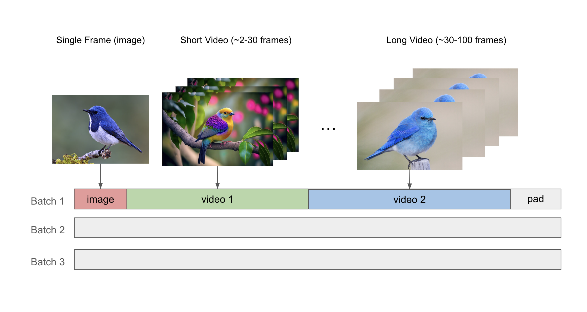
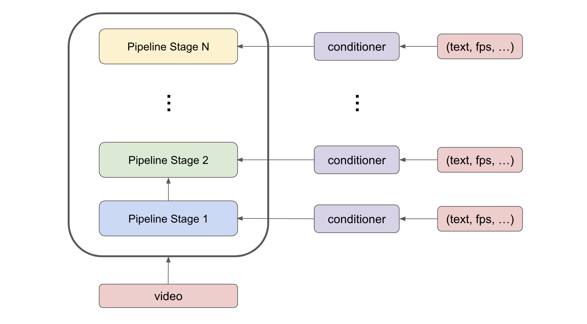

Diffusion Training Framework
=============

Overview
--------

The NeMo Diffusion Training Framework provides a scalable training platform for diffusion models with transformer backbones.  Our new features streamline the training process, allowing developers to efficiently train state-of-the-art models with ease. 

Some of the features we currently support include:

- Energon Dataloader for Webscale Dataloading
- Model and Data Parallelism
- Model Architectures: DiT 30B parameters or even more

Features Status
---------------

We support image diffusion training. Video training incoming.

+---------------------------+------------------+
| Parallelism               | Status           |
+===========================+==================+
| FSDP                      | ✅ Supported     |
+---------------------------+------------------+
| CP+TP+SP+distopt          | ✅ Supported     |
+---------------------------+------------------+
| CP+TP+SP+PP+distopt       | ✅ Supported     |
+---------------------------+------------------+
| CP+TP+SP+FSDP             | 🕒 Coming Soon   |
+---------------------------+------------------+

**Legend:**
- **FSDP**: Fully Sharded Data Parallelism
- **CP**: Context Parallelism
- **TP**: Tensor Parallelism
- **SP**: Sequence Parallelism
- **PP**: Pipeline Parallelism
- **distop**: mcore distributed optmizer

+--------------+-------------------+-----------------+
| Model Size   | Modality          | Status          |
+==============+===================+=================+
| DiT 30B+     | 256px image       | ✅ Supported    |
+--------------+-------------------+-----------------+
| DiT 30B+     | 256px image+video | 🕒 Coming Soon  |
+--------------+-------------------+-----------------+
| DiT 30B+     | 768px image+video | 🕒 Coming Soon  |
+--------------+-------------------+-----------------+

Energon Dataloader for Webscale Dataloading
-------------------------------------------

Webscale Dataloading
^^^^^^^^^^^^^^^^^^^^

Megatron-Energon is an optimized multi-modal dataloader for large-scale deep learning with Megatron. Energon allows for distributed loading of large training training data for multi-modal model training. Energon allows for blending many datasets together and distributing the dataloading workflow across multiple cluster nodes/processes while ensuring reproducibility and resumability. 

Dataloader Checkpointing
^^^^^^^^^^^^^^^^^^^^^^^^

One of Energon's key features is its ability to save and restore its state. This functionality is crucial for long-running training processes, making the dataloader robust and recoverable after interruptions. By allowing checkpointing of the dataloader status, Energon ensures that training can be resumed from where it left off, saving time and computational resources in case of unexpected shutdowns or planned pauses in the training process. This makes it especially useful for large scale training as it requires several training jobs for end-to-end training.

Parallel Configuration
^^^^^^^^^^^^^^^^^^^^^^

Energon's architecture allows it to efficiently distribute data across multiple processing units, ensuring that each GPU or node receives a balanced workload. This parallelization not only increases the overall throughput of data processing but also helps in maintaining high utilization of available computational resources.

Mixed Image-Video Training (comming soon)
------------------------------

Our dataloader provides support for mixed image-video training by using the NeMo packed sequence feature to pack together images and videos of varying length into the same microbatch. The sequence packing mechanism uses the THD attention kernel, which allows us to increase the model FLOPs utilization (MFU) and efficiently process data with varying length.

Model and Data Parallelism
--------------------------
NeMo provides support for training models using tensor parallelism, sequence parallelism, pipeline parallelism, and context parallelism. To support pipeline parallelism with conditional diffusion training, we duplicate the conditional embeddings across the pipeline stages, and perform an all-reduce during the backward pass. This approach uses more compute, but it has a lower communication cost than sending the conditional embeddings through different pipeline stages. 

Model Architectures
-------------------

DiT
^^^
We implement an efficient version of the diffusion transformer (DiT) [1]_. Our DiT is slightly modified from the original paper as we use cross attention and adaptive layernorm together in the same architecture. We also use a QK-layernorm for training stability. Our framework allows for customizing the DiT architecture while maintaining its scalability, enabling training large DiT models on long sequence lengths.

Data preparation
--------------------------

We expect data to be in this webdataset format. For more information about webdataset and energon dataset, please refer to https://github.com/NVIDIA/Megatron-Energon

Here we demonstrate a step by step example of how to prepare a dummy image dataset.

.. code-block:: bash

    torchrun --nproc-per-node 2 nemo/collections/diffusion/data/prepare_energon_dataset.py --factory prepare_dummy_image_dataset

this will generate a folder a tar files. .pth contains image/video latent representations encode by image/video tokenizer, .json contains metadata including text caption, resolution, aspection ratio, and .pickle contains text embeddings encoded by language model like T5.

.. code-block:: bash

   shard_000.tar
   ├── samples/sample_0000.pth
   ├── samples/sample_0000.pickle
   ├── samples/sample_0000.json
   ├── samples/sample_0001.pth
   ├── samples/sample_0001.pickle
   ├── samples/sample_0001.json
   └── ...
   shard_001.tar   

The following is a sample command to prepare prepare webdataset into energon dataset:

.. code-block:: bash

   # energon prepare . --num-workers 192
   Found 369057 tar files in total. The first and last ones are:
   - 0.tar
   - 99999.tar
   If you want to exclude some of them, cancel with ctrl+c and specify an exclude filter in the command line.
   Please enter a desired train/val/test split like "0.5, 0.2, 0.3" or "8,1,1": 1,0,0
   Indexing shards  [####################################]  369057/369057
   Sample 0, keys:
   - .json
   - .pickle
   - .pth
   Sample 1, keys:
   - .json
   - .pickle
   - .pth
   Found the following part types in the dataset: .json, .pth, .pickle
   Do you want to create a dataset.yaml interactively? [Y/n]: Y
   The following dataset classes are available:
   0. CaptioningWebdataset
   1. CrudeWebdataset
   2. ImageClassificationWebdataset
   3. ImageWebdataset
   4. InterleavedWebdataset
   5. MultiChoiceVQAWebdataset
   6. OCRWebdataset
   7. SimilarityInterleavedWebdataset
   8. TextWebdataset
   9. VQAOCRWebdataset
   10. VQAWebdataset
   11. VidQAWebdataset
   Please enter a number to choose a class: 1
   The dataset you selected uses the following sample type:

   class CrudeSample(dict):
      """Generic sample type to be processed later."""

   CrudeWebdataset does not need a field map. You will need to provide a `Cooker` for your dataset samples in your `TaskEncoder`.
   Furthermore, you might want to add `subflavors` in your meta dataset specification.

training
--------------------------

To launch training on one node

.. code-block:: bash

   torchrun --nproc-per-node 8 nemo/collections/diffusion/train.py --yes --factory pretrain_xl

To launch training on multiple nodes using Slurm

.. code-block:: bash

   sbatch nemo/collections/diffusion/scripts/train.sh --factory pretrain_xl

Citations
---------

.. [1] William Peebles and Saining Xie, "Scalable Diffusion Models with Transformers," *arXiv preprint arXiv:2212.09748*, 2022.