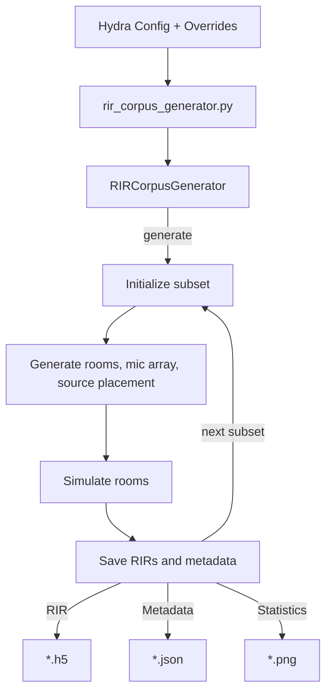

# RIR Corpus Generator

## Outline

This tool can be used to generate a corpus of room impulse responses (RIR) for a set of randomly generated rooms and microphone array placements. The tool is using [Pyroomacoustics](https://github.com/LCAV/pyroomacoustics) to simulate RIRs.

The generator loads configuration from a config file, generates RIRs, saves the metadata in a manifest file and RIRs in a HDF5 file.



## Features

The generator is easily reconfigurable and supports configuration of the following options

- Number of rooms for each subset, range of dimensions and RT60 for randomization
- Microphone array placement and orientation randomization
- Number of sources per room and their placement inside the room

## Parameters

An example of a RIR corpus generator setup is provided in `conf/rir_corpus.yaml`

## Example

The RIR corpus generator with the example config can be used by running:

```bash
python rir_corpus_generator.py output_dir=OUTPUT_DIR
```

where `OUTPUT_DIR` is a path to the output directory.

The output will be structured as

```bash
OUTPUT_DIR
+--{train, dev, test}
|	+--*.h5
+--config.yaml
+--{train, dev, test}_manifest.json
+--{train, dev, test}_info.png
```

Each directoy, e.g, `{train, dev, test}`, corresponds to a subset of data and contain the `*.h5` files with RIRs. Corresponding `*_manifest.json` files contain metadata for each subset. Each row corresponds to a single room/`*.h5` file and includes the following fields

- `room_filepath`: path to `*.h5` file with RIRs
- `sample_rate`: sample rate
- `dim`: dimensions of the room `[width, length, height]`
- `num_sources`: number of sources simulated in this room
- `rir_rt60_theory`: Theoretically calculated RT60
- `rir_rt60_measured`: RT60 calculated from the generated RIRs, list with `num_sources` elements
- `mic_positions`: microphone postions in the room, list with `num_mics` elements
- `mic_center`: center of the microphone array
- `source_position`: position of each source, list with `num_source` elements
- `source_distance`: distance of each source to microphone center, list with `num_source` elements
- `source_azimuth`: azimuth of each source relative to microphone array, list with `num_source` elements
- `source_elevation`: elevation of each source relative to microphone array, list with `num_source` elements

## Loading generated data

The following function can be used to load the RIR data from a simulated room file 

```bash
from nemo.collections.asr.data.data_simulation import load_rir_simulation

# Specify the file
filepath = 'OUTPUT_DIR/test/test_room_00000.h5'

# Load RIRs for the first source
mc_rir, sample_rate = load_rir_simulation(filepath=filepath, source=0)

# Plot RIRs for all microphones
import matplotlib.pyplot as plt
plt.plot(mc_rir)
```

## Requirements

Pyroomacoustics needs to be installed. If not available, it can be installed as

```bash
pip install pyroomacoustics
```

## References

1. R. Scheibler, E. Bezzam, I. Dokmanić, Pyroomacoustics: A Python package for audio room simulations and array processing algorithms, Proc. IEEE ICASSP, Calgary, CA, 2018.