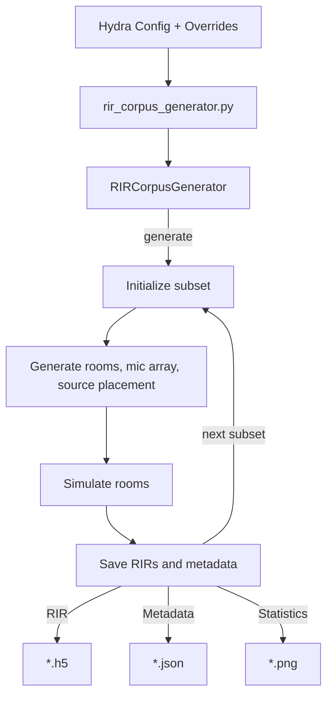
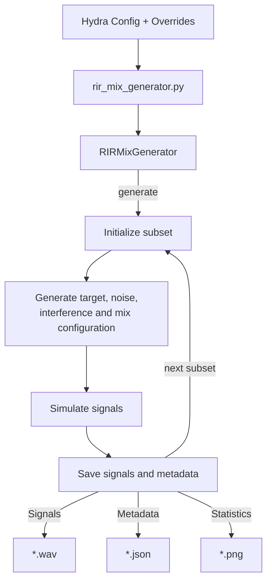
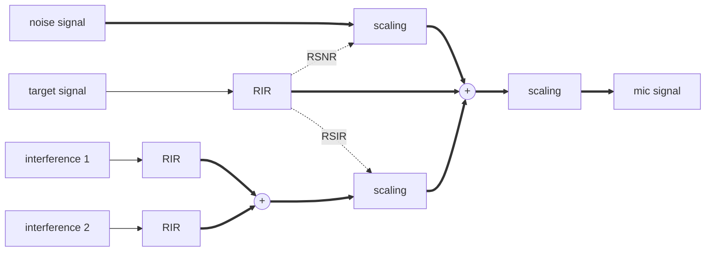

# Table of Contents
1. [RIR Corpus Generator](#rir-corpus-generator)
2. [RIR Mix Generator](#rir-mix-generator)

---

# RIR Corpus Generator

## Outline

This tool can be used to generate a corpus of room impulse responses (RIR) for a set of randomly generated rooms and microphone array placements. The tool is using [Pyroomacoustics](https://github.com/LCAV/pyroomacoustics) to simulate RIRs.

The generator loads configuration from a config file, generates RIRs, saves the metadata in a manifest file and RIRs in a HDF5 file.



## Features

The generator is easily reconfigurable and supports configuration of the following options

- Number of rooms for each subset, range of dimensions and RT60 for randomization
- Microphone array placement and orientation randomization
- Number of sources per room and their placement inside the room

## Parameters

An example of a RIR corpus generator setup is provided in `conf/rir_corpus.yaml`

## Example

The RIR corpus generator with the example config can be used by running:

```bash
python rir_corpus_generator.py output_dir=OUTPUT_DIR
```

where `OUTPUT_DIR` is a path to the output directory.

The output will be structured as

```bash
OUTPUT_DIR
+--{train, dev, test}
|	+--*.h5
+--config.yaml
+--{train, dev, test}_manifest.json
+--{train, dev, test}_info.png
```

Each directory, e.g, `{train, dev, test}`, corresponds to a subset of data and contain the `*.h5` files with RIRs. Corresponding `*_manifest.json` files contain metadata for each subset. Each row corresponds to a single room/`*.h5` file and includes the following fields

- `room_filepath`: path to `*.h5` file with RIRs
- `sample_rate`: sample rate
- `dim`: dimensions of the room `[width, length, height]`
- `num_sources`: number of sources simulated in this room
- `rir_rt60_theory`: Theoretically calculated RT60
- `rir_rt60_measured`: RT60 calculated from the generated RIRs, list with `num_sources` elements
- `mic_positions`: microphone positions in the room, list with `num_mics` elements
- `mic_center`: center of the microphone array
- `source_position`: position of each source, list with `num_source` elements
- `source_distance`: distance of each source to microphone center, list with `num_source` elements
- `source_azimuth`: azimuth of each source relative to microphone array, list with `num_source` elements
- `source_elevation`: elevation of each source relative to microphone array, list with `num_source` elements

## Loading generated data

The following function can be used to load the RIR data from a simulated room file 

```bash
from nemo.collections.asr.data.data_simulation import load_rir_simulation

# Specify the file
filepath = 'OUTPUT_DIR/test/test_room_00000.h5'

# Load RIRs for the first source
mc_rir, sample_rate = load_rir_simulation(filepath=filepath, source=0)

# Plot RIRs for all microphones
import matplotlib.pyplot as plt
plt.plot(mc_rir)
```

## Requirements

Pyroomacoustics needs to be installed. If not available, it can be installed as

```bash
pip install pyroomacoustics
```

---

# RIR Mix Generator

## Outline

This tool can be used to generate a corpus of signals by using a database of RIRs, speech, noise, and interfering sources.

The generator loads configuration from a config file, configures target and interference RIRs and signals, noise signals, mix configuration, prepares the corresponding audio files, and saves the metadata in a manifest file.



Microphone signals are constructed by mixing target, background noise and interference signal. This is illustrated in the following diagram for an example with two interfering sources:



## Features

The generator is easily reconfigurable and supports configuration of the following options

- Manifest files for RIRs, signals target, noise, interference
- Constrains for target positions relative to the microphone array (azimuth, elevation, distance)
- Probability and number of interfering sources and separation to target
- Reverberant-signal-to-noise ratio (RSNR) and reverberant-signal-to-interference ratio (RSIR) for scaling noise and interference


## Parameters

An example of a RIR corpus generator setup is provided in `conf/rir_mix.yaml`

## Example

The RIR mix generator with the example config can be used by running:

```bash
python rir_mix_generator.py output_dir=OUTPUT_DIR
```

where `OUTPUT_DIR` is a path to the output directory.

The output will be structured as

```bash
OUTPUT_DIR
+--{train, dev, test}
|	+--*_mic.wav
|	+--*_target_reverberant.wav
|	+--*_target_anechoic.wav
|	+--*_noise.wav
|	+--*_interference.wav
+--config.yaml
+--{train, dev, test}_manifest.json
+--{train, dev, test}_info.png
```

Each directory, e.g, `{train, dev, test}`, corresponds to a subset of data and contains the `*.wav` files with the generated audio signals. Corresponding `*_manifest.json` files contain metadata for each subset. Each row corresponds to a single example/set of `*.wav` files and includes the following fields

- `audio_filepath`: path to the mic file
- `{tag}_filepath`: path to the corresponding signal component, such as `noise` or `interference`
- `text`: transcription of the target utterance (if available)
- `duration`: duration of the signal
- `{target/noise/interference/mix}_cfg`: dictionary with configuration used to generate the corresponding signal
- `rt60`: RT60 measured from RIRs for the target source
- `drr`: Direct-to-reverberant ratio calculated from the RIRs for the target source [2]

---

# References

1. R. Scheibler, E. Bezzam, I. Dokmanić, Pyroomacoustics: A Python package for audio room simulations and array processing algorithms, Proc. IEEE ICASSP, Calgary, CA, 2018.

2. J. Eaton, N. D. Gaubitch, A. H. Moore, P. A. Naylor, The ACE challenge: Corpus description and performance evaluation, Proc. IEEE Workshop on Applications of Signal Processing to Audio and Acoustics (WASPAA), New Paltz, NY, USA, 2015
