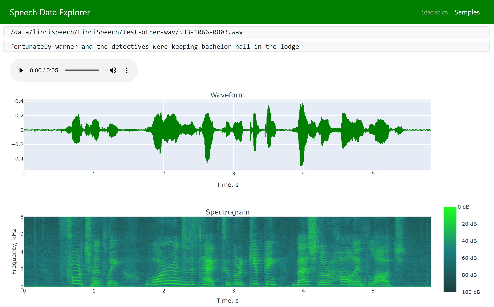

Speech Data Explorer
--------------------

[Dash](https://plotly.com/dash/)-based tool for interactive exploration of ASR/TTS datasets.

Features:
- dataset's statistics (alphabet, vocabulary, duration-based histograms)
- navigation across dataset (sorting, filtering)
- inspection of individual utterances (waveform, spectrogram, audio player)
- errors' analysis (Word Error Rate, Character Error Rate, Word Match Rate, Mean Word Accuracy, diff)
- comparison of two ASR models using interactive word-level accuracy plot 

Please make sure that requirements are installed. Then run:
```
python data_explorer.py path_to_manifest.json
```

To compare word-level accuracy of two ASR models:
```
python data_explorer.py path_to_manifest.json -nc pred_text_{model_1_name} pred_text_{model_2_name}
```

JSON manifest file should contain the following fields:
- "audio_filepath" (path to audio file)
- "duration" (duration of the audio file in seconds)
- "text" (reference transcript)

Errors' analysis requires "pred_text" (ASR transcript) for all utterances.
"Visual comparison requires two or more "pred_text_{model_name}" fields."

Any additional field will be parsed and displayed in 'Samples' tab.



