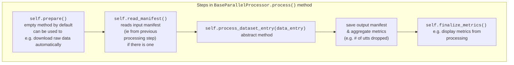
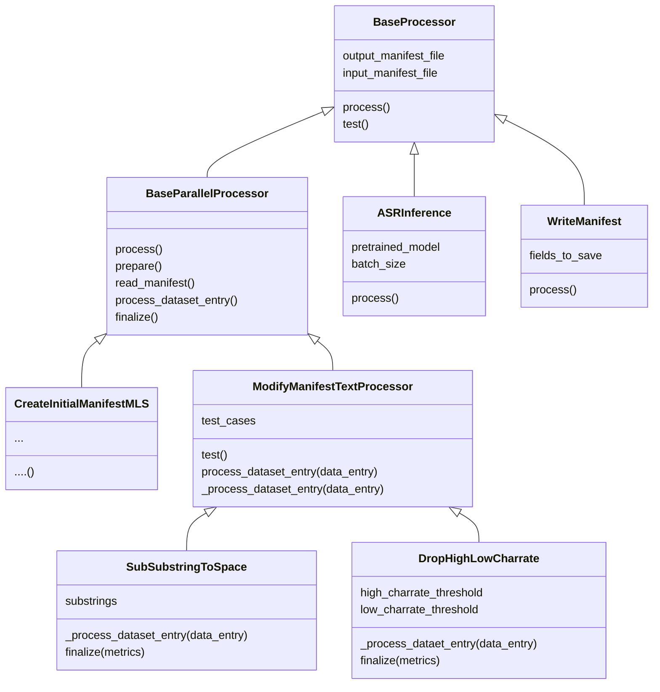

# Speech Dataset Processor

Speech Dataset Processor (SDP) is a toolkit to make it easy to:
1. write code to process a new dataset, minimizing the amount of boilerplate code required.
2. share the steps for processing a speech dataset. Sharing processing steps can be as easy as sharing a YAML file.

SDP's philosophy is to represent processing operations as 'processor' classes. Many common processing operations are provided, and it is easy to add your own. In some cases, all you will need to do to process a new dataset is simply to write a YAML file containing the parameters needed to process your dataset.

SDP is specifically intended for the use case when you have an existing dataset with the audio & text pairs already specified in some form, and you wish to create a JSON manifest suitable for use with NeMo. SDP allows for intermediate cleaning and filtering steps which involve amending the 'ground truth' `"text"` or dropping utterances which are deemed to be too inaccurate for training on.

# Overview of how SDP processes a dataset
1. You call the main.py script, passing in a config.yaml file, possibly with some overrides.
2. main.py script calls run_processors.py, passing in your config.
3. run_processors.py does the following:

    a. picks out the processors you wish to run (you can specify a subset of the processors in the config override, e.g. to avoid re-running time-consuming steps).

    b. if some of the processors have not had "output_manifest_file" or "input_manfiest_file" entries specified, SDP will automatically create temporary files for those.

    c. instantiate the processor classes using `hydra.utils.instantiate`
    
    d. run the run-time processor tests by calling the `processor.test()` method.

    e. run the processing method (`processor.process()`) of each processor in order.

# Layout of config YAML files

The YAML config file for processing a dataset must contain a key `processors`, the value of which is a list. Each item in that list is expected to be a dictionary specifying a processor class, i.e. it must have a key `_target_`, the value of which is a path to a "processor" class, and the remaining keys must be the kwargs necessary to instantiate that class with `hydra.utils.instantiate()` (c.f. https://hydra.cc/docs/advanced/instantiate_objects/overview/).

SDP will run the processors specified in the `processors` list in the config file. It will also check for a `processors_to_run` key in the config file, which can be either the string "all", or any Python "slice" object.

> **Note**: SDP will run the processors in the order in which they are listed in the config YAML file. Make sure to list the processors in an order which makes sense, e.g. create an initial manifest first; make sure to run asr inference before doing any processing which looks at `pred_text` fields in the manifest.

# Processor classes

## `Base Processor`
All processor classes inherit from the `BaseProcessor` class. This is a very simple abstract class which has 2 empty methods: `process()` and `test()`. These serve to remind us that SDP essentially just runs `test()` on all processors, and then `process()` on all processors.

`ASRInference` is a child class of `BaseProcessor`. It has a simple `process()` method which runs transcription on every utterance in the input_manifest.

`WriteManifest` is also a child class of `BaseProcessor`. It has a simple `process()` method which saves a copy of the input manifest containing only the fields specified in `fields_to_save`.

## `BaseParallelProcessor`
`BaseParallelProcessor` inherits from the `BaseProcessor` class. Within its `.process()` method, it calls other methods and functions, which allow it to do more complex processing. Most importantly, it calls its `.process_dataset_entry(data_entry)` method on every utterance in the manifest, and it does this in parallel, allowing for more efficient processing.

### What is a `DataEntry`?
As mentioned above, `BaseParallelProcessor.process_dataset_entry(data_entry)` is called on a variable called `data_entry` which represents an utterance in our dataset. In most cases, `data_entry` is a `DataEntry` object, which represents a line in a dataset manifest. 
> The only exception to the above is in processors which are run at the start of processing when we are creating a manifest for the first time (such as `CreateInitialManifestMLS`, in which the `data_entry` variable is a string containing a line for that utterance from the original raw MLS transcript).

The `DataEntry` class is a dataclass which contains 2 attributes:
1. `data` is an Optional dictionary containing items which represent the JSON manifest entry. `data` can also be `None`. If a `.process_dataset_entry(data_entry)` method returns a `DataEntry` class where `data == None`, then that utterance will be dropped from the output manifest.
2. `metrics`, which can be of any type, and are `None` by default. This variable is used by some variables to record summary statistics about the changes made to the dataset, these metrics are aggregated and can be displayed once every utterance has been processed by the processor.

### What happends in `BaseParallelProcessor.process()`

We outline the `.process()` method of the `BaseParallelProcessor` class below:

## `ModifyManifestTextProcessor`
`ModifyManifestTextProcessor` inherits from the `BaseProcessor` class. It takes in an additional optional parameter `test_cases` and overwrites a few methods:
* `.test()`: this method makes sure that the output from the processor matches the expected output specified in the `test_cases` parameter.
* `.process_dataset_entry(data_entry)`: this method applies processing to a `data_entry`. First, spaces are added to the start and end of the 'text' and 'pred_text' entries (if they exist), then the abstract method `._process_dataset_entry(data_entry)` is called. Then, any extra spaces (e.g. two spaces next to each other '  ') are removed from 'text' and 'pred_text' entries.
* `._process_dataset_entry(data_entry)`: this is an abstract method which will be over-written by children of `ModifyManfiestTextProcessor`.

## How to make your own processor classes.

We will describe how to make your own processor classes by referring to SDP's existing classes.

### Creating an initial manifest, e.g. as in `CreateInitialManifestMLS`.
`CreateInitialManifestMLS` is a child class of `BaseParallelProcessor`. It downloads raw MLS data for a specified language, and creates an initial manifest (in the format expected by NeMo) which can be cleaned by subsequent processors.

Its `.prepare()` method downloads and extracts the raw data.

Its `read_manifest()` method reads the lines in the raw MLS transcript file.

Its `process_dataset_entry()` method takes in the lines from the raw MLS transcript file, and outputs `DataEntry` objects containing entries that will be saved into the manifest (i.e. `"audio_filepath"`, `"duration"`, `"text"`) for each utterance.

### A `ModifyManifestTextProcessor` class that cleans ground truth text, e.g. as in `SubSubstringToSpace`.

One of the classes provided in SDP is `SubSubstringToSpace`. At initialization, it takes in `substrings`, a list of strings which, if found in the "text", will be converted to spaces. This is helpful for e.g. removing punctuation.

In its `_process_dataset_entry(data_entry)` method it does the string to space convertion upon the `data_entry` that is input. Its output is a `data_entry` with the changes applied to `data`, and the the metrics of which substrings were spotted and converted to spaces recorded in `metrics`. These metrics will be aggregated over all utterances by the `BaseParallelProcessor` class. `SubSubstringToSpace` also has a `.finalize(metrics)` method which will log information about the aggregated metrics after all of the utterances in the manifest have been processed.

### A `ModifyManifestTextProcessor` class that drops incorrectly transcribed utterances, e.g. as in `DropHighLowCharrate`.

One of the classes provided in SDP is `DropHighLowCharrate`. At initialization, it takes in `high_charrate_threshold` and `low_charrate_threshold`, for which the utterance will be dropped if it is above or below each value respectively. This is helpful for automatically filtering out incorrectly transcribed utterances.

In its `_process_dataset_entry(data_entry)` method it evaluates the character rate of the utterance. If the character rate is within bounds, it will return the same `data_entry` that was input. If the character rate is out of bounds, it will return a `data_entry` with `data=None` and `metrics` which reflect the applied changes.
Similar to the `SubSubstringToSpace` class, it has a `.finalize(metrics)` method which will log information about the aggregated metrics after all of the utterances in the manifest have been processed.

## Class diagram
A diagram of the classes mentioned above is included here. Arrows represent inheritance.

